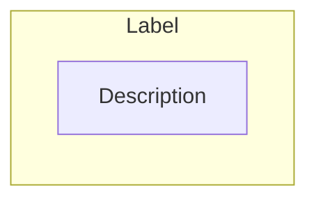
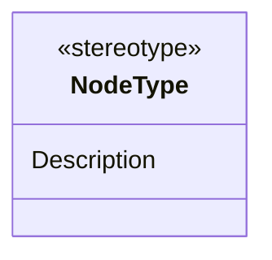
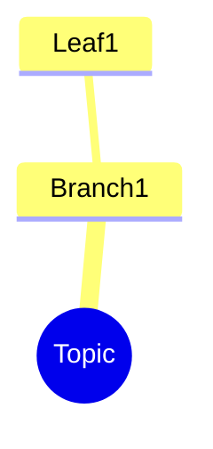
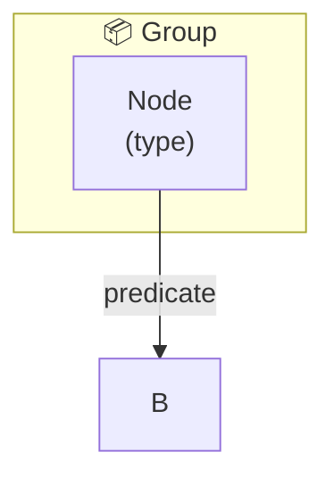

# LLM Brief: NotebookLM Infographics & Slides Repository

> **Start here** — This is the main context brief for working with this repository in Claude Code / Cowork sessions.

---

## What This Repository Is

This is **Dinis Cruz's content library** — a collection of AI-generated infographics, slide decks, and supporting documentation covering software development, cybersecurity, GenAI, and technical leadership.

### Content Pipeline

```
Source Document (PDF/MD) → NotebookLM → Infographic (PNG/JPG) + Slide Deck (PDF)
                                     ↓
                          SEMANTIC-GRAPH.md (structured metadata + Mermaid + Cypher)
                                     ↓
                          README.md (navigation + embedded mosaic + SKG section)
```

All visual content is generated using **Google NotebookLM** from source documents (white papers, research briefs, technical documentation).

### Repository Statistics

| Metric | Count |
|--------|-------|
| Total Visual Assets | ~271 |
| PDF Documents | ~171 |
| PNG Infographics | ~100 |
| Organized Folders | ~126 |
| Repository Size | ~2.1 GB |

---

## Folder Structure

```
NotebookLM__Infographics-and-slides/
├── CLAUDE.md              # Quick context (auto-loaded by Claude)
├── .claude/               # ← YOU ARE HERE - Detailed workflow guides
│   ├── MAIN.md            # This file - comprehensive context
│   ├── create-readme.md   # How to create README.md files
│   ├── create-semantic-graph.md  # How to create SEMANTIC-GRAPH.md files
│   ├── create-slide-mosaic.md    # pdftoppm + montage workflow
│   ├── mermaid-templates.md      # Copy-paste Mermaid diagrams
│   ├── neo4j-import.md           # Neo4j sandbox visualization
│   └── create-curated-guide.md   # Collection page creation
│
├── _for_linkedin/         # LinkedIn publishing pipeline
│   ├── published/         # Already shared on LinkedIn (fully structured)
│   └── to-publish/        # Queue for future posts
│
├── by-topic/              # Primary content organized by subject
│   ├── GenAI development/
│   ├── osbot-utils/
│   ├── Graphs/
│   ├── Cyber security.../
│   └── ...
│
├── by-collaborator/       # Content organized by contributor
└── curated-guides/        # Themed collections linking related content
```

---

## The Two Documentation Files

Each content folder should have two markdown files:

### 1. README.md — Navigation & Discovery

**Purpose**: Help humans browse and find content

**Structure** (enhanced January 2026):

```markdown
# Title

[← Back](../README.md) · [Published](../../README.md) · [🏠 Home](../../../../README.md)

> Overview blockquote summarizing the content

| 📄 Source | 🖼️ Infographic | 📑 Slides |
|-----------|----------------|-----------|
| [Source Doc](./file.pdf) | [View Image](./image.jpg) | [Slide Deck](./slides.pdf) |

> Generated with [Google NotebookLM](https://notebooklm.google.com/)

---

## 🖼️ Infographic


---

## 📑 Slide Deck (X slides)
[](./slides.pdf)
*Click image to open* · [⬇️ Download PDF](raw-github-url)

---

## 🧠 Semantic Knowledge Graph
> **Machine-readable metadata** — Structured content for search, discovery, and graph database integration

This document includes a comprehensive [SEMANTIC-GRAPH.md](./SEMANTIC-GRAPH.md) file containing:
| Section | Description |
[📖 View SEMANTIC-GRAPH.md](./SEMANTIC-GRAPH.md)

---

## Key Topics | Contents | Source Information
```

📖 **Full instructions**: [create-readme.md](./create-readme.md)

---

### 2. SEMANTIC-GRAPH.md — Semantic Knowledge Graph Serialization

**Purpose**: Machine-readable metadata for search, discovery, and graph database integration

**Key features** (enhanced January 2026):
- **Navigation links** at top (README, Infographic, Slides, Home)
- **Mermaid diagrams** that render in GitHub (flowchart, mindmap, classDiagram, graph)
- **Neo4j Cypher** ready-to-import queries
- **Optional screenshot** of Neo4j visualization

**Structure**:

```markdown
# Title

[📖 README](./README.md) · [🖼️ Infographic](./image.jpg) · [📑 Slides](./slides.pdf) · [🏠 Home](../../../../README.md)

> *Semantic Knowledge Graph (SKG) — machine-readable metadata for search, discovery, and graph database integration*

---

## Summary          ← 2-4 sentences
## Key Concepts     ← 4-6 bolded terms with explanations
## Core Arguments   ← 4-6 numbered logical points
## Key Quotes       ← 2-4 memorable quotes from source
## Tags             ← 10-15 lowercase tags in backticks
## Search Phrases   ← 6-10 natural language queries

---

## Semantic Knowledge Graph

### [Domain-Specific Diagram] (Visual)


### Ontology


### Taxonomy


### Knowledge Graph


### Cypher Import (Neo4j)
```cypher
CREATE (n:Type {id: 'id', name: 'Name'})
CREATE (n)-[:RELATIONSHIP]->(m)
```

---

### Neo4j Visualization (optional)

**How to import**: Instructions...
```

📖 **Full instructions**: [create-semantic-graph.md](./create-semantic-graph.md)

---

## Slide Mosaic Creation

Every content folder with a slide deck should have a `slides_mosaic.png` — a 4x4 grid preview of all slides.

```bash
# Extract slides as images (100 DPI for thumbnails)
pdftoppm -png -r 100 "slides.pdf" slide_thumb

# Create 4x4 mosaic grid
montage slide_thumb-*.png -tile 4x4 -geometry 300x+5+5 -background white slides_mosaic.png

# Cleanup individual thumbnails
rm slide_thumb-*.png
```

📖 **Full instructions**: [create-slide-mosaic.md](./create-slide-mosaic.md)

---

## Key Terminology

| Term | Meaning |
|------|---------|
| **SKG** | Semantic Knowledge Graph — nodes + edges + ontology + taxonomy |
| **SEMANTIC-GRAPH.md** | The file containing SKG serialization (formerly CONTENT.md) |
| **Ontology** | Schema defining valid node types and predicates |
| **Taxonomy** | Hierarchical category structure |
| **Nodes** | Entities/concepts (map to `(:Type {id, name})` in Neo4j) |
| **Edges** | Relationships (map to `-[:PREDICATE]->` in Neo4j) |
| **Predicates** | Relationship types (e.g., `addresses`, `includes`, `produces`) |
| **Mermaid** | Diagram-as-code format that renders in GitHub markdown |
| **Cypher** | Neo4j query language for graph operations |
| **Slide Mosaic** | 4x4 grid thumbnail of all slides in a deck |

---

## Common Tasks

### Creating documentation for a new content folder

1. **List folder contents** to identify: source PDF, infographic(s), slide deck
2. **Read the source PDF** to understand the content
3. **Create slides_mosaic.png** following [create-slide-mosaic.md](./create-slide-mosaic.md)
4. **Create README.md** following [create-readme.md](./create-readme.md)
5. **Create SEMANTIC-GRAPH.md** following [create-semantic-graph.md](./create-semantic-graph.md)
6. **Optional**: Import Cypher to Neo4j, screenshot, add to SEMANTIC-GRAPH.md

### Updating navigation when folders move

- Recalculate relative paths in breadcrumbs
- Update parent README folder listings
- URL-encode special characters (spaces → `%20`, parentheses → `%28`/`%29`)

### Adding content to LinkedIn pipeline

- New content goes in `_for_linkedin/to-publish/[category]/`
- After publishing, move to `_for_linkedin/published/[category]/`

### Creating a curated guide

- Create folder in `curated-guides/[theme-name]/`
- Create README.md linking to related SEMANTIC-GRAPH.md files
- See [create-curated-guide.md](./create-curated-guide.md) for template

---

## URL Encoding Reference

| Character | Encoded |
|-----------|---------|
| Space | `%20` |
| `(` | `%28` |
| `)` | `%29` |
| `'` | `%27` |
| `–` (en-dash) | `%E2%80%93` |
| `—` (em-dash) | `%E2%80%94` |

---

## webloc File Handling

macOS `.webloc` files contain LinkedIn URLs. They're XML plist format:

```xml
<?xml version="1.0" encoding="UTF-8"?>
<!DOCTYPE plist PUBLIC "-//Apple//DTD PLIST 1.0//EN" "...">
<plist version="1.0">
<dict>
    <key>URL</key>
    <string>https://www.linkedin.com/posts/diniscruz_...</string>
</dict>
</plist>
```

Extract URL with: `grep -o 'https://[^<]*' file.webloc`

---

## Author & License

- **Author**: Dinis Cruz ([@DinisCruz](https://github.com/DinisCruz), dinis.cruz@owasp.org)
- **License**: CC BY 4.0 — Share and adapt with attribution

---

## Quick Start Checklist

When starting a new Cowork session on this repo:

- [ ] Claude auto-loads `CLAUDE.md` at repo root
- [ ] For deep work, read this brief (`.claude/MAIN.md`)
- [ ] Understand current task (new content? navigation fix? bulk updates?)
- [ ] Check staging area (`_for_linkedin/to-publish/`) for pending work
- [ ] Reference specific briefs as needed
- [ ] Use `SEMANTIC-GRAPH.md` (not ~~CONTENT.md~~)
- [ ] Include Mermaid diagrams + Cypher export
- [ ] Create slide mosaics for all decks
- [ ] URL-encode all special characters in links
