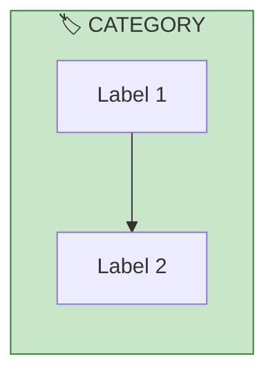
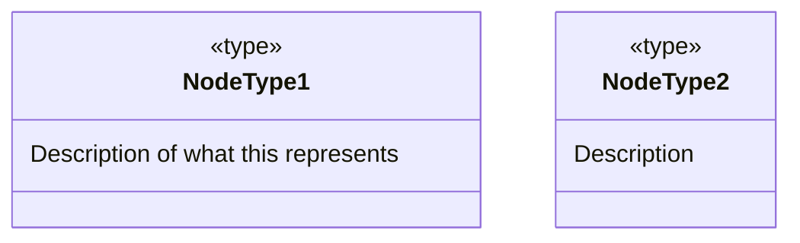
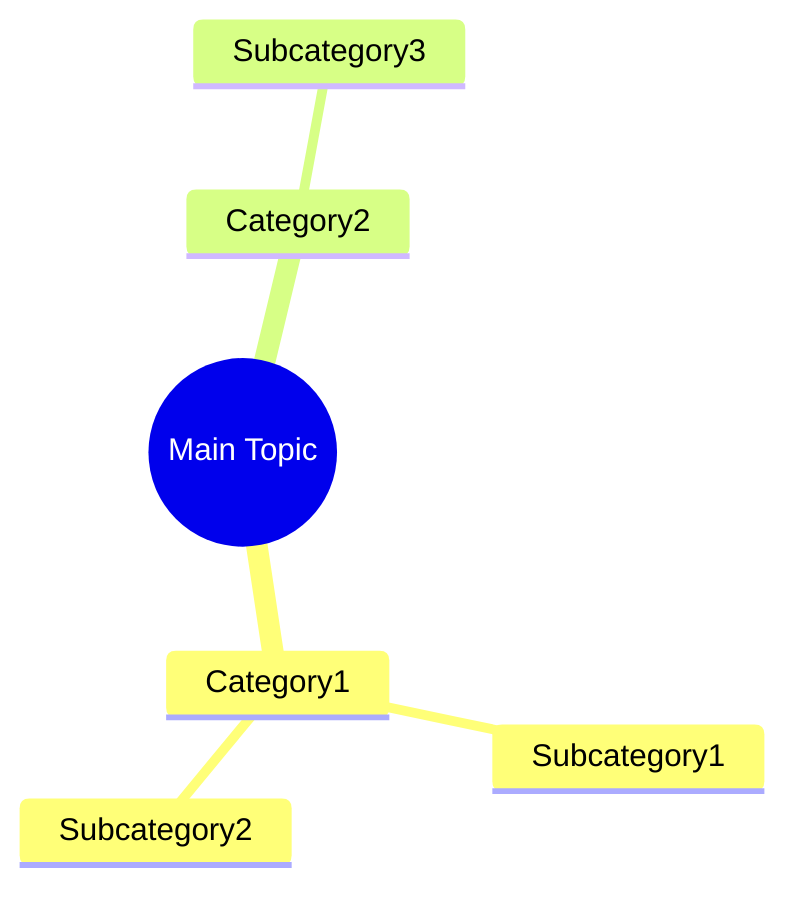
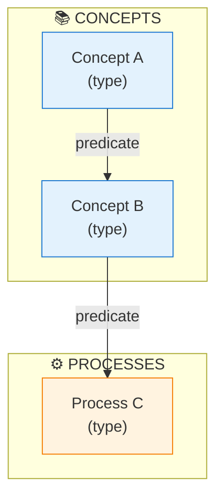
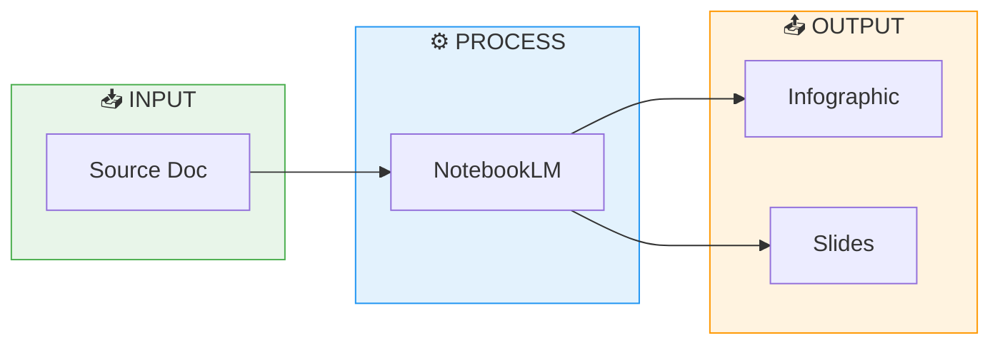
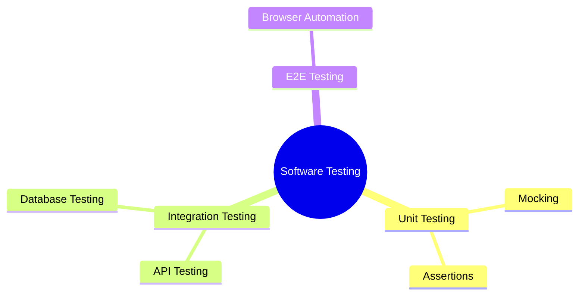
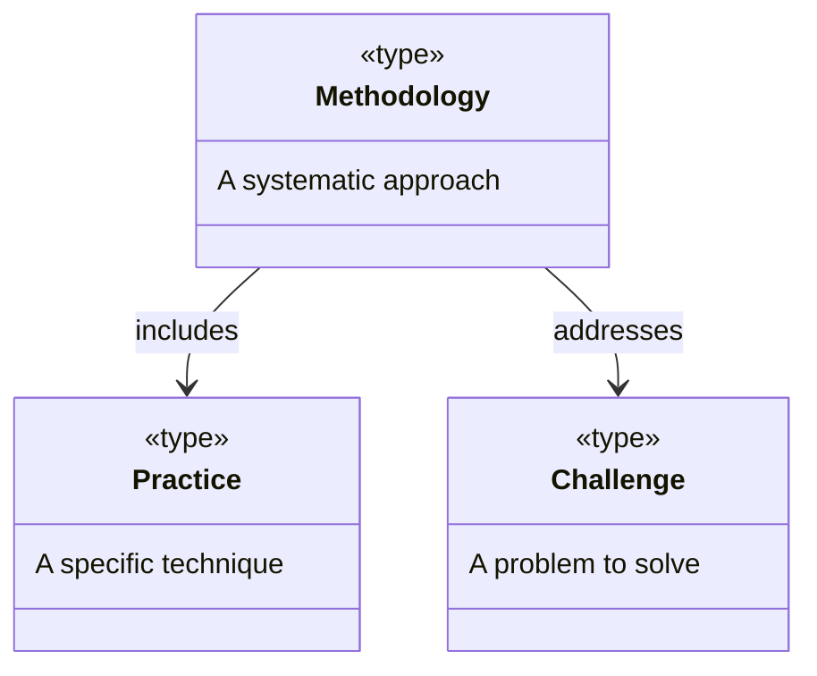
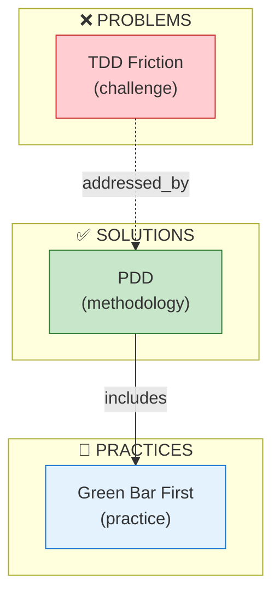

# LLM Brief: Creating SEMANTIC-GRAPH.md Files

> Instructions for creating SEMANTIC-GRAPH.md files — Semantic Knowledge Graph (SKG) serializations with Mermaid visualizations and Neo4j Cypher export

---

## Purpose

SEMANTIC-GRAPH.md files are **Semantic Knowledge Graph (SKG) documents serialized in markdown format**. They contain structured data that can be:

1. **Visualized in GitHub** — Mermaid diagrams render directly
2. **Imported into Neo4j** — Cypher queries ready to execute
3. **Searched and discovered** — Tags and search phrases enable indexing
4. **Human-readable** — Summary, concepts, arguments at the top

---

## What is a Semantic Knowledge Graph (SKG)?

An SKG consists of:

| Component | Purpose | In SEMANTIC-GRAPH.md | Neo4j Equivalent |
|-----------|---------|----------------------|------------------|
| **Nodes** | Entities/concepts | Mermaid graph nodes | `(:NodeType {id, name})` |
| **Edges** | Relationships | Mermaid arrows | `-[:PREDICATE]->` |
| **Ontology** | Valid types & predicates | classDiagram | Schema/constraints |
| **Taxonomy** | Category hierarchy | mindmap | Hierarchical relationships |
| **Properties** | Metadata | Metadata table | Node properties |

---

## File Structure (Enhanced January 2026)

```markdown
# Title of Content

[📖 README](./README.md) · [🖼️ Infographic](./image.jpg) · [📑 Slides](./slides.pdf) · [🏠 Home](../../../../README.md)

> *Semantic Knowledge Graph (SKG) — machine-readable metadata for search, discovery, and graph database integration*

---

## Summary

[2-4 sentences explaining what this content is about and its main thesis]

---

## Key Concepts

- **Concept 1**: Brief explanation
- **Concept 2**: Brief explanation
[4-6 concepts — these map to nodes in the SKG]

---

## Core Arguments

1. First main argument or point
2. Second main argument or point
[4-6 numbered points — these represent logical flow/edges]

---

## Key Quotes

> "Notable quote from the content"

[2-4 quotes that capture the essence]

---

## Tags

`tag1` `tag2` `tag3` `tag4` `tag5` [etc.]

[10-15 single-word or hyphenated tags in backticks]

---

## Search Phrases

- "natural language search phrase"
- "another way someone might search"
[6-10 phrases]

---

## Semantic Knowledge Graph

### [Domain-Specific Workflow/Architecture] (Visual)



### Ontology



### Taxonomy



### Knowledge Graph



### Cypher Import (Neo4j)

```cypher
// Create nodes
CREATE (concept1:Concept {id: 'concept1', name: 'Concept 1', description: 'Description'})
CREATE (concept2:Concept {id: 'concept2', name: 'Concept 2', description: 'Description'})
CREATE (process1:Process {id: 'process1', name: 'Process 1'})

// Create relationships
CREATE (concept1)-[:RELATES_TO]->(concept2)
CREATE (concept2)-[:ENABLES]->(process1)
```

---

### Neo4j Visualization (optional)


**How to import and visualize this graph in Neo4j:**

1. **Create a free Neo4j Sandbox** at [sandbox.neo4j.com](https://sandbox.neo4j.com/) — select "Blank Sandbox"
2. **Open Neo4j Browser** and paste the Cypher code above into the query editor
3. **Run the query** (click the play button or press Ctrl+Enter)
4. **Visualize the graph** with this query:
   ```cypher
   MATCH p=()-[]-()
   RETURN p
   ```
```

---

## Navigation Header

**Always include navigation at the top of SEMANTIC-GRAPH.md:**

```markdown
[📖 README](./README.md) · [🖼️ Infographic](./image.jpg) · [📑 Slides](./slides.pdf) · [🏠 Home](../../../../README.md)
```

Adjust the relative path to Home based on folder depth:
- 4 levels deep: `../../../../README.md`
- 5 levels deep: `../../../../../README.md`

URL-encode filenames with special characters:
- Spaces → `%20`
- Parentheses → `%28` `%29`

---

## Mermaid Diagram Types

### 1. Flowchart (Workflows, Processes, Architectures)



**Use for:** Pipelines, workflows, data flow, system architecture

### 2. Mind Map (Taxonomies, Hierarchies)



**Use for:** Category hierarchies, topic breakdowns, concept organization

### 3. Class Diagram (Ontologies, Entity Types)



**Use for:** Defining node types and their relationships (schema)

### 4. Graph (Knowledge Graph, Relationships)



**Use for:** Entity relationships, concept connections, knowledge representation

---

## Color Conventions for Mermaid

| Category | Fill Color | Stroke Color | Hex Values |
|----------|------------|--------------|------------|
| Problems/Challenges | Light red | Dark red | `#ffcdd2`, `#c62828` |
| Solutions/Methods | Light green | Dark green | `#c8e6c9`, `#2e7d32` |
| Concepts/Ideas | Light blue | Dark blue | `#e3f2fd`, `#1976d2` |
| Processes/Actions | Light orange | Dark orange | `#fff3e0`, `#f57c00` |
| Data/Artifacts | Light purple | Dark purple | `#e1bee7`, `#7b1fa2` |
| Neutral/Other | Light gray | Dark gray | `#f5f5f5`, `#616161` |

---

## Cypher Export Guidelines

### Node Creation

```cypher
CREATE (nodeId:NodeType {
    id: 'node_id',
    name: 'Human Readable Name',
    description: 'Optional description'
})
```

**Conventions:**
- Use `snake_case` for `id` values
- Use Title Case for `name` values
- Node types use `PascalCase`

### Relationship Creation

```cypher
CREATE (node1)-[:RELATIONSHIP_TYPE]->(node2)
```

**Conventions:**
- Relationship types use `UPPER_SNAKE_CASE`
- Direction matters: source → target

### Common Relationship Types

| Predicate | Use For |
|-----------|---------|
| `INCLUDES` | Methodology includes practices |
| `ADDRESSES` | Solution addresses problem |
| `CAUSES` | Problem causes effect |
| `ENABLES` | Practice enables outcome |
| `TRANSFORMS` | Process transforms input to output |
| `RELATES_TO` | General relationship |
| `CONTRASTS_WITH` | Alternative approach |
| `PART_OF` | Component of larger whole |

---

## Section Guidelines

### Summary
- 2-4 sentences maximum
- Answer: "What is this about?" and "Why does it matter?"
- This is the **projection** of the SKG - human-readable view

### Key Concepts
- 4-6 bullet points
- Bold the concept name, then explain
- These map to **nodes** in the SKG

### Core Arguments
- 4-6 numbered points
- Logical flow of the content
- These represent **edges** (relationships) in the SKG

### Tags
- 10-15 tags in backticks
- All lowercase, hyphenated if multi-word
- Include: topics, technologies, methodologies, domains

### Mermaid Diagrams
- **Flowchart**: For the main workflow/architecture (domain-specific)
- **classDiagram**: For ontology (node types)
- **mindmap**: For taxonomy (hierarchy)
- **graph TB**: For knowledge graph (relationships)

### Cypher Export
- Create all nodes first
- Create relationships second
- Use readable IDs that match Mermaid node IDs

---

## Complete Example

See the enhanced SEMANTIC-GRAPH.md files in:
- `linkedin-published/3rd Party Content/Unbaking the Cake - Capturing Data Before Entropy/SEMANTIC-GRAPH.md`
- `linkedin-published/Wardley Maps/Wardley Maps as an Analogy for Software Development Evolution/SEMANTIC-GRAPH.md`

---

## Checklist

Before finalizing a SEMANTIC-GRAPH.md:

- [ ] Navigation links at top (README, Infographic, Slides, Home)
- [ ] Summary is 2-4 sentences
- [ ] Key Concepts has 4-6 bolded terms
- [ ] Core Arguments flows logically (4-6 points)
- [ ] Tags are lowercase, 10-15 total
- [ ] Search Phrases are natural language (6-10)
- [ ] Domain-specific flowchart/diagram included
- [ ] Ontology as classDiagram
- [ ] Taxonomy as mindmap
- [ ] Knowledge graph as graph TB
- [ ] Cypher export with all nodes and relationships
- [ ] Node IDs are readable (`green_bar` not `n1`)
- [ ] Consistent color coding in Mermaid
- [ ] All links are URL-encoded properly
