# LLM Brief: Mermaid Diagram Templates

> Copy-paste templates for Mermaid diagrams in SEMANTIC-GRAPH.md files

---

## Quick Reference

| Diagram Type | Use For | Section |
|--------------|---------|---------|
| `flowchart LR/TB` | Workflows, pipelines, architectures | Domain-specific visual |
| `classDiagram` | Entity types, schema | Ontology |
| `mindmap` | Hierarchies, taxonomies | Taxonomy |
| `graph TB` | Relationships, knowledge graph | Knowledge Graph |

---

## 1. Flowchart Templates

### Left-to-Right Pipeline

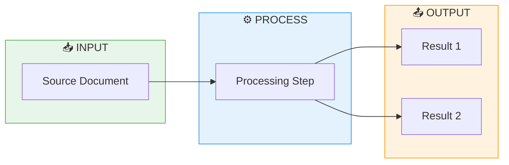

### Top-to-Bottom Workflow

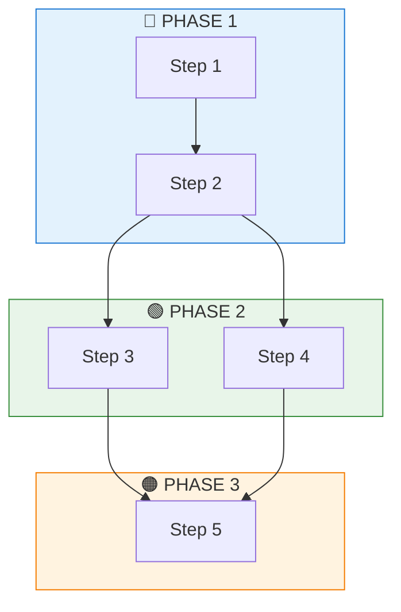

### Decision Flow

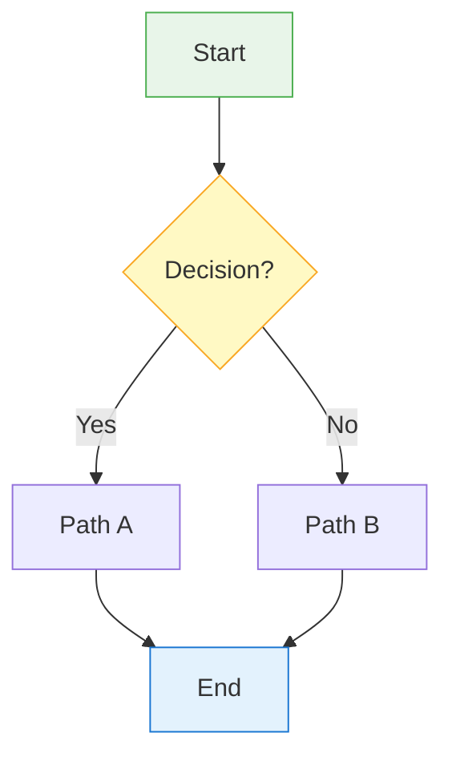

### Architecture Diagram

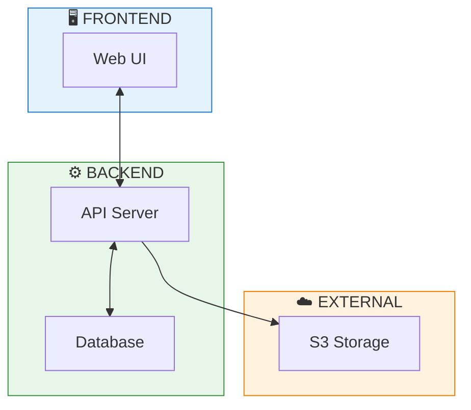

---

## 2. Class Diagram Templates (Ontology)

### Basic Ontology

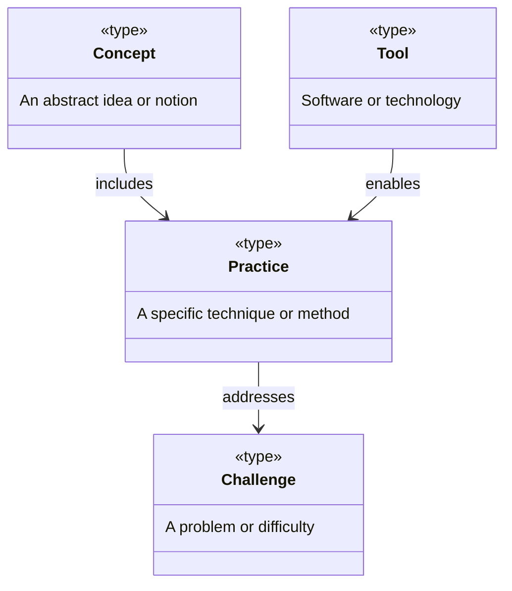

### Methodology Ontology

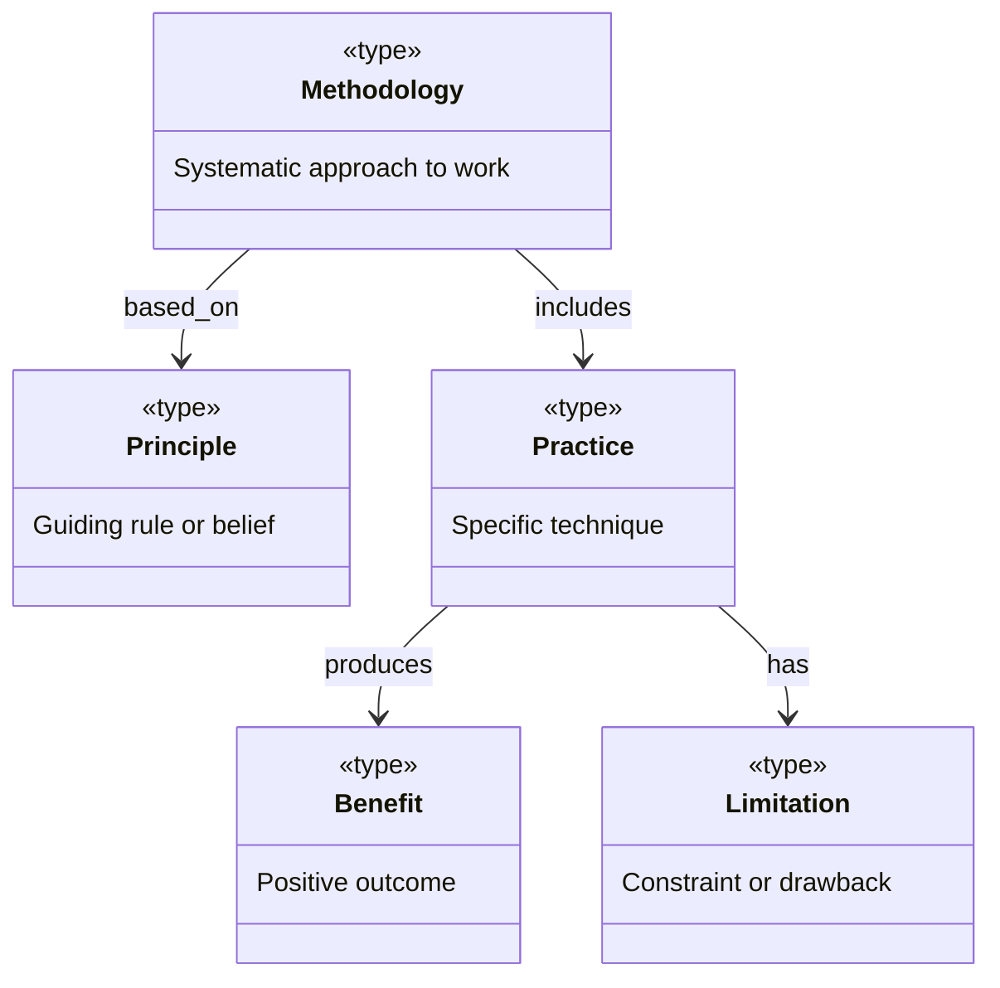

### Technical Ontology

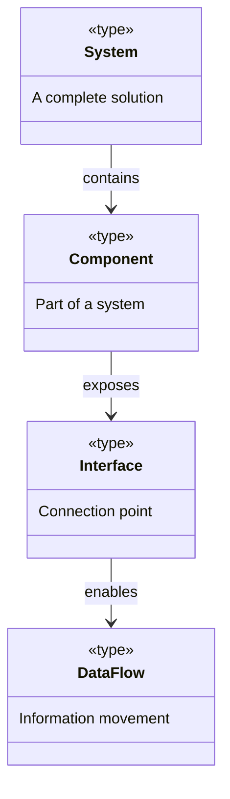

---

## 3. Mindmap Templates (Taxonomy)

### Topic Hierarchy

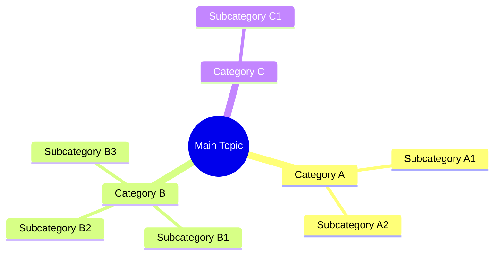

### Methodology Breakdown

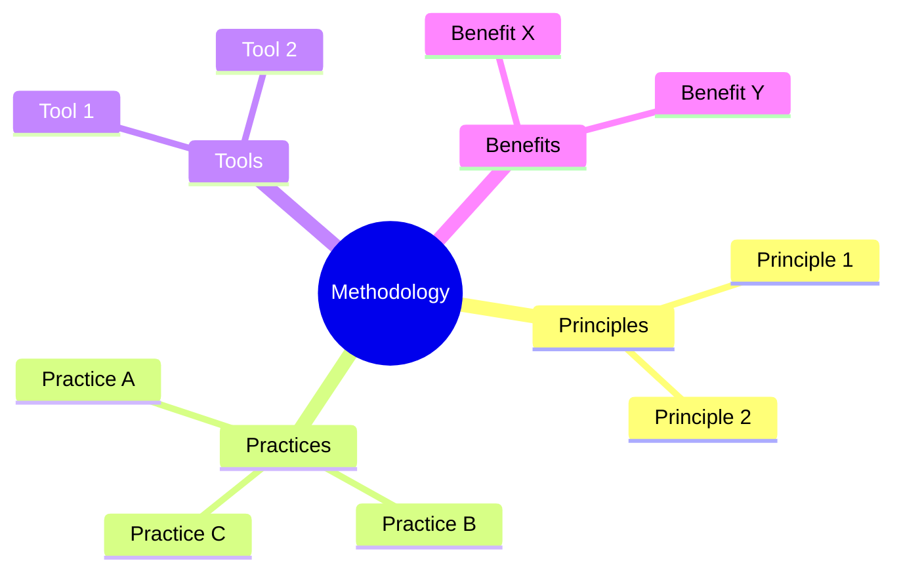

### Technical Domain

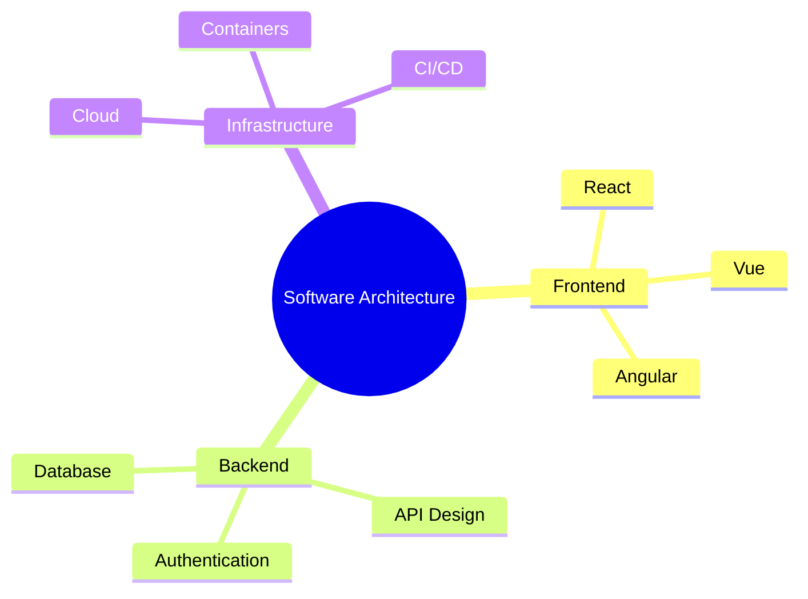

---

## 4. Knowledge Graph Templates

### Basic Relationship Graph

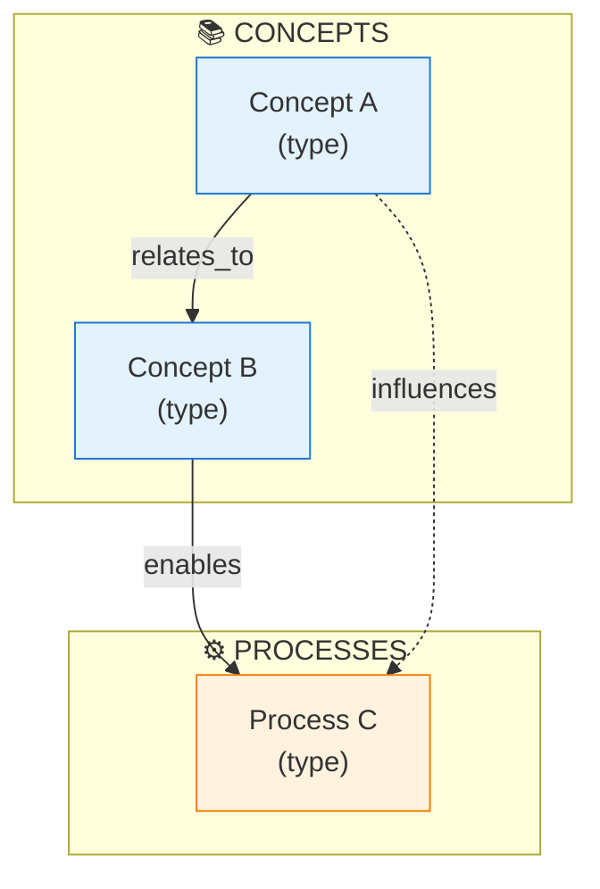

### Problem-Solution Graph

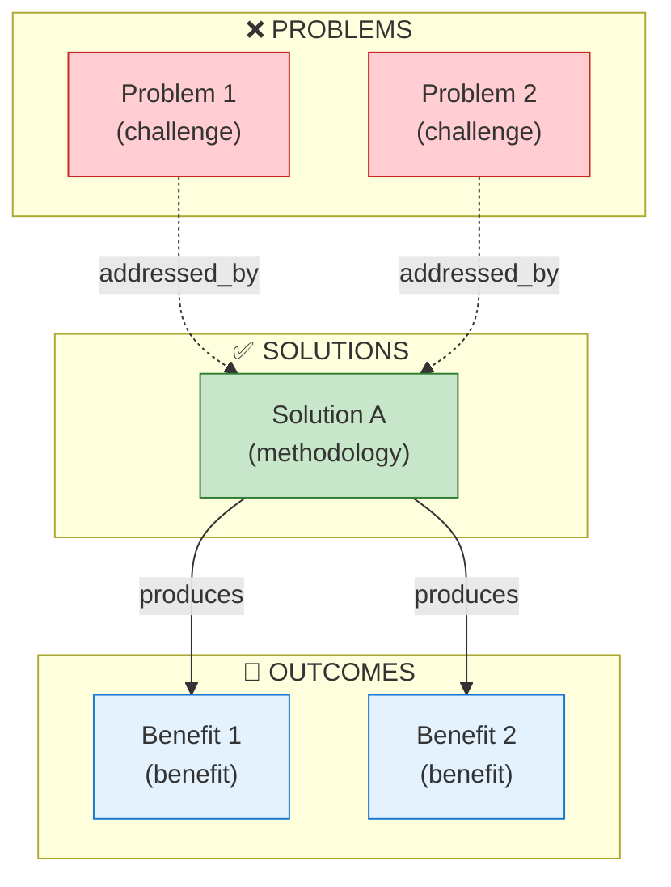

### Multi-Category Graph

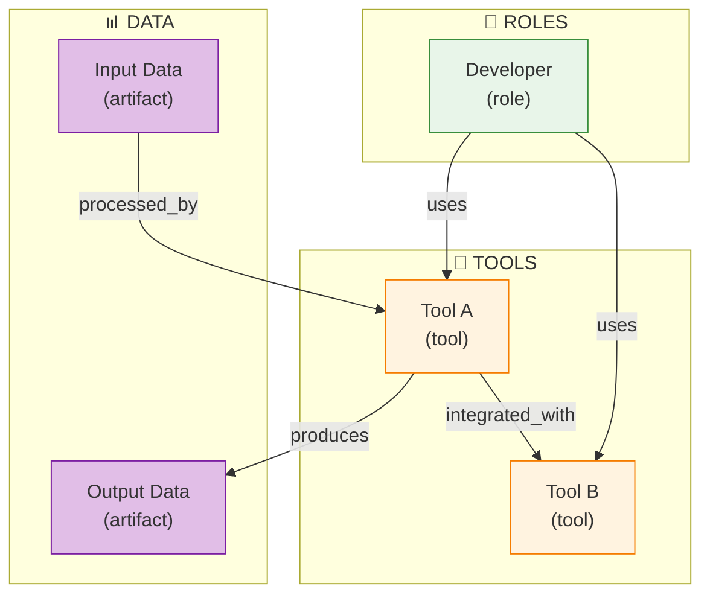

---

## Color Palette Reference

| Category | Fill | Stroke | CSS |
|----------|------|--------|-----|
| Problems | `#ffcdd2` | `#c62828` | Light/Dark Red |
| Solutions | `#c8e6c9` | `#2e7d32` | Light/Dark Green |
| Concepts | `#e3f2fd` | `#1976d2` | Light/Dark Blue |
| Processes | `#fff3e0` | `#f57c00` | Light/Dark Orange |
| Data | `#e1bee7` | `#7b1fa2` | Light/Dark Purple |
| Neutral | `#f5f5f5` | `#616161` | Light/Dark Gray |
| Warning | `#fff9c4` | `#f9a825` | Light/Dark Yellow |

---

## Edge Styles

| Style | Syntax | Use For |
|-------|--------|---------|
| Solid arrow | `-->` | Direct relationship |
| Dashed arrow | `-.->` | Indirect/weak relationship |
| Thick arrow | `==>` | Strong relationship |
| Labeled | `-->|label|` | Named relationship |
| Bidirectional | `<-->` | Two-way relationship |

---

## Node Shapes

| Shape | Syntax | Use For |
|-------|--------|---------|
| Rectangle | `A["Text"]` | Default, concepts |
| Round | `A("Text")` | Processes, actions |
| Stadium | `A(["Text"])` | Start/end points |
| Diamond | `A{"Text"}` | Decisions |
| Circle | `A(("Text"))` | Central concepts |
| Hexagon | `A{{"Text"}}` | External systems |

---

## Tips

1. **Keep it simple** — 8-15 nodes maximum
2. **Use subgraphs** — Group related nodes
3. **Consistent colors** — Same type = same color
4. **Readable labels** — Use `\n` for multi-line
5. **Meaningful edges** — Label relationships
6. **Test rendering** — Check in GitHub preview
