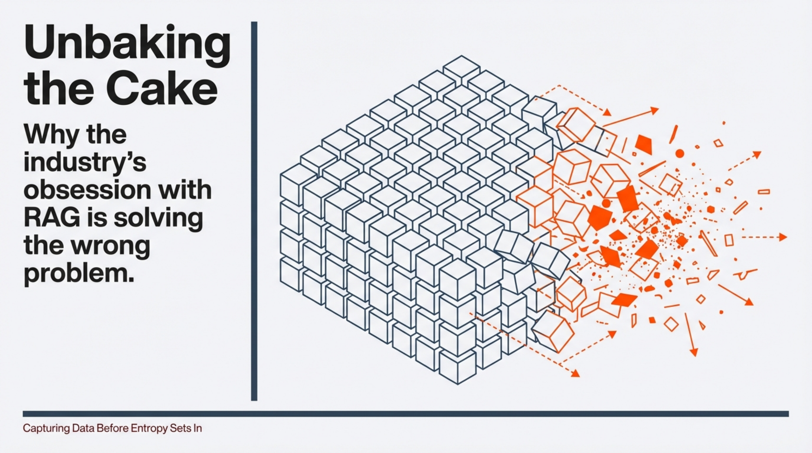
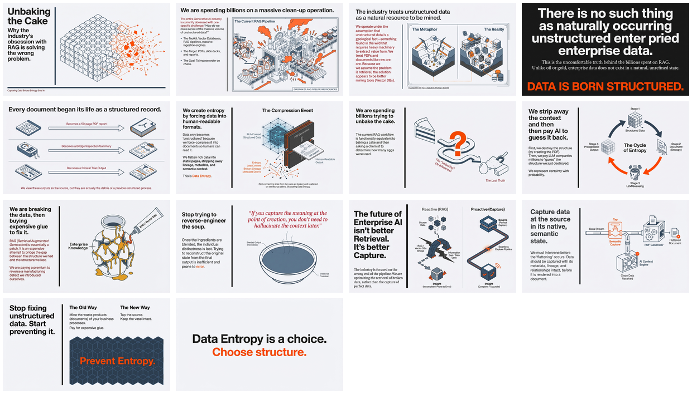

# Unbaking the Cake - Capturing Data Before Entropy

[← Back to 3rd Party Content](../README.md) · [Published](../../README.md) · [Home](../../../../README.md)

| 📄 Source | 🖼️ Infographic | 📑 Deep Dive |
|-----------|----------------|--------------|
| [source.txt](./source.txt) | [View Image](./24%20Jan%20-%20The%20Case%20for%20Native%20Data%20Capture.jpg) | [PDF Document](./24%20Jan%20-%20Capture_Not_Retrieval.pdf) |

> Generated with [Google NotebookLM](https://notebooklm.google.com/) — Source post → Infographic → Deep dive document

---

## 🖼️ Infographic

---

## 📑 Slide Deck (14 slides)

> **Deep Dive Document** — NotebookLM-generated presentation exploring the full implications of Timothy Cook's thesis

📖 View all slides

*Click images to open the slide deck* · [⬇️ Download PDF](https://github.com/DinisCruz/NotebookLM__Infographics-and-slides/raw/refs/heads/main/_for_linkedin/published/3rd%20Party%20Content/Unbaking%20the%20Cake%20-%20Capturing%20Data%20Before%20Entropy/24%20Jan%20-%20Capture_Not_Retrieval.pdf)

---

## Overview

A thought-provoking LinkedIn post by Timothy Cook challenging the current approach to enterprise AI and unstructured data. The core thesis: data is born structured but becomes "unstructured" when we compress it into documents for human consumption, stripping away lineage, metadata, and semantic context. The GenAI industry then spends billions trying to reverse-engineer this lost structure through RAG pipelines and vector databases. The solution isn't better retrieval—it's better capture at the source.

---

## Contents

| File | Description |
|------|-------------|
| [source.txt](./source.txt) | Original LinkedIn post text with attribution |
| [24 Jan - Capture_Not_Retrieval.pdf](./24%20Jan%20-%20Capture_Not_Retrieval.pdf) | NotebookLM-generated deep dive document |
| [24 Jan - The Case for Native Data Capture.jpg](./24%20Jan%20-%20The%20Case%20for%20Native%20Data%20Capture.jpg) | Infographic visualization |
| [Timothy Cook](https://www.linkedin.com/in/timothywaynecook/) | Author's LinkedIn profile |
| [Source post](https://www.linkedin.com/feed/update/urn:li:activity:7419714503782850560/) | Original LinkedIn post |
| [My commentary post](https://www.linkedin.com/feed/update/urn:li:activity:7420815037105172480/) | Dinis Cruz's commentary post |
| [CONTENT.md](./CONTENT.md) | Semantic Knowledge Graph metadata |

---

## Key Topics

- Data entropy and information loss in document creation
- The false premise of "naturally occurring unstructured data"
- RAG pipelines as expensive remediation for self-inflicted problems
- Native semantic capture at point of creation
- LLM costs for structure reconstruction

---

## Core Insight

> "Data is born structured. It only becomes 'unstructured' because we force-compress it into documents so humans can read it."

The argument reframes the GenAI industry's obsession with unstructured data processing as treating a symptom rather than the cause. Instead of building better tools to "unbake the cake" (reverse-engineer structure from documents), we should prevent the data entropy in the first place by capturing meaning at the source.

---

## Source Information

| Field | Value |
|-------|-------|
| **Author** | Timothy Cook |
| **Platform** | LinkedIn |
| **Post URL** | https://www.linkedin.com/feed/update/urn:li:activity:7419714503782850560/ |
| **Author Profile** | https://www.linkedin.com/in/timothywaynecook/ |
| **Date** | January 2026 |
| **Content Type** | 3rd Party / External Source |
