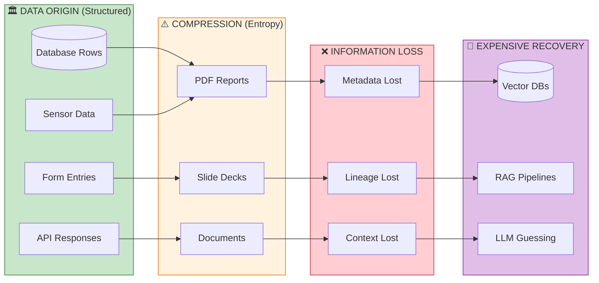
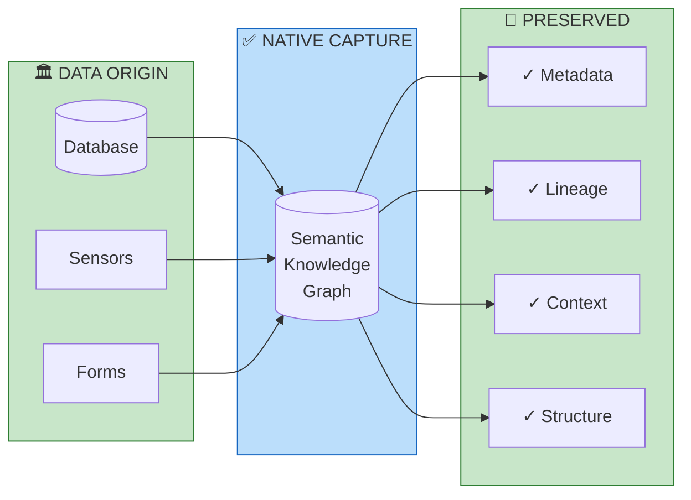
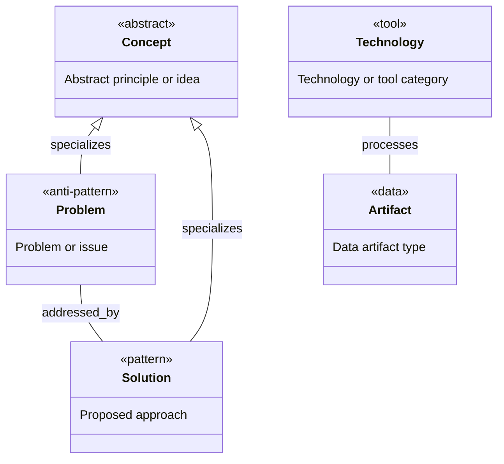
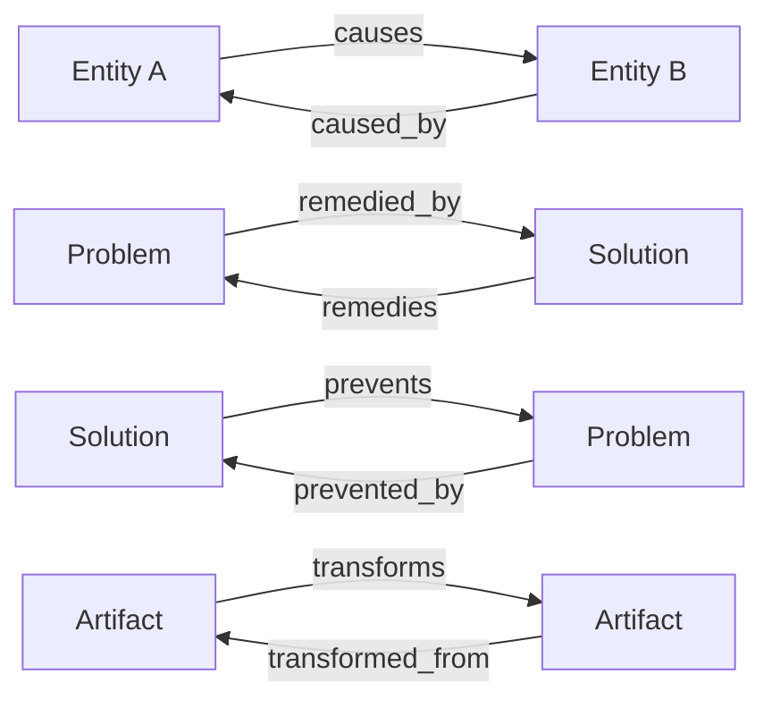
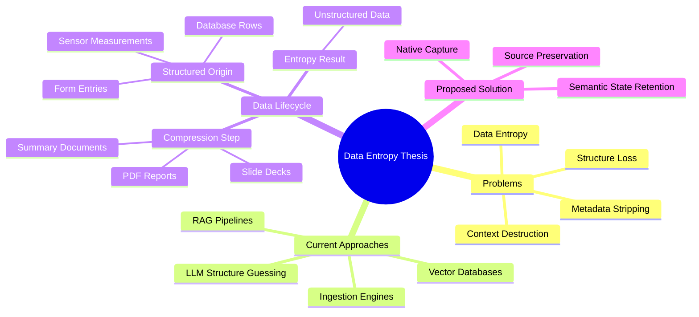
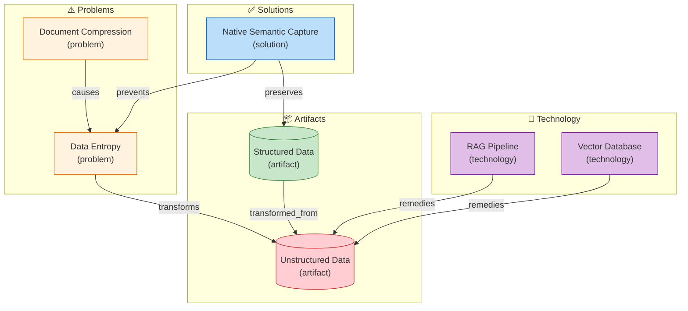
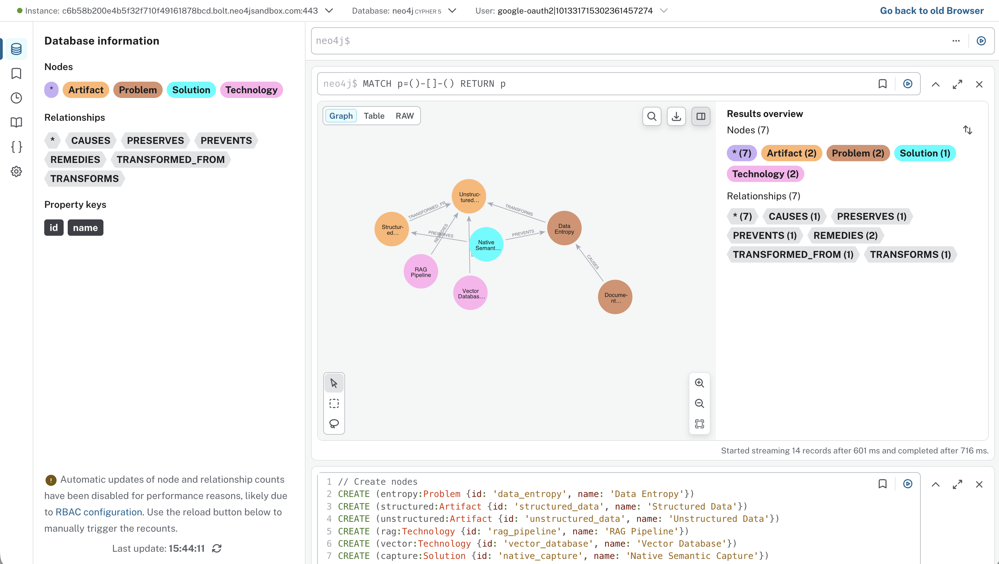

# Unbaking the Cake - Capturing Data Before Entropy

[📖 README](./README.md) · [🖼️ Infographic](./24%20Jan%20-%20The%20Case%20for%20Native%20Data%20Capture.jpg) · [📑 Slides](./24%20Jan%20-%20Capture_Not_Retrieval.pdf) · [🏠 Home](../../../../README.md)

> *Semantic Knowledge Graph (SKG) — machine-readable metadata for search, discovery, and graph database integration*

---

## Summary

Timothy Cook argues that the GenAI industry's massive investment in processing "unstructured data" is fundamentally misguided. The uncomfortable truth: there is no such thing as naturally occurring unstructured enterprise data. Every PDF report, slide deck, and summary document started as structured data—database rows, sensor measurements, form entries—that was deliberately compressed into human-readable formats, stripping away lineage, metadata, and semantic context. We then pay LLM companies millions to "guess" the structure we just destroyed. The solution isn't better RAG—it's better capture at the point of creation, preserving meaning before entropy sets in.

---

## Key Concepts

- **Data Entropy**: The loss of structure, lineage, metadata, and semantic context when structured data is compressed into documents for human consumption—an irreversible information loss that the industry then tries to reverse.

- **The Unbaking Fallacy**: The idea that we can reliably reconstruct the original structured data from documents is fundamentally flawed—like trying to unbake a cake back into flour, eggs, and sugar.

- **Native Semantic Capture**: Capturing data at its source in its native, semantic state before flattening it into documents—preserving the meaning at the point of creation rather than hallucinating context later.

- **RAG as Expensive Glue**: Retrieval-Augmented Generation pipelines are characterized as costly remediation for a self-inflicted problem—breaking data then buying expensive tools to partially fix it.

- **Structure Reconstruction Cost**: The billions spent on vector databases, ingestion engines, and LLM inference to "guess" structure that existed before document creation—a massive industry built on reversing preventable entropy.

- **The Document Compression Problem**: The practice of force-compressing rich, structured data into formats like PDFs and slide decks solely for human readability, destroying machine-usable structure in the process.

---

## Core Arguments

1. Enterprise data is always born structured—as database rows, sensor measurements, form entries, API responses—and only becomes "unstructured" through deliberate document creation processes.

2. The GenAI industry treats unstructured data as a "natural resource to be mined" when it's actually a human-created artifact that resulted from information destruction.

3. Vector databases, RAG pipelines, and massive ingestion engines are essentially trying to reverse an irreversible process—reconstructing structure that was deliberately stripped away.

4. Paying LLM companies to "guess" the structure we destroyed is economically irrational when we could have simply preserved that structure in the first place.

5. The future of enterprise AI isn't better retrieval or smarter RAG—it's preventing the creation of unstructured data by capturing semantic meaning at the source.

6. If you capture meaning at the point of creation, you eliminate the need to hallucinate context later—prevention is fundamentally superior to remediation.

---

## Key Quotes

> "We are spending billions trying to unbake the cake."

> "There is no such thing as naturally occurring unstructured enterprise data."

> "Data is born structured. It only becomes 'unstructured' because we force-compress it into documents so humans can read it."

> "We are breaking the data, and then buying expensive glue to fix it."

---

## Tags

`data-entropy` `unstructured-data` `rag-pipelines` `vector-databases` `semantic-capture` `llm-costs` `document-processing` `data-lineage` `metadata-loss` `enterprise-ai` `information-architecture` `3rd-party-content`

---

## Search Phrases

- "unstructured data is not naturally occurring"
- "data entropy document compression"
- "RAG pipeline expensive remediation"
- "capture data at source semantic state"
- "unbaking the cake data reconstruction"
- "LLM costs structure guessing"
- "vector database treating symptoms"
- "prevent unstructured data creation"
- "metadata lineage loss documents"
- "native semantic capture enterprise AI"

---

## Metadata

| Field | Value |
|-------|-------|
| **Content Type** | 3rd Party LinkedIn Post |
| **Domain** | Enterprise AI / Data Architecture |
| **Sub-domain** | Information Management / GenAI Strategy |
| **Author** | Timothy Cook |
| **Author LinkedIn** | https://www.linkedin.com/in/timothywaynecook/ |
| **Source URL** | https://www.linkedin.com/feed/update/urn:li:activity:7419714503782850560/ |
| **Date** | January 2026 |
| **Target Audience** | Enterprise Architects, AI/ML Engineers, Data Engineers, CTOs |

---

## Related Content

| Relationship | Content |
|--------------|---------|
| `relevant_to` | Semantic Knowledge Graph approaches |
| `contrasts_with` | RAG-first enterprise AI strategies |
| `supports` | Data-first architecture patterns |
| `related_to` | Metadata preservation systems |

---

## Semantic Knowledge Graph

### The Core Problem (Visual)



### The Solution (Visual)



---

### Ontology

> The ontology defines the **types of entities** (nodes) and **relationships** (predicates) in this knowledge domain.

#### Node Types



| Ref | Description | Examples |
|-----|-------------|----------|
| `concept` | Abstract concept or principle | Data Entropy, Unbaking Fallacy |
| `technology` | Technology or tool category | Vector DB, RAG Pipeline, LLM |
| `problem` | Problem or anti-pattern | Structure Loss, Metadata Stripping |
| `solution` | Proposed solution or approach | Native Capture, Source Preservation |
| `artifact` | Data artifact type | Structured Data, PDF, Document |

#### Predicates (Relationships)



| Ref | Inverse | Description |
|-----|---------|-------------|
| `causes` | `caused_by` | Causal relationship |
| `remedies` | `remedied_by` | Problem-solution relationship |
| `prevents` | `prevented_by` | Prevention relationship |
| `transforms` | `transformed_from` | Data transformation |

---

### Taxonomy

> Hierarchical classification of concepts in this domain.



**ASCII Tree View:**

```
data_entropy_thesis
├── problems
│   ├── data_entropy
│   ├── structure_loss
│   ├── metadata_stripping
│   └── context_destruction
├── current_approaches
│   ├── vector_databases
│   ├── rag_pipelines
│   ├── ingestion_engines
│   └── llm_structure_guessing
├── data_lifecycle
│   ├── structured_origin
│   │   ├── database_rows
│   │   ├── sensor_measurements
│   │   └── form_entries
│   ├── compression_step
│   │   ├── pdf_reports
│   │   ├── slide_decks
│   │   └── summary_documents
│   └── entropy_result
│       └── unstructured_data
└── proposed_solution
    ├── native_capture
    ├── source_preservation
    └── semantic_state_retention
```

---

### Knowledge Graph

> Visual representation of entities and their relationships.



#### Nodes (for database import)

| ID | Type | Name |
|----|------|------|
| `data_entropy` | `problem` | Data Entropy |
| `structured_data` | `artifact` | Structured Data |
| `unstructured_data` | `artifact` | Unstructured Data |
| `rag_pipeline` | `technology` | RAG Pipeline |
| `vector_database` | `technology` | Vector Database |
| `native_capture` | `solution` | Native Semantic Capture |
| `document_compression` | `problem` | Document Compression |

#### Edges (for database import)

| From | Predicate | To |
|------|-----------|-----|
| `document_compression` | `causes` | `data_entropy` |
| `data_entropy` | `transforms` | `unstructured_data` |
| `rag_pipeline` | `remedies` | `unstructured_data` |
| `vector_database` | `remedies` | `unstructured_data` |
| `native_capture` | `prevents` | `data_entropy` |
| `native_capture` | `preserves` | `structured_data` |
| `structured_data` | `transformed_from` | `unstructured_data` |

---

### Cypher Import (Neo4j)

```cypher
// Create nodes
CREATE (entropy:Problem {id: 'data_entropy', name: 'Data Entropy'})
CREATE (structured:Artifact {id: 'structured_data', name: 'Structured Data'})
CREATE (unstructured:Artifact {id: 'unstructured_data', name: 'Unstructured Data'})
CREATE (rag:Technology {id: 'rag_pipeline', name: 'RAG Pipeline'})
CREATE (vector:Technology {id: 'vector_database', name: 'Vector Database'})
CREATE (capture:Solution {id: 'native_capture', name: 'Native Semantic Capture'})
CREATE (compression:Problem {id: 'document_compression', name: 'Document Compression'})

// Create relationships
CREATE (compression)-[:CAUSES]->(entropy)
CREATE (entropy)-[:TRANSFORMS]->(unstructured)
CREATE (rag)-[:REMEDIES]->(unstructured)
CREATE (vector)-[:REMEDIES]->(unstructured)
CREATE (capture)-[:PREVENTS]->(entropy)
CREATE (capture)-[:PRESERVES]->(structured)
CREATE (structured)-[:TRANSFORMED_FROM]->(unstructured)
```

---

### Neo4j Visualization



**How to import and visualize this graph in Neo4j:**

1. **Create a free Neo4j Sandbox** at [sandbox.neo4j.com](https://sandbox.neo4j.com/) — select "Blank Sandbox"
2. **Open Neo4j Browser** and paste the Cypher code above into the query editor
3. **Run the query** (click the play button or press Ctrl+Enter)
4. **Visualize the graph** with this query:
   ```cypher
   MATCH p=()-[]-()
   RETURN p
   ```

This renders all nodes and relationships, showing how concepts like *Data Entropy*, *Native Semantic Capture*, and *RAG Pipeline* interconnect as a visual knowledge graph.
