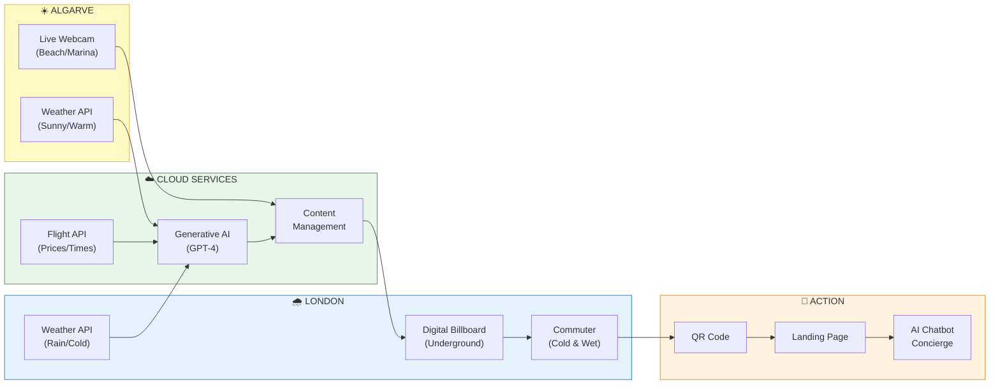
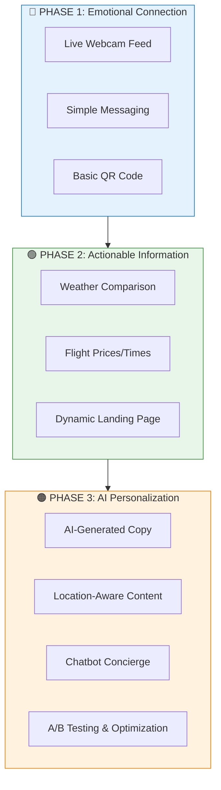
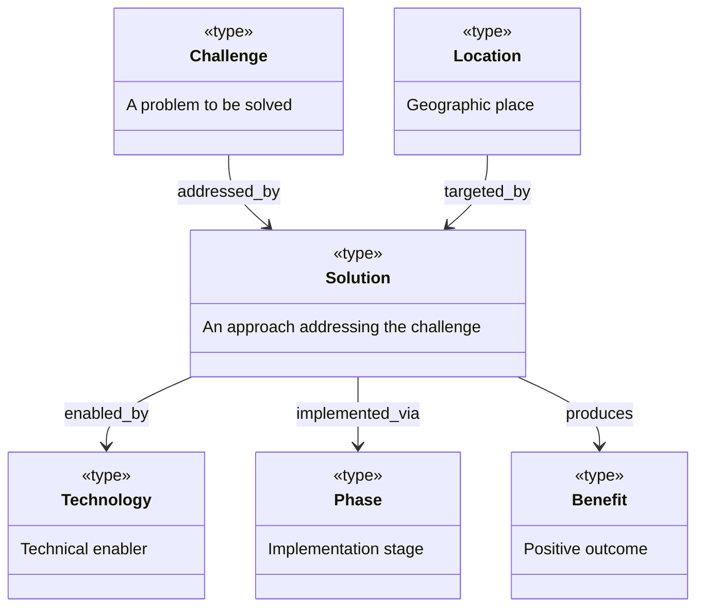
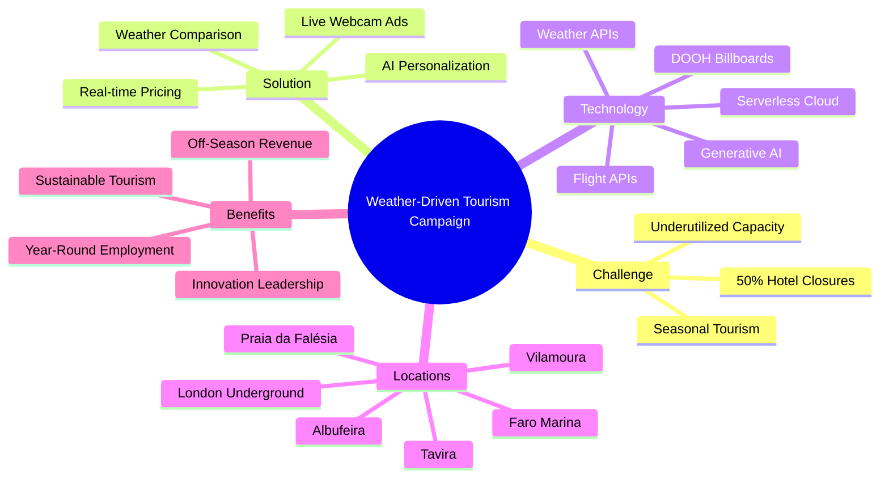
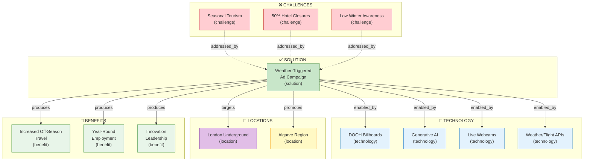

# Dynamic Weather-Driven Algarve Tourism Campaign

[📖 README](./README.md) · [🖼️ Infographic](./14%20Jan%20-%20%28infographic%29%20Rainy%20London%2C%20Sunny%20Algarve%20Advertising.png) · [📑 Slides](./14%20Jan%20-%20%28side%20deck%29%20Closing%20the%20Sunshine%20Gap%20-%20Algarve%20Surplus%20Strategy.pdf) · [🏠 Home](../../../../README.md)

> *Semantic Knowledge Graph (SKG) — machine-readable metadata for search, discovery, and graph database integration*

---

## Summary

This white paper proposes a dynamic, AI-powered advertising campaign to address Portugal's Algarve region seasonal tourism challenge. The concept: deploy digital billboards in London's Underground that display live webcam feeds from sunny Algarve beaches when London weather is rainy or cold. Ads include real-time weather comparisons, flight prices, and travel times, with Generative AI creating personalized messaging. The goal is to entice spontaneous off-season travel, distributing tourism more evenly throughout the year while positioning Portugal as an innovator in smart advertising.

---

## Key Concepts

- **Weather-Triggered Marketing**: Advertising that responds dynamically to real-time weather conditions, showing sunny destinations when the viewer's local weather is poor — proven to spike travel bookings during inclement weather.

- **Digital Out-of-Home (DOOH)**: Modern digital billboards capable of displaying video, live streams, and dynamically updated content via APIs — the infrastructure enabling this campaign in London Underground stations.

- **Seasonal Tourism Problem**: The Algarve faces extreme seasonality — overflowing in summer, half-empty in winter, with ~50% of hotels closing for winter months despite 300+ sunny days per year.

- **Live Webcam Authenticity**: Real-time video feeds eliminate skepticism from glossy stock photos — viewers see actual current conditions, creating visceral emotional contrast with their rainy reality.

- **Generative AI Content Engine**: AI (like GPT-4) dynamically composes ad copy based on real-time inputs (weather, prices, time), enabling unlimited contextual variations without manual scripting.

- **Phased Implementation**: Three-stage rollout from simple live feeds (Phase 1) to weather/price data (Phase 2) to full AI personalization with chatbot concierge (Phase 3).

---

## Core Arguments

1. **The Weather Gap is Real and Underexploited**: Algarve enjoys ~5 hours of winter sunshine daily versus ~1 hour in London — yet visitors don't realize how pleasant off-season Algarve can be.

2. **Live Feeds Beat Stock Photography**: Showing actual real-time footage creates authenticity that glossy ads cannot match — if it's raining in London and sunny in Algarve right now, viewers see it with their own eyes.

3. **Emotional Triggers Drive Spontaneous Action**: A cold, wet commuter seeing a warm beach scene experiences an immediate emotional desire to escape — the ad answers their current discomfort.

4. **Actionable Information Converts Interest to Bookings**: Adding flight prices ("from £50"), times ("2h40m flight"), and QR codes transforms passive longing into immediate action.

5. **AI Makes Real-Time Personalization Feasible**: Without AI, scripting every weather/time/location combination would be impossible — Generative AI handles unlimited contextual variations efficiently.

6. **Technology Already Exists**: DOOH networks support live content, weather APIs are cheap, flight data is accessible, serverless cloud makes it cost-effective — this is practical today.

---

## Key Quotes

> "Imagine a digital billboard in an Underground station on a grey morning, streaming a live webcam from an Algarve beach, with text that reads: 'It's 25°C here right now. You could be here tomorrow – flights from £50.'"

> "The uncomfortable truth: roughly 50% of Algarve hotels close for the winter months due to lack of visitors, while travelers in winter are craving sunshine."

> "AI can dynamically tailor the ad content based on real-time conditions — this level of dynamic messaging keeps the campaign fresh and hyper-relevant to the moment."

> "Generative AI is the catalyst that transforms a cool idea – streaming Algarve sunshine to London – into an operational reality that can adapt, personalize, and optimize at scale."

---

## Tags

`weather-triggered-marketing` `dooh` `digital-billboards` `algarve` `portugal` `tourism` `seasonal-tourism` `generative-ai` `live-streaming` `london-underground` `travel-advertising` `off-season` `serverless` `weather-api` `personalization`

---

## Search Phrases

- "weather-triggered travel advertising"
- "AI-powered tourism marketing"
- "live webcam billboard advertising"
- "solving seasonal tourism with technology"
- "digital out-of-home dynamic content"
- "Algarve winter tourism promotion"
- "real-time personalized advertising"
- "London to Portugal spontaneous travel"
- "GenAI in advertising campaigns"
- "weather-based ad targeting"

---

## Semantic Knowledge Graph

### Campaign Architecture (Visual)



### Phased Implementation



### Ontology



### Taxonomy



### Knowledge Graph



### Cypher Import (Neo4j)

```cypher
// Create Challenge nodes
CREATE (seasonal:Challenge {id: 'seasonal_tourism', name: 'Seasonal Tourism', description: 'Algarve overflows in summer, half-empty in winter'})
CREATE (closures:Challenge {id: 'hotel_closures', name: '50% Hotel Closures', description: 'Half of Algarve hotels close for winter months'})
CREATE (awareness:Challenge {id: 'low_awareness', name: 'Low Winter Awareness', description: 'Tourists dont realize how pleasant off-season Algarve is'})

// Create Solution node
CREATE (campaign:Solution {id: 'weather_triggered_campaign', name: 'Weather-Triggered Ad Campaign', description: 'Live webcam ads in London showing sunny Algarve when London is rainy'})

// Create Technology nodes
CREATE (dooh:Technology {id: 'dooh', name: 'DOOH Billboards', description: 'Digital Out-of-Home advertising screens in London Underground'})
CREATE (genai:Technology {id: 'generative_ai', name: 'Generative AI', description: 'AI-powered dynamic content generation (GPT-4)'})
CREATE (webcam:Technology {id: 'live_webcams', name: 'Live Webcams', description: 'Real-time video feeds from Algarve beaches and marinas'})
CREATE (apis:Technology {id: 'weather_flight_apis', name: 'Weather/Flight APIs', description: 'Real-time weather data and flight pricing'})

// Create Location nodes
CREATE (london:Location {id: 'london', name: 'London Underground', description: 'Target audience location - rainy commuters'})
CREATE (algarve:Location {id: 'algarve', name: 'Algarve Region', description: 'Destination - 300+ sunny days per year'})

// Create Benefit nodes
CREATE (offseason:Benefit {id: 'offseason_travel', name: 'Increased Off-Season Travel', description: 'More visitors during winter months'})
CREATE (employment:Benefit {id: 'year_round_employment', name: 'Year-Round Employment', description: 'Stable jobs for tourism workers'})
CREATE (innovation:Benefit {id: 'innovation_leadership', name: 'Innovation Leadership', description: 'Portugal positioned as tech-savvy destination'})

// Create Phase nodes
CREATE (phase1:Phase {id: 'phase1', name: 'Phase 1: Emotional Connection', description: 'Live webcam feeds with simple messaging'})
CREATE (phase2:Phase {id: 'phase2', name: 'Phase 2: Actionable Information', description: 'Weather comparison, flight prices, QR codes'})
CREATE (phase3:Phase {id: 'phase3', name: 'Phase 3: AI Personalization', description: 'Dynamic itineraries, chatbot concierge'})

// Create relationships
CREATE (seasonal)-[:ADDRESSED_BY]->(campaign)
CREATE (closures)-[:ADDRESSED_BY]->(campaign)
CREATE (awareness)-[:ADDRESSED_BY]->(campaign)

CREATE (campaign)-[:ENABLED_BY]->(dooh)
CREATE (campaign)-[:ENABLED_BY]->(genai)
CREATE (campaign)-[:ENABLED_BY]->(webcam)
CREATE (campaign)-[:ENABLED_BY]->(apis)

CREATE (campaign)-[:TARGETS]->(london)
CREATE (campaign)-[:PROMOTES]->(algarve)

CREATE (campaign)-[:PRODUCES]->(offseason)
CREATE (campaign)-[:PRODUCES]->(employment)
CREATE (campaign)-[:PRODUCES]->(innovation)

CREATE (campaign)-[:IMPLEMENTED_VIA]->(phase1)
CREATE (campaign)-[:IMPLEMENTED_VIA]->(phase2)
CREATE (campaign)-[:IMPLEMENTED_VIA]->(phase3)
CREATE (phase1)-[:PRECEDES]->(phase2)
CREATE (phase2)-[:PRECEDES]->(phase3)
```

---

## Metadata

| Field | Value |
|-------|-------|
| **Content Type** | White Paper / Business Proposal |
| **Domain** | Tourism Marketing |
| **Sub-domain** | AI-Powered Advertising, DOOH |
| **Author** | Dinis Cruz (with ChatGPT Deep Research) |
| **Date Created** | October 2024 |
| **NotebookLM Assets** | January 2025 |
| **License** | CC BY 4.0 |

---

## Related Content

| Relationship | Content |
|--------------|---------|
| `uses` | Generative AI (GPT-4) |
| `uses` | Digital Out-of-Home advertising |
| `related_to` | Tourism Yukon midnight sun campaign |
| `related_to` | Weather-triggered marketing research |
| `applied_in` | Portugal tourism promotion |
