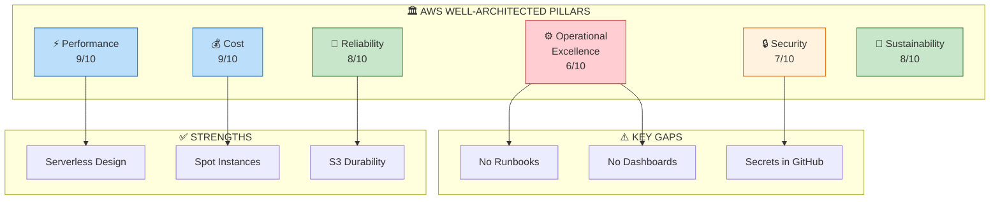
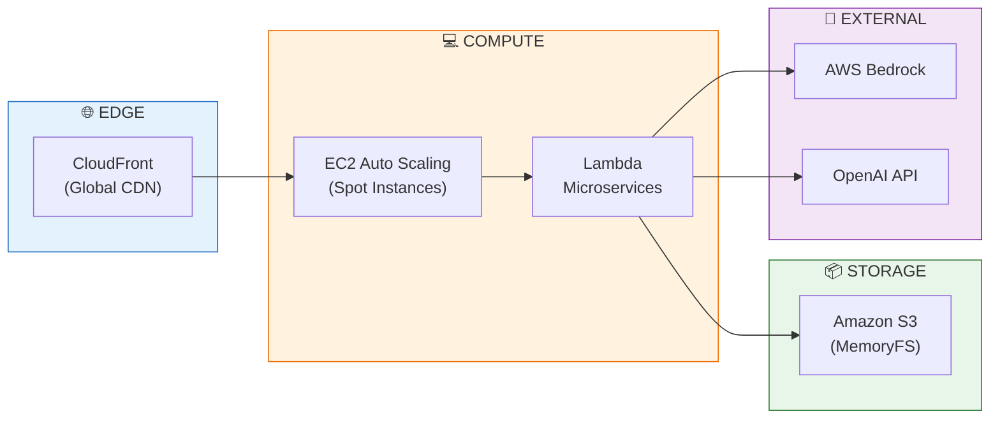
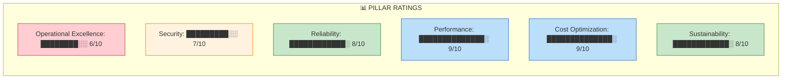
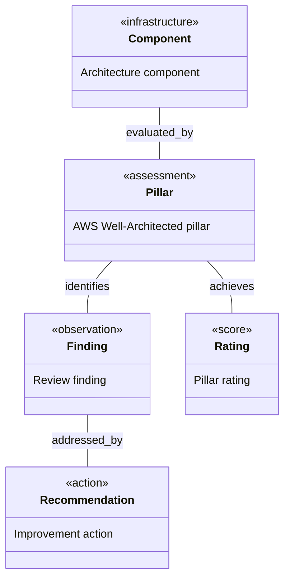
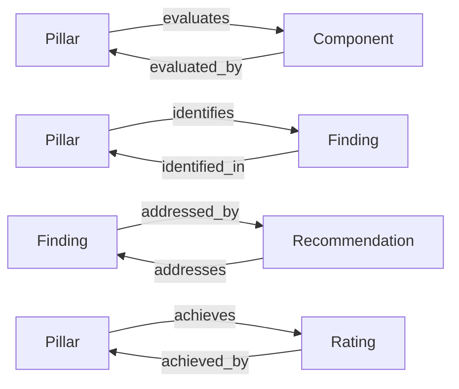
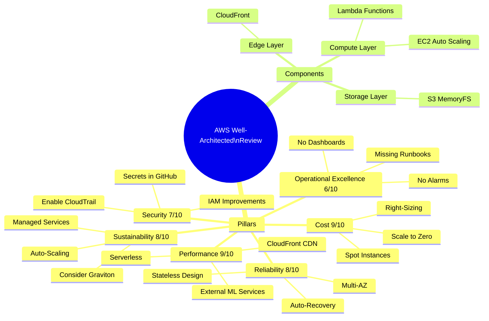
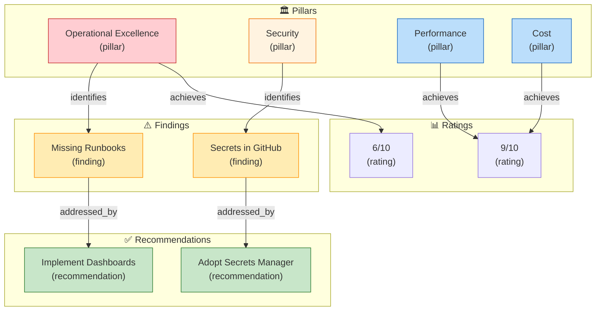

# AWS Well-Architected Framework Review – Web Content Filtering Proxy Solution

[📖 README](./README.md) · [🖼️ Infographic](./22%20Jan%20-%20Cloud%20Proxy%20Risk%20and%20Optimisation..jpg) · [📑 Slides](./22%20Jan%20-%20Web_Content_Filtering_Proxy_Audit.pdf) · [🏠 Home](../../../../README.md)

> *Semantic Knowledge Graph (SKG) — machine-readable metadata for search, discovery, and graph database integration*

---

## Summary

This AWS Well-Architected Framework review evaluates a man-in-the-middle web proxy designed for advanced content filtering against all six AWS pillars. The architecture features CloudFront global distribution, EC2 Auto Scaling proxy tier with Spot Instances, Lambda-based microservices, and S3 as the primary data store. Key findings include strong performance efficiency (9/10) and cost optimization (9/10) through serverless design and Spot usage, but operational gaps (6/10) due to missing runbooks, dashboards, and alarms. Security (7/10) needs improvement with secrets management migration to AWS Secrets Manager and IAM policy tightening. The review provides detailed recommendations for each pillar to achieve production-grade maturity.

---

## Key Concepts

- **AWS Well-Architected Framework**: Six-pillar evaluation methodology covering Operational Excellence, Security, Reliability, Performance Efficiency, Cost Optimization, and Sustainability for cloud workloads.

- **MITM Web Proxy Architecture**: Man-in-the-middle proxy intercepting HTTP(S) traffic, deconstructing HTML, applying semantic analysis and sentiment classification, then reconstructing sanitized content.

- **Serverless Microservices Pattern**: Lambda functions (FastAPI/Python) for Man-in-the-Middle API, HTML Service, Semantic Text Service, HTML Graph/Storage, and Caching Service with CloudFront distribution.

- **S3 as Database (MemoryFS)**: Using Amazon S3 with versioning as primary data store via custom abstraction layer, eliminating traditional database management while achieving 11 nines durability.

- **Spot Instances for Cost Optimization**: Stateless EC2 proxy tier using Spot Instances (up to 90% cheaper than on-demand) with Auto Scaling Group handling interruptions gracefully.

- **Operational Maturity Gaps**: Missing runbooks/playbooks, no CloudWatch dashboards or alarms, secrets stored in GitHub Secrets rather than AWS Secrets Manager, no game days conducted.

---

## Core Arguments

1. The architecture achieves high performance efficiency (9/10) through serverless components, global CloudFront distribution, and offloading heavy ML computations to external services (AWS Bedrock, OpenAI API) rather than self-hosting models.

2. Cost optimization (9/10) is excellent due to aggressive use of Spot Instances, scale-to-zero Lambda architecture, right-sizing through benchmarking, and the ability to tear down entire environments after business hours.

3. Operational Excellence (6/10) is the weakest pillar due to lack of documented runbooks, no CloudWatch dashboards or automated alarms, and no incident response procedures or game days conducted.

4. Security (7/10) benefits from IAM roles with some least-privilege scope and TLS everywhere, but needs improvement in secrets management (migrate from GitHub Secrets to AWS Secrets Manager) and enabling CloudTrail/GuardDuty.

5. Reliability (8/10) is strong with multi-AZ deployment, auto-recovery via ASG health checks, stateless services, and S3's inherent durability, but needs regular failure testing and documented recovery procedures.

6. Sustainability (8/10) aligns with AWS best practices through right-sizing, auto-scaling to eliminate idle resources, and leveraging managed services, though adopting Graviton instances could further improve energy efficiency.

---

## Key Quotes

> "The architecture is largely serverless and stateless, with a small always-on footprint (the proxy EC2 tier) that can scale dynamically."

> "Runbooks are codified processes that provide consistent outcomes no matter who uses them, and should include steps for handling errors and escalations."

> "Spot Instances are ideal for fault-tolerant, stateless workloads like web servers and API endpoints."

> "The biggest gaps to address are in operational preparedness and security management, which can be improved with relatively small changes."

---

## Tags

`aws-well-architected` `six-pillars` `mitm-proxy` `content-filtering` `cloudfront` `lambda` `ec2-auto-scaling` `spot-instances` `s3-database` `operational-excellence` `security-review` `cost-optimization`

---

## Search Phrases

- "AWS Well-Architected Framework proxy review"
- "MITM web proxy architecture assessment"
- "CloudFront Lambda microservices pattern"
- "S3 as database MemoryFS pattern"
- "Spot Instances stateless proxy tier"
- "operational excellence runbooks playbooks"
- "AWS Secrets Manager migration GitHub Secrets"
- "multi-AZ auto scaling reliability"
- "serverless cost optimization Lambda"
- "sustainability pillar Graviton instances"

---

## Metadata

| Field | Value |
|-------|-------|
| **Content Type** | Technical Architecture Review |
| **Domain** | Dev Briefs / MitmProxy Service |
| **Sub-domain** | AWS Well-Architected / Cloud Architecture |
| **Format** | PDF (19 pages) |
| **Date** | January 2026 |
| **Generated By** | ChatGPT Deep Research |
| **Target Audience** | Cloud Architects, DevOps Engineers, Security Teams |

---

## Related Content

| Relationship | Content |
|--------------|---------|
| `reviews` | MITM Proxy Platform Architecture |
| `applies` | AWS Well-Architected Framework |
| `related_to` | Mitmproxy Solution Architecture Debrief |
| `related_to` | Project Plan: AWS Deployment Service Integration |
| `part_of` | MyFeeds.ai Service Architecture |

---

## Semantic Knowledge Graph

### Six Pillars Assessment (Visual)



### Architecture Components (Visual)



### Pillar Ratings Radar (Visual)



---

### Ontology

> The ontology defines the **types of entities** (nodes) and **relationships** (predicates) in this knowledge domain.

#### Node Types



| Ref | Description | Examples |
|-----|-------------|----------|
| `pillar` | AWS Well-Architected pillar | Operational Excellence, Security, Reliability |
| `component` | Architecture component | CloudFront, Lambda, EC2, S3 |
| `finding` | Review finding | Missing Runbooks, Secrets Gap |
| `recommendation` | Improvement action | Adopt Secrets Manager, Implement Dashboards |
| `rating` | Pillar rating | 6/10, 9/10 |

#### Predicates (Relationships)



| Ref | Inverse | Description |
|-----|---------|-------------|
| `evaluates` | `evaluated_by` | Pillar evaluation |
| `identifies` | `identified_in` | Finding identification |
| `recommends` | `recommended_by` | Improvement suggestion |
| `achieves` | `achieved_by` | Rating achievement |

---

### Taxonomy

> Hierarchical classification of concepts in this domain.



**ASCII Tree View:**

```
aws_well_architected_review
├── pillars
│   ├── operational_excellence (6/10)
│   ├── security (7/10)
│   ├── reliability (8/10)
│   ├── performance_efficiency (9/10)
│   ├── cost_optimization (9/10)
│   └── sustainability (8/10)
├── architecture_components
│   ├── cloudfront_distribution
│   ├── ec2_proxy_tier
│   ├── lambda_microservices
│   └── s3_data_store
├── gaps_identified
│   ├── missing_runbooks
│   ├── no_monitoring_dashboards
│   └── secrets_not_in_aws
└── key_recommendations
    ├── implement_cloudwatch_alarms
    ├── adopt_secrets_manager
    ├── conduct_game_days
    └── tighten_iam_policies
```

---

### Knowledge Graph

> Visual representation of entities and their relationships.



#### Nodes (for database import)

| ID | Type | Name |
|----|------|------|
| `oe_pillar` | `pillar` | Operational Excellence |
| `security_pillar` | `pillar` | Security |
| `reliability_pillar` | `pillar` | Reliability |
| `performance_pillar` | `pillar` | Performance Efficiency |
| `cost_pillar` | `pillar` | Cost Optimization |
| `missing_runbooks` | `finding` | No Documented Runbooks |
| `secrets_gap` | `finding` | Secrets in GitHub not AWS |
| `secrets_manager` | `recommendation` | Adopt AWS Secrets Manager |

#### Edges (for database import)

| From | Predicate | To |
|------|-----------|-----|
| `oe_pillar` | `identifies` | `missing_runbooks` |
| `security_pillar` | `identifies` | `secrets_gap` |
| `security_pillar` | `recommends` | `secrets_manager` |
| `performance_pillar` | `achieves` | `9_out_of_10` |
| `cost_pillar` | `achieves` | `9_out_of_10` |
| `oe_pillar` | `achieves` | `6_out_of_10` |

---

### Cypher Import (Neo4j)

```cypher
// Create pillar nodes
CREATE (oe:Pillar {id: 'oe_pillar', name: 'Operational Excellence', rating: 6})
CREATE (sec:Pillar {id: 'security_pillar', name: 'Security', rating: 7})
CREATE (rel:Pillar {id: 'reliability_pillar', name: 'Reliability', rating: 8})
CREATE (perf:Pillar {id: 'performance_pillar', name: 'Performance Efficiency', rating: 9})
CREATE (cost:Pillar {id: 'cost_pillar', name: 'Cost Optimization', rating: 9})
CREATE (sust:Pillar {id: 'sustainability_pillar', name: 'Sustainability', rating: 8})

// Create finding nodes
CREATE (runbooks:Finding {id: 'missing_runbooks', name: 'No Documented Runbooks'})
CREATE (secrets:Finding {id: 'secrets_gap', name: 'Secrets in GitHub not AWS'})
CREATE (dashboards:Finding {id: 'no_dashboards', name: 'No CloudWatch Dashboards'})

// Create recommendation nodes
CREATE (secmgr:Recommendation {id: 'secrets_manager', name: 'Adopt AWS Secrets Manager'})
CREATE (alarms:Recommendation {id: 'implement_alarms', name: 'Implement CloudWatch Alarms'})

// Create relationships
CREATE (oe)-[:IDENTIFIES]->(runbooks)
CREATE (oe)-[:IDENTIFIES]->(dashboards)
CREATE (sec)-[:IDENTIFIES]->(secrets)
CREATE (secrets)-[:ADDRESSED_BY]->(secmgr)
CREATE (runbooks)-[:ADDRESSED_BY]->(alarms)
```
