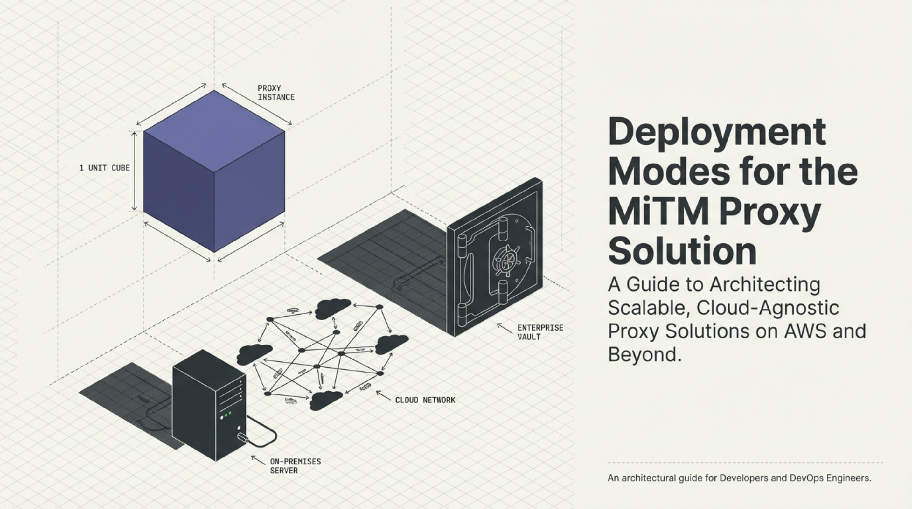

# Deployment Modes for the Man-in-the-Middle Proxy Solution (AWS-Oriented)

[← Back to Dev Briefs - MitmProxy Service](../README.md) · [Published](../../README.md) · [Home](../../../../README.md)

| 📄 Source | 🖼️ Infographic | 📑 Slides |
|-----------|----------------|-----------|
| [Source Doc](./Deployment%20Modes%20for%20the%20Man-in-the-Middle%20Proxy%20Solution%20%28AWS-Oriented%29.pdf) | [View Image](./23%20Jan%20-%20MiTM%20Proxy%20Scaling%20Strategies.jpg) | [Slide Deck](./23%20Jan-%20Deployment_Modes_Scaling_the_MiTM_Proxy.pdf) |

> Generated with [Google NotebookLM](https://notebooklm.google.com/) — Source document → Infographic → Slide deck

---

## 🖼️ Infographic

---

## 📑 Slide Deck Preview

> **Deep Dive Presentation** — NotebookLM-generated slide deck exploring all six deployment modes in detail

*Click the image above to open the full slide deck*

---

## Overview

Comprehensive guide to six deployment models for the MiTM proxy solution, ranging from simple all-in-one single instance deployments to fully distributed serverless microservices on AWS Lambda or Kubernetes. The document explains how each model balances trade-offs in complexity, scalability, and resource usage, with all patterns being cloud-agnostic despite AWS-centric descriptions. Key insight: the architecture's stateless design (externalizing state to S3) enables horizontal scaling across all models.

---

## Contents

| File | Description |
|------|-------------|
| [Deployment Modes for the Man-in-the-Middle Proxy Solution (AWS-Oriented).pdf](./Deployment%20Modes%20for%20the%20Man-in-the-Middle%20Proxy%20Solution%20%28AWS-Oriented%29.pdf) | Main deployment guide (9 pages) |
| [23 Jan- Deployment_Modes_Scaling_the_MiTM_Proxy.pdf](./23%20Jan-%20Deployment_Modes_Scaling_the_MiTM_Proxy.pdf) | NotebookLM deep dive on scaling |
| [23 Jan - MiTM Proxy Scaling Strategies.jpg](./23%20Jan%20-%20MiTM%20Proxy%20Scaling%20Strategies.jpg) | Infographic on scaling strategies |
| [LinkedIn post](https://www.linkedin.com/posts/diniscruz_deployment-modes-scaling-the-mitm-proxy-ugcPost-7420506134899298304-5N77/) | LinkedIn post with slide deck |
| [CONTENT.md](./CONTENT.md) | Semantic Knowledge Graph metadata |

---

## Deployment Models Covered

| # | Model | Use Case |
|---|-------|----------|
| 1 | **All-in-One Single Instance** | Development, testing, small-scale production, on-prem appliances |
| 2 | **Split Proxy and API (Two-Tier)** | Security segmentation, different resource profiles |
| 3 | **All-in-One Serverless (Single Lambda)** | Reduce server management, bursty traffic |
| 4 | **Microservices on Multiple Lambdas** | Maximum scalability, independent service scaling |
| 5 | **Kubernetes Deployment** | Cloud-agnostic containers, on-prem K8s environments |
| 6 | **Fully Offline / Self-Contained** | Air-gapped environments, high-security installations |

---

## Key Architecture Principles

- **Stateless Design**: All application servers remain stateless by externalizing state to S3, enabling any instance to serve any request
- **In-Memory Microservices**: FastAPI's TestClient enables services to call each other internally without HTTP overhead
- **Flexible Caching Layer**: Storage abstraction allows swapping between in-memory, local disk, compressed archives, or S3
- **Cloud Agnostic**: Patterns translate to Azure (VMs, Functions, Blob, AKS) and GCP (GCE, Cloud Functions/Run, GCS, GKE)

---

## Source Information

| Field | Value |
|-------|-------|
| **Content Type** | Technical Architecture Guide |
| **Domain** | Dev Briefs / MitmProxy Service |
| **Format** | PDF (9 pages) |
| **Date** | January 2026 |
| **Generated By** | ChatGPT |
