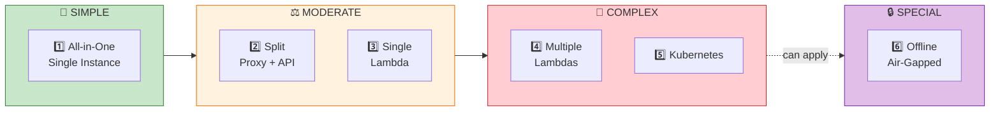
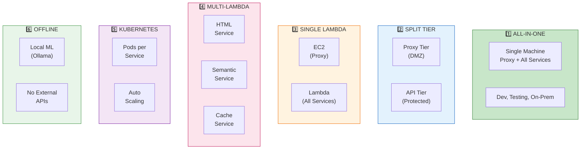
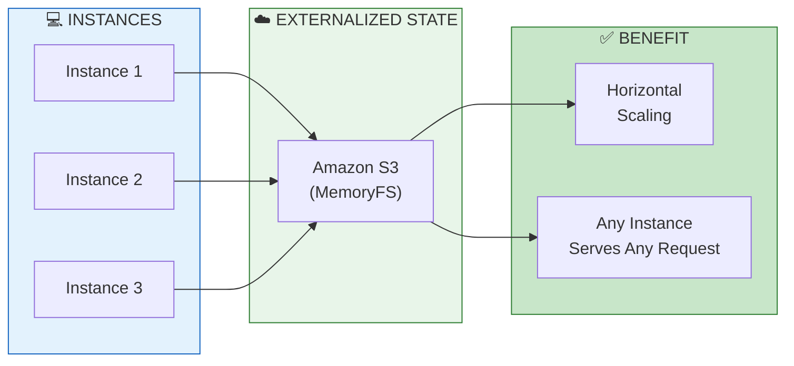
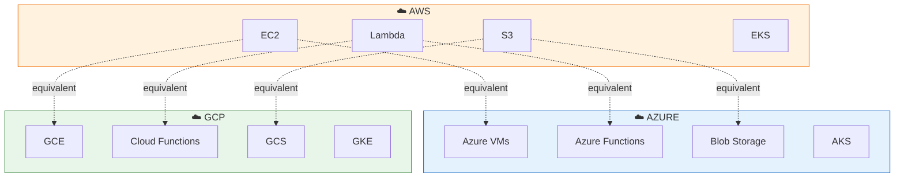
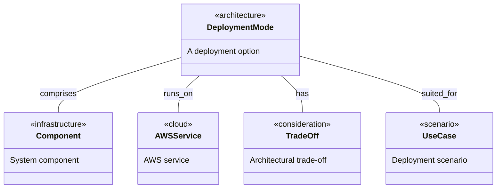
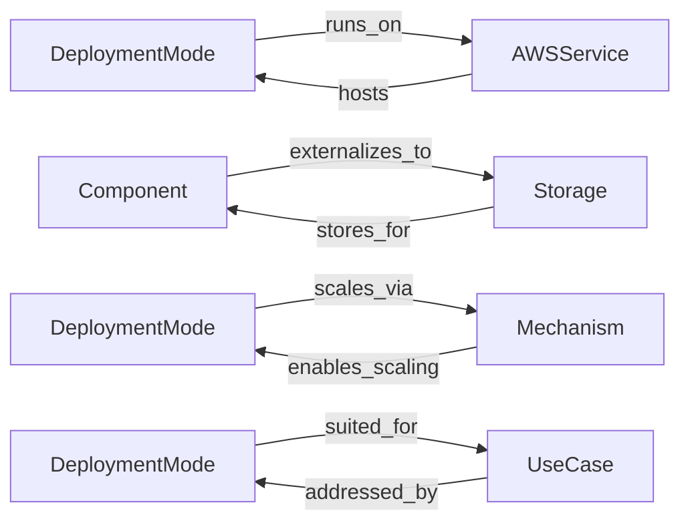
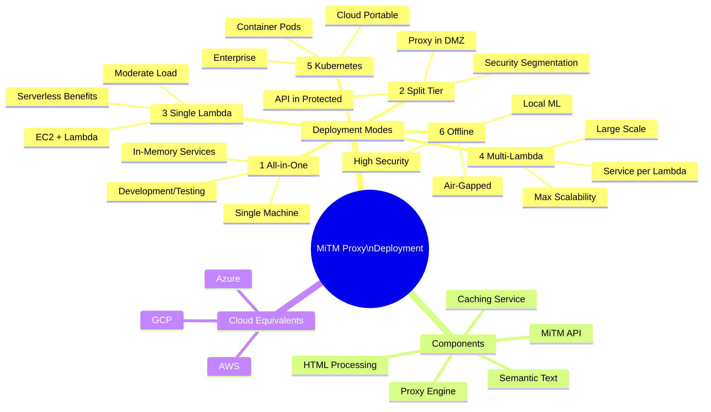
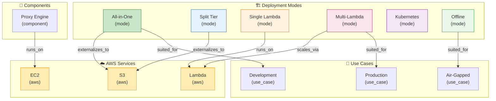

# Deployment Modes for the Man-in-the-Middle Proxy Solution (AWS-Oriented)

[📖 README](./README.md) · [🖼️ Infographic](./23%20Jan%20-%20MiTM%20Proxy%20Scaling%20Strategies.jpg) · [📑 Slides](./23%20Jan-%20Deployment_Modes_Scaling_the_MiTM_Proxy.pdf) · [🏠 Home](../../../../README.md)

> *Semantic Knowledge Graph (SKG) — machine-readable metadata for search, discovery, and graph database integration*

---

## Summary

This technical guide presents six deployment models for the MiTM proxy solution, spanning the spectrum from single-machine monolith to fully distributed cloud-native microservices. The solution comprises an intercepting HTTP/HTTPS proxy (requiring persistent compute) plus FastAPI-based microservices (MiTM Proxy API, HTML Processing, Graph Analysis, Semantic Text, Caching) that can be deployed together or separately. The architecture's stateless design—externalizing state to S3—enables horizontal scaling across all models. Each deployment mode offers different trade-offs: all-in-one for simplicity, split tiers for security segmentation, single Lambda for serverless benefits, multiple Lambdas for maximum granularity, Kubernetes for container portability, and offline mode for air-gapped environments.

---

## Key Concepts

- **Stateless Architecture Pattern**: Application servers externalize all state to S3 (or equivalent object storage), meaning any instance can serve any request without session affinity—the key enabler for horizontal scaling across all deployment modes.

- **In-Memory Microservices via TestClient**: FastAPI's testing/client mechanism allows services to call each other internally without actual HTTP requests, enabling the same code to work whether calling a remote REST API or an in-process function.

- **Flexible Storage Abstraction**: The caching layer uses a memoryfs-style abstraction allowing backend swaps between in-memory (volatile), local disk (persistent), compressed archives (zip), or cloud object storage (S3) without code changes.

- **Persistent Compute Requirement**: The MiTM proxy engine cannot run on purely serverless platforms because it needs to maintain an open network port and handle continuous HTTP connections—it always requires EC2, containers, or equivalent.

- **Hybrid Serverless Model**: The proxy runs on EC2 while the API/microservices tier runs on Lambda, combining persistent compute for interception with serverless scaling for processing logic.

- **Offline/Air-Gapped Augmentation**: A cross-cutting mode that can be applied to any deployment model by replacing external dependencies (AWS Comprehend, LLM APIs) with local alternatives (Ollama, HuggingFace pipelines).

---

## Core Arguments

1. The all-in-one deployment is not just for testing—it can be viable for production in low-traffic scenarios, on-prem appliances, or customer site deployments, with vertical scaling (larger instances) or modest horizontal scaling (identical instances behind ALB).

2. Splitting proxy and API tiers provides security segmentation (proxy in DMZ, processing in protected network) and enables independent scaling of network-intensive proxy work versus compute-intensive analysis work.

3. Single Lambda for all microservices reduces server management overhead and provides automatic scaling, but trades off cold-start latency and 15-minute execution time limits—suitable for moderate loads or bursty traffic.

4. Multiple Lambdas (one per microservice) offers maximum scalability and fault isolation—each service scales independently and can be updated without affecting others—but introduces network latency between services and deployment complexity.

5. Kubernetes provides container flexibility and cloud portability similar to multi-Lambda, but better handles long-running tasks (no execution time limits) and integrates well with existing K8s infrastructure and expertise.

6. The architecture's cloud-agnostic design means all patterns translate to Azure (VMs → Azure VMs, Lambda → Azure Functions, S3 → Blob Storage, EKS → AKS) and GCP (GCE, Cloud Functions/Run, GCS, GKE) with minimal changes.

---

## Key Quotes

> "Stateless designs externalize state so any server can handle any request, greatly simplifying scaling and improving reliability."

> "The code does not need to know whether it's calling a remote REST API or an in-process function, since the interface is the same."

> "Even the all-in-one deployment can be suitable for certain production scenarios, not just testing."

> "The deployment models provide a spectrum from a simple single-machine setup to a fully distributed, cloud-native microservice architecture."

---

## Tags

`deployment-modes` `mitm-proxy` `aws-architecture` `serverless` `lambda` `kubernetes` `microservices` `stateless-design` `s3-caching` `fastapi` `testclient` `horizontal-scaling` `air-gapped` `cloud-agnostic` `auto-scaling`

---

## Search Phrases

- "MITM proxy deployment modes AWS"
- "stateless microservices S3 state externalization"
- "FastAPI TestClient in-memory service calls"
- "single Lambda vs multiple Lambdas microservices"
- "Kubernetes vs serverless deployment trade-offs"
- "air-gapped proxy deployment offline mode"
- "all-in-one vs distributed architecture"
- "proxy tier API tier separation"
- "cloud-agnostic deployment patterns"
- "auto scaling group stateless instances"

---

## Metadata

| Field | Value |
|-------|-------|
| **Content Type** | Technical Architecture Guide |
| **Domain** | Dev Briefs / MitmProxy Service |
| **Sub-domain** | Deployment Architecture / Cloud Infrastructure |
| **Format** | PDF (9 pages) |
| **Date** | January 2026 |
| **Generated By** | ChatGPT |
| **Target Audience** | DevOps Engineers, Cloud Architects, Platform Engineers |

---

## Related Content

| Relationship | Content |
|--------------|---------|
| `extends` | MITM Proxy Platform Architecture Overview |
| `complements` | Standalone (Air-Gapped) MITM Proxy Service |
| `references` | AWS Well-Architected Framework Review |
| `uses` | FastAPI TestClient mechanism |
| `part_of` | MyFeeds.ai Service Architecture |

---

## Semantic Knowledge Graph

### Six Deployment Modes Spectrum (Visual)



### Deployment Mode Details (Visual)



### Stateless Architecture Pattern (Visual)



### Cloud Equivalents (Visual)



---

### Ontology

> The ontology defines the **types of entities** (nodes) and **relationships** (predicates) in this knowledge domain.

#### Node Types



| Ref | Description | Examples |
|-----|-------------|----------|
| `deployment_mode` | A deployment architecture option | All-in-One, Multi-Lambda, Kubernetes |
| `component` | System component | Proxy Engine, HTML Service, Cache |
| `aws_service` | AWS service | EC2, Lambda, S3, API Gateway |
| `trade_off` | Architectural trade-off | Complexity vs Scalability |
| `use_case` | Deployment scenario | Development, Production, Air-Gapped |

#### Predicates (Relationships)



| Ref | Inverse | Description |
|-----|---------|-------------|
| `runs_on` | `hosts` | Compute hosting |
| `externalizes_to` | `stores_for` | State externalization |
| `scales_via` | `enables_scaling` | Scaling mechanism |
| `suited_for` | `addressed_by` | Use case fit |

---

### Taxonomy

> Hierarchical classification of concepts in this domain.



**ASCII Tree View:**

```
mitm_proxy_deployment
├── deployment_modes
│   ├── all_in_one_single_instance
│   │   ├── single_machine_multiple_processes
│   │   ├── in_memory_microservices
│   │   └── flexible_caching_layer
│   ├── split_proxy_api_two_tier
│   │   ├── dedicated_proxy_servers
│   │   └── dedicated_api_servers
│   ├── all_in_one_serverless_lambda
│   │   ├── lambda_for_api_layer
│   │   └── ec2_for_proxy
│   ├── microservices_multiple_lambdas
│   │   ├── separate_lambda_functions
│   │   └── service_coordination
│   ├── kubernetes_deployment
│   │   ├── containerized_microservices
│   │   └── proxy_inside_or_outside_k8s
│   └── fully_offline_self_contained
│       ├── local_ml_nlp_services
│       └── no_external_calls
├── components
│   ├── intercepting_proxy_engine
│   ├── mitm_proxy_api
│   ├── html_processing_service
│   ├── graph_analysis_service
│   ├── semantic_text_service
│   └── caching_service
└── cloud_equivalents
    ├── azure (vms, functions, blob, aks)
    └── gcp (gce, cloud_run, gcs, gke)
```

---

### Knowledge Graph

> Visual representation of entities and their relationships.



#### Nodes (for database import)

| ID | Type | Name |
|----|------|------|
| `all_in_one` | `deployment_mode` | All-in-One Single Instance |
| `two_tier` | `deployment_mode` | Split Proxy/API Two-Tier |
| `single_lambda` | `deployment_mode` | All-in-One Serverless Lambda |
| `multi_lambda` | `deployment_mode` | Microservices Multiple Lambdas |
| `kubernetes` | `deployment_mode` | Kubernetes Deployment |
| `offline` | `deployment_mode` | Fully Offline Mode |
| `proxy_engine` | `component` | Intercepting Proxy Engine |
| `s3` | `aws_service` | Amazon S3 |
| `ec2` | `aws_service` | Amazon EC2 |
| `lambda` | `aws_service` | AWS Lambda |

#### Edges (for database import)

| From | Predicate | To |
|------|-----------|-----|
| `proxy_engine` | `runs_on` | `ec2` |
| `all_in_one` | `externalizes_to` | `s3` |
| `two_tier` | `externalizes_to` | `s3` |
| `single_lambda` | `runs_on` | `lambda` |
| `multi_lambda` | `scales_via` | `lambda` |
| `all_in_one` | `suited_for` | `development` |
| `multi_lambda` | `suited_for` | `large_scale_production` |
| `offline` | `suited_for` | `air_gapped_environments` |

---

### Cypher Import (Neo4j)

```cypher
// Create deployment mode nodes
CREATE (all:DeploymentMode {id: 'all_in_one', name: 'All-in-One Single Instance', complexity: 'low'})
CREATE (split:DeploymentMode {id: 'two_tier', name: 'Split Proxy/API Two-Tier', complexity: 'medium'})
CREATE (slambda:DeploymentMode {id: 'single_lambda', name: 'All-in-One Serverless Lambda', complexity: 'medium'})
CREATE (mlambda:DeploymentMode {id: 'multi_lambda', name: 'Microservices Multiple Lambdas', complexity: 'high'})
CREATE (k8s:DeploymentMode {id: 'kubernetes', name: 'Kubernetes Deployment', complexity: 'high'})
CREATE (offline:DeploymentMode {id: 'offline', name: 'Fully Offline Mode', complexity: 'variable'})

// Create AWS service nodes
CREATE (ec2:AWSService {id: 'ec2', name: 'Amazon EC2'})
CREATE (lambda:AWSService {id: 'lambda', name: 'AWS Lambda'})
CREATE (s3:AWSService {id: 's3', name: 'Amazon S3'})

// Create component nodes
CREATE (proxy:Component {id: 'proxy_engine', name: 'Intercepting Proxy Engine', requires_persistent: true})

// Create relationships
CREATE (proxy)-[:RUNS_ON]->(ec2)
CREATE (all)-[:EXTERNALIZES_TO]->(s3)
CREATE (split)-[:EXTERNALIZES_TO]->(s3)
CREATE (slambda)-[:RUNS_ON]->(lambda)
CREATE (mlambda)-[:SCALES_VIA]->(lambda)
CREATE (all)-[:SUITED_FOR {notes: 'development, testing, small-scale'}]->(:UseCase {name: 'Development'})
CREATE (mlambda)-[:SUITED_FOR {notes: 'large scale, high throughput'}]->(:UseCase {name: 'Production'})
CREATE (offline)-[:SUITED_FOR {notes: 'no external dependencies'}]->(:UseCase {name: 'Air-Gapped'})
```
