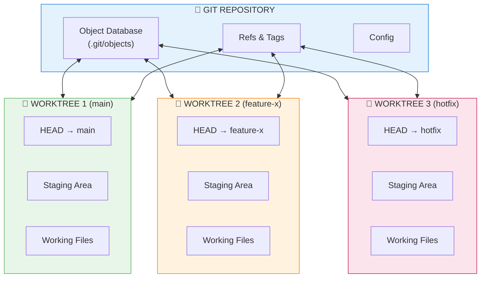
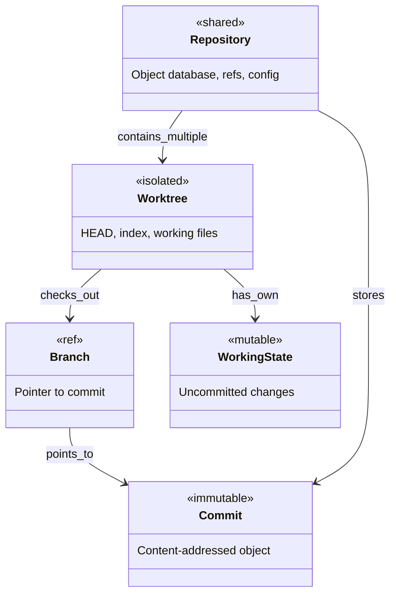
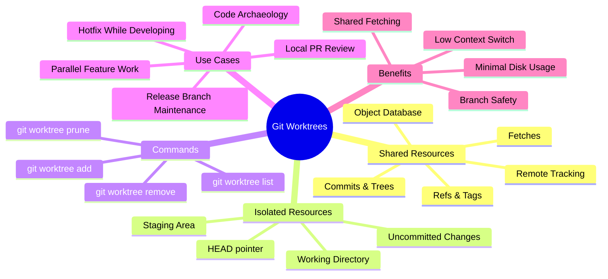
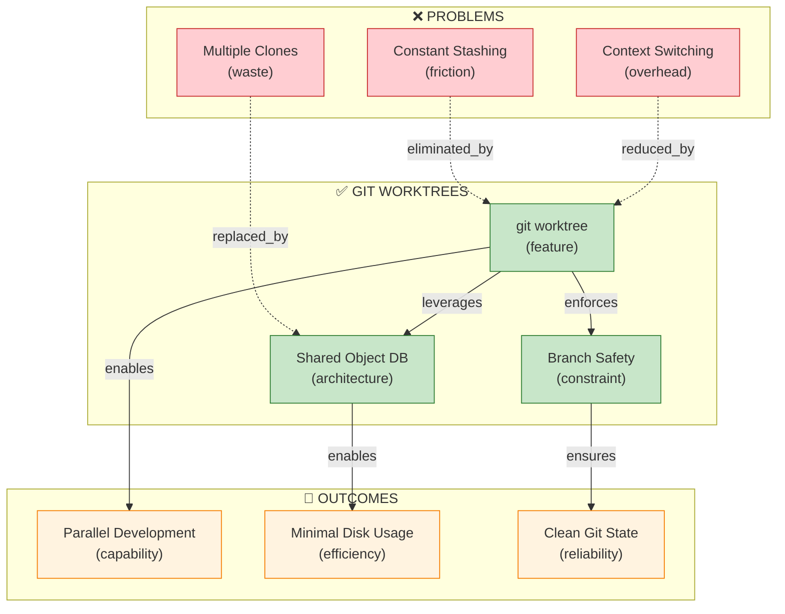

# Git Worktrees: Multiple Working Directories, One Repository

[📖 README](./README.md) · [🖼️ Infographic](./24%20Jan%20-%20Git%20Worktrees%20Multi-Tasking%20Bottleneck%20Solution.jpg) · [📑 Slides](./24%20Jan%20-%20Git_Worktrees_Zero_Friction_Development.pdf) · [🏠 Home](../../../../README.md) · [Published](../../README.md)

> *Semantic Knowledge Graph (SKG) — machine-readable metadata for search, discovery, and graph database integration*

---

## Summary

`git worktree` allows you to check out **multiple branches simultaneously**, each into its own directory, while sharing a single Git repository and object database. This solves a long-standing friction in Git workflows where developers need to work on multiple branches at once without stashing, context switching, or cloning the repo again. Worktrees are not a hack but a natural extension of Git's core architecture — its distributed, content-addressed design makes this feature clean, safe, and extremely efficient.

---

## Key Concepts

- **Git Worktree**: A directory on disk with its own checked-out branch, working files, staging area (index), and HEAD — all sharing the same Git object database with other worktrees
- **Shared Object Database**: All worktrees share the same commits, trees, blobs, refs, tags, and remotes — only working state is isolated, not history
- **Branch Safety Guarantee**: Git enforces that a branch may only be checked out in one worktree at a time, preventing concurrent rebases, conflicting working states, and silent corruption
- **History vs Working State**: Git's fundamental separation — history is shared, working state is isolated — which worktrees simply expose and leverage
- **Zero Duplication**: Unlike multiple clones which duplicate the entire object database, worktrees share history with minimal disk overhead
- **Detached HEAD Worktrees**: Allowed for debugging old commits, code archaeology, and bisecting without the branch exclusivity constraint

---

## Core Arguments

1. Classic Git usage assumes one working directory per repository, creating friction when working on multiple features, hotfixes, or PR reviews simultaneously
2. The traditional workaround of multiple clones leads to duplicated disk usage, repeated network fetches, fragmented local state, and higher cognitive overhead
3. Git's architecture (distributed, content-addressed, ref-based) naturally supports multiple working directories because commits don't belong to a working directory — branches are just pointers
4. Worktrees provide all the benefits of multiple clones without the costs: minimal disk usage, shared fetching, enforced branch safety, and low context switching overhead
5. The branch safety rule (one worktree per branch) is a feature, not a limitation — it prevents the concurrent modification problems that would occur with multiple checkouts
6. Once you internalize the separation of history from working state, worktrees feel like the obvious way Git should be used

---

## Key Quotes

> "I want to work on two branches at once without stashing, context switching, or cloning the repo again."

> "Multiple working directories, one Git repository."

> "Worktrees take advantage of this by allowing: Multiple HEADs, Multiple indexes, One shared object store."

> "git worktree doesn't change Git's model — it reveals it."

---

## Tags

`git-worktree` `git` `version-control` `branching` `workflow` `parallel-development` `context-switching` `developer-productivity` `multi-tasking` `branch-management` `object-database` `working-directory` `zero-duplication` `detached-head`

---

## Search Phrases

- "how to work on multiple git branches simultaneously"
- "git worktree vs multiple clones comparison"
- "check out two branches at the same time git"
- "avoid git stash when switching branches"
- "git parallel branch development workflow"
- "multiple working directories one repository"
- "git worktree add command usage"
- "shared git object database explained"
- "branch safety in git worktrees"
- "reduce context switching in git workflow"

---

## Semantic Knowledge Graph

### Git Worktree Architecture (Visual)



### Ontology



### Taxonomy



### Knowledge Graph



### Cypher Import (Neo4j)

```cypher
// Create nodes - Problems
CREATE (constant_stashing:Friction {id: 'constant_stashing', name: 'Constant Stashing', description: 'git stash / git stash pop cycles when switching branches'})
CREATE (multiple_clones:Waste {id: 'multiple_clones', name: 'Multiple Clones', description: 'Duplicated disk usage, repeated fetches, fragmented state'})
CREATE (context_switching:Overhead {id: 'context_switching', name: 'Context Switching', description: 'Mental overhead of switching between branches'})

// Create nodes - Solution
CREATE (git_worktree:Feature {id: 'git_worktree', name: 'Git Worktree', description: 'Multiple working directories, one repository'})
CREATE (shared_object_db:Architecture {id: 'shared_object_db', name: 'Shared Object Database', description: 'All worktrees share commits, trees, blobs'})
CREATE (branch_safety:Constraint {id: 'branch_safety', name: 'Branch Safety', description: 'One branch per worktree prevents conflicts'})

// Create nodes - Components
CREATE (worktree_add:Command {id: 'worktree_add', name: 'git worktree add', description: 'Create new worktree for branch'})
CREATE (worktree_list:Command {id: 'worktree_list', name: 'git worktree list', description: 'Show all active worktrees'})
CREATE (worktree_remove:Command {id: 'worktree_remove', name: 'git worktree remove', description: 'Clean up worktree'})

// Create nodes - Outcomes
CREATE (parallel_development:Capability {id: 'parallel_development', name: 'Parallel Development', description: 'Work on multiple branches simultaneously'})
CREATE (minimal_disk_usage:Efficiency {id: 'minimal_disk_usage', name: 'Minimal Disk Usage', description: 'No duplication of object database'})
CREATE (clean_git_state:Reliability {id: 'clean_git_state', name: 'Clean Git State', description: 'Predictable, isolated working states'})

// Create relationships - Problem solving
CREATE (constant_stashing)-[:ELIMINATED_BY]->(git_worktree)
CREATE (multiple_clones)-[:REPLACED_BY]->(shared_object_db)
CREATE (context_switching)-[:REDUCED_BY]->(git_worktree)

// Create relationships - Architecture
CREATE (git_worktree)-[:LEVERAGES]->(shared_object_db)
CREATE (git_worktree)-[:ENFORCES]->(branch_safety)
CREATE (git_worktree)-[:PROVIDES]->(worktree_add)
CREATE (git_worktree)-[:PROVIDES]->(worktree_list)
CREATE (git_worktree)-[:PROVIDES]->(worktree_remove)

// Create relationships - Outcomes
CREATE (shared_object_db)-[:ENABLES]->(minimal_disk_usage)
CREATE (git_worktree)-[:ENABLES]->(parallel_development)
CREATE (branch_safety)-[:ENSURES]->(clean_git_state)
```

---

### Neo4j Visualization

**How to import and visualize this graph in Neo4j:**

1. **Create a free Neo4j Sandbox** at [sandbox.neo4j.com](https://sandbox.neo4j.com/) — select "Blank Sandbox"
2. **Open Neo4j Browser** and paste the Cypher code above into the query editor
3. **Run the query** (click the play button or press Ctrl+Enter)
4. **Visualize the graph** with this query:
   ```cypher
   MATCH p=()-[]-()
   RETURN p
   ```
