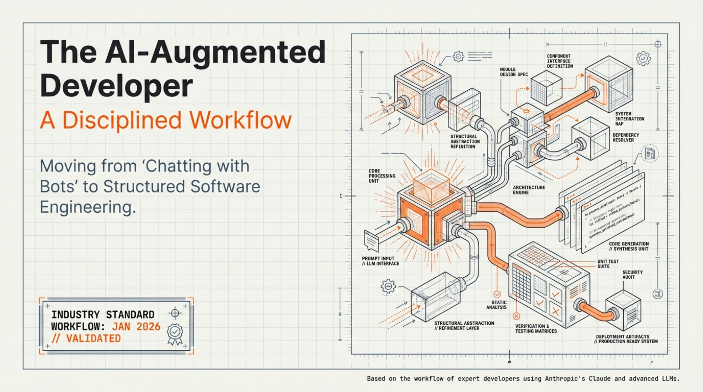

# LLM-Assisted Development Workflow (Jan 2026)

[← Back to GenAI Development](../README.md) · [Published](../../README.md) · [Home](../../../../README.md)

| 📄 Source | 🖼️ Infographic | 📑 Slides |
|-----------|----------------|-----------|
| [Source Doc](./LLM-Assisted%20Development%20Workflow%20%28Jan%202026%29.pdf) | [View Image](./22Jan%20-%20Disciplined%20LLM-Assisted%20Development%20Workflow.jpg) | [Slide Deck](./AI_Engineering_Discipline.pdf) |

> Generated with [Google NotebookLM](https://notebooklm.google.com/) — Source document → Infographic → Slide deck

---

## 🖼️ Infographic

---

## 📑 Slide Deck Preview

> **Deep Dive Presentation** — NotebookLM-generated slide deck on disciplined AI-augmented software engineering

*Click the image above to open the full slide deck*

---

## Overview

Comprehensive workflow documentation for AI-augmented software engineering, treating the LLM as a powerful pair programmer requiring clear direction, context, and human oversight. The document outlines a five-stage process: requirements gathering with focused context, iterative planning and architecture brainstorming, detailed specification development, code generation, and testing/debugging refinement.

## Contents

| File | Description |
|------|-------------|
| [LLM-Assisted Development Workflow (Jan 2026).pdf](./LLM-Assisted%20Development%20Workflow%20%28Jan%202026%29.pdf) | Full workflow guide (10 pages) |
| [22Jan - Disciplined LLM-Assisted Development Workflow.jpg](./22Jan%20-%20Disciplined%20LLM-Assisted%20Development%20Workflow.jpg) | Infographic visualization |
| [AI_Engineering_Discipline.pdf](./AI_Engineering_Discipline.pdf) | NotebookLM slide deck |
| [LinkedIn post (Infographic)](https://www.linkedin.com/posts/diniscruz_here-is-the-workflow-that-i-use-when-coding-activity-7420090079521447937-WEjv/) | LinkedIn post with infographic |
| [LinkedIn post (Slides)](https://www.linkedin.com/posts/diniscruz_my-genai-development-workflow-activity-7420090880356814848-bpmb/) | LinkedIn post with slide deck |
| [CONTENT.md](./CONTENT.md) | Semantic Knowledge Graph metadata |

## Key Topics

- **Context Engineering**: Curating relevant context without overloading the model
- **Iterative Planning**: Back-and-forth architecture brainstorming before coding
- **Detailed Specifications**: Comprehensive briefs as blueprints for code generation
- **Test-Driven Refinement**: LLM-generated tests for validation and debugging
- **Human-in-the-Loop**: Developer as architect, reviewer, and prompt engineer

## Workflow Stages

| Stage | Description |
|-------|-------------|
| 1. Requirements & Context | Define problem, gather focused relevant code context |
| 2. Iterative Planning | Brainstorm architecture with LLM, refine design |
| 3. Specification Brief | Comprehensive spec including data models, interfaces, behaviors |
| 4. Code Generation | LLM implements from spec, potentially multiple files at once |
| 5. Testing & Debugging | LLM generates tests, iterate until all pass |

## Source

- **Authors**: Dinis Cruz and ChatGPT Deep Research
- **Date**: January 2026
- **Platform**: MyFeeds.ai / NotebookLM content pipeline
- **References**: Addy Osmani LLM workflow, Thoughtworks context engineering

---

*Generated for NotebookLM content pipeline*
