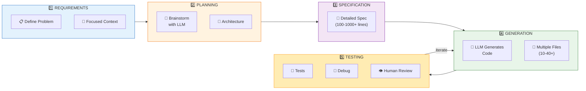
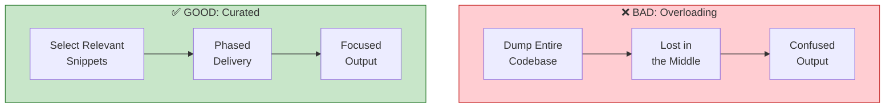
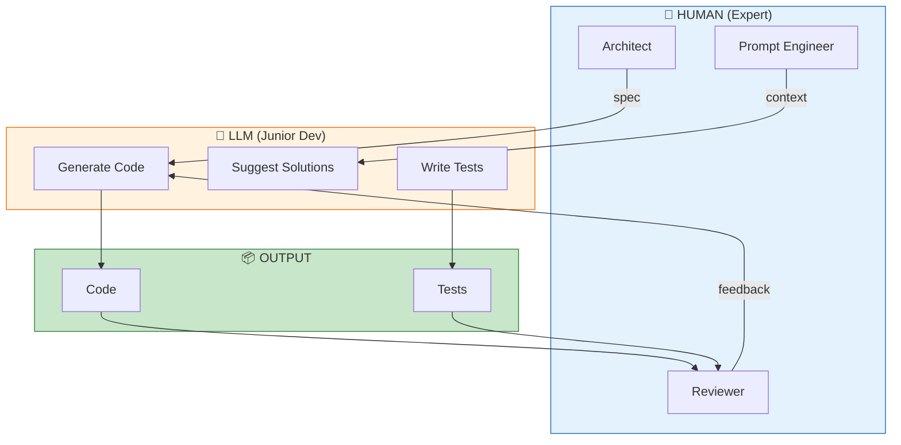
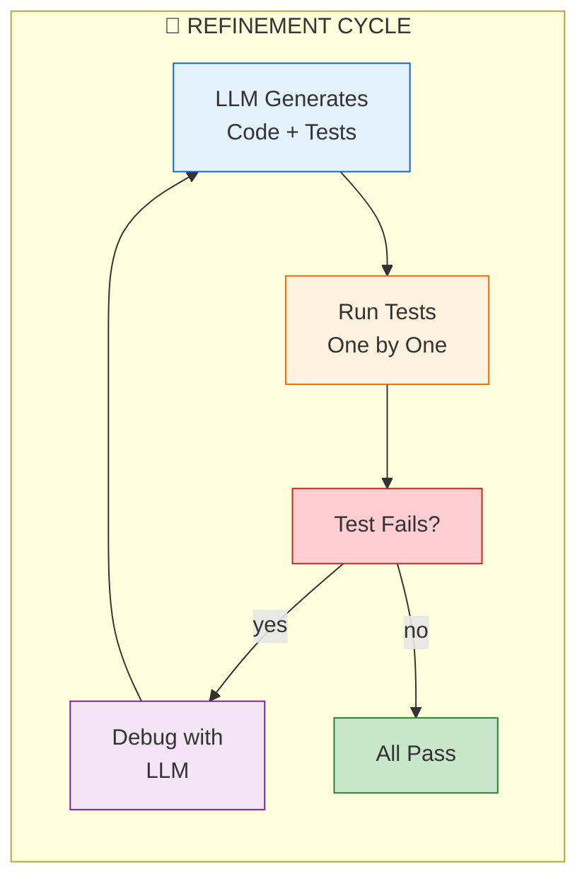
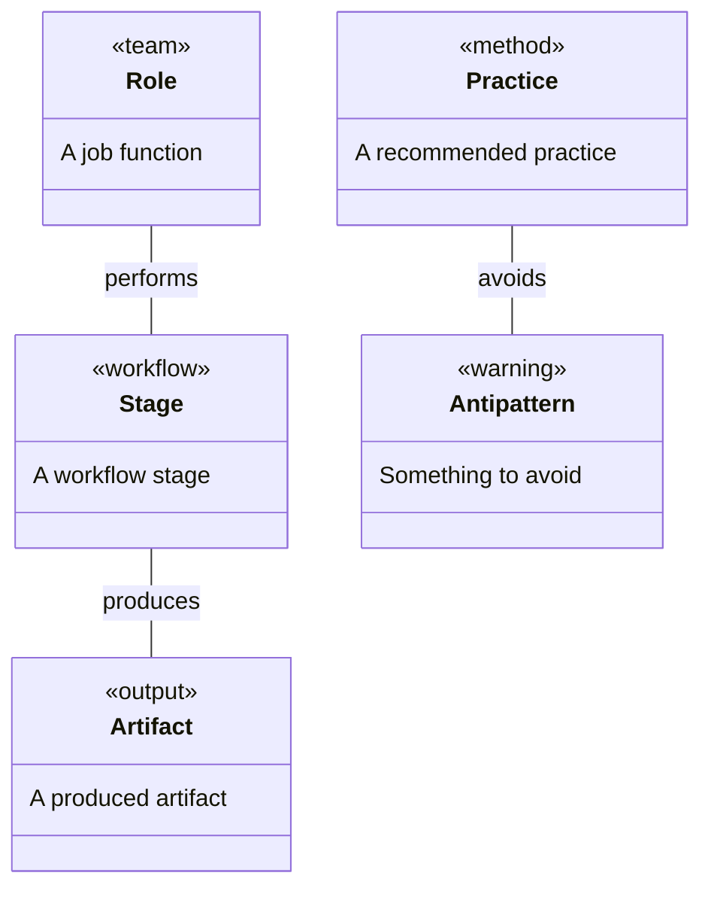
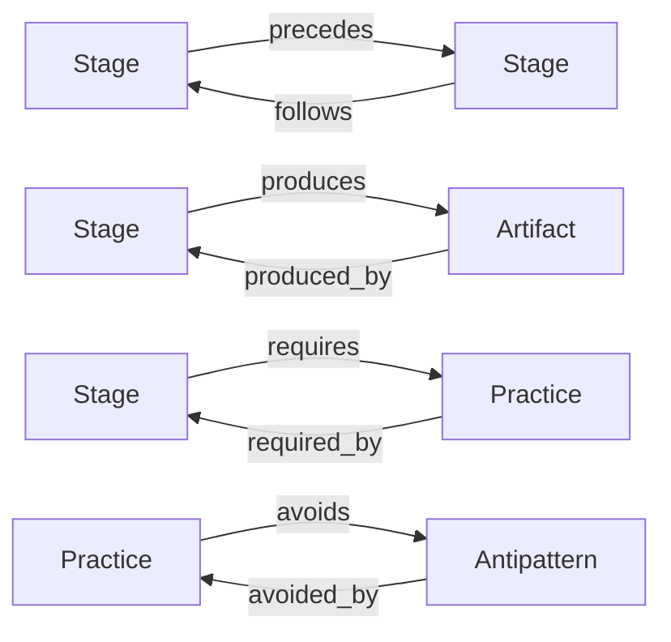
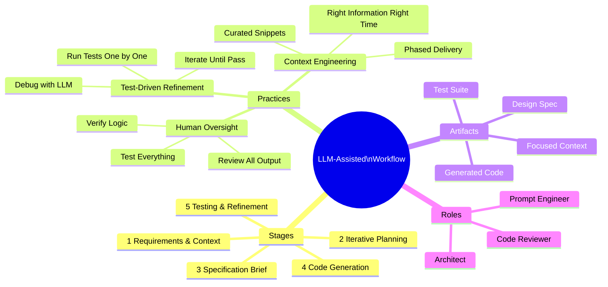
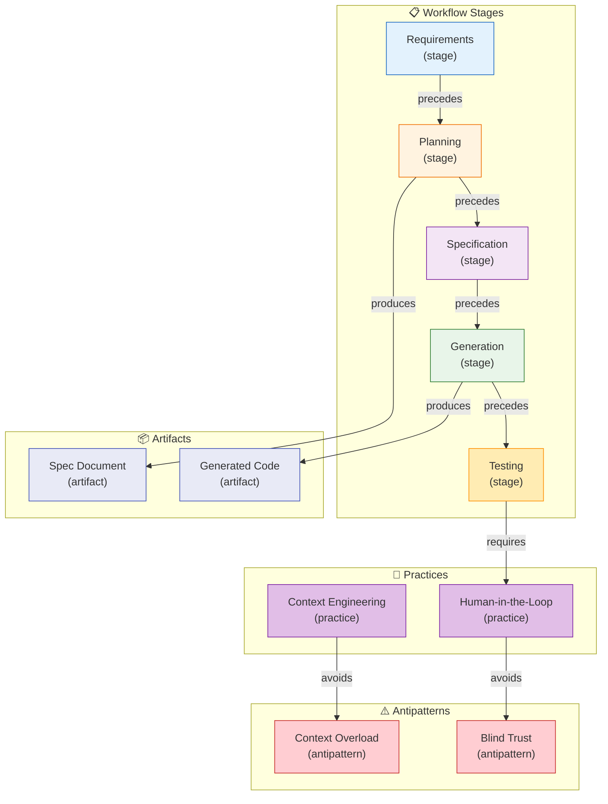

# LLM-Assisted Development Workflow (Jan 2026)

> *Semantic Knowledge Graph (SKG) - markdown serialization for search, discovery, and graph database integration*

---

## Summary

This workflow document describes an AI-augmented software engineering approach where the LLM serves as a powerful pair programmer requiring clear direction, context, and human oversight. The five-stage process emphasizes context engineering (curating relevant information without overloading), iterative planning before coding, comprehensive specifications as blueprints, LLM-driven code generation and test creation, and rigorous human-in-the-loop verification. Key insight: the workflow assumes developer expertise — AI amplifies skilled engineers but isn't a substitute for fundamental development skills; treat the LLM like an "over-confident junior developer" whose work requires mandatory review.

---

## Key Concepts

- **Context Engineering**: Curating prompt content intelligently — giving the model "only what matters, the right information, in the right format, at the right time" rather than dumping entire codebases.

- **Lost in the Middle Phenomenon**: How models miss important details buried in overly long prompts, leading to confused output, token waste, and inconsistent code.

- **Iterative Planning Dialogue**: Back-and-forth conversation with LLM to brainstorm requirements and design before any implementation — "waterfall in 15 minutes."

- **Specification Brief**: Comprehensive document (often 100s-1000+ lines) capturing architecture, data models, interfaces, behaviors, and testing strategy as the contract for implementation.

- **Test-Driven Refinement Loop**: Running AI-generated tests one by one, using failures to iteratively debug and refine code — forcing thorough review of AI output.

- **IFD (Iterative Flow Development)**: Approach where LLM helps build end-to-end slices including backend, tests, and UI prototypes for testing complex data flows.

---

## Core Arguments

1. AI coding assistants require skill, structure, and clear process — the workflow is about the developer's expertise guiding AI at every step, not letting AI take over blindly.

2. Providing too much context hurts performance ("Lost in the Middle"); strategic context selection through phased delivery leads to better results than overwhelming the AI.

3. Planning first prevents wasted cycles — a comprehensive spec/plan is the cornerstone that aligns human and AI before coding begins, like a "waterfall in 15 minutes."

4. The LLM can generate multiple files (10-40+) in one response when given a detailed spec, but output must be treated as a first draft requiring human refinement.

5. LLM-generated tests act as a second pair of eyes on implementation — if the AI writes a test for a scenario it forgot to handle in code, that signals a missing feature.

6. All software engineering practices (design before coding, testing, version control, standards) are MORE important when AI writes half your code — AI amplifies discipline, doesn't replace it.

---

## Key Quotes

> "Context engineering isn't about stuffing more into the prompt — it's about curating smarter."

> "An LLM coding partner is like an over-confident junior developer — you must rigorously review and test everything it produces."

> "Planning first forces you and the AI onto the same page and prevents wasted cycles."

> "AI doesn't replace engineering discipline; it amplifies it."

---

## Tags

`llm-workflow` `ai-pair-programming` `context-engineering` `specification-driven` `test-driven-development` `code-generation` `human-in-the-loop` `developer-productivity` `ai-augmented-engineering` `iterative-development` `prompt-engineering` `software-architecture`

---

## Search Phrases

- "LLM-assisted development workflow 2026"
- "context engineering for AI coding"
- "specification-driven AI development"
- "treating LLM as junior developer"
- "iterative planning with AI pair programmer"
- "test-driven refinement AI code"
- "context window paradox LLM"
- "AI-augmented software engineering"
- "human-in-the-loop code review"
- "multi-file code generation LLM"

---

## Metadata

| Field | Value |
|-------|-------|
| **Content Type** | Workflow Guide / Best Practices |
| **Domain** | GenAI Development / Software Engineering |
| **Sub-domain** | Development Methodologies |
| **Format** | PDF (10 pages) |
| **Date** | January 2026 |
| **Authors** | Dinis Cruz, ChatGPT Deep Research |
| **Target Audience** | Developers, Engineering Leaders |

---

## Related Content

| Relationship | Content |
|--------------|---------|
| `related_to` | Comparing Vibe Coding to Traditional Outsourced Development |
| `related_to` | Vibe Coding Workflow for Rapid Product-Market Fit |
| `references` | Addy Osmani - My LLM Coding Workflow |
| `references` | Thoughtworks - Context Engineering |
| `references` | Assembled - Writing Tests with LLMs |
| `part_of` | GenAI Development Best Practices |

---

## Semantic Knowledge Graph

### The Five-Stage Workflow (Visual)



### Context Engineering Pattern (Visual)



### Human-in-the-Loop Model (Visual)



### Test-Driven Refinement Loop (Visual)



---

### Ontology

> The ontology defines the **types of entities** (nodes) and **relationships** (predicates) in this knowledge domain.

#### Node Types



| Ref | Description | Examples |
|-----|-------------|----------|
| `stage` | A workflow stage | Requirements, Planning, Specification, Generation, Testing |
| `practice` | A recommended practice | Context Engineering, Human-in-the-Loop |
| `artifact` | A produced artifact | Specification Document, Generated Code, Tests |
| `role` | A job function | Architect, Reviewer, Prompt Engineer |
| `antipattern` | Something to avoid | Context Overloading, Blind Trust |

#### Predicates (Relationships)



| Ref | Inverse | Description |
|-----|---------|-------------|
| `precedes` | `follows` | Workflow stage order |
| `produces` | `produced_by` | Stage producing artifact |
| `requires` | `required_by` | Dependency relationship |
| `avoids` | `avoided_by` | Antipattern prevention |

---

### Taxonomy

> Hierarchical classification of concepts in this domain.



**ASCII Tree View:**

```
llm_workflow
├── stages
│   ├── requirements_context
│   ├── iterative_planning
│   ├── specification_brief
│   ├── code_generation
│   └── testing_refinement
├── practices
│   ├── context_engineering
│   ├── human_oversight
│   └── test_driven_refinement
├── artifacts
│   ├── focused_context
│   ├── design_spec
│   ├── generated_code
│   └── test_suite
└── roles
    ├── architect
    ├── code_reviewer
    └── prompt_engineer
```

---

### Knowledge Graph

> Visual representation of entities and their relationships.



#### Nodes (for database import)

| ID | Type | Name |
|----|------|------|
| `requirements` | `stage` | Requirements & Context |
| `planning` | `stage` | Iterative Planning |
| `specification` | `stage` | Specification Brief |
| `generation` | `stage` | Code Generation |
| `testing` | `stage` | Testing & Refinement |
| `context_engineering` | `practice` | Context Engineering |
| `human_loop` | `practice` | Human-in-the-Loop |
| `context_overload` | `antipattern` | Context Overloading |
| `spec_document` | `artifact` | Specification Document |

#### Edges (for database import)

| From | Predicate | To |
|------|-----------|-----|
| `requirements` | `precedes` | `planning` |
| `planning` | `precedes` | `specification` |
| `specification` | `precedes` | `generation` |
| `generation` | `precedes` | `testing` |
| `context_engineering` | `avoids` | `context_overload` |
| `planning` | `produces` | `spec_document` |
| `testing` | `requires` | `human_loop` |

---

### Cypher Import (Neo4j)

```cypher
// Create nodes
CREATE (req:Stage {id: 'requirements', name: 'Requirements & Context', order: 1})
CREATE (plan:Stage {id: 'planning', name: 'Iterative Planning', order: 2})
CREATE (spec:Stage {id: 'specification', name: 'Specification Brief', order: 3})
CREATE (gen:Stage {id: 'generation', name: 'Code Generation', order: 4})
CREATE (test:Stage {id: 'testing', name: 'Testing & Refinement', order: 5})
CREATE (ctxeng:Practice {id: 'context_engineering', name: 'Context Engineering'})
CREATE (human:Practice {id: 'human_loop', name: 'Human-in-the-Loop'})
CREATE (overload:Antipattern {id: 'context_overload', name: 'Context Overloading'})
CREATE (specdoc:Artifact {id: 'spec_document', name: 'Specification Document'})
CREATE (code:Artifact {id: 'generated_code', name: 'Generated Code'})

// Create relationships
CREATE (req)-[:PRECEDES]->(plan)
CREATE (plan)-[:PRECEDES]->(spec)
CREATE (spec)-[:PRECEDES]->(gen)
CREATE (gen)-[:PRECEDES]->(test)
CREATE (ctxeng)-[:AVOIDS]->(overload)
CREATE (plan)-[:PRODUCES]->(specdoc)
CREATE (gen)-[:PRODUCES]->(code)
CREATE (test)-[:REQUIRES]->(human)
```
