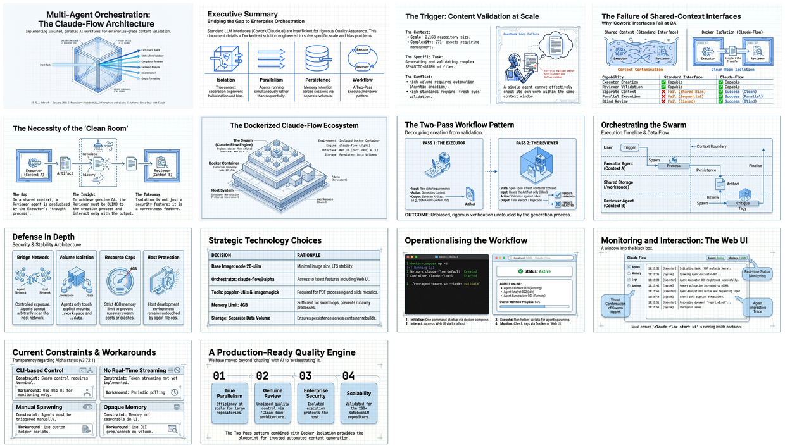

[🏠 Home](../../../../README.md) / [Published](../../README.md) / [GenAI Development](../README.md) / **Multi-Agent Orchestration with Claude-Flow**

---

# Multi-Agent Orchestration with Claude-Flow in Docker

A complete guide to implementing isolated, parallel AI agent workflows for content validation using Claude-Flow running in an isolated Docker environment — enabling true parallel agent execution, Executor/Reviewer two-pass workflows, and complete isolation from the host development environment.

| 📄 Source | 🖼️ Infographic | 📑 Slides |
|---|---|---|
| [LLM Debrief (MD)](./v3.72.1__llm-debrief-multi-agent-orchestration.md) | [View Image](./25%20Jan%20-%20Scaling%20AI%20Workflows%20via%20Claude-Flow.jpg) | [Slide Deck](./25%20Jan%20-%20Agent_Isolation_and_Quality_Control.pdf) |

> *Generated with [Google NotebookLM](https://notebooklm.google.com/) — Source document → Infographic → Slide deck*

---

## 🖼️ Infographic

---

## 📑 Slide Deck (14 slides)

*Click image to open the slide deck* · [⬇️ Download PDF](https://github.com/DinisCruz/NotebookLM__Infographics-and-slides/raw/refs/heads/main/_for_linkedin/published/GenAI%20Development/Multi-Agent%20Orchestration%20with%20Claude-Flow/25%20Jan%20-%20Agent_Isolation_and_Quality_Control.pdf)

---

## 🧠 Semantic Knowledge Graph

> **Machine-readable metadata** — Structured content for search, discovery, and graph database integration

This document includes a comprehensive [SEMANTIC-GRAPH.md](./SEMANTIC-GRAPH.md) file containing:

| Section | Description |
|---------|-------------|
| Summary | 2-4 sentence overview of the content |
| Key Concepts | Core ideas with explanations |
| Core Arguments | Logical flow of main points |
| Mermaid Diagrams | Visual ontology, taxonomy, and knowledge graph |
| Neo4j Cypher | Ready-to-import graph database queries |

[📖 View SEMANTIC-GRAPH.md](./SEMANTIC-GRAPH.md)

---

## 🔗 LinkedIn Posts

| Type | Link |
|------|------|
| Slides Post | [View on LinkedIn](https://www.linkedin.com/feed/update/urn:li:ugcPost:7421029893250977792/) |

---

## Key Topics

| Topic | Description |
|-------|-------------|
| **Multi-Agent Swarms** | Parallel execution of specialized agents (Executor, Reviewer, Coordinator) with separate contexts |
| **Two-Pass Workflow** | Quality assurance pattern where Executor creates content and independent Reviewer validates it |
| **Docker Isolation** | Complete security boundary preventing AI agents from accessing host system resources |
| **Self-Review Bias** | The problem with same-context review where the reviewer knows the executor's reasoning |
| **Claude-Flow** | Orchestration framework enabling swarm topology, shared memory, and Web UI monitoring |

---

## Source Information

| Field | Value |
|-------|-------|
| **Version** | v3.72.1 |
| **Date** | January 2026 |
| **Use Case** | SEMANTIC-GRAPH.md creation for NotebookLM content repository |
