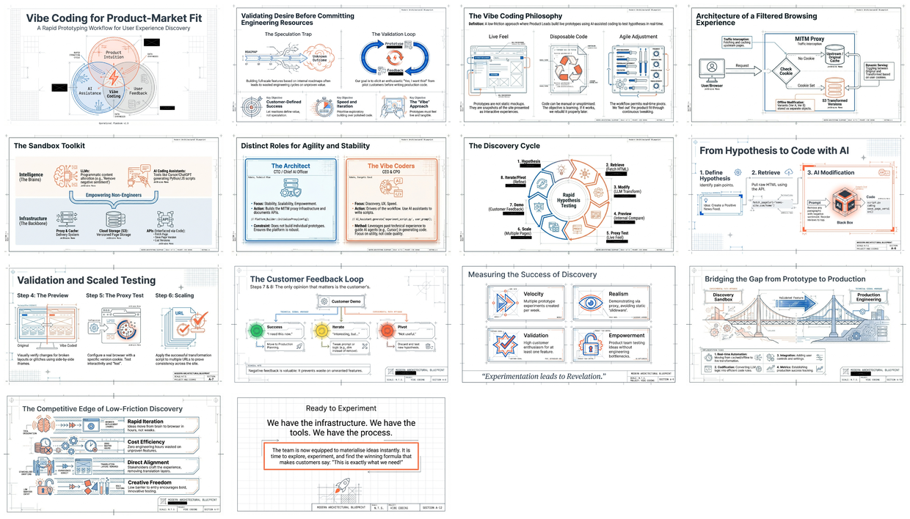

# Vibe Coding Workflow for Rapid Product-Market Fit Discovery

[← Back to GenAI Development](../README.md) · [Published](../../README.md) · [Home](../../../../README.md)

> Workflow document describing a rapid prototyping approach using AI-assisted coding for product-market fit discovery. Built around a MITM proxy infrastructure with page caching and version serving, the workflow enables CEO/CPO "vibe coders" to quickly create and demo webpage transformations to pilot customers, identifying which features elicit a "Yes, I want this!" reaction.

| 📄 Source | 🖼️ Infographic | 📑 Slides |
|-----------|----------------|-----------|
| [Source Doc](./Vibe%20Coding%20Workflow%20for%20Rapid%20Product-Market%20Fit%20Discovery.pdf) | [View Image](./22%20Jan%20-%20Vibe%20Coding%20Workflow%20Ecosystem%20Diagram.jpg) | [Slide Deck](./22%20Jan%20-%20Vibe_Coding_Product_Fit.pdf) |

> Generated with [Google NotebookLM](https://notebooklm.google.com/) — Source document → Infographic → Slide deck

---

## 🖼️ Infographic

---

## 📑 Slide Deck (14 slides)

> **Deep Dive Presentation** — NotebookLM-generated slide deck on rapid prototyping for product-market fit

*Click image to open the slide deck* · [⬇️ Download PDF](https://github.com/DinisCruz/NotebookLM__Infographics-and-slides/raw/refs/heads/main/_for_linkedin/published/GenAI%20development/Vibe%20Coding%20Workflow%20for%20Rapid%20Product-Market%20Fit%20Discovery/22%20Jan%20-%20Vibe_Coding_Product_Fit.pdf)

---

## 🧠 Semantic Knowledge Graph

> **Machine-readable metadata** — Structured content for search, discovery, and graph database integration

This document includes a comprehensive [SEMANTIC-GRAPH.md](./SEMANTIC-GRAPH.md) file containing:

| Section | Description |
|---------|-------------|
| **Summary** | Concise overview of the core thesis |
| **Key Concepts** | 6 main ideas with detailed explanations |
| **Core Arguments** | 6 numbered arguments from the source |
| **Key Quotes** | 4 memorable quotes for reference |
| **Tags & Search Phrases** | 12 tags + 10 search phrases for discovery |
| **Ontology & Taxonomy** | Structured hierarchy for knowledge graphs |
| **Graph Nodes & Edges** | Ready-to-import relationships for Neo4j/similar |

[📖 View SEMANTIC-GRAPH.md](./SEMANTIC-GRAPH.md)

---

## Key Topics

- **MITM Proxy Infrastructure**: Traffic interception, caching, and version serving via cookies
- **Offline Page Modification**: Creating multiple transformed versions stored in S3
- **CEO/CPO as Vibe Coders**: Non-engineers using AI assistants to create prototypes
- **8-Step Workflow**: From hypothesis to customer demo to iteration
- **Customer-Defined Success**: Letting customer reactions define desirable features

## Workflow Steps

| Step | Description |
|------|-------------|
| 1 | Define hypothesis / idea |
| 2 | Retrieve relevant pages |
| 3 | Use LLM to modify page |
| 4 | Create quick preview (before/after) |
| 5 | Test via proxy in real browser |
| 6 | Apply to multiple pages |
| 7 | Demo to customer and gather feedback |
| 8 | Iterate or pivot |

---

## Contents

| File | Description |
|------|-------------|
| [Vibe Coding Workflow for Rapid Product-Market Fit Discovery.pdf](./Vibe%20Coding%20Workflow%20for%20Rapid%20Product-Market%20Fit%20Discovery.pdf) | Full workflow guide (8 pages) |
| [22 Jan - Vibe_Coding_Product_Fit.pdf](./22%20Jan%20-%20Vibe_Coding_Product_Fit.pdf) | NotebookLM slide deck |
| [22 Jan - Vibe Coding Workflow Ecosystem Diagram.jpg](./22%20Jan%20-%20Vibe%20Coding%20Workflow%20Ecosystem%20Diagram.jpg) | Visual workflow diagram |
| [LinkedIn Post](https://www.linkedin.com/posts/diniscruz_vibe-coding-to-discover-product-market-fit-activity-7420157833951780864-Pa1M/) | LinkedIn post with slide deck |
| [SEMANTIC-GRAPH.md](./SEMANTIC-GRAPH.md) | Semantic Knowledge Graph metadata |

---

## Source Information

| Field | Value |
|-------|-------|
| **Authors** | Dinis Cruz, ChatGPT Deep Research |
| **Date** | January 2026 |
| **Platform** | MyFeeds.ai / MitmProxy Service |

---

*Generated for NotebookLM content pipeline*
