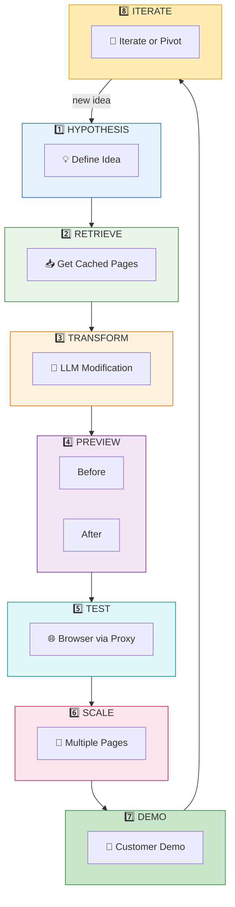
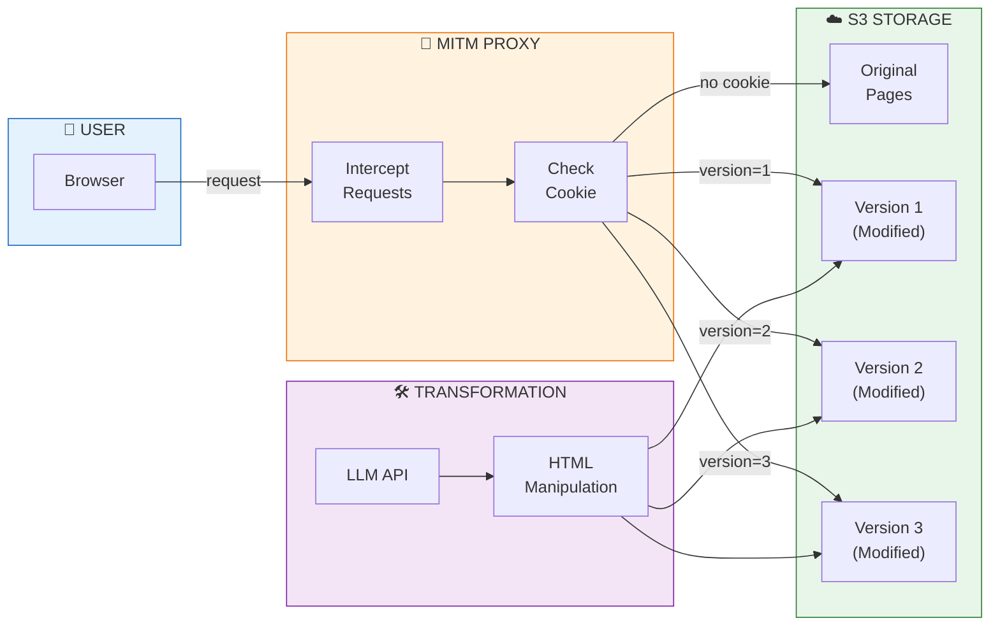
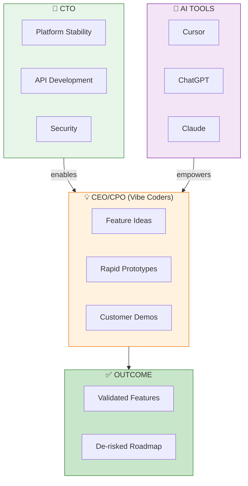
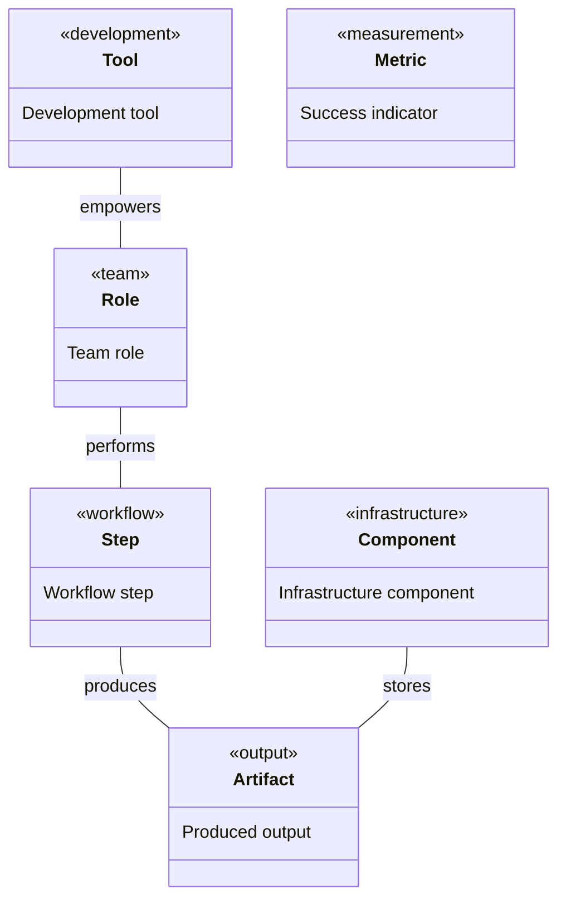
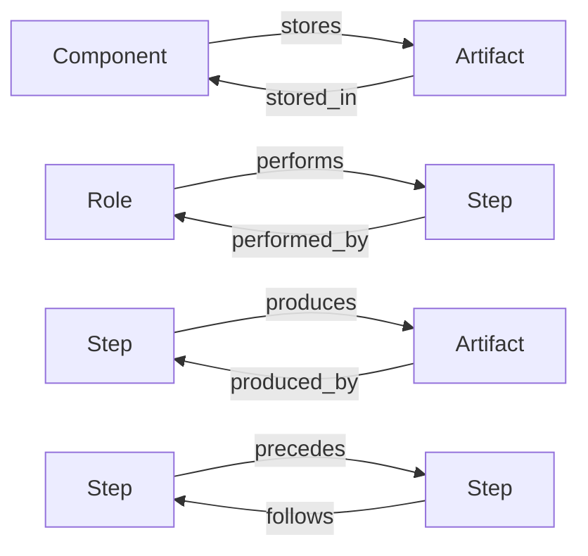
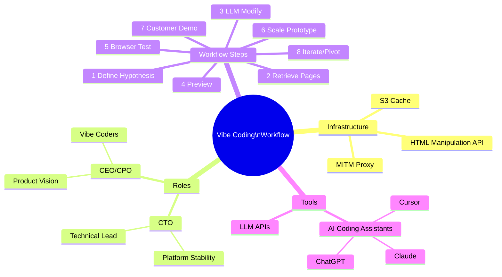
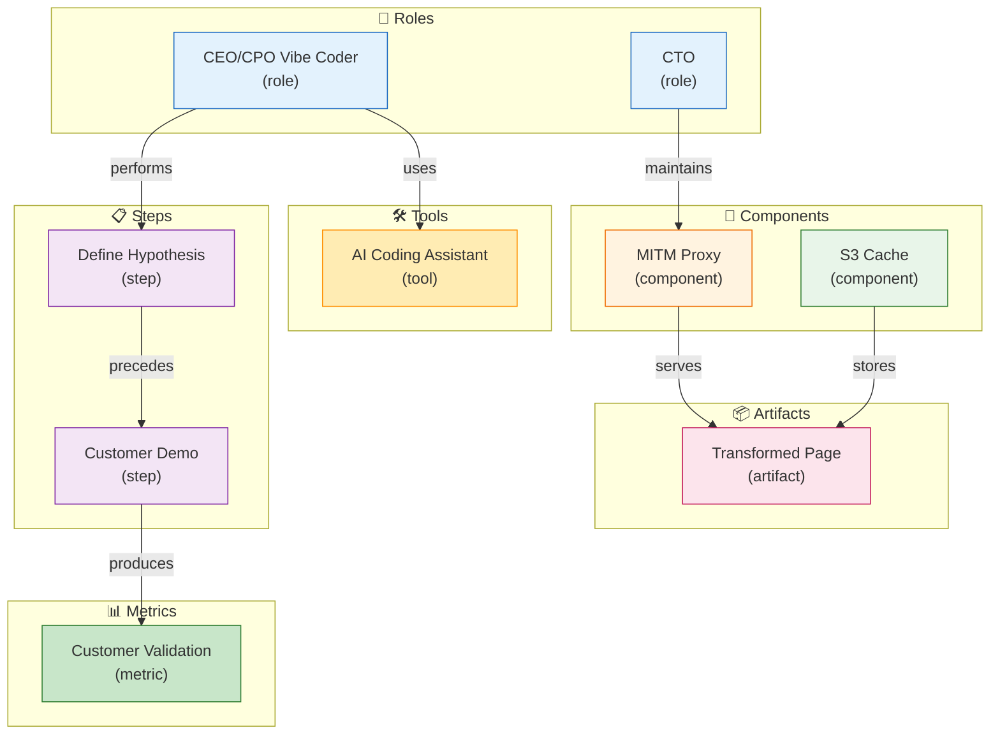

# Vibe Coding Workflow for Rapid Product-Market Fit Discovery

> *Semantic Knowledge Graph (SKG) - markdown serialization for search, discovery, and graph database integration*

---

## Summary

This workflow document describes a rapid prototyping approach for product-market fit discovery using AI-assisted "vibe coding." Built around a MITM proxy infrastructure that intercepts web traffic, caches pages in S3, and serves multiple transformed versions via browser cookies, the workflow enables CEO/CPO "vibe coders" to quickly create webpage modifications and demo them to pilot customers. Key insight: customer-defined success means letting user reactions determine which features are desirable — the workflow empowers product leaders to dream up an idea and see it realized in a demo the same day, de-risking the product roadmap through validated customer feedback.

---

## Key Concepts

- **Vibe Coding**: Fast, iterative prototyping approach using AI-assisted coding where non-engineers describe changes in natural language and get working code or transformations without writing everything from scratch.

- **MITM Proxy Infrastructure**: Man-in-the-middle proxy intercepting HTTP requests, caching original pages in S3, and serving transformed versions based on browser cookie settings.

- **Dynamic Version Serving**: Proxy checks special cookie to decide which page version to serve — original if not set, or specific transformation if cookie specifies version ID.

- **Offline Page Modification**: Cached pages modified outside live browsing sessions using LLM prompts, creating multiple variants (content removed, elements blurred, highlights added) stored as separate S3 objects.

- **Customer-Defined Success**: Rather than guessing internally, customer reactions ("I love it" vs "Not useful") define which features are desirable — the ultimate validation is "Yes, I want this!"

- **CEO/CPO as Vibe Coders**: Product leads with enough technical background to use AI coding assistants (Cursor, ChatGPT) becoming primary drivers of rapid prototyping, focusing on UX rather than low-level code.

---

## Core Arguments

1. With technical foundation (proxy, caching, APIs) in place, the next step is finding what end-user experience delivers real value — validated directly with customers, not guessed internally.

2. The workflow divides roles so CTO ensures platform stability while CEO/CPO iterate on product ideas without being blocked by heavy engineering cycles — making discovery highly agile.

3. LLM-powered HTML manipulation (via prompts like "Remove negative-sentiment text") combined with AI coding assistants enables rapid transformation of pages without deep coding expertise.

4. Prototypes should feel like live website experiences to customers — taking snapshots and altering them while preserving click-through navigation greatly enhances feedback quality.

5. Ideas can be built and tested in hours/days instead of weeks; engineering investment only comes after validating an idea — cost-effective experimentation through cached pages and offline modifications.

6. Success metrics include: multiple prototypes conducted, live demo capability, customer enthusiasm for at least one feature, learning from failures, and product team empowerment to try ideas on a whim.

---

## Key Quotes

> "The term vibe coding encapsulates this quick, exploratory building approach."

> "Customer reactions define what features are desirable."

> "The CEO and CPO feel confident that they can dream up an idea and see it realized in a demo the same day."

> "It de-risks the product roadmap significantly."

---

## Tags

`vibe-coding` `product-market-fit` `rapid-prototyping` `mitm-proxy` `page-caching` `llm-transformation` `customer-validation` `ai-coding-assistant` `s3-storage` `cookie-versioning` `html-manipulation` `startup-methodology`

---

## Search Phrases

- "vibe coding workflow product discovery"
- "MITM proxy page transformation"
- "rapid prototyping product-market fit"
- "CEO CPO as vibe coders"
- "LLM HTML page modification"
- "customer-defined feature validation"
- "S3 page version caching"
- "cookie-based version serving"
- "AI-assisted prototyping workflow"
- "same-day idea to demo"

---

## Metadata

| Field | Value |
|-------|-------|
| **Content Type** | Workflow Guide / Methodology |
| **Domain** | GenAI Development / Product Discovery |
| **Sub-domain** | Prototyping / Customer Validation |
| **Format** | PDF (8 pages) |
| **Date** | January 2026 |
| **Authors** | Dinis Cruz, ChatGPT Deep Research |
| **Target Audience** | CEOs, CPOs, Product Leaders |

---

## Related Content

| Relationship | Content |
|--------------|---------|
| `related_to` | Comparing Vibe Coding to Traditional Outsourced Development |
| `related_to` | LLM-Assisted Development Workflow |
| `uses` | MitmProxy Service |
| `uses` | HTML Graph Service |
| `part_of` | MyFeeds.ai Architecture |

---

## Semantic Knowledge Graph

### The Vibe Coding Workflow (Visual)



### Infrastructure Architecture (Visual)



### Role Division (Visual)



---

### Ontology

> The ontology defines the **types of entities** (nodes) and **relationships** (predicates) in this knowledge domain.

#### Node Types



| Ref | Description | Examples |
|-----|-------------|----------|
| `component` | Infrastructure component | MITM Proxy, S3 Cache, HTML API |
| `role` | Team role | CTO, CEO/CPO (Vibe Coder) |
| `step` | Workflow step | Define Hypothesis, Customer Demo |
| `tool` | Development tool | Cursor, ChatGPT, Claude |
| `artifact` | Produced output | Transformed Page, Prototype |
| `metric` | Success indicator | Customer Enthusiasm, Validated Feature |

#### Predicates (Relationships)



| Ref | Inverse | Description |
|-----|---------|-------------|
| `uses` | `used_by` | Component usage |
| `performs` | `performed_by` | Role performing step |
| `produces` | `produced_by` | Step producing artifact |
| `precedes` | `follows` | Workflow order |

---

### Taxonomy

> Hierarchical classification of concepts in this domain.



**ASCII Tree View:**

```
vibe_coding_workflow
├── infrastructure
│   ├── mitm_proxy
│   ├── s3_cache
│   └── html_manipulation_api
├── roles
│   ├── cto (technical lead)
│   └── ceo_cpo (vibe coders)
├── workflow_steps
│   ├── define_hypothesis
│   ├── retrieve_pages
│   ├── llm_modify
│   ├── preview
│   ├── browser_test
│   ├── scale_prototype
│   ├── customer_demo
│   └── iterate_pivot
└── tools
    ├── ai_coding_assistant
    └── llm_api
```

---

### Knowledge Graph

> Visual representation of entities and their relationships.



#### Nodes (for database import)

| ID | Type | Name |
|----|------|------|
| `mitm_proxy` | `component` | MITM Proxy |
| `s3_cache` | `component` | S3 Page Cache |
| `vibe_coder` | `role` | CEO/CPO Vibe Coder |
| `define_hypothesis` | `step` | Define Hypothesis |
| `customer_demo` | `step` | Demo to Customer |
| `ai_assistant` | `tool` | AI Coding Assistant |
| `transformed_page` | `artifact` | Transformed Page Version |
| `customer_validation` | `metric` | Customer Enthusiasm |

#### Edges (for database import)

| From | Predicate | To |
|------|-----------|-----|
| `vibe_coder` | `performs` | `define_hypothesis` |
| `vibe_coder` | `uses` | `ai_assistant` |
| `mitm_proxy` | `serves` | `transformed_page` |
| `s3_cache` | `stores` | `transformed_page` |
| `define_hypothesis` | `precedes` | `customer_demo` |
| `customer_demo` | `produces` | `customer_validation` |

---

### Cypher Import (Neo4j)

```cypher
// Create nodes
CREATE (proxy:Component {id: 'mitm_proxy', name: 'MITM Proxy'})
CREATE (s3:Component {id: 's3_cache', name: 'S3 Page Cache'})
CREATE (vibe:Role {id: 'vibe_coder', name: 'CEO/CPO Vibe Coder'})
CREATE (cto:Role {id: 'cto', name: 'CTO'})
CREATE (hypothesis:Step {id: 'define_hypothesis', name: 'Define Hypothesis', order: 1})
CREATE (demo:Step {id: 'customer_demo', name: 'Demo to Customer', order: 7})
CREATE (ai:Tool {id: 'ai_assistant', name: 'AI Coding Assistant'})
CREATE (page:Artifact {id: 'transformed_page', name: 'Transformed Page Version'})
CREATE (validation:Metric {id: 'customer_validation', name: 'Customer Enthusiasm'})

// Create relationships
CREATE (vibe)-[:PERFORMS]->(hypothesis)
CREATE (vibe)-[:USES]->(ai)
CREATE (cto)-[:MAINTAINS]->(proxy)
CREATE (proxy)-[:SERVES]->(page)
CREATE (s3)-[:STORES]->(page)
CREATE (hypothesis)-[:PRECEDES]->(demo)
CREATE (demo)-[:PRODUCES]->(validation)
```
