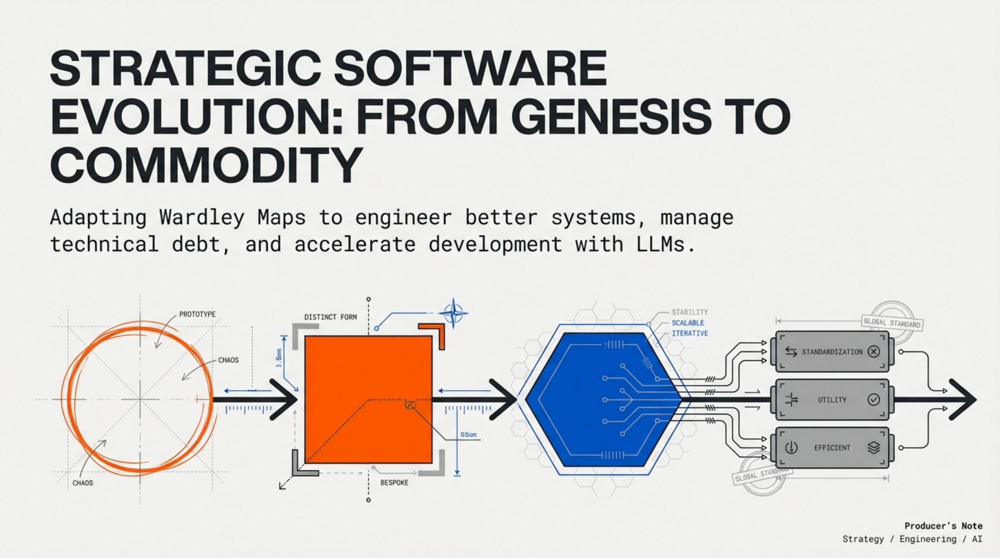

# Wardley Maps as an Analogy for Software Development Evolution

[← Back to Wardley Maps](../README.md) · [Published](../../README.md) · [Home](../../../../README.md)

| 📄 Source | 🖼️ Infographic | 📑 Slides |
|-----------|----------------|-----------|
| [Source Doc](./Wardley%20Maps%20as%20an%20Analogy%20for%20Software%20Development%20Evolution.pdf) | [View Image](./22%20Jan%20-%20Mapping%20Software%20Evolution%20to%20Commodity.jpg) | [Slide Deck](./22%20Jan%20-%20Strategic_Code_Evolution.pdf) |

> Generated with [Google NotebookLM](https://notebooklm.google.com/) — Source document → Infographic → Slide deck

---

## 🖼️ Infographic

---

## 📑 Slide Deck Preview

> **Deep Dive Presentation** — NotebookLM-generated slide deck on strategic code evolution using Wardley Maps

*Click the image above to open the full slide deck*

---

## Overview

White paper exploring how Wardley Maps' evolution stages (Genesis → Custom-Built → Product → Commodity) provide a powerful analogy for software development decisions. The document demonstrates how identifying each module's evolutionary stage informs refactoring priorities, resource allocation, and LLM-assisted development workflows where code history becomes the best brief for generating improved implementations.

## Contents

| File | Description |
|------|-------------|
| [Wardley Maps as an Analogy for Software Development Evolution.pdf](./Wardley%20Maps%20as%20an%20Analogy%20for%20Software%20Development%20Evolution.pdf) | Full white paper (7 pages) |
| [22 Jan - Strategic_Code_Evolution.pdf](./22%20Jan%20-%20Strategic_Code_Evolution.pdf) | NotebookLM slide deck |
| [22 Jan - Mapping Software Evolution to Commodity.jpg](./22%20Jan%20-%20Mapping%20Software%20Evolution%20to%20Commodity.jpg) | Visual evolution diagram |
| [LinkedIn post](https://www.linkedin.com/posts/diniscruz_wardley-maps-strategic-code-evolution-activity-7420165433149890561-J1a3/) | LinkedIn post with slide deck |
| [CONTENT.md](./CONTENT.md) | Semantic Knowledge Graph metadata |

## Key Topics

- **Evolution Stages**: Genesis (experimental), Custom-Built (bespoke), Product (stable), Commodity (utility)
- **Strategic Focus**: Invest in Genesis/Custom-Built, leverage existing Product/Commodity solutions
- **Refactoring with Purpose**: Every module needs a "client" — YAGNI principle applied to evolution
- **LLM-Assisted Development**: Using code history as context for AI-generated improvements
- **Commoditization Benefits**: Stable building blocks accelerate higher-level innovation

## Evolution Stages Applied to Code

| Stage | Software Analog | Treatment |
|-------|-----------------|-----------|
| Genesis | Prototype, hacky script | Isolate, expect changes |
| Custom-Built | Bespoke internal solution | Invest in maturing |
| Product | Stable internal library | Reuse confidently |
| Commodity | Open-source/cloud service | Use as-is, don't reinvent |

## Source

- **Authors**: Dinis Cruz and ChatGPT Deep Research
- **Date**: January 2026
- **References**: Simon Wardley's mapping framework, Joel Spolsky on code rewrites

---

*Generated for NotebookLM content pipeline*
