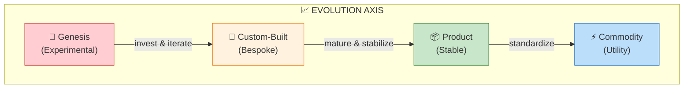
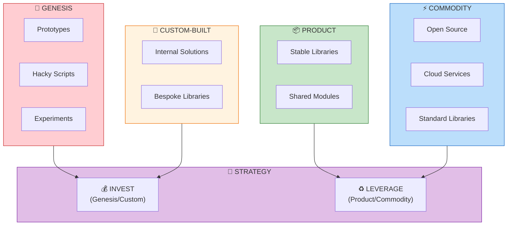
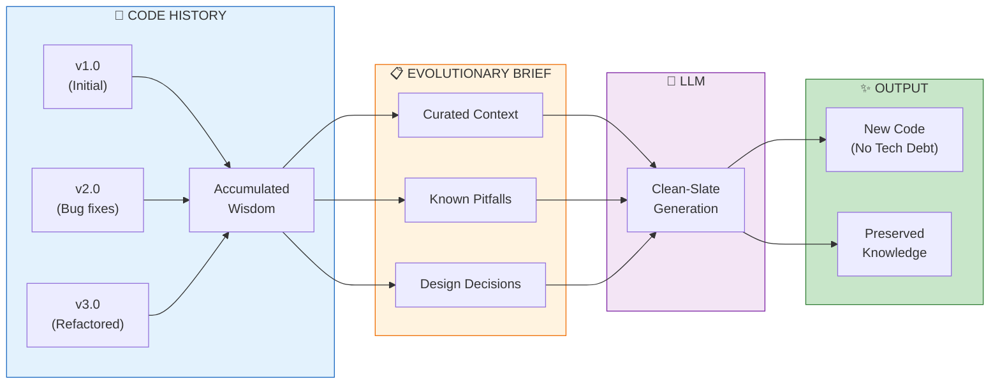
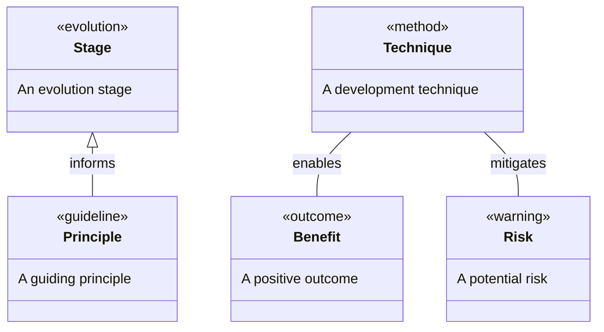
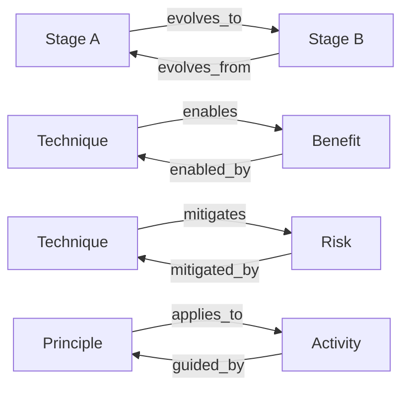
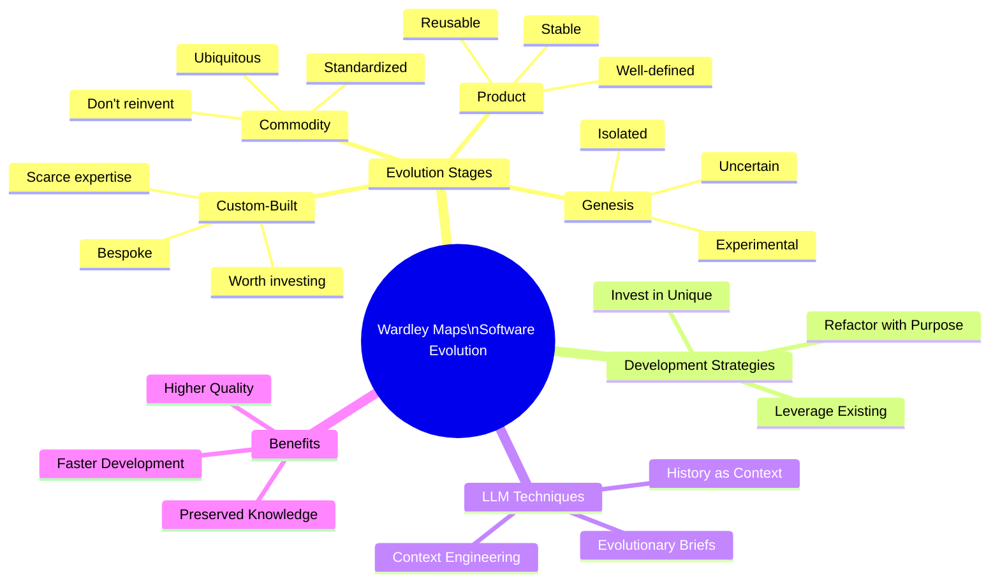
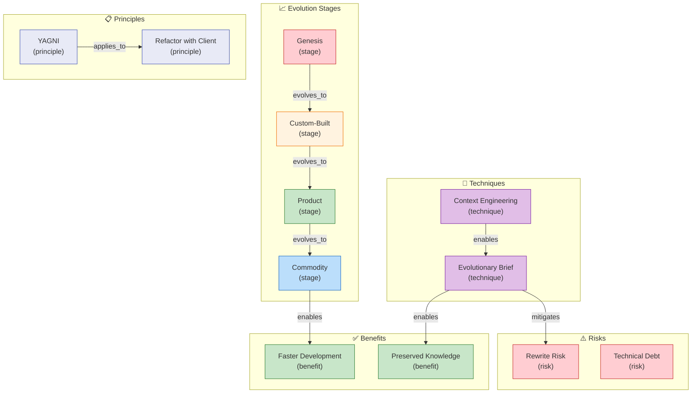

# Wardley Maps as an Analogy for Software Development Evolution

> *Semantic Knowledge Graph (SKG) - markdown serialization for search, discovery, and graph database integration*

---

## Summary

This white paper explores how Wardley Maps' evolution stages provide a powerful lens for software development decisions, mapping code modules through Genesis → Custom-Built → Product → Commodity stages. The document argues that identifying each component's evolutionary stage informs where to invest development effort versus leverage existing solutions, and introduces the concept of using code history as the best brief for LLM-assisted development. Key insight: by feeding an LLM the evolution history of a module rather than just a static spec, you carry forward accumulated wisdom without carrying forward technical debt — enabling clean-slate rewrites that preserve lessons learned.

---

## Key Concepts

- **Wardley Map Evolution Axis**: Four stages from Genesis (experimental, uncertain) through Custom-Built (bespoke, scarce) to Product (stable, well-defined) and Commodity (standardized, ubiquitous utility).

- **Component-Stage Mapping**: Identifying which evolutionary stage each code module occupies — prototypes as Genesis, internal libraries as Custom-Built/Product, open-source frameworks as Commodity.

- **Strategic Development Focus**: Invest effort in evolving unique/differentiating components (Genesis/Custom-Built) while leveraging existing solutions for commodity needs — avoid reinventing wheels.

- **Refactoring with a Client**: Never refactor without a clear consumer — aligns with YAGNI principle; treat each refactor as a mini product development with identified "customers" who benefit.

- **LLM Evolutionary Briefs**: Providing AI assistants with previous code versions and design history as context, enabling informed rewrites that preserve lessons without inheriting technical debt.

- **Context Engineering**: Carefully curating what context an LLM sees — selective snippets of evolution history rather than entire codebase — to produce relevant, high-quality code generation.

---

## Core Arguments

1. Software systems contain modules at various evolutionary stages simultaneously — some experimental Genesis code, some bespoke Custom-Built solutions, some stable Product-grade libraries, and Commodity dependencies.

2. Understanding each component's stage informs treatment: Genesis code should be isolated and expendable; Custom-Built code worth investing in; Product-grade modules reused confidently; Commodity solutions adopted as-is.

3. Commoditization accelerates development speed — as Wardley observed, industrialized components not only increase efficiency but enable "acceleration in the speed at which I can develop new things" built on reliable foundations.

4. Refactoring must be purpose-driven with identified clients — messy internal functions causing no problems and needed nowhere else may not justify rewrite investment; focus on actively-used, blocking components.

5. LLMs work best with evolutionary context — previous versions, design decisions, known pitfalls — enabling clean-slate solutions that address known issues without repeating past mistakes.

6. This approach mitigates traditional rewrite risks (Joel Spolsky's warning about losing accumulated bug fixes) by distilling knowledge into the prompt rather than throwing it away with the old code.

---

## Key Quotes

> "Each refactoring or redesign is an investment to move that component to a higher stage of evolution where it becomes more stable and efficient."

> "Never refactor or abstract a component without a clear client or use-case that needs it."

> "When you throw away code and start from scratch, you are throwing away all that knowledge... Years of programming work." (Joel Spolsky)

> "The more code and experience you have, the faster you can go, because each evolutionary step builds a stronger foundation for the next."

---

## Tags

`wardley-maps` `software-evolution` `genesis-to-commodity` `refactoring-strategy` `llm-development` `context-engineering` `code-reuse` `technical-debt` `yagni` `clean-slate-rewrite` `commoditization` `strategic-development`

---

## Search Phrases

- "Wardley Maps software development analogy"
- "code evolution stages Genesis to Commodity"
- "refactoring with purpose client identification"
- "LLM code history evolutionary brief"
- "commoditization development speed acceleration"
- "strategic focus Genesis Custom-Built investment"
- "context engineering AI code generation"
- "Joel Spolsky rewrite risk mitigation"
- "YAGNI principle refactoring decisions"
- "carrying wisdom without technical debt"

---

## Metadata

| Field | Value |
|-------|-------|
| **Content Type** | White Paper / Strategic Analysis |
| **Domain** | Software Development / Strategic Planning |
| **Sub-domain** | Architecture Decisions / AI-Assisted Development |
| **Format** | PDF (7 pages) |
| **Date** | January 2026 |
| **Authors** | Dinis Cruz, ChatGPT Deep Research |
| **Target Audience** | Software Architects, Engineering Leads, CTOs |

---

## Related Content

| Relationship | Content |
|--------------|---------|
| `related_to` | LLM-Assisted Development Workflow |
| `related_to` | Vibe Coding Workflow for Rapid Product-Market Fit |
| `references` | Simon Wardley's Mapping Framework |
| `references` | Joel Spolsky - Things You Should Never Do |
| `part_of` | Software Architecture Strategy |

---

## Semantic Knowledge Graph

### The Evolution Axis (Visual)



### Software Evolution Strategy (Visual)



### LLM Evolutionary Brief Pattern (Visual)



---

### Ontology

> The ontology defines the **types of entities** (nodes) and **relationships** (predicates) in this knowledge domain.

#### Node Types



| Ref | Description | Examples |
|-----|-------------|----------|
| `stage` | An evolution stage | Genesis, Custom-Built, Product, Commodity |
| `principle` | A guiding principle | YAGNI, Refactor with Client |
| `technique` | A development technique | Evolutionary Briefs, Context Engineering |
| `benefit` | A positive outcome | Faster Development, Preserved Knowledge |
| `risk` | A potential risk | Knowledge Loss, Technical Debt |

#### Predicates (Relationships)



| Ref | Inverse | Description |
|-----|---------|-------------|
| `evolves_to` | `evolves_from` | Stage progression |
| `enables` | `enabled_by` | Capability enablement |
| `mitigates` | `mitigated_by` | Risk reduction |
| `applies_to` | `applied_by` | Technique application |

---

### Taxonomy

> Hierarchical classification of concepts in this domain.



**ASCII Tree View:**

```
wardley_software_evolution
├── evolution_stages
│   ├── genesis (experimental)
│   ├── custom_built (bespoke)
│   ├── product (stable)
│   └── commodity (utility)
├── development_strategies
│   ├── invest_in_unique
│   ├── leverage_existing
│   └── refactor_with_purpose
├── llm_techniques
│   ├── evolutionary_briefs
│   ├── context_engineering
│   └── history_as_context
└── benefits
    ├── faster_development
    ├── higher_quality
    └── preserved_knowledge
```

---

### Knowledge Graph

> Visual representation of entities and their relationships.



#### Nodes (for database import)

| ID | Type | Name |
|----|------|------|
| `genesis` | `stage` | Genesis Stage |
| `custom_built` | `stage` | Custom-Built Stage |
| `product` | `stage` | Product Stage |
| `commodity` | `stage` | Commodity Stage |
| `yagni` | `principle` | YAGNI Principle |
| `evolutionary_brief` | `technique` | LLM Evolutionary Brief |
| `context_engineering` | `technique` | Context Engineering |
| `rewrite_risk` | `risk` | Knowledge Loss on Rewrite |
| `faster_dev` | `benefit` | Accelerated Development |

#### Edges (for database import)

| From | Predicate | To |
|------|-----------|-----|
| `genesis` | `evolves_to` | `custom_built` |
| `custom_built` | `evolves_to` | `product` |
| `product` | `evolves_to` | `commodity` |
| `commodity` | `enables` | `faster_dev` |
| `evolutionary_brief` | `mitigates` | `rewrite_risk` |
| `yagni` | `applies_to` | `refactoring` |
| `context_engineering` | `enables` | `evolutionary_brief` |

---

### Cypher Import (Neo4j)

```cypher
// Create nodes
CREATE (genesis:Stage {id: 'genesis', name: 'Genesis Stage', characteristics: 'experimental, uncertain'})
CREATE (custom:Stage {id: 'custom_built', name: 'Custom-Built Stage', characteristics: 'bespoke, scarce'})
CREATE (product:Stage {id: 'product', name: 'Product Stage', characteristics: 'stable, well-defined'})
CREATE (commodity:Stage {id: 'commodity', name: 'Commodity Stage', characteristics: 'standardized, utility'})
CREATE (yagni:Principle {id: 'yagni', name: 'YAGNI Principle'})
CREATE (evbrief:Technique {id: 'evolutionary_brief', name: 'LLM Evolutionary Brief'})
CREATE (ctxeng:Technique {id: 'context_engineering', name: 'Context Engineering'})
CREATE (rewrite:Risk {id: 'rewrite_risk', name: 'Knowledge Loss on Rewrite'})
CREATE (faster:Benefit {id: 'faster_dev', name: 'Accelerated Development'})

// Create relationships
CREATE (genesis)-[:EVOLVES_TO]->(custom)
CREATE (custom)-[:EVOLVES_TO]->(product)
CREATE (product)-[:EVOLVES_TO]->(commodity)
CREATE (commodity)-[:ENABLES]->(faster)
CREATE (evbrief)-[:MITIGATES]->(rewrite)
CREATE (ctxeng)-[:ENABLES]->(evbrief)
CREATE (yagni)-[:APPLIES_TO {context: 'refactoring decisions'}]->(custom)
```
