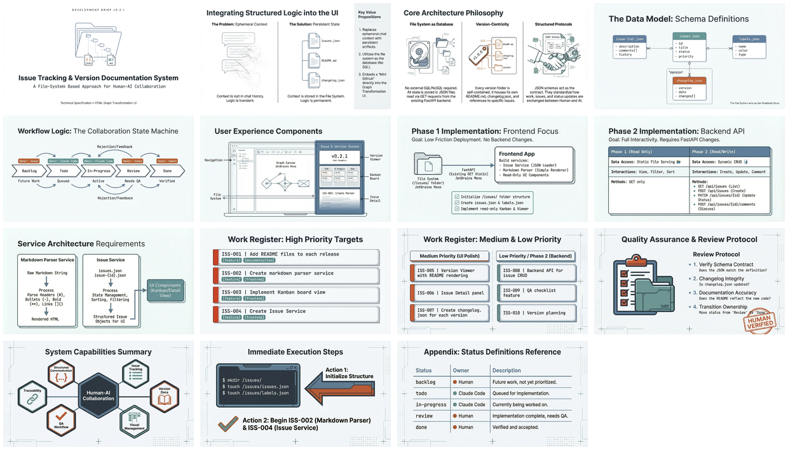

[🏠 Home](../../../../../README.md) / [2026](../../../README.md) / [January](../../README.md) / [Dev Briefs](..) / **Issue Tracking System v0.2.1**

---

# Dev Brief: Database-less Issue Tracking & Version Documentation System

> **Architecture Pattern**: File-system-based issue tracking using JSON files and markdown — enabling structured human-AI collaboration without external databases.

---

## Infographic


---

## Slide Deck

[](./29%20Jan%20-%20Structured_Collaboration_Filesystem.pdf)

*Click the mosaic above to view the full 15-slide presentation (PDF)*

---

## Semantic Knowledge Graph

For detailed concept mapping, relationships, and exportable graph data, see:

**[SEMANTIC-GRAPH.md](SEMANTIC-GRAPH.md)** — Contains Mermaid diagrams, concept taxonomy, ontology, and Cypher export for Neo4j integration.

---

## Overview

This dev brief describes a file-system-based issue tracking and version documentation system designed for structured communication between developers and Claude Code. The system uses JSON files as its persistence layer, enabling issue management, version tracking, and Kanban workflows without requiring any external database.

**Key Innovation**: The file system becomes the database — all state is stored in JSON files that can be read via GET requests from an existing FastAPI backend.

---

## Core Concepts

| Concept | Description |
|---------|-------------|
| **File System as Database** | JSON files for persistence — no external database required |
| **Version-Centric Organization** | Each version folder is self-contained with README, changelog, and issue references |
| **Structured Communication** | JSON schemas provide a contract between human and AI |
| **Kanban Workflow** | 5-status flow: backlog → todo → in-progress → review → done |
| **Two-Phase Implementation** | Phase 1 frontend-only (GET), Phase 2 adds backend API (CRUD) |

---

## File System Architecture

```
project-root/
├── dev-briefs/
│   └── 001-issue-tracking-system/
│       └── BRIEF.md
├── issues/
│   ├── issues.json          # Index/manifest
│   ├── labels.json          # Label definitions
│   └── issue-{id}.json      # Individual issues
├── versions/
│   └── v1.x.x/
│       ├── README.md        # Release notes
│       └── changelog.json   # Structured changes
└── VERSION                  # Current version
```

---

## Kanban Status Flow

```
BACKLOG → TODO → IN-PROGRESS → REVIEW → DONE
  │         │         │           │        │
  │ Human   │ Claude  │ Claude    │ Human  │ Human
  │ assigns │ starts  │ completes │ QAs    │ accepts
```

| Status | Owner | Description |
|--------|-------|-------------|
| `backlog` | Human | Future work, not yet prioritized |
| `todo` | Claude Code | Queued for implementation |
| `in-progress` | Claude Code | Currently being worked on |
| `review` | Human | Implementation complete, needs QA |
| `done` | Human | Verified and accepted |

---

## Services Architecture

Two core services power the system:

1. **Markdown Parser Service** — Converts markdown to rendered HTML
   - Headers (h1-h6), bullet/numbered lists
   - Bold, italic, links, code blocks

2. **Issue Service** — Manages issue data
   - `getIssues()` — Load all issues
   - `getIssue(id)` — Load single issue
   - `getIssuesByStatus(status)` — Filter for Kanban
   - `getIssuesByVersion(version)` — Filter for version viewer

---

## Implementation Phases

### Phase 1: Frontend Only (No Backend Changes)

| Component | Description |
|-----------|-------------|
| Issue Service | Load/parse issue JSON files |
| Markdown Parser | Simple parser for headers, bullets, links |
| Kanban Board | Read-only view of issues by status |
| Version Viewer | Display README + changelog |
| Issue Detail | Read-only single issue view |

### Phase 2: Backend API

| Endpoint | Method | Description |
|----------|--------|-------------|
| `/api/issues` | GET | List all issues |
| `/api/issues/{id}` | GET | Get single issue |
| `/api/issues` | POST | Create new issue |
| `/api/issues/{id}` | PATCH | Update issue |
| `/api/issues/{id}/comments` | POST | Add comment |

---

## JSON Schemas

**Issue Schema** includes: id, title, description, status, labels, timestamps, targetVersion, comments array, and checklist items.

**Changelog Schema** includes: version, date, summary, issuesAddressed array, and filesChanged array with bidirectional issue links.

---

## Benefits

1. **Structured Communication** — JSON schemas for Claude Code to report work
2. **Issue Tracking** — Mini GitHub-like system using filesystem
3. **Version Documentation** — README + changelog per release
4. **Visual Management** — Kanban board for tracking progress
5. **QA Workflow** — Review states and checklists
6. **Traceability** — Links between issues, files, and versions

---

## Related Content

- [osbot-fast-api v0.34.0](../../../by-topic/dev-briefs/osbot-fast-api/v0.34.0__debrief__unified-service-client-architecture/) — Related unified service architecture
- [How Dinis Works](../../../curated-guides/how-dinis-works/) — Workflow demonstration

---

*Dev brief processed: 29 January 2026*
