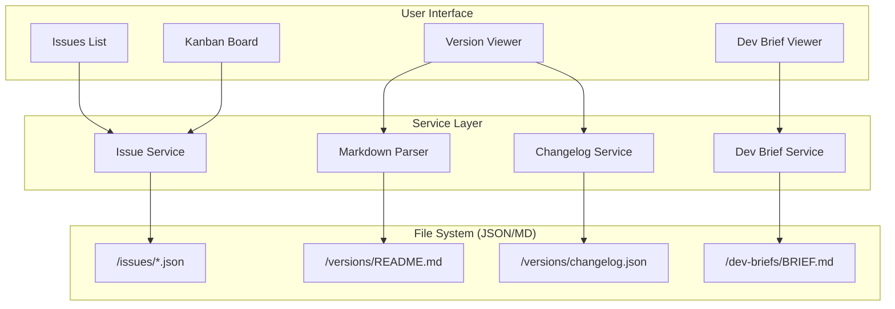
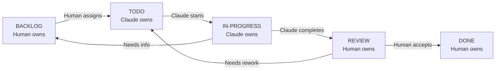
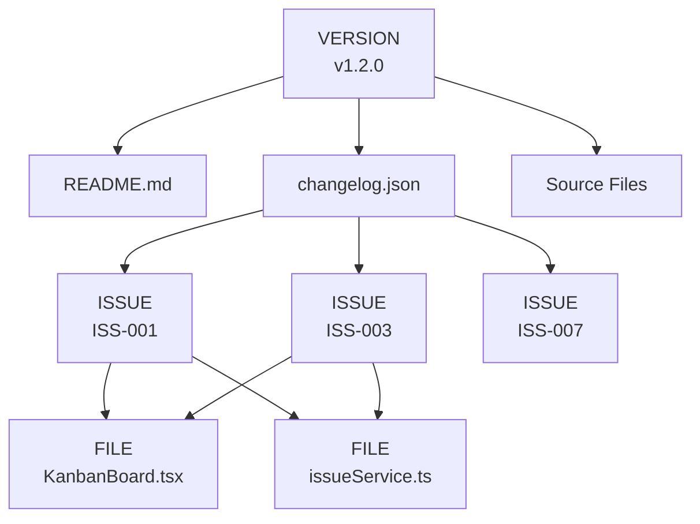
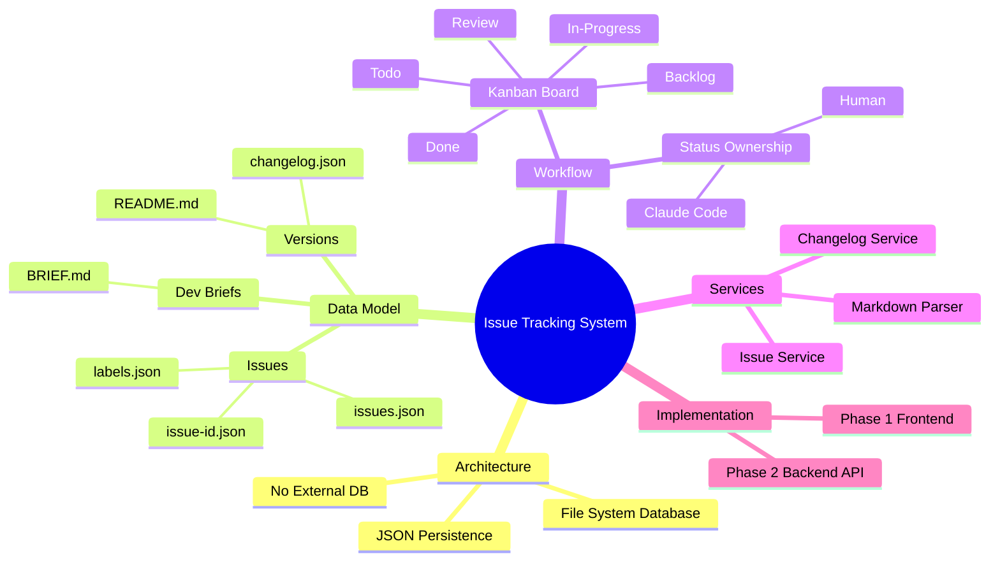

# Semantic Knowledge Graph: Database-less Issue Tracking System

> **Machine-readable metadata** for the file-system-based issue tracking and version documentation system enabling structured human-AI collaboration.

---

## Summary

This dev brief describes an architecture pattern for issue tracking and version documentation using the file system as the database. All state is persisted in JSON files (issues, labels, changelogs) and markdown (READMEs, briefs), enabling a Kanban workflow for human-AI collaboration without external database dependencies. The system provides structured communication contracts via JSON schemas, version-centric organization, and bidirectional traceability between issues, files, and releases. Implementation is phased: Phase 1 is frontend-only using existing GET endpoints; Phase 2 adds backend CRUD APIs.

---

## Key Concepts

| Concept | Definition | Significance |
|---------|------------|--------------|
| **File System as Database** | Using JSON files and markdown for all persistence | Eliminates external database dependency |
| **Version-Centric Organization** | Each version folder contains README, changelog, and source files | Self-contained release documentation |
| **Structured Communication** | JSON schemas define contract between human and AI | Enables reliable human-AI collaboration |
| **Kanban Workflow** | 5-status flow: backlog → todo → in-progress → review → done | Visual progress management |
| **Status Ownership** | Different actors own different statuses (Human vs Claude) | Clear responsibility boundaries |
| **Bidirectional Traceability** | Issues link to files; files link back to issues | Full audit trail |
| **Two-Phase Implementation** | Phase 1 read-only; Phase 2 adds CRUD | Incremental delivery |
| **Markdown Parser Service** | Converts markdown to rendered HTML | Enables rich documentation display |
| **Issue Service** | Loads and manages issue JSON files | Core data access layer |
| **Changelog Schema** | Structured record of issues addressed and files changed | Release documentation |

---

## Core Arguments

1. **Databases Are Optional**: For many project management use cases, the file system provides sufficient persistence without the operational complexity of external databases.

2. **JSON as Contract**: Structured JSON schemas enable reliable communication between humans and AI agents — both parties know exactly what data to expect and produce.

3. **Version-Centric Thinking**: Organizing around versions (not just issues) creates natural documentation artifacts that survive the project lifecycle.

4. **Ownership Clarity**: Explicitly assigning status ownership (human vs Claude Code) prevents confusion about who should act next.

5. **Incremental Implementation**: Starting with read-only Phase 1 delivers immediate value while deferring backend complexity.

---

## Key Quotes

> "We're using the file system as our persistence layer — no external database required. All state is stored in JSON files that can be read via GET requests from the existing FastAPI backend."

> "JSON schemas provide a contract between human and AI for exchanging information about work done, issues, and status."

> "The Phase 1 implementation requires no backend changes — everything works through existing GET endpoints reading JSON/MD files from the filesystem."

---

## Tags

`Issue-Tracking` `File-System-Database` `JSON-Schema` `Kanban` `Version-Control` `Human-AI-Collaboration` `Claude-Code` `Markdown-Parser` `Changelog` `Dev-Brief` `FastAPI` `Frontend-Only` `CRUD-API` `Structured-Communication` `Traceability`

---

## Search Phrases

- File system based issue tracking
- JSON schema human AI collaboration
- Database-less project management
- Kanban workflow Claude Code
- Version documentation system
- Changelog JSON schema
- Structured communication AI agents
- File system persistence pattern
- Issue tracking without database
- Human AI handoff workflow

---

## Visual: Data Flow Architecture



---

## Visual: Kanban Status Flow



---

## Visual: Entity Relationships



---

## Ontology

### Node Types

| Node Type | Description | Properties |
|-----------|-------------|------------|
| `System` | The overall issue tracking system | name, version |
| `Folder` | File system folder | path, type |
| `JSONFile` | JSON data file | path, schema |
| `MarkdownFile` | Markdown documentation file | path, purpose |
| `Service` | Software service component | name, methods |
| `UIComponent` | User interface component | name, purpose |
| `Status` | Kanban status | name, owner |
| `Phase` | Implementation phase | number, scope |
| `Schema` | JSON schema definition | name, fields |
| `APIEndpoint` | REST API endpoint | path, method |

### Predicates (Edge Types)

| Predicate | Domain → Range | Description |
|-----------|----------------|-------------|
| `contains` | Folder → File | Folder contains file |
| `reads` | Service → File | Service reads from file |
| `renders` | UIComponent → Service | UI uses service for data |
| `transitions_to` | Status → Status | Kanban status transition |
| `owned_by` | Status → Actor | Status ownership |
| `implements` | Phase → Feature | Phase implements feature |
| `defines` | Schema → Field | Schema defines field |
| `exposes` | APIEndpoint → Operation | API exposes operation |

---

## Taxonomy

### Mindmap



### ASCII Tree

```
Issue Tracking System v0.2.1
├── Core Concepts
│   ├── File System as Database
│   ├── Version-Centric Organization
│   ├── Structured Communication (JSON)
│   └── Kanban Workflow
│
├── File System Structure
│   ├── /issues/
│   │   ├── issues.json (index)
│   │   ├── labels.json (definitions)
│   │   └── issue-{id}.json (individual)
│   ├── /versions/
│   │   ├── README.md (release notes)
│   │   └── changelog.json (structured)
│   └── /dev-briefs/
│       └── BRIEF.md
│
├── Kanban Status Flow
│   ├── backlog (Human owns)
│   ├── todo (Claude owns)
│   ├── in-progress (Claude owns)
│   ├── review (Human owns)
│   └── done (Human owns)
│
├── Services
│   ├── Markdown Parser Service
│   │   └── parseMarkdown(md) → HTML
│   └── Issue Service
│       ├── getIssues()
│       ├── getIssue(id)
│       ├── getIssuesByStatus(status)
│       └── getIssuesByVersion(version)
│
├── UI Components
│   ├── Kanban Board Panel
│   ├── Version Viewer Panel
│   ├── Issue Detail Panel
│   └── Dev Brief Viewer
│
└── Implementation Phases
    ├── Phase 1: Frontend Only
    │   └── Uses existing GET endpoints
    └── Phase 2: Backend API
        ├── POST /api/issues
        ├── PATCH /api/issues/{id}
        └── POST /api/issues/{id}/comments
```

---

## Knowledge Graph

### Nodes Table

| Node ID | Label | Type | Properties |
|---------|-------|------|------------|
| N1 | Issue Tracking System | System | version: 0.2.1 |
| N2 | /issues/ | Folder | type: data |
| N3 | /versions/ | Folder | type: documentation |
| N4 | /dev-briefs/ | Folder | type: briefs |
| N5 | issues.json | JSONFile | schema: IssueIndex |
| N6 | labels.json | JSONFile | schema: Labels |
| N7 | issue-{id}.json | JSONFile | schema: Issue |
| N8 | README.md | MarkdownFile | purpose: release-notes |
| N9 | changelog.json | JSONFile | schema: Changelog |
| N10 | Issue Service | Service | methods: 4 |
| N11 | Markdown Parser | Service | methods: 1 |
| N12 | Kanban Board | UIComponent | purpose: visual-management |
| N13 | Version Viewer | UIComponent | purpose: documentation |
| N14 | backlog | Status | owner: human |
| N15 | todo | Status | owner: claude |
| N16 | in-progress | Status | owner: claude |
| N17 | review | Status | owner: human |
| N18 | done | Status | owner: human |
| N19 | Phase 1 | Phase | scope: frontend-only |
| N20 | Phase 2 | Phase | scope: backend-api |

### Edges Table

| Edge ID | Source | Target | Predicate | Properties |
|---------|--------|--------|-----------|------------|
| E1 | N1 | N2 | contains | - |
| E2 | N1 | N3 | contains | - |
| E3 | N1 | N4 | contains | - |
| E4 | N2 | N5 | contains | - |
| E5 | N2 | N6 | contains | - |
| E6 | N2 | N7 | contains | multiple: true |
| E7 | N3 | N8 | contains | per-version: true |
| E8 | N3 | N9 | contains | per-version: true |
| E9 | N10 | N5 | reads | - |
| E10 | N10 | N7 | reads | - |
| E11 | N11 | N8 | reads | - |
| E12 | N12 | N10 | renders | - |
| E13 | N13 | N11 | renders | - |
| E14 | N14 | N15 | transitions_to | actor: human |
| E15 | N15 | N16 | transitions_to | actor: claude |
| E16 | N16 | N17 | transitions_to | actor: claude |
| E17 | N17 | N18 | transitions_to | actor: human |
| E18 | N17 | N15 | transitions_to | reason: rework |

---

## Cypher Import

```cypher
// ============================================
// Issue Tracking System v0.2.1
// Neo4j Import Script
// ============================================

// --- Create System ---
CREATE (sys:System {
  id: 'issue-tracking-system',
  name: 'Issue Tracking System',
  version: '0.2.1',
  description: 'File-system-based issue tracking for human-AI collaboration'
});

// --- Create Folders ---
CREATE (fIssues:Folder {id: 'issues', path: '/issues/', type: 'data'});
CREATE (fVersions:Folder {id: 'versions', path: '/versions/', type: 'documentation'});
CREATE (fBriefs:Folder {id: 'dev-briefs', path: '/dev-briefs/', type: 'briefs'});

// --- Create Files ---
CREATE (issuesJson:JSONFile {id: 'issues-json', path: '/issues/issues.json', schema: 'IssueIndex'});
CREATE (labelsJson:JSONFile {id: 'labels-json', path: '/issues/labels.json', schema: 'Labels'});
CREATE (issueJson:JSONFile {id: 'issue-json', path: '/issues/issue-{id}.json', schema: 'Issue'});
CREATE (readmeMd:MarkdownFile {id: 'readme-md', path: '/versions/README.md', purpose: 'release-notes'});
CREATE (changelogJson:JSONFile {id: 'changelog-json', path: '/versions/changelog.json', schema: 'Changelog'});
CREATE (briefMd:MarkdownFile {id: 'brief-md', path: '/dev-briefs/BRIEF.md', purpose: 'dev-brief'});

// --- Create Services ---
CREATE (issueService:Service {
  id: 'issue-service',
  name: 'Issue Service',
  methods: ['getIssues', 'getIssue', 'getIssuesByStatus', 'getIssuesByVersion', 'getLabels']
});

CREATE (mdParser:Service {
  id: 'markdown-parser',
  name: 'Markdown Parser Service',
  methods: ['parseMarkdown']
});

// --- Create UI Components ---
CREATE (kanban:UIComponent {id: 'kanban-board', name: 'Kanban Board', purpose: 'visual-management'});
CREATE (versionViewer:UIComponent {id: 'version-viewer', name: 'Version Viewer', purpose: 'documentation'});
CREATE (issueDetail:UIComponent {id: 'issue-detail', name: 'Issue Detail', purpose: 'issue-view'});

// --- Create Statuses ---
CREATE (sBacklog:Status {id: 'backlog', name: 'backlog', owner: 'human'});
CREATE (sTodo:Status {id: 'todo', name: 'todo', owner: 'claude'});
CREATE (sInProgress:Status {id: 'in-progress', name: 'in-progress', owner: 'claude'});
CREATE (sReview:Status {id: 'review', name: 'review', owner: 'human'});
CREATE (sDone:Status {id: 'done', name: 'done', owner: 'human'});

// --- Create Phases ---
CREATE (phase1:Phase {id: 'phase-1', number: 1, scope: 'frontend-only', description: 'Read-only using GET endpoints'});
CREATE (phase2:Phase {id: 'phase-2', number: 2, scope: 'backend-api', description: 'Full CRUD via REST API'});

// --- Create Relationships ---
MATCH (sys:System {id: 'issue-tracking-system'})
MATCH (fIssues:Folder {id: 'issues'})
MATCH (fVersions:Folder {id: 'versions'})
MATCH (fBriefs:Folder {id: 'dev-briefs'})
MATCH (issuesJson:JSONFile {id: 'issues-json'})
MATCH (labelsJson:JSONFile {id: 'labels-json'})
MATCH (issueJson:JSONFile {id: 'issue-json'})
MATCH (readmeMd:MarkdownFile {id: 'readme-md'})
MATCH (changelogJson:JSONFile {id: 'changelog-json'})
MATCH (briefMd:MarkdownFile {id: 'brief-md'})
MATCH (issueService:Service {id: 'issue-service'})
MATCH (mdParser:Service {id: 'markdown-parser'})
MATCH (kanban:UIComponent {id: 'kanban-board'})
MATCH (versionViewer:UIComponent {id: 'version-viewer'})
MATCH (sBacklog:Status {id: 'backlog'})
MATCH (sTodo:Status {id: 'todo'})
MATCH (sInProgress:Status {id: 'in-progress'})
MATCH (sReview:Status {id: 'review'})
MATCH (sDone:Status {id: 'done'})

// System contains folders
CREATE (sys)-[:CONTAINS]->(fIssues)
CREATE (sys)-[:CONTAINS]->(fVersions)
CREATE (sys)-[:CONTAINS]->(fBriefs)

// Folders contain files
CREATE (fIssues)-[:CONTAINS]->(issuesJson)
CREATE (fIssues)-[:CONTAINS]->(labelsJson)
CREATE (fIssues)-[:CONTAINS {multiple: true}]->(issueJson)
CREATE (fVersions)-[:CONTAINS {perVersion: true}]->(readmeMd)
CREATE (fVersions)-[:CONTAINS {perVersion: true}]->(changelogJson)
CREATE (fBriefs)-[:CONTAINS]->(briefMd)

// Services read files
CREATE (issueService)-[:READS]->(issuesJson)
CREATE (issueService)-[:READS]->(issueJson)
CREATE (issueService)-[:READS]->(labelsJson)
CREATE (mdParser)-[:READS]->(readmeMd)

// UI renders via services
CREATE (kanban)-[:RENDERS_VIA]->(issueService)
CREATE (versionViewer)-[:RENDERS_VIA]->(mdParser)

// Status transitions
CREATE (sBacklog)-[:TRANSITIONS_TO {actor: 'human'}]->(sTodo)
CREATE (sTodo)-[:TRANSITIONS_TO {actor: 'claude'}]->(sInProgress)
CREATE (sInProgress)-[:TRANSITIONS_TO {actor: 'claude'}]->(sReview)
CREATE (sReview)-[:TRANSITIONS_TO {actor: 'human'}]->(sDone)
CREATE (sReview)-[:TRANSITIONS_TO {reason: 'rework'}]->(sTodo)
CREATE (sInProgress)-[:TRANSITIONS_TO {reason: 'needs-info'}]->(sBacklog);
```

---

## Neo4j Import Instructions

### Quick Start

1. **Create a Neo4j Sandbox** at [sandbox.neo4j.com](https://sandbox.neo4j.com/) or use Neo4j Desktop
2. **Open Neo4j Browser** and connect to your database
3. **Copy the Cypher code** from the section above
4. **Paste and run** in the Neo4j Browser query window
5. **Visualize** with: `MATCH p=()-[]-() RETURN p LIMIT 100`

### Sample Queries

```cypher
// View full graph
MATCH p=()-[]-() RETURN p LIMIT 100;

// Find all status transitions
MATCH path = (s1:Status)-[:TRANSITIONS_TO]->(s2:Status)
RETURN s1.name AS From, s2.name AS To,
       COALESCE(path.actor, 'n/a') AS Actor;

// Trace service dependencies
MATCH (ui:UIComponent)-[:RENDERS_VIA]->(svc:Service)-[:READS]->(file)
RETURN ui.name AS UI, svc.name AS Service, file.path AS File;

// Find all files in a folder
MATCH (f:Folder)-[:CONTAINS]->(file)
RETURN f.path AS Folder, collect(file.path) AS Files;

// Find Claude-owned statuses
MATCH (s:Status {owner: 'claude'})
RETURN s.name AS Status;
```

---

## Metadata

| Field | Value |
|-------|-------|
| **Source** | Dev Brief v0.2.1 |
| **Date Processed** | 29 January 2026 |
| **Content Type** | Architecture / Dev Brief |
| **Graph Complexity** | Medium |
| **Neo4j Ready** | Yes |
| **Mermaid Diagrams** | 3 |
| **Node Count** | 20 |
| **Edge Count** | 18 |

---

## Related Content

| Content | Relevance |
|---------|-----------|
| [osbot-fast-api v0.34.0](../../../../by-topic/dev-briefs/osbot-fast-api/v0.34.0__debrief__unified-service-client-architecture/) | Related service architecture patterns |
| [How Dinis Works](../../../../curated-guides/how-dinis-works/) | Workflow demonstration |
| [LLM-Assisted Development](../../../../linkedin-published/GenAI%20development/LLM-Assisted%20Development%20Workflow%20%28Jan%202026%29/) | Human-AI collaboration context |

---

*Semantic graph generated: 29 January 2026*
