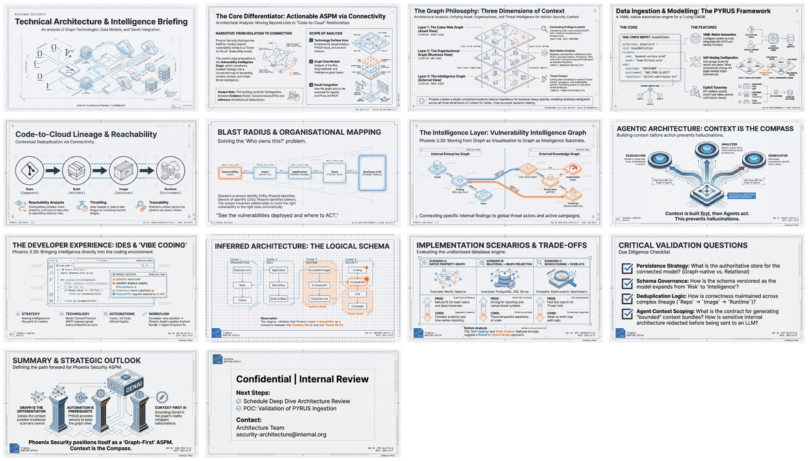

[🏠 Home](../../../../README.md) / [2026](../../README.md) / [January](../README.md) / **Phoenix Security Graph Technologies Briefing**

---

# Technical Briefing on Phoenix Security's Graph Technologies, Data Models, and genAI Integration

> **Executive Analysis**: How Phoenix Security uses graph-based architectures to deliver "Actionable ASPM" — connecting vulnerability data to ownership, runtime context, business impact, and threat intelligence through relationship-centric representations.

---

## Infographic


---

## Slide Deck

[](./29%20Jan%20-%20Phoenix_Security_Architecture_Deep_Dive.pdf)

*Click the mosaic above to view the full 14-slide presentation (PDF)*

---

## Semantic Knowledge Graph

For detailed concept mapping, relationships, and exportable graph data, see:

**[SEMANTIC-GRAPH.md](SEMANTIC-GRAPH.md)** — Contains Mermaid diagrams, concept taxonomy, ontology, and Cypher export for Neo4j integration.

---

## Overview

This technical briefing examines Phoenix Security's publicly evidenced technology surface area, focusing on three key dimensions:

1. **Graph-Based Data Model** — The "Cyber Risk Graph", "Vulnerability Intelligence Graph", and organizational impact graphs that power Phoenix's core capabilities
2. **Architecture Components** — Ingestion, correlation, deduplication, ownership automation (PYRUS), and graph reasoning layers
3. **GenAI Integration** — How graph-derived context enables Phoenix's three-agent architecture (Researcher, Analyzer, Remediator) and upcoming MCP/IDE integrations

The analysis distinguishes between publicly evidenced capabilities and architectural inferences, framing open validation questions for internal review.

---

## Key Concepts

| Concept | Description |
|---------|-------------|
| **Actionable ASPM** | Phoenix's positioning as Application Security Posture Management that drives prioritised remediation actions across "code-to-cloud" environments |
| **Cyber Risk Graph** | Relationship-centric representation connecting vulnerabilities to applications, deployments, and organizational ownership |
| **Vulnerability Intelligence Graph** | Extended graph (Phoenix 3.30) linking vulnerabilities to campaigns, libraries, business units, teams, and threat intelligence overlays |
| **PYRUS** | YAML-native CMDB automation framework for automated ownership attribution and "self-healing configuration" |
| **Blast Radius Analysis** | Graph traversal to determine which business units, teams, and applications are affected by a vulnerability |
| **Container Lineage** | Agentless code-to-cloud provenance tracking (repo → build → image → runtime) |
| **4D Risk Attribution** | Ownership, deployment location, exposure level, and business context |
| **AI-Agent-Second** | Architecture pattern where agents run *after* attribution/context is built ("context is the compass") |

---

## Phoenix's Three Graph Types

Phoenix Security uses "graph" in three distinct but interconnected ways:

```
┌─────────────────────────────────────────────────────────────────────────────┐
│                    PHOENIX SECURITY GRAPH ARCHITECTURE                       │
├─────────────────────────────────────────────────────────────────────────────┤
│                                                                              │
│  ┌──────────────────┐  ┌──────────────────┐  ┌──────────────────┐           │
│  │  RISK/ASSET      │  │  ORGANISATIONAL  │  │  INTELLIGENCE    │           │
│  │  GRAPH           │  │  IMPACT GRAPH    │  │  GRAPH           │           │
│  ├──────────────────┤  ├──────────────────┤  ├──────────────────┤           │
│  │ • Code-to-cloud  │  │ • Blast radius   │  │ • CVE/CWE links  │           │
│  │   visibility     │  │   analysis       │  │ • Threat actors  │           │
│  │ • Vulnerability  │  │ • Business unit  │  │ • Campaigns      │           │
│  │   prioritisation │  │   mapping        │  │ • Attack TTPs    │           │
│  │ • Asset registry │  │ • Team ownership │  │ • Exploitability │           │
│  └──────────────────┘  └──────────────────┘  └──────────────────┘           │
│           │                    │                    │                        │
│           └────────────────────┼────────────────────┘                        │
│                                ▼                                             │
│                   ┌──────────────────────┐                                   │
│                   │  UNIFIED CONTEXTUAL  │                                   │
│                   │  SUBSTRATE FOR AI    │                                   │
│                   └──────────────────────┘                                   │
│                                                                              │
└─────────────────────────────────────────────────────────────────────────────┘
```

---

## Architecture Component Map

| Layer | Primary Responsibilities | Public Evidence |
|-------|-------------------------|-----------------|
| **Ingestion & Connectors** | Pull findings from scanners; ingest metadata from SCM/CI/CD/cloud/IdP/CMDB | Integrations catalogue; PYRUS integration claims |
| **Asset & Ownership Modelling** | Canonical applications, components, services, environments, teams | PYRUS repo; supported `AssetType` taxonomy |
| **Correlation & Deduplication** | Merge duplicates across SDLC and deployment contexts | Phoenix 3.30 notes; "canary token-based traceability" |
| **Graph Reasoning Layer** | Traversals for blast radius, attack paths, vulnerability intelligence linking | Blast Radius documentation; Vulnerability Intelligence Graph release |
| **Risk Scoring Engine** | Multi-tier risk aggregation across vulns → assets → services → business units | Phoenix risk formula; threat-centric + 4D framing |
| **Presentation & Workflow** | Dashboards, vulnerability explorer, ticketing integration | Dashboard upgrade notes; Jira/Azure DevOps/Slack integration |

---

## AI Agent Architecture

Phoenix describes a three-agent model that operates on the graph-derived contextual substrate:

| Agent | Role | Graph Subgraph Fed to Agent |
|-------|------|----------------------------|
| **Researcher** | Monitors threat intelligence; maps vulnerabilities to threat actors/techniques | Vuln ↔ Exploitability ↔ Actor/TTP ↔ Campaign |
| **Analyzer** | Models attack paths within code-to-cloud environment; reachability awareness | Repo/Lib → Build → Image → Env → Exposure |
| **Remediator** | Produces remediation plans and grouped actions | Vulnerability clusters + ownership/priority properties |

**Key Insight**: Agents run *after* context is built — "4-dimensional risk attribution" (ownership, deployment location, exposure level, business context) is established first, then role-specific agents operate on pre-contextualized data.

---

## MCP and IDE Integration Roadmap

Phoenix explicitly states intention to integrate remediation into modern IDE and "vibe coding" workflows:

- **MCP Server** — Upcoming integration targeting Cursor, Lovable, and GitHub Copilot
- **Graph + MCP Interaction Pattern**:
  1. Developer/agent requests context for a vulnerability
  2. Phoenix returns graph-derived context bundle (repos, runtime paths, ownership, SLA, threat intel)
  3. IDE agent proposes changes; Phoenix tracks remediation state and risk impact

---

## Graph Operations Required by Phoenix Features

| Feature | Graph Operation Implied | Why Graph-Native Matters |
|---------|------------------------|--------------------------|
| **Cyber Risk Graph** | Multi-hop traversals: findings → assets → apps → deployments | Relationships change frequently; graph reduces impedance |
| **Blast Radius Analysis** | Reverse reachability: "what depends on/uses this?" | Requires traversing outward from vulnerability node |
| **Container Lineage** | Provenance/path queries: repo → build → image → runtime | Lineage is naturally a directed graph |
| **Vulnerability Intelligence Graph** | Knowledge-graph style joins; neighbourhood exploration | Single connected model enables cross-domain correlation |
| **Contextual Deduplication** | Entity resolution + cluster formation | Dedup groups are subgraphs; linkage shape affects risk |
| **PYRUS Ownership Automation** | Graph rewrite / edge reattachment on ownership change | "Self-healing" suggests automated link refactoring |

---

## Key Questions for Architecture Review

1. **Graph Persistence**: What is the authoritative storage for the connected model (graph-native vs relational + projection)?
2. **Schema Governance**: How are node/edge types versioned as Phoenix expands from "risk graph" to "vulnerability intelligence graph"?
3. **Deduplication Correctness**: How does contextual deduplication interact with lineage across multiple deployment contexts?
4. **Agent Context Packaging**: What is the contract for generating "bounded, minimal, correct" context bundles for agents?

---

## Related Content

- [How Dinis Works — Curated Guide](../../../../curated-guides/how-dinis-works/) — Workflow demonstration
- [Semantic Knowledge Graphs Collection](../../../../curated-guides/semantic-knowledge-graphs/) — Related graph-based documentation approaches
- [GenCloudTwin](../../../../linkedin-published/Cyber%20Security%20and%20Business/%282%20Jan%29%20-%20%20GenCloudTwin%20-%20Creating%20a%20Cloud%20Environment%20Digital%20Twin%20with%20Semantic%20Knowledge%20Graphs/) — Complementary cloud digital twin concept

---

*Technical briefing processed: 29 January 2026*
*Source: ChatGPT Deep Research analysis of Phoenix Security public materials*
