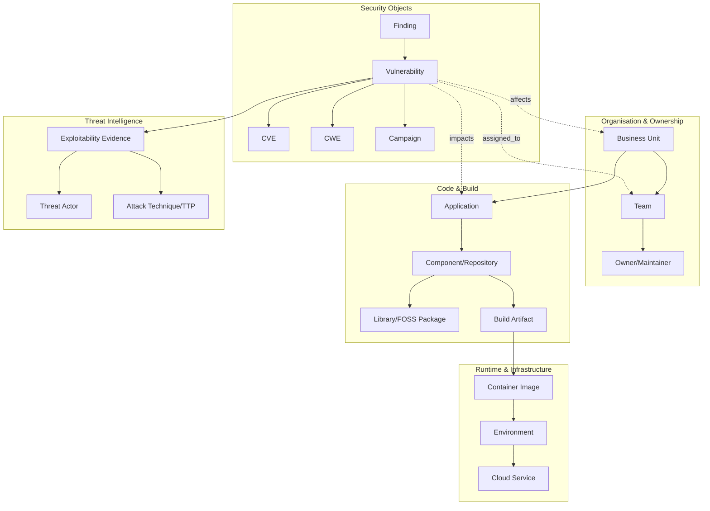
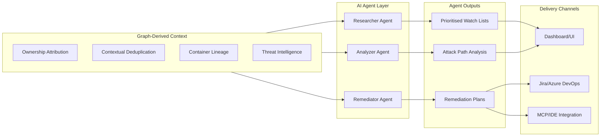
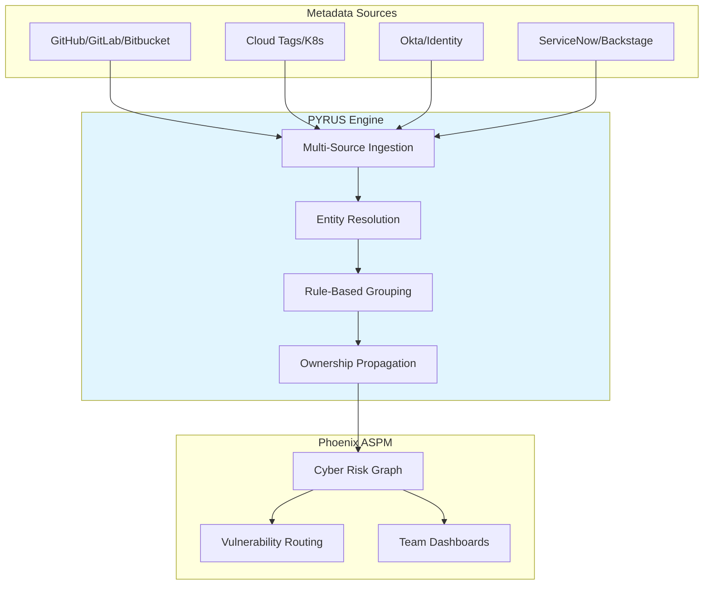
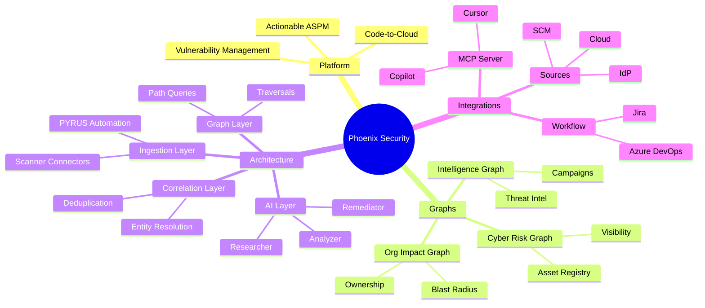
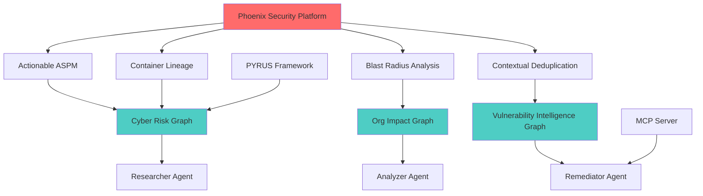

# Semantic Knowledge Graph: Phoenix Security Graph Technologies & GenAI Integration

> **Machine-readable metadata** for the technical briefing on Phoenix Security's graph-based ASPM platform, covering architecture, data models, AI agent integration, and MCP roadmap.

---

## Summary

This briefing examines Phoenix Security's "Actionable ASPM" platform through a graph lens, analysing how relationship-centric representations — the Cyber Risk Graph, Vulnerability Intelligence Graph, and organisational impact graphs — enable code-to-cloud vulnerability contextualization. Phoenix's differentiator is not merely aggregating scanner findings, but connecting them to ownership, runtime context, business impact, and threat intelligence through traversable graph structures. The platform's AI-agent-second architecture (Researcher, Analyzer, Remediator) operates on pre-contextualized graph-derived data, and the stated MCP integration roadmap aims to bring this contextual intelligence directly into IDE and "vibe coding" workflows.

---

## Key Concepts

| Concept | Definition | Significance |
|---------|------------|--------------|
| **Actionable ASPM** | Application Security Posture Management that drives prioritised remediation across code-to-cloud | Phoenix's market positioning and value proposition |
| **Cyber Risk Graph** | Relationship-centric representation connecting vulnerabilities to applications and deployments | Foundation for code-to-cloud visibility |
| **Vulnerability Intelligence Graph** | Extended graph linking vulns to campaigns, libraries, org structures, and threat intel | Enables cross-domain correlation and agentic AI |
| **Blast Radius Analysis** | Graph traversal determining which business units/teams/applications are affected by a vulnerability | Answers "who owns this risk and how bad is it?" |
| **PYRUS** | YAML-native CMDB automation framework with self-healing configuration | Automated ownership attribution and graph maintenance |
| **Container Lineage** | Agentless code-to-cloud provenance: repo → build → image → runtime | Connects build artefacts to runtime containers |
| **4D Risk Attribution** | Ownership, deployment location, exposure level, business context | Context dimensions applied before AI agents run |
| **AI-Agent-Second** | Architecture where agents run after attribution/context is built | "Context is the compass" — graph-first design |
| **Contextual Deduplication** | Merge duplicates across SDLC/deployment contexts; adjust risk by correlation density | Reduces noise; treats duplicates differently by context |
| **MCP Integration** | Model Context Protocol server for IDE/vibe coding tools | Brings graph-derived context into developer workflows |

---

## Core Arguments

1. **Graph as Intelligence Substrate**: Phoenix is moving from "graph as visualization" to "graph as an intelligence substrate" spanning both enterprise context and external threat knowledge — the Vulnerability Intelligence Graph is the clearest evidence of this trajectory.

2. **Context Before Agents**: The AI-agent-second architecture is "highly aligned with graph-first design" because agent prompt/context windows can be assembled from bounded, relevant subgraphs rather than forcing LLMs to reason over unstructured vulnerability lists.

3. **Relationship-Heavy by Design**: Phoenix's PYRUS taxonomy (`AssetType` values spanning REPOSITORY, FOSS, SAST, CONTAINER, CLOUD) strongly implies the internal model is multi-domain and relationship-heavy regardless of the backing persistence layer.

4. **Self-Healing Configuration**: Ownership drift becomes a graph maintenance problem; PYRUS's "self-healing configuration" suggests automated refactoring of link structure when people, code, or environments change.

5. **Graph Operations Required**: Phoenix's features imply specific graph computations — multi-hop traversals, reverse reachability, provenance/path queries, entity resolution, and knowledge-graph style joins — that are awkward in flat asset tables.

---

## Key Quotes

> "Phoenix 3.30 introduces a 'Vulnerability Intelligence Graph' that links vulnerabilities to campaigns, libraries, business units, teams, applications, assets, and individual findings, and then merges that organisational mapping with threat layers such as exploitability, threat actors, and attack techniques."

> "The AI-agent-second narrative makes a critical architectural point: Phoenix claims agents run after attribution/context is built ('context is the compass')."

> "The novel element in Phoenix's publicly stated approach is not merely 'LLM summarisation'; it is the claim that Phoenix's agents depend on a pre-existing contextual substrate that includes ownership attribution, deduplication/correlation, reachability, container lineage, and threat-intel mappings — most naturally represented and queried as a graph."

> "Phoenix explicitly states an intention to integrate remediation into modern IDE and 'vibe coding' workflows via an upcoming MCP server, naming Cursor, Lovable, and GitHub Copilot as targets."

---

## Tags

`Phoenix-Security` `ASPM` `Application-Security-Posture-Management` `Graph-Database` `Knowledge-Graph` `Vulnerability-Management` `Cyber-Risk-Graph` `Blast-Radius` `Container-Lineage` `PYRUS` `GenAI` `AI-Agents` `MCP` `Model-Context-Protocol` `Threat-Intelligence` `Code-to-Cloud` `SBOM` `CVE` `CWE` `MITRE-ATT&CK` `DevSecOps` `Remediation` `Ownership-Attribution` `Contextual-Deduplication` `Reachability-Analysis`

---

## Search Phrases

- Phoenix Security graph architecture
- Actionable ASPM vulnerability intelligence graph
- Blast radius analysis security platform
- PYRUS YAML CMDB automation
- AI agents for vulnerability management
- Context-first security AI architecture
- Code-to-cloud vulnerability correlation
- Container lineage traceability
- MCP server security integration
- Graph-based vulnerability prioritization
- Ownership attribution security findings
- Self-healing CMDB configuration
- Threat actor vulnerability mapping
- Attack path modelling ASPM

---

## Visual: Phoenix Graph Architecture



---

## Visual: AI Agent Architecture



---

## Visual: PYRUS Pipeline Architecture



---

## Ontology

### Node Types

| Node Type | Description | Properties |
|-----------|-------------|------------|
| `Platform` | Security platform | name, type, version |
| `Capability` | Platform capability area | name, description |
| `GraphType` | Type of graph in architecture | name, purpose |
| `Component` | Architecture component | name, layer, responsibilities |
| `Agent` | AI agent type | name, role, inputs, outputs |
| `EntityType` | Node type in Phoenix's data model | name, family, examples |
| `EdgeType` | Relationship type in data model | name, semantics |
| `GraphOperation` | Graph computation required | name, complexity |
| `Feature` | Product feature | name, description, graph_operation |
| `Integration` | External system integration | name, type, direction |
| `Question` | Architecture review question | topic, question_text |

### Predicates (Edge Types)

| Predicate | Domain → Range | Description |
|-----------|----------------|-------------|
| `has_capability` | Platform → Capability | Platform provides this capability |
| `uses_graph` | Capability → GraphType | Capability depends on this graph type |
| `contains` | Component → Component | Architectural containment |
| `feeds` | Component → Agent | Provides context to agent |
| `produces` | Agent → Output | Agent generates this output |
| `requires_operation` | Feature → GraphOperation | Feature needs this graph computation |
| `connects_to` | Platform → Integration | Integration point |
| `addresses` | Capability → Question | Capability relates to review question |
| `models` | GraphType → EntityType | Graph type includes this node type |
| `links_via` | EntityType → EdgeType | Entities connected via this edge type |

---

## Taxonomy

### Mindmap



### ASCII Tree

```
Phoenix Security Graph Technologies
├── Platform Positioning
│   ├── Actionable ASPM
│   ├── Code-to-Cloud Visibility
│   └── Prioritised Remediation
│
├── Graph Architecture
│   ├── Risk/Asset Graph
│   │   ├── Vulnerability → Application → Deployment
│   │   └── Single Asset Register
│   │
│   ├── Organisational Impact Graph
│   │   ├── Blast Radius Analysis
│   │   ├── Business Unit Mapping
│   │   └── Team Ownership Attribution
│   │
│   └── Vulnerability Intelligence Graph
│       ├── CVE/CWE Links
│       ├── Campaign Correlation
│       ├── Threat Actor Mapping
│       └── Attack Technique (TTP) Links
│
├── Architecture Components
│   ├── Ingestion & Integration Connectors
│   ├── Asset & Ownership Modelling
│   ├── Correlation & Contextual Deduplication
│   ├── Graph Reasoning Layer
│   ├── Risk Scoring Engine
│   └── Presentation & Workflow Integration
│
├── AI Agent Architecture
│   ├── Researcher (Threat Intel Monitoring)
│   ├── Analyzer (Attack Path Modelling)
│   └── Remediator (Action Planning)
│
├── PYRUS Automation
│   ├── YAML-Native CMDB
│   ├── Self-Healing Configuration
│   ├── Multi-Source Metadata Ingestion
│   └── Automated Ownership Propagation
│
└── Integration Roadmap
    ├── MCP Server (Cursor, Copilot, Lovable)
    ├── Ticketing (Jira, Azure DevOps, ServiceNow)
    └── Source Metadata (SCM, Cloud, IdP, CMDB)
```

---

## Knowledge Graph

### Visual Representation



### Nodes Table

| Node ID | Label | Type | Properties |
|---------|-------|------|------------|
| N1 | Phoenix Security | Platform | type: ASPM, focus: vulnerability-management |
| N2 | Actionable ASPM | Capability | scope: code-to-cloud |
| N3 | Cyber Risk Graph | GraphType | purpose: asset-visibility |
| N4 | Org Impact Graph | GraphType | purpose: blast-radius |
| N5 | Vulnerability Intelligence Graph | GraphType | purpose: threat-correlation |
| N6 | PYRUS | Component | type: CMDB-automation, language: YAML |
| N7 | Researcher Agent | Agent | role: threat-intel-monitoring |
| N8 | Analyzer Agent | Agent | role: attack-path-modelling |
| N9 | Remediator Agent | Agent | role: action-planning |
| N10 | Blast Radius Analysis | Feature | operation: reverse-reachability |
| N11 | Container Lineage | Feature | operation: provenance-query |
| N12 | Contextual Deduplication | Feature | operation: entity-resolution |
| N13 | MCP Server | Integration | targets: Cursor, Copilot, Lovable |
| N14 | 4D Risk Attribution | Concept | dimensions: ownership, location, exposure, business |
| N15 | AI-Agent-Second | Pattern | principle: context-before-agents |
| N16 | Application | EntityType | family: SDLC |
| N17 | Vulnerability | EntityType | family: Security |
| N18 | Business Unit | EntityType | family: Organisation |
| N19 | Threat Actor | EntityType | family: ThreatIntel |
| N20 | Campaign | EntityType | family: ThreatIntel |

### Edges Table

| Edge ID | Source | Target | Predicate | Properties |
|---------|--------|--------|-----------|------------|
| E1 | N1 | N2 | has_capability | primary: true |
| E2 | N2 | N3 | uses_graph | for: visibility |
| E3 | N2 | N4 | uses_graph | for: impact-analysis |
| E4 | N2 | N5 | uses_graph | for: intelligence |
| E5 | N6 | N3 | maintains | via: ownership-propagation |
| E6 | N3 | N7 | feeds | subgraph: vuln-threat-intel |
| E7 | N4 | N8 | feeds | subgraph: lineage-exposure |
| E8 | N5 | N9 | feeds | subgraph: vuln-clusters |
| E9 | N1 | N10 | has_feature | evidence: public-docs |
| E10 | N1 | N11 | has_feature | evidence: public-docs |
| E11 | N1 | N12 | has_feature | evidence: public-docs |
| E12 | N13 | N9 | enables | via: graph-query-endpoints |
| E13 | N14 | N15 | enables | principle: context-compass |
| E14 | N17 | N16 | impacts | via: blast-radius |
| E15 | N17 | N18 | affects | via: ownership-traversal |
| E16 | N17 | N19 | linked_to | via: intelligence-graph |
| E17 | N17 | N20 | associated_with | via: campaign-correlation |

---

## Cypher Import

```cypher
// ============================================
// Phoenix Security Graph Technologies
// Neo4j Import Script
// ============================================

// --- Clear existing data (optional) ---
// MATCH (n) DETACH DELETE n;

// --- Create Platform ---
CREATE (phoenix:Platform {
  id: 'phoenix-security',
  name: 'Phoenix Security',
  type: 'ASPM',
  description: 'Actionable Application Security Posture Management',
  focus: 'code-to-cloud vulnerability management'
});

// --- Create Graph Types ---
CREATE (crg:GraphType {
  id: 'cyber-risk-graph',
  name: 'Cyber Risk Graph',
  purpose: 'asset-visibility',
  description: 'Code-to-cloud visibility and prioritisation'
});

CREATE (oig:GraphType {
  id: 'org-impact-graph',
  name: 'Organisational Impact Graph',
  purpose: 'blast-radius',
  description: 'Mapping vulnerabilities to business units, teams, applications'
});

CREATE (vig:GraphType {
  id: 'vuln-intel-graph',
  name: 'Vulnerability Intelligence Graph',
  purpose: 'threat-correlation',
  description: 'Links vulns to campaigns, threat actors, CVEs, CWEs, TTPs'
});

// --- Create Capabilities ---
CREATE (aspm:Capability {
  id: 'actionable-aspm',
  name: 'Actionable ASPM',
  scope: 'code-to-cloud'
});

CREATE (blast:Feature {
  id: 'blast-radius',
  name: 'Blast Radius Analysis',
  operation: 'reverse-reachability',
  description: 'Maps which business units, teams, apps affected by vulnerability'
});

CREATE (lineage:Feature {
  id: 'container-lineage',
  name: 'Container Lineage',
  operation: 'provenance-query',
  description: 'Agentless code-to-cloud: repo → build → image → runtime'
});

CREATE (dedup:Feature {
  id: 'contextual-dedup',
  name: 'Contextual Deduplication',
  operation: 'entity-resolution',
  description: 'Merge duplicates across SDLC and deployment contexts'
});

// --- Create Components ---
CREATE (pyrus:Component {
  id: 'pyrus',
  name: 'PYRUS',
  type: 'CMDB-automation',
  language: 'YAML',
  description: 'Self-healing configuration for ownership and grouping'
});

CREATE (mcp:Integration {
  id: 'mcp-server',
  name: 'MCP Server',
  targets: ['Cursor', 'GitHub Copilot', 'Lovable'],
  status: 'roadmap'
});

// --- Create Agents ---
CREATE (researcher:Agent {
  id: 'researcher-agent',
  name: 'Researcher',
  role: 'threat-intel-monitoring',
  inputs: 'Vuln ↔ Exploitability ↔ Actor/TTP ↔ Campaign',
  outputs: 'Prioritised watch lists, exploitability narrative'
});

CREATE (analyzer:Agent {
  id: 'analyzer-agent',
  name: 'Analyzer',
  role: 'attack-path-modelling',
  inputs: 'Repo/Lib → Build → Image → Env → Exposure',
  outputs: 'Is it reachable? Blast radius, inferred exploit paths'
});

CREATE (remediator:Agent {
  id: 'remediator-agent',
  name: 'Remediator',
  role: 'action-planning',
  inputs: 'Vulnerability clusters + ownership/priority',
  outputs: 'Bundled work items, PR-ready instructions'
});

// --- Create Patterns ---
CREATE (fourD:Concept {
  id: '4d-risk-attribution',
  name: '4D Risk Attribution',
  dimensions: ['ownership', 'deployment-location', 'exposure-level', 'business-context']
});

CREATE (aiSecond:Pattern {
  id: 'ai-agent-second',
  name: 'AI-Agent-Second',
  principle: 'context-before-agents',
  description: 'Agents run after attribution/context is built'
});

// --- Create Entity Types ---
CREATE (etApp:EntityType {id: 'application', name: 'Application', family: 'SDLC'});
CREATE (etRepo:EntityType {id: 'repository', name: 'Repository/Component', family: 'SDLC'});
CREATE (etLib:EntityType {id: 'library', name: 'Library/FOSS Package', family: 'SDLC'});
CREATE (etBuild:EntityType {id: 'build', name: 'Build Artifact', family: 'SDLC'});
CREATE (etImg:EntityType {id: 'container-image', name: 'Container Image', family: 'Runtime'});
CREATE (etEnv:EntityType {id: 'environment', name: 'Environment', family: 'Runtime'});
CREATE (etCloud:EntityType {id: 'cloud-resource', name: 'Cloud Service/Resource', family: 'Runtime'});
CREATE (etVuln:EntityType {id: 'vulnerability', name: 'Vulnerability', family: 'Security'});
CREATE (etFinding:EntityType {id: 'finding', name: 'Finding', family: 'Security'});
CREATE (etCamp:EntityType {id: 'campaign', name: 'Campaign', family: 'ThreatIntel'});
CREATE (etBU:EntityType {id: 'business-unit', name: 'Business Unit', family: 'Organisation'});
CREATE (etTeam:EntityType {id: 'team', name: 'Team', family: 'Organisation'});
CREATE (etOwner:EntityType {id: 'owner', name: 'Owner/Maintainer', family: 'Organisation'});
CREATE (etActor:EntityType {id: 'threat-actor', name: 'Threat Actor', family: 'ThreatIntel'});
CREATE (etTTP:EntityType {id: 'ttp', name: 'Attack Technique/TTP', family: 'ThreatIntel'});
CREATE (etCVE:EntityType {id: 'cve', name: 'CVE', family: 'ThreatIntel'});
CREATE (etCWE:EntityType {id: 'cwe', name: 'CWE', family: 'ThreatIntel'});

// --- Create Relationships ---
MATCH (phoenix:Platform {id: 'phoenix-security'})
MATCH (aspm:Capability {id: 'actionable-aspm'})
MATCH (crg:GraphType {id: 'cyber-risk-graph'})
MATCH (oig:GraphType {id: 'org-impact-graph'})
MATCH (vig:GraphType {id: 'vuln-intel-graph'})
MATCH (pyrus:Component {id: 'pyrus'})
MATCH (mcp:Integration {id: 'mcp-server'})
MATCH (researcher:Agent {id: 'researcher-agent'})
MATCH (analyzer:Agent {id: 'analyzer-agent'})
MATCH (remediator:Agent {id: 'remediator-agent'})
MATCH (blast:Feature {id: 'blast-radius'})
MATCH (lineage:Feature {id: 'container-lineage'})
MATCH (dedup:Feature {id: 'contextual-dedup'})
MATCH (fourD:Concept {id: '4d-risk-attribution'})
MATCH (aiSecond:Pattern {id: 'ai-agent-second'})

// Platform → Capabilities
CREATE (phoenix)-[:HAS_CAPABILITY]->(aspm)
CREATE (phoenix)-[:HAS_FEATURE]->(blast)
CREATE (phoenix)-[:HAS_FEATURE]->(lineage)
CREATE (phoenix)-[:HAS_FEATURE]->(dedup)

// Capabilities → Graphs
CREATE (aspm)-[:USES_GRAPH {for: 'visibility'}]->(crg)
CREATE (aspm)-[:USES_GRAPH {for: 'impact-analysis'}]->(oig)
CREATE (aspm)-[:USES_GRAPH {for: 'intelligence'}]->(vig)

// Components → Graphs
CREATE (pyrus)-[:MAINTAINS {via: 'ownership-propagation'}]->(crg)
CREATE (pyrus)-[:MAINTAINS {via: 'self-healing'}]->(oig)

// Graphs → Agents
CREATE (crg)-[:FEEDS {subgraph: 'vuln-threat-intel'}]->(researcher)
CREATE (oig)-[:FEEDS {subgraph: 'lineage-exposure'}]->(analyzer)
CREATE (vig)-[:FEEDS {subgraph: 'vuln-clusters'}]->(remediator)

// MCP → Agent
CREATE (mcp)-[:ENABLES {via: 'graph-query-endpoints'}]->(remediator)

// Architectural patterns
CREATE (fourD)-[:ENABLES {principle: 'context-compass'}]->(aiSecond)
CREATE (aiSecond)-[:SHAPES]->(researcher)
CREATE (aiSecond)-[:SHAPES]->(analyzer)
CREATE (aiSecond)-[:SHAPES]->(remediator)

// Features → Graph Operations
CREATE (blast)-[:REQUIRES_OPERATION {type: 'reverse-reachability'}]->(oig)
CREATE (lineage)-[:REQUIRES_OPERATION {type: 'provenance-query'}]->(crg)
CREATE (dedup)-[:REQUIRES_OPERATION {type: 'entity-resolution'}]->(vig);

// --- Entity Type Relationships ---
MATCH (etApp:EntityType {id: 'application'})
MATCH (etRepo:EntityType {id: 'repository'})
MATCH (etLib:EntityType {id: 'library'})
MATCH (etBuild:EntityType {id: 'build'})
MATCH (etImg:EntityType {id: 'container-image'})
MATCH (etEnv:EntityType {id: 'environment'})
MATCH (etVuln:EntityType {id: 'vulnerability'})
MATCH (etFinding:EntityType {id: 'finding'})
MATCH (etBU:EntityType {id: 'business-unit'})
MATCH (etTeam:EntityType {id: 'team'})
MATCH (etActor:EntityType {id: 'threat-actor'})
MATCH (etCVE:EntityType {id: 'cve'})
MATCH (etCamp:EntityType {id: 'campaign'})

CREATE (etApp)-[:CONTAINS]->(etRepo)
CREATE (etRepo)-[:DEPENDS_ON]->(etLib)
CREATE (etRepo)-[:PRODUCES]->(etBuild)
CREATE (etBuild)-[:PRODUCES]->(etImg)
CREATE (etImg)-[:RUNS_IN]->(etEnv)
CREATE (etFinding)-[:MAPS_TO]->(etVuln)
CREATE (etVuln)-[:LINKED_TO]->(etCVE)
CREATE (etVuln)-[:IMPACTS]->(etApp)
CREATE (etVuln)-[:AFFECTS]->(etBU)
CREATE (etVuln)-[:ASSIGNED_TO]->(etTeam)
CREATE (etVuln)-[:ASSOCIATED_WITH]->(etCamp)
CREATE (etVuln)-[:EXPLOITED_BY]->(etActor);
```

---

## Neo4j Import Instructions

### Quick Start

1. **Create a Neo4j Sandbox** at [sandbox.neo4j.com](https://sandbox.neo4j.com/) or use Neo4j Desktop
2. **Open Neo4j Browser** and connect to your database
3. **Copy the Cypher code** from the section above
4. **Paste and run** in the Neo4j Browser query window
5. **Visualize** with: `MATCH p=()-[]-() RETURN p LIMIT 100`

### Sample Queries

```cypher
// View full graph
MATCH p=()-[]-() RETURN p LIMIT 100;

// Find all graph types and what feeds into them
MATCH (g:GraphType)<-[:USES_GRAPH]-(c:Capability)
RETURN g.name AS Graph, c.name AS Capability;

// Trace agent architecture
MATCH (g:GraphType)-[:FEEDS]->(a:Agent)
RETURN g.name AS GraphType, a.name AS Agent, a.role AS Role;

// Find Phoenix features and their required graph operations
MATCH (f:Feature)-[:REQUIRES_OPERATION]->(g:GraphType)
RETURN f.name AS Feature, f.operation AS Operation, g.name AS TargetGraph;

// Explore entity type relationships (Phoenix data model)
MATCH path = (e1:EntityType)-[r]->(e2:EntityType)
RETURN e1.name AS From, type(r) AS Relationship, e2.name AS To;

// Find MCP integration path
MATCH path = (mcp:Integration)-[:ENABLES]->(a:Agent)
RETURN mcp.name, mcp.targets, a.name, a.role;
```

---

## Metadata

| Field | Value |
|-------|-------|
| **Source** | ChatGPT Deep Research analysis of Phoenix Security public materials |
| **Date Processed** | 29 January 2026 |
| **Content Type** | Technical briefing / Architecture analysis |
| **Graph Complexity** | High (multi-layer: platform, graphs, agents, entity model) |
| **Neo4j Ready** | Yes |
| **Mermaid Diagrams** | 4 |
| **Node Count** | 20 |
| **Edge Count** | 17+ |

---

## Related Content

| Content | Relevance |
|---------|-----------|
| [How Dinis Works — Curated Guide](../../../../curated-guides/how-dinis-works/) | Workflow demonstration context |
| [Semantic Knowledge Graphs Collection](../../../../curated-guides/semantic-knowledge-graphs/) | Related graph documentation approaches |
| [GenCloudTwin](../../../../linkedin-published/Cyber%20Security%20and%20Business/%282%20Jan%29%20-%20%20GenCloudTwin%20-%20Creating%20a%20Cloud%20Environment%20Digital%20Twin%20with%20Semantic%20Knowledge%20Graphs/) | Cloud digital twin using similar SKG approach |
| [Data Physics and Semantic Capture](../../../../linkedin-published/3rd%20Party%20Content/Data%20Physics%20and%20the%20Semantic%20Capture%20of%20Intent/) | Foundational concepts on capturing intent |
| [LLM-Assisted Development Workflow](../../../../linkedin-published/GenAI%20development/LLM-Assisted%20Development%20Workflow%20%28Jan%202026%29/) | Context engineering for AI agents |

---

*Semantic graph generated: 29 January 2026*
