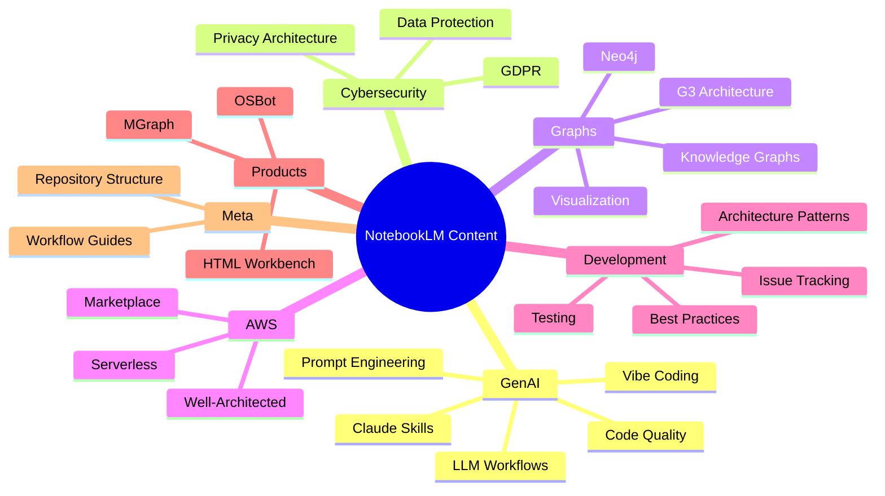
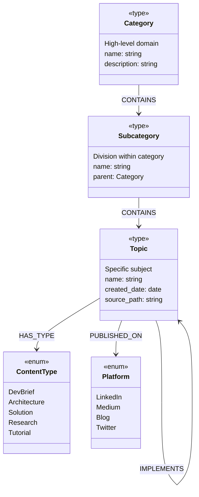
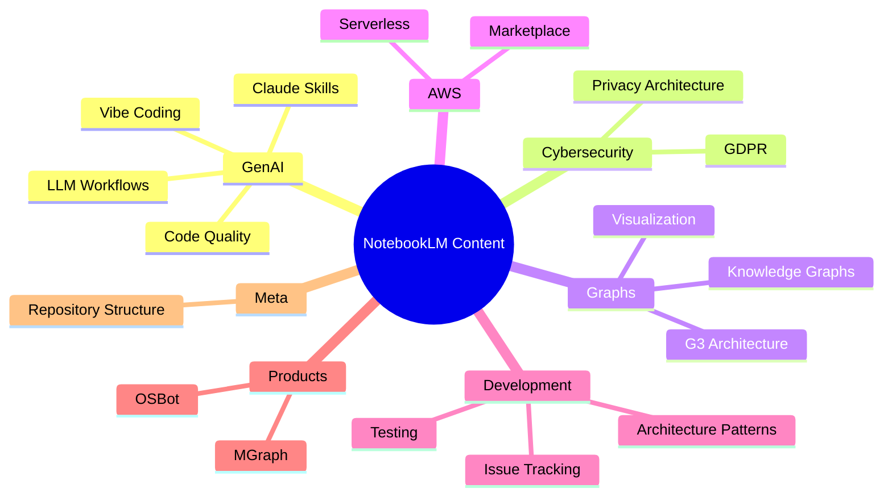

# LLM Brief: Repository-Level Ontology & Taxonomy

> **The Missing Layer** — Applying Semantic Knowledge Graph principles to the repository itself

**Date**: 31 January 2026
**Author**: Dinis Cruz
**Status**: Design phase
**Depends On**: [Three-Layer Content Architecture](../31-jan__brief__notebooklm-repo__exploring-new-content-stucture/31-jan__brief__notebooklm-repo__exploring-new-content-stucture.md)

---

## Executive Summary

This document proposes adding a **repository-level Ontology and Taxonomy** to the NotebookLM Infographics & Slides repository. Just as we create SEMANTIC-GRAPH.md files to capture the knowledge structure of individual content pieces, we need a master schema that defines how content is categorized, typed, and related at the repository level.

This is the natural evolution of our workflow — we've proven the value of semantic graphs for individual content, now we apply the same pattern to the container itself.

---

## The Insight

We've been creating SEMANTIC-GRAPH.md files that answer:
- What concepts exist in THIS content?
- How do they relate to each other?
- What's the ontology (types) and taxonomy (hierarchy) for THIS topic?

But we've been missing the meta-level question:
- What concepts exist in THIS REPOSITORY?
- How do content pieces relate to each other?
- What's the ontology and taxonomy for THE WHOLE COLLECTION?

```
┌─────────────────────────────────────────────────────────────────────────────┐
│                         THE MISSING LAYER                                    │
├─────────────────────────────────────────────────────────────────────────────┤
│                                                                             │
│   Individual Content                         Repository Level               │
│   ──────────────────                         ────────────────               │
│                                                                             │
│   ┌─────────────────────┐                   ┌─────────────────────┐        │
│   │ SEMANTIC-GRAPH.md   │                   │ ONTOLOGY.md         │        │
│   │                     │                   │ TAXONOMY.md         │        │
│   │ • Concepts          │                   │                     │        │
│   │ • Relationships     │    ◀── SAME ──▶   │ • Categories        │        │
│   │ • Ontology          │       PATTERN     │ • Content Types     │        │
│   │ • Taxonomy          │                   │ • Relationships     │        │
│   │ • Cypher export     │                   │ • Cypher export     │        │
│   └─────────────────────┘                   └─────────────────────┘        │
│                                                                             │
│   ✅ We have this                           ❌ We're missing this          │
│                                                                             │
└─────────────────────────────────────────────────────────────────────────────┘
```

---

## Why Now? The Wardley Mapping Evolution Play

This proposal follows classic **Wardley Mapping doctrine**: don't over-engineer upfront — ship, learn, then productize.

### Our Evolution Journey

```
┌─────────────────────────────────────────────────────────────────────────────┐
│                    WARDLEY EVOLUTION OF THIS REPOSITORY                      │
├─────────────────────────────────────────────────────────────────────────────┤
│                                                                             │
│   GENESIS (Dec 2024-Jan 2025)                                               │
│   ───────────────────────────                                               │
│   • Started publishing content to LinkedIn                                  │
│   • Created folders organically as needed                                   │
│   • No formal structure — just shipped content                              │
│   • Goal: Get ideas out, test reception                                     │
│                                                                             │
│   CUSTOM-BUILT (Jan 2025)                                                   │
│   ───────────────────────                                                   │
│   • Added README.md files for navigation                                    │
│   • Experimented with SEMANTIC-GRAPH.md format                              │
│   • Created .claude/ workflow guides                                        │
│   • Tried curated-guides/ for discovery                                     │
│   • Goal: Make content findable and reusable                                │
│                                                                             │
│   PRODUCT (Now - Jan 2026)                    ◀── YOU ARE HERE              │
│   ────────────────────────                                                  │
│   • Three-layer architecture (sources/topics/platforms)                     │
│   • Repository-level Ontology & Taxonomy                                    │
│   • Standardized workflows with clear placement rules                       │
│   • Goal: Scalable, consistent, machine-readable                            │
│                                                                             │
│   COMMODITY (Future)                                                        │
│   ──────────────────                                                        │
│   • Automated content placement                                             │
│   • Cross-repository knowledge graphs                                       │
│   • Reader persona-based navigation                                         │
│   • Goal: Self-organizing knowledge base                                    │
│                                                                             │
└─────────────────────────────────────────────────────────────────────────────┘
```

### The Doctrine

> "Don't try to create the perfect architecture before you understand the problem. Ship something, learn from it, then improve."

We didn't start with a semantic graph for the repository because:
1. We didn't know what categories would emerge
2. We didn't know if SEMANTIC-GRAPH.md would work (it did!)
3. We needed real content to reveal the patterns
4. Premature optimization is the root of all evil

Now we have:
- ~270+ content pieces across multiple categories
- Proven SEMANTIC-GRAPH.md format
- Clear pain points showing where the current approach breaks
- Understanding of what's needed

**This is the right time to productize.**

---

## Real Examples: Where Our Current Approach Breaks

### Problem 1: Inconsistent Category Naming

The same logical category has different names in different places:

```
linkedin-published/               by-topic/
─────────────────────            ─────────────────────
Dev Briefs/                  ≠   dev-briefs/
3rd Party Content/           ≠   3rd party - documents or text/
Development and Enginering/  ≠   (no equivalent)
```

**Impact**: Can't reliably cross-reference. Search fails. Navigation breaks.

**With Ontology/Taxonomy**: Single source of truth for category names.

---

### Problem 2: Typos That Persist

Folder names contain typos that propagate everywhere:

```
linkedin-published/Development and Enginering/    ← Missing 'e'
linkedin-published/Strategic partnerhips/         ← Missing 'i'
by-topic/Strategic partnerhips/                   ← Same typo copied
```

**Impact**: Looks unprofessional. Hard to fix after content references it.

**With Ontology/Taxonomy**: Categories defined once, validated, then used consistently.

---

### Problem 3: Mixed Granularity

Some folders are broad domains, others are specific products, at the same level:

```
by-topic/
├── GenAI development/           ← Broad domain (22+ items)
├── Graphs/                      ← Broad domain
├── osbot-utils/                 ← Specific product
├── dev-briefs/                  ← Content type, not topic
└── Dinis Cruz - Startups/       ← Author-based category
```

**Impact**: No consistent mental model. Where does new content go?

**With Ontology/Taxonomy**: Clear hierarchy with defined levels (Domain > Category > Subcategory > Topic).

---

### Problem 4: Content Type vs Topic Confusion

"Dev Briefs" is a content TYPE (format), not a TOPIC (subject):

```
Current structure mixes:
├── Dev Briefs/          ← This is a FORMAT (like "White Paper" or "Tutorial")
├── GenAI development/   ← This is a TOPIC (subject matter)
├── Cyber Security/      ← This is a TOPIC
└── Wardley Maps/        ← This is a TOPIC (or methodology)
```

**Impact**: Same content can logically belong to multiple places. Where does a "Dev Brief about GenAI Security" go?

**With Ontology/Taxonomy**: Separate dimensions — ContentType and Topic are orthogonal.

---

### Problem 5: No Clear Placement Rules

When processing the Jan 29 content, Claude had to ask:

> "Where should these live in topics/? Option A: Development/Tools/HTML Workbench/? Option B: Architecture/HTML Workbench/? Option C: MGraph/HTML Workbench/?"

**Impact**: Every new content piece requires a human decision. Not scalable.

**With Ontology/Taxonomy**: Check taxonomy → find fit or extend. Clear workflow.

---

### Problem 6: Flat Structure Doesn't Scale

`by-topic/GenAI development/` has 22+ items at the same level:

```
by-topic/GenAI development/
├── Agents on Rails/
├── Architecture Patterns/
├── Authorization and Workflow Model.../
├── Beyond code - Testing/
├── Comparing Vibe Coding.../
├── Dual Save Pattern/
├── Europe Chance to Break.../
├── Integrating a Semantic Knowledge Layer.../
├── Iterative Flow Development/
├── Runtime Type Checking.../
├── Software Development in the Age of GenA/
├── The 100% Cost for 10% Use Problem.../
├── The Rise of Hyper-Focused Software.../
├── Why Cloud storage is a great database/
├── Why I built my own Serverless GraphDb/
├── Zero Context-Switch Workflow/
├── _Modernizing Legacy Systems_.../
├── dev-tools/
├── vibe-coding/
└── ... (more)
```

**Impact**: Overwhelming. No subcategories. Hard to find related content.

**With Ontology/Taxonomy**: Defined hierarchy with subcategories when items exceed ~15-20.

---

### Problem 7: Curated Guides as a Workaround

We created `curated-guides/` to solve discovery:

```
curated-guides/
├── from-idea-to-startup/
└── semantic-knowledge-graphs/
```

**Impact**: Manual curation doesn't scale. Guides become stale. Duplicates navigation logic.

**With Ontology/Taxonomy**: The taxonomy IS the navigation. Curated guides become views/filters, not parallel structures.

---

### Problem 8: Multiple Content Forms for Same Topic

The HTML Transformation Workbench has both a "Dev Brief" and an "Architecture" document:

```
by-date/2026/Jan/29/Dev briefs/
├── 1) LLM_BRIEF__HTML_Transformation_Workbench_UI/
└── 2) ARCHITECTURE__HTML_Transformation_Workbench/
```

Where do these go in `topics/`? Are they:
- Two separate topics?
- One topic with two content types?
- One topic at different maturity levels?

**With Ontology/Taxonomy**: ContentType dimension handles this — same Topic, different Types (DevBrief, Architecture, Solution).

---

## The Solution: Repository-Level Ontology & Taxonomy

### ONTOLOGY.md — What Types of Things Exist

```markdown
# Repository Ontology

## Node Types

### Category
A high-level domain of knowledge.
Examples: GenAI, Cybersecurity, Graphs, AWS, Development

### Subcategory
A subdivision within a Category.
Examples: Claude Skills (under GenAI), GDPR (under Cybersecurity)

### Topic
A specific subject with associated content.
Examples: Pass-Driven Development, Graph-Based Issue Tracking

### ContentType
The format/maturity of content.
Values: DevBrief, Architecture, Solution, Research, Tutorial, Analysis

### Platform
A publication destination.
Values: LinkedIn, Medium, Blog, Twitter

## Relationships

### Structural
- Category CONTAINS Subcategory
- Subcategory CONTAINS Topic
- Topic HAS_TYPE ContentType

### Cross-references
- Topic RELATES_TO Topic
- Topic EXTENDS Topic (e.g., Architecture extends DevBrief)
- Topic IMPLEMENTS Topic (e.g., Solution implements Architecture)

### Publication
- Topic PUBLISHED_ON Platform
```

### TAXONOMY.md — The Actual Hierarchy

```markdown
# Repository Taxonomy

## Category Hierarchy



## Content Type Matrix

| Topic | DevBrief | Architecture | Solution | Research |
|-------|----------|--------------|----------|----------|
| HTML Workbench | ✅ | ✅ | 🔜 | |
| Graph-Based Issues | ✅ | | ✅ | |
| Three-Layer Architecture | ✅ | | | |
```

---

## Workflow Integration

### New Content Processing Flow

```
┌─────────────────────────────────────────────────────────────────────────────┐
│                    CONTENT PROCESSING WITH ONTOLOGY/TAXONOMY                 │
├─────────────────────────────────────────────────────────────────────────────┤
│                                                                             │
│   1. CONTENT ARRIVES                                                        │
│      └── New content added to sources/YYYY/MM/DD/[Topic]/                   │
│                                                                             │
│   2. CHECK ONTOLOGY/TAXONOMY                    ◀── NEW STEP                │
│      ├── Does this Topic fit existing Categories?                           │
│      ├── Is the ContentType defined?                                        │
│      └── Are relationships clear?                                           │
│                                                                             │
│   3. DECISION POINT                                                         │
│      │                                                                      │
│      ├── FITS EXISTING TAXONOMY                                             │
│      │   └── Proceed to step 4                                              │
│      │                                                                      │
│      └── NEEDS TAXONOMY UPDATE                                              │
│          ├── Update TAXONOMY.md (add Category/Subcategory)                  │
│          ├── Update ONTOLOGY.md (if new types needed)                       │
│          └── Then proceed to step 4                                         │
│                                                                             │
│   4. CREATE TOPICS/ DOCUMENTATION                                           │
│      └── Place in topics/[Category]/[Subcategory]/[Topic]/                  │
│                                                                             │
│   5. CREATE PLATFORMS/ ARTIFACTS (if published)                             │
│      └── Place in platforms/[platform]/[Category]/[Subcategory]/[Topic]/    │
│                                                                             │
└─────────────────────────────────────────────────────────────────────────────┘
```

### Expected Evolution

1. **Initially**: Frequent taxonomy updates as we categorize existing content
2. **Mid-term**: Occasional updates as new domains emerge
3. **Stable state**: Taxonomy covers 95%+ of content without changes
4. **Mature**: Ontology rarely changes; taxonomy occasionally extended

---

## Implementation: The `semantic-data/` Folder

Per the [Three-Layer Architecture](../31-jan__brief__notebooklm-repo__exploring-new-content-stucture/31-jan__brief__notebooklm-repo__exploring-new-content-stucture.md), the new structure lives in a dedicated top-level folder:

```
NotebookLM__Infographics-and-slides/
│
├── semantic-data/                    # NEW: Refactored content with ontology
│   ├── ONTOLOGY.md                   # What types exist
│   ├── TAXONOMY.md                   # Category hierarchy
│   ├── sources/                      # Layer 1: Raw assets by date
│   │   └── 2026/01/31/[Topic]/
│   ├── topics/                       # Layer 2: Curated docs by category
│   │   └── [Category]/[Subcategory]/[Topic]/
│   └── platforms/                    # Layer 3: Publication artifacts
│       └── linkedin/[Category]/[Subcategory]/[Topic]/
│
├── by-date/                          # EXISTING: Keep during migration
├── by-topic/                         # EXISTING: Keep during migration
├── linkedin-published/               # EXISTING: Keep during migration
├── curated-guides/                   # EXISTING: Eventually replaced by taxonomy
└── .claude/                          # Workflow guides (update to use semantic-data/)
```

### Why `semantic-data/`?

- **Semantic**: This is structured, meaningful data — not just files
- **Data**: Emphasizes this is the data layer (vs presentation/views)
- **Aligned**: Matches SEMANTIC-GRAPH.md naming convention
- **Clear boundary**: New structure is isolated from legacy during migration

---

## ONTOLOGY.md Template

```markdown
# NotebookLM Repository Ontology

> Defines the types of entities and relationships in this knowledge base

---

## Node Types

### Content Organization

| Type | Description | Properties |
|------|-------------|------------|
| `Category` | High-level domain | name, description |
| `Subcategory` | Division within category | name, description, parent_category |
| `Topic` | Specific subject with content | name, description, created_date, source_path |

### Content Classification

| Type | Description | Values |
|------|-------------|--------|
| `ContentType` | Format/maturity of content | DevBrief, Architecture, Solution, Research, Tutorial, Analysis |
| `Platform` | Publication destination | LinkedIn, Medium, Blog, Twitter |
| `Status` | Publication status | Draft, Published, Updated |

### Artifacts

| Type | Description | Location |
|------|-------------|----------|
| `SourceDocument` | Original PDF/MD | sources/ |
| `Infographic` | NotebookLM image | sources/ |
| `SlidesDeck` | NotebookLM slides | sources/ |
| `README` | Navigation doc | topics/ |
| `SemanticGraph` | SKG document | topics/ |
| `SlideMosaic` | Preview grid | topics/ |
| `PostText` | Published content | platforms/ |

---

## Relationships

### Structural (Hierarchy)

| Relationship | From | To | Description |
|--------------|------|-----|-------------|
| `CONTAINS` | Category | Subcategory | Category contains subcategories |
| `CONTAINS` | Subcategory | Topic | Subcategory contains topics |
| `HAS_TYPE` | Topic | ContentType | Topic has a content type |
| `HAS_ARTIFACT` | Topic | Artifact | Topic has associated files |

### Cross-References

| Relationship | From | To | Description |
|--------------|------|-----|-------------|
| `RELATES_TO` | Topic | Topic | General relationship |
| `EXTENDS` | Topic | Topic | Elaborates on another (DevBrief → Architecture) |
| `IMPLEMENTS` | Topic | Topic | Realizes another (Architecture → Solution) |
| `SUPERSEDES` | Topic | Topic | Replaces older content |
| `PART_OF` | Topic | Topic | Component of larger work |

### Publication

| Relationship | From | To | Description |
|--------------|------|-----|-------------|
| `PUBLISHED_ON` | Topic | Platform | Where content was published |
| `PUBLISHED_DATE` | Topic | Date | When published |

---

## Mermaid Ontology Diagram



---

## Cypher Schema (Neo4j)

```cypher
// Constraints
CREATE CONSTRAINT category_name IF NOT EXISTS FOR (c:Category) REQUIRE c.name IS UNIQUE;
CREATE CONSTRAINT subcategory_name IF NOT EXISTS FOR (s:Subcategory) REQUIRE s.name IS UNIQUE;
CREATE CONSTRAINT topic_id IF NOT EXISTS FOR (t:Topic) REQUIRE t.id IS UNIQUE;

// Indexes
CREATE INDEX category_idx IF NOT EXISTS FOR (c:Category) ON (c.name);
CREATE INDEX topic_type_idx IF NOT EXISTS FOR (t:Topic) ON (t.content_type);
CREATE INDEX topic_date_idx IF NOT EXISTS FOR (t:Topic) ON (t.created_date);
```
```

---

## TAXONOMY.md Template

```markdown
# NotebookLM Repository Taxonomy

> The category hierarchy for organizing content

**Last Updated**: 31 January 2026
**Total Categories**: X
**Total Topics**: Y

---

## Visual Hierarchy



---

## Category Details

### GenAI

AI-powered development practices and tools.

| Subcategory | Description | Topic Count |
|-------------|-------------|-------------|
| Claude Skills | Building skills for Claude | 2 |
| Code Quality | AI-era code quality | 3 |
| LLM Workflows | Patterns for LLM integration | 5 |
| Vibe Coding | Conversational development | 4 |

### Cybersecurity

Security, privacy, and compliance.

| Subcategory | Description | Topic Count |
|-------------|-------------|-------------|
| GDPR | Data protection regulation | 2 |
| Privacy Architecture | Privacy-first design | 3 |

[... continue for each category ...]

---

## Content Type Distribution

| ContentType | Count | Description |
|-------------|-------|-------------|
| DevBrief | 45 | Technical briefs and overviews |
| Architecture | 12 | System design documents |
| Solution | 8 | Working implementations |
| Research | 15 | Deep research reports |
| Tutorial | 5 | How-to guides |

---

## Cypher Export

```cypher
// Categories
CREATE (genai:Category {name: 'GenAI', description: 'AI-powered development'})
CREATE (cyber:Category {name: 'Cybersecurity', description: 'Security and compliance'})
CREATE (graphs:Category {name: 'Graphs', description: 'Graph technologies'})
CREATE (aws:Category {name: 'AWS', description: 'Amazon Web Services'})
CREATE (dev:Category {name: 'Development', description: 'Software development practices'})
CREATE (products:Category {name: 'Products', description: 'Specific products and tools'})
CREATE (meta:Category {name: 'Meta', description: 'Repository structure and workflows'})

// Subcategories
CREATE (claude_skills:Subcategory {name: 'Claude Skills'})
CREATE (code_quality:Subcategory {name: 'Code Quality'})
// ... more subcategories

// Relationships
CREATE (genai)-[:CONTAINS]->(claude_skills)
CREATE (genai)-[:CONTAINS]->(code_quality)
// ... more relationships
```
```

---

## Benefits Summary

| Before (Ad-hoc) | After (Ontology/Taxonomy) |
|-----------------|---------------------------|
| "Where should this go?" → Ask human | Check taxonomy → find fit |
| Inconsistent naming | Single source of truth |
| Mixed granularity | Defined hierarchy levels |
| Content type confusion | Orthogonal dimensions |
| Manual curated guides | Taxonomy IS navigation |
| Flat folders don't scale | Subcategories when needed |

---

## Next Steps

1. **Create initial ONTOLOGY.md** — Define types and relationships
2. **Create initial TAXONOMY.md** — Bootstrap from existing content
3. **Process Jan 31 content** — Test the workflow with real examples
4. **Iterate** — Refine based on fit/friction
5. **Document in .claude/** — Update workflow guides

---

## Appendix: Related Documents

- [Three-Layer Content Architecture](../31-jan__brief__notebooklm-repo__exploring-new-content-stucture/31-jan__brief__notebooklm-repo__exploring-new-content-stucture.md) — The sources/topics/platforms structure
- `.claude/create-semantic-graph.md` — Individual content SKG creation
- `.claude/MAIN.md` — Repository context brief

---

## Appendix: Wardley Mapping References

This evolution follows Wardley doctrine:

1. **"Do the simple thing first"** — We started with folders, not graphs
2. **"Ship and iterate"** — Content was published, patterns emerged
3. **"Use appropriate methods"** — Now applying structure where proven valuable
4. **"Think big, start small"** — Repository graph enables future automation
5. **"Be humble"** — The taxonomy will evolve; that's expected
