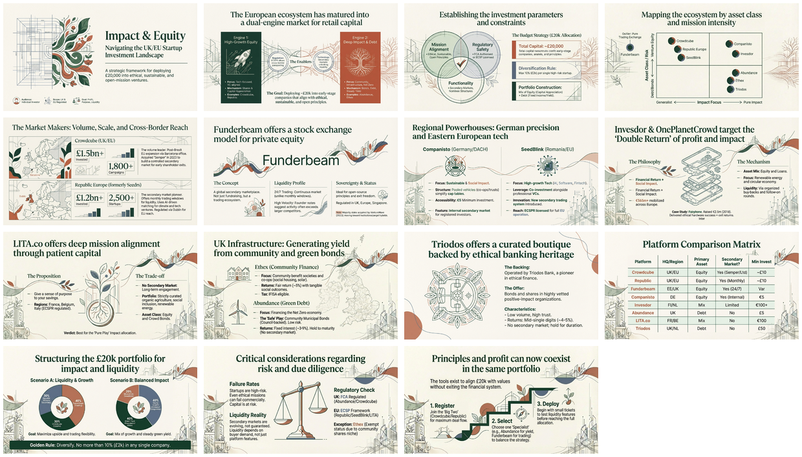

# UK/EU Investment Platforms for Ethical and Sustainable Startups

[Home](../../../../README.md) / [By Topic](../../../README.md) / [3rd Party Content](../../README.md) / **UK/EU Investment Platforms**

---

## Overview

This collection provides a comprehensive guide to regulated UK and EU investment platforms that enable individual investors to deploy capital into ethical, sustainable, and mission-driven startups. The materials cover equity crowdfunding, impact investing, community finance, and secondary market opportunities across Europe.

**Key Focus Areas:**
- Equity crowdfunding platforms (Crowdcube, Republic Europe, Companisto, SeedBlink)
- Impact-focused platforms (LITA.co, Ethex, Abundance, Triodos)
- Secondary market liquidity options (Funderbeam, Seedrs)
- Regulatory frameworks (FCA, ECSPR)
- Portfolio construction strategies for ethical investing

**Investment Parameters:**
- Target allocation: ~20,000 GBP
- Diversification rule: Max 10% per single startup
- Asset mix: Equity + Debt instruments
- Geographic scope: UK and EU regulated platforms

---

## Infographic

*Visual overview of top UK and EU platforms for ethical startup investment, highlighting leading equity crowdfunding platforms, specialist impact platforms, minimum investments, and secondary market availability.*

---

## Slide Deck

*Click the mosaic to view the full 15-slide presentation on navigating the UK/EU startup investment landscape.*

**Slide Deck Contents:**
1. Impact & Equity - Introduction
2. Dual-Engine Market Overview
3. Investment Parameters & Constraints
4. Ecosystem Mapping by Asset Class
5. Market Makers: Crowdcube & Republic
6. Funderbeam Secondary Market Model
7. Regional Powerhouses: Companisto & SeedBlink
8. Invesdor & OnePlanetCrowd
9. LITA.co Deep Impact Platform
10. UK Infrastructure: Ethex & Abundance
11. Triodos Ethical Banking Platform
12. Platform Comparison Matrix
13. Portfolio Structuring Scenarios
14. Risk & Due Diligence
15. Conclusion: Principles & Profit

---

## Source Information

| Attribute | Details |
|-----------|---------|
| **Document Title** | Best UK/EU Investment Platforms for Ethical and Sustainable Startups |
| **Content Type** | Research Guide / Investment Analysis |
| **Source** | Third-party document (ChatGPT generated research) |
| **Date Created** | January 2025 |
| **Pages** | 6 (PDF document) + 15 slides |
| **Primary Topics** | Impact Investing, ESG, Crowdfunding, Venture Capital |
| **Geographic Focus** | United Kingdom, European Union |
| **Target Audience** | Individual investors seeking ethical/sustainable investments |
| **Investment Range** | ~20,000 GBP portfolio allocation |

---

## Navigation

| Document | Description | Format |
|----------|-------------|--------|
| [Main Research Document](Best%20UK_EU%20Investment%20Platforms%20for%20Ethical%20and%20Sustainable%20Startups.pdf) | Comprehensive guide to UK/EU ethical investment platforms | PDF (6 pages) |
| [Infographic](26%20-%20UK%3AEU%20Ethical%20Investing%20Platforms%20Guide.jpg) | Visual summary of platform landscape | JPG |
| [Slide Deck](26%20Jan%20-%20Impact_Capital_Strategy_UK_Europe.pdf) | Strategic framework presentation | PDF (15 slides) |
| [Slide Mosaic](slides_mosaic.png) | Visual preview of all slides | PNG |
| [Semantic Graph](SEMANTIC-GRAPH.md) | Knowledge structure and relationships | Markdown |

---

## Platform Quick Reference

| Platform | Region | Asset Type | Secondary Market | Min Investment |
|----------|--------|------------|------------------|----------------|
| Crowdcube | UK/EU | Equity | Yes (Semper) | ~10 GBP |
| Republic Europe | UK/EU | Equity | Yes (Monthly) | ~10 GBP |
| Funderbeam | EE/UK | Equity | Yes (24/7) | Variable |
| Companisto | DE | Equity | Yes (Internal) | 5 EUR |
| Invesdor | FI/NL | Mix | Limited | 100+ EUR |
| Abundance | UK | Debt | No | 5 GBP |
| LITA.co | FR/BE | Mix | No | 100 EUR |
| Triodos | UK/NL | Debt | No | 50 GBP |
| Ethex | UK | Debt | No | Variable |
| SeedBlink | RO/EU | Equity | Yes (New) | 2,500 EUR |

---

*Generated: January 2025*
