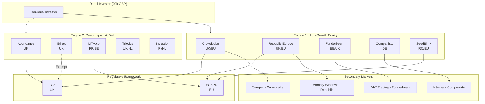
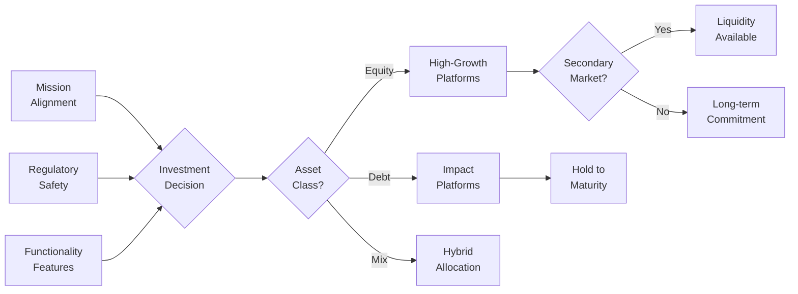
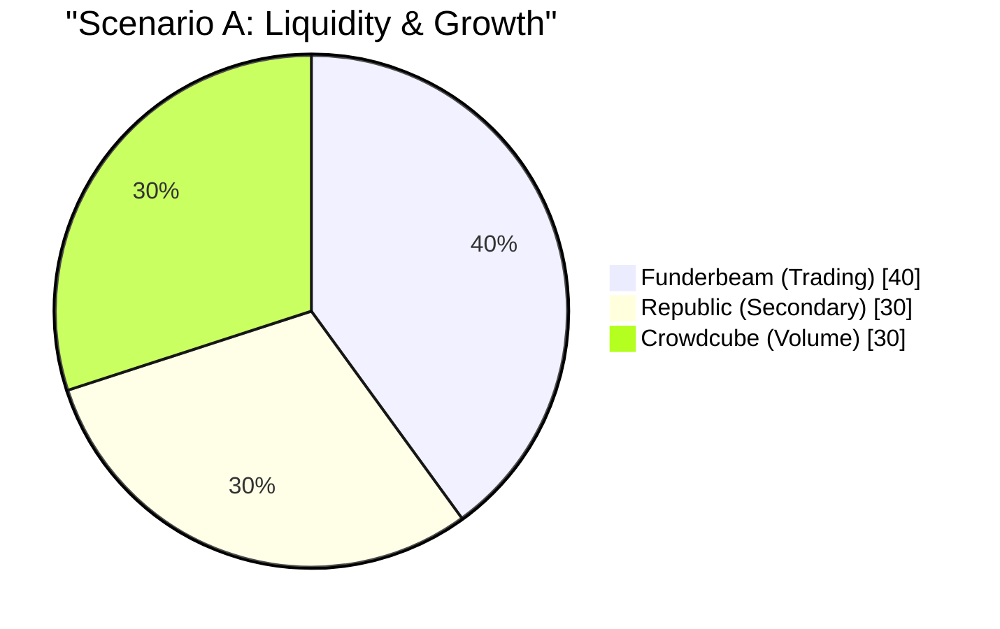
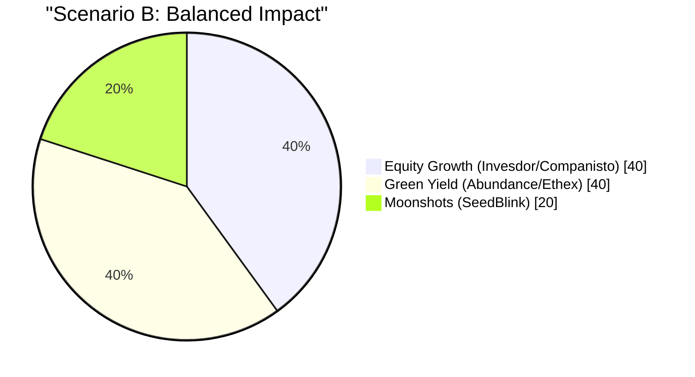
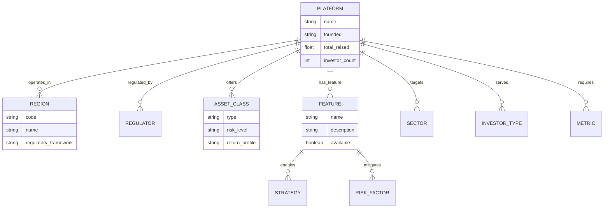
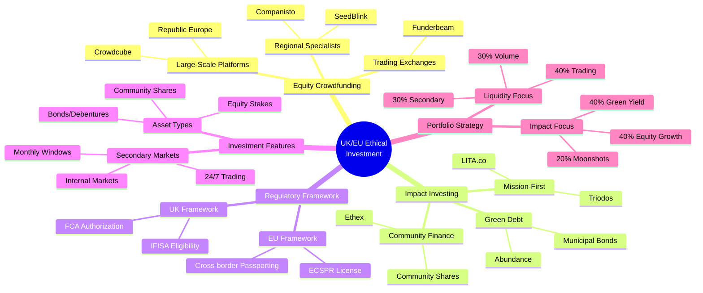

# Semantic Graph: UK/EU Ethical Investment Platforms

[Home](../../../../README.md) / [By Topic](../../../README.md) / [3rd Party Content](../../README.md) / [UK/EU Investment Platforms](README.md) / **Semantic Graph**

---

## Summary

This document maps the knowledge structure of UK and EU investment platforms serving ethical, sustainable, and mission-driven startups. It covers the dual-engine ecosystem of high-growth equity crowdfunding and deep impact debt instruments, regulatory frameworks (FCA, ECSPR), secondary market mechanisms, and portfolio construction strategies for deploying approximately 20,000 GBP into values-aligned ventures.

---

## Key Concepts

| Concept | Definition | Importance |
|---------|------------|------------|
| **Equity Crowdfunding** | Investment model allowing retail investors to purchase shares in early-stage companies through regulated platforms | Primary mechanism for accessing startup equity |
| **Impact Investing** | Investment strategy targeting measurable social/environmental outcomes alongside financial returns | Core philosophy for ethical capital deployment |
| **Secondary Market** | Trading venue where investors can buy/sell private company shares before an IPO or acquisition | Critical for liquidity in illiquid startup investments |
| **ECSPR** | European Crowdfunding Service Providers Regulation enabling cross-border crowdfunding up to 5M EUR | Regulatory enabler for pan-European investing |
| **FCA Authorization** | UK Financial Conduct Authority approval required for investment platforms | Regulatory compliance indicator for UK platforms |
| **Nominee Structure** | Legal arrangement where platform holds shares on behalf of investors | Simplifies cap table management for startups |
| **ESG Criteria** | Environmental, Social, and Governance factors used to evaluate investments | Framework for assessing ethical alignment |
| **Community Shares** | Withdrawable share capital issued by community benefit societies | UK-specific instrument for social enterprises |
| **Green Bonds** | Debt instruments financing environmental/climate projects | Fixed-income route to sustainable investment |
| **Dual-Engine Model** | Framework distinguishing high-growth equity from deep impact debt investments | Strategic allocation concept |

---

## Core Arguments

1. **Market Maturation**: The European ethical investment ecosystem has matured into a dual-engine market combining high-growth equity platforms with deep impact debt instruments, enabled by regulatory harmonization (ECSPR) and secondary market innovation.

2. **Liquidity Evolution**: Secondary markets are transforming startup investing from illiquid long-term commitments to more flexible positions, with platforms like Funderbeam offering 24/7 trading and Seedrs/Republic providing monthly windows.

3. **Mission-Profit Alignment**: Successful cases like Fairphone demonstrate that ethical missions and financial returns can coexist, with early investors achieving both social impact and profitable exits.

4. **Regulatory Framework**: The combination of UK FCA regulation and EU ECSPR licensing provides investor protections while enabling cross-border capital flows for sustainable ventures.

5. **Diversification Imperative**: The high-risk nature of startup investing necessitates strict diversification rules (max 10% per company) across multiple platforms and asset types.

---

## Key Quotes

> "The European ecosystem has matured into a dual-engine market for retail capital" - emphasizing the structural evolution of impact investing infrastructure.

> "Diversify. No more than 10% (2k GBP) in any single company" - the golden rule for portfolio construction in high-risk startup investing.

> "Principles and profit can now coexist in the same portfolio" - affirming the viability of values-aligned investment strategies.

---

## Tags

`impact-investing` `equity-crowdfunding` `sustainable-finance` `ESG` `ethical-investment` `startup-funding` `secondary-markets` `ECSPR` `FCA-regulated` `green-bonds` `community-finance` `venture-capital` `UK-investment` `EU-investment` `portfolio-construction` `social-enterprise` `renewable-energy` `fintech` `crowdfunding-platforms`

---

## Search Phrases

- "UK ethical investment platforms for startups"
- "EU equity crowdfunding sustainable companies"
- "Secondary market for private company shares Europe"
- "Impact investing platforms UK EU regulated"
- "ESG crowdfunding minimum investment"
- "Crowdcube vs Seedrs comparison"
- "Funderbeam trading private equity"
- "Community bonds social housing UK"
- "ECSPR regulated crowdfunding platforms"
- "Green bonds retail investors UK"

---

## Metadata

| Field | Value |
|-------|-------|
| **Domain** | Finance / Impact Investing |
| **Sub-domain** | Equity Crowdfunding, Sustainable Finance |
| **Geographic Scope** | United Kingdom, European Union |
| **Temporal Context** | 2024-2025 |
| **Audience** | Retail investors, Impact-focused individuals |
| **Complexity Level** | Intermediate |
| **Data Currency** | Current as of January 2025 |
| **Regulatory Context** | FCA (UK), ECSPR (EU) |

---

## Related Content

| Topic | Relationship | Description |
|-------|--------------|-------------|
| Venture Capital | Parent Category | Institutional equivalent of equity crowdfunding |
| ESG Reporting | Related Framework | Standards for measuring impact metrics |
| Fintech Regulation | Regulatory Context | Broader framework governing platform operations |
| Climate Finance | Sector Focus | Major theme across impact platforms |
| Social Enterprise | Investment Target | Common entity type on ethical platforms |
| Community Energy | Sector Example | Frequent offering on UK impact platforms |
| Open Source Business | Mission Alignment | Potential alignment with sovereignty principles |

---

## Visual Diagrams

### Platform Ecosystem Overview



### Investment Decision Flow



### Portfolio Allocation Scenarios





---

## Ontology

### Node Types

| Node Type | Description | Examples | Count |
|-----------|-------------|----------|-------|
| **Platform** | Investment crowdfunding service provider | Crowdcube, Republic, Funderbeam | 10 |
| **Regulator** | Governmental oversight body | FCA, ECSPR authorities | 2 |
| **Asset_Class** | Type of financial instrument | Equity, Debt, Community Shares | 4 |
| **Region** | Geographic operating area | UK, EU, DE, FR, FI, NL | 8 |
| **Feature** | Platform capability | Secondary Market, Nominee Structure | 6 |
| **Sector** | Investment focus area | Renewable Energy, Social Housing | 7 |
| **Investor_Type** | Category of investor | Retail, HNW, Institutional | 3 |
| **Strategy** | Investment approach | Liquidity-focused, Impact-first | 4 |
| **Metric** | Performance measure | Min Investment, Returns, Volume | 5 |
| **Risk_Factor** | Investment consideration | Failure Rate, Liquidity Risk | 4 |

### Predicates

| Predicate | Domain | Range | Description |
|-----------|--------|-------|-------------|
| `operates_in` | Platform | Region | Geographic coverage |
| `regulated_by` | Platform | Regulator | Oversight relationship |
| `offers` | Platform | Asset_Class | Investment types available |
| `has_feature` | Platform | Feature | Platform capabilities |
| `targets` | Platform | Sector | Investment focus areas |
| `serves` | Platform | Investor_Type | Audience accessibility |
| `requires` | Platform | Metric | Minimum investment threshold |
| `provides` | Platform | Metric | Returns or yield range |
| `enables` | Feature | Strategy | Capability-strategy link |
| `mitigates` | Feature | Risk_Factor | Risk reduction relationship |

### Ontology Diagram



---

## Taxonomy

### Mind Map



### ASCII Taxonomy Tree

```
UK/EU Ethical Investment Platforms
|
+-- EQUITY CROWDFUNDING PLATFORMS
|   |
|   +-- Large-Scale (Volume Leaders)
|   |   +-- Crowdcube [UK/EU] - 1.5B+ raised, 1,800+ campaigns
|   |   +-- Republic Europe [UK/EU] - 1.2B+ raised, 2,500+ startups
|   |
|   +-- Regional Powerhouses
|   |   +-- Companisto [DE/DACH] - 309M EUR, sustainability focus
|   |   +-- SeedBlink [RO/EU] - 200M+ EUR, tech-focused
|   |
|   +-- Trading Exchanges
|       +-- Funderbeam [EE/UK] - 24/7 secondary market
|
+-- IMPACT & DEBT PLATFORMS
|   |
|   +-- Community Finance [UK]
|   |   +-- Ethex - 120M+ raised, community shares/bonds
|   |   +-- Abundance - 140M+ raised, green bonds
|   |
|   +-- Mission-First [EU]
|   |   +-- LITA.co [FR/BE] - 150M+ EUR, curated impact
|   |   +-- Triodos [UK/NL] - Ethical bank backed
|   |
|   +-- Hybrid Platforms
|       +-- Invesdor/OnePlanetCrowd [FI/NL] - 565M+ EUR mobilized
|
+-- REGULATORY FRAMEWORKS
|   |
|   +-- UK Regulation
|   |   +-- FCA Authorized (Crowdcube, Abundance)
|   |   +-- FCA Exempt (Ethex - community shares)
|   |
|   +-- EU Regulation
|       +-- ECSPR Licensed (Republic, SeedBlink, LITA)
|       +-- Cross-border passporting enabled
|
+-- SECONDARY MARKET FEATURES
|   |
|   +-- Continuous Trading
|   |   +-- Funderbeam - 24/7 marketplace
|   |
|   +-- Periodic Windows
|   |   +-- Republic/Seedrs - Monthly trading
|   |   +-- Crowdcube/Semper - Controlled market
|   |
|   +-- Internal Markets
|   |   +-- Companisto - Registered investors only
|   |
|   +-- No Secondary Market
|       +-- Abundance, Ethex, LITA, Triodos
|
+-- INVESTMENT SECTORS
    |
    +-- Technology & Innovation
    |   +-- Fintech, AI, Software, Medtech
    |
    +-- Renewable Energy
    |   +-- Solar, Wind, Tidal, Community Energy
    |
    +-- Social Enterprise
    |   +-- Social Housing, Healthcare, Education
    |
    +-- Sustainable Products
        +-- Ethical Consumer, Circular Economy, Organic
```

---

## Knowledge Graph

### Visual Knowledge Graph

```mermaid
graph TB
    subgraph Platforms
        CC[Crowdcube]
        RE[Republic Europe]
        FB[Funderbeam]
        CO[Companisto]
        SB[SeedBlink]
        AB[Abundance]
        ET[Ethex]
        LI[LITA.co]
        TR[Triodos]
        IV[Invesdor]
    end

    subgraph Regions
        UK[United Kingdom]
        EU[European Union]
        DE[Germany]
        FR[France]
        FI[Finland]
        NL[Netherlands]
        EE[Estonia]
        RO[Romania]
    end

    subgraph Assets
        EQ[Equity]
        DB[Debt/Bonds]
        CS[Community Shares]
        MX[Mixed]
    end

    subgraph Features
        SM[Secondary Market]
        NOM[Nominee Structure]
        ISA[IFISA Eligible]
    end

    subgraph Regulators
        FCA[FCA]
        ECSPR[ECSPR]
    end

    CC -->|operates_in| UK
    CC -->|operates_in| EU
    CC -->|offers| EQ
    CC -->|has_feature| SM
    CC -->|regulated_by| FCA

    RE -->|operates_in| UK
    RE -->|operates_in| EU
    RE -->|offers| EQ
    RE -->|has_feature| SM
    RE -->|has_feature| NOM
    RE -->|regulated_by| ECSPR

    FB -->|operates_in| EE
    FB -->|operates_in| UK
    FB -->|offers| EQ
    FB -->|has_feature| SM

    CO -->|operates_in| DE
    CO -->|offers| EQ
    CO -->|has_feature| SM
    CO -->|regulated_by| ECSPR

    SB -->|operates_in| RO
    SB -->|operates_in| EU
    SB -->|offers| EQ
    SB -->|has_feature| SM
    SB -->|regulated_by| ECSPR

    AB -->|operates_in| UK
    AB -->|offers| DB
    AB -->|has_feature| ISA
    AB -->|regulated_by| FCA

    ET -->|operates_in| UK
    ET -->|offers| CS
    ET -->|offers| DB
    ET -->|has_feature| ISA

    LI -->|operates_in| FR
    LI -->|offers| MX
    LI -->|regulated_by| ECSPR

    TR -->|operates_in| UK
    TR -->|operates_in| NL
    TR -->|offers| DB

    IV -->|operates_in| FI
    IV -->|operates_in| NL
    IV -->|offers| MX
    IV -->|regulated_by| ECSPR
```



### Nodes Table

| ID | Label | Type | Properties |
|----|-------|------|------------|
| P01 | Crowdcube | Platform | founded: 2011, raised: 1.5B GBP, campaigns: 1800+, min_invest: 10 GBP |
| P02 | Republic Europe | Platform | founded: 2012, raised: 1.2B GBP, startups: 2500+, min_invest: 10 GBP |
| P03 | Funderbeam | Platform | founded: 2013, investors: 25000, trading_volume: 16M EUR/year |
| P04 | Companisto | Platform | founded: 2011, raised: 309M EUR, investors: 179000, min_invest: 5 EUR |
| P05 | SeedBlink | Platform | founded: 2020, raised: 200M+ EUR, startups: 200+, min_invest: 2500 EUR |
| P06 | Abundance | Platform | founded: 2012, raised: 140M GBP, projects: 45+, min_invest: 5 GBP |
| P07 | Ethex | Platform | founded: 2013, raised: 120M GBP, projects: 200+, investors: 25000 |
| P08 | LITA.co | Platform | founded: 2014, raised: 150M EUR, campaigns: 300+, min_invest: 100 EUR |
| P09 | Triodos | Platform | founded: 2018, min_invest: 50 GBP, returns: 4-5% |
| P10 | Invesdor | Platform | founded: 2012, mobilized: 565M EUR, min_invest: 100 EUR |
| R01 | UK | Region | framework: FCA, currency: GBP |
| R02 | EU | Region | framework: ECSPR, currency: EUR |
| R03 | Germany | Region | framework: ECSPR, currency: EUR |
| R04 | France | Region | framework: ECSPR, currency: EUR |
| R05 | Finland | Region | framework: ECSPR, currency: EUR |
| R06 | Netherlands | Region | framework: ECSPR, currency: EUR |
| R07 | Estonia | Region | framework: ECSPR, currency: EUR |
| R08 | Romania | Region | framework: ECSPR, currency: EUR |
| A01 | Equity | Asset_Class | risk: high, return: variable, liquidity: low-medium |
| A02 | Debt/Bonds | Asset_Class | risk: low-medium, return: 3-9%, liquidity: low |
| A03 | Community Shares | Asset_Class | risk: medium, return: ~5%, liquidity: low |
| A04 | Mixed | Asset_Class | risk: variable, return: variable |
| F01 | Secondary Market | Feature | benefit: liquidity, availability: varies |
| F02 | Nominee Structure | Feature | benefit: simplified governance |
| F03 | IFISA Eligible | Feature | benefit: tax-free returns |
| G01 | FCA | Regulator | jurisdiction: UK, type: financial_conduct |
| G02 | ECSPR | Regulator | jurisdiction: EU, max_raise: 5M EUR |

### Edges Table

| Source | Predicate | Target | Properties |
|--------|-----------|--------|------------|
| P01 | operates_in | R01 | primary: true |
| P01 | operates_in | R02 | via: Barcelona office |
| P01 | offers | A01 | primary: true |
| P01 | has_feature | F01 | via: Semper acquisition |
| P01 | regulated_by | G01 | status: authorized |
| P02 | operates_in | R01 | primary: true |
| P02 | operates_in | R02 | via: Dublin office |
| P02 | offers | A01 | primary: true |
| P02 | has_feature | F01 | type: monthly_windows |
| P02 | has_feature | F02 | structure: nominee |
| P02 | regulated_by | G02 | status: licensed |
| P03 | operates_in | R07 | primary: true |
| P03 | operates_in | R01 | expanded: true |
| P03 | offers | A01 | primary: true |
| P03 | has_feature | F01 | type: 24/7_trading |
| P04 | operates_in | R03 | primary: true |
| P04 | offers | A01 | primary: true |
| P04 | has_feature | F01 | type: internal_market |
| P04 | regulated_by | G02 | status: compliant |
| P05 | operates_in | R08 | primary: true |
| P05 | operates_in | R02 | expanded: true |
| P05 | offers | A01 | primary: true |
| P05 | has_feature | F01 | type: new_system |
| P05 | regulated_by | G02 | status: licensed |
| P06 | operates_in | R01 | primary: true |
| P06 | offers | A02 | primary: true |
| P06 | has_feature | F03 | eligible: true |
| P06 | regulated_by | G01 | status: first_authorized |
| P07 | operates_in | R01 | primary: true |
| P07 | offers | A03 | primary: true |
| P07 | offers | A02 | secondary: true |
| P07 | has_feature | F03 | eligible: true |
| P08 | operates_in | R04 | primary: true |
| P08 | offers | A04 | mixed: equity_and_debt |
| P08 | regulated_by | G02 | status: compliant |
| P09 | operates_in | R01 | primary: true |
| P09 | operates_in | R06 | bank_origin: true |
| P09 | offers | A02 | primary: true |
| P10 | operates_in | R05 | primary: true |
| P10 | operates_in | R06 | merged: OnePlanetCrowd |
| P10 | offers | A04 | mixed: equity_and_bonds |
| P10 | regulated_by | G02 | status: licensed |

---

## Cypher Import

```cypher
// =====================================================
// UK/EU ETHICAL INVESTMENT PLATFORMS - KNOWLEDGE GRAPH
// Cypher Import Script for Neo4j
// =====================================================

// Clear existing data (optional - use with caution)
// MATCH (n) DETACH DELETE n;

// -----------------------------------------------------
// CREATE CONSTRAINTS AND INDEXES
// -----------------------------------------------------

CREATE CONSTRAINT platform_id IF NOT EXISTS FOR (p:Platform) REQUIRE p.id IS UNIQUE;
CREATE CONSTRAINT region_code IF NOT EXISTS FOR (r:Region) REQUIRE r.code IS UNIQUE;
CREATE CONSTRAINT asset_type IF NOT EXISTS FOR (a:AssetClass) REQUIRE a.type IS UNIQUE;
CREATE CONSTRAINT feature_name IF NOT EXISTS FOR (f:Feature) REQUIRE f.name IS UNIQUE;
CREATE CONSTRAINT regulator_id IF NOT EXISTS FOR (g:Regulator) REQUIRE g.id IS UNIQUE;

// -----------------------------------------------------
// CREATE PLATFORM NODES
// -----------------------------------------------------

CREATE (p:Platform {
  id: 'P01',
  name: 'Crowdcube',
  founded: 2011,
  total_raised: 1500000000,
  currency: 'GBP',
  campaigns: 1800,
  investors: 2000000,
  min_invest: 10,
  headquarters: 'UK',
  eu_office: 'Barcelona'
});

CREATE (p:Platform {
  id: 'P02',
  name: 'Republic Europe',
  former_name: 'Seedrs',
  founded: 2012,
  total_raised: 1200000000,
  currency: 'GBP',
  startups: 2500,
  min_invest: 10,
  headquarters: 'UK',
  eu_office: 'Dublin'
});

CREATE (p:Platform {
  id: 'P03',
  name: 'Funderbeam',
  founded: 2013,
  verified_investors: 25000,
  total_users: 80000,
  trading_volume_annual: 16000000,
  currency: 'EUR',
  listed_companies: 63,
  countries: 11,
  headquarters: 'Estonia'
});

CREATE (p:Platform {
  id: 'P04',
  name: 'Companisto',
  founded: 2011,
  total_raised: 309000000,
  currency: 'EUR',
  investors: 179000,
  startups: 300,
  min_invest: 5,
  headquarters: 'Germany',
  focus: 'sustainability and social impact'
});

CREATE (p:Platform {
  id: 'P05',
  name: 'SeedBlink',
  founded: 2020,
  total_raised: 200000000,
  currency: 'EUR',
  startups: 200,
  min_invest: 2500,
  headquarters: 'Romania',
  focus: 'high-growth tech'
});

CREATE (p:Platform {
  id: 'P06',
  name: 'Abundance Investment',
  founded: 2012,
  total_raised: 140000000,
  currency: 'GBP',
  projects: 45,
  min_invest: 5,
  headquarters: 'UK',
  focus: 'green and social investments',
  first_fca_authorized: true
});

CREATE (p:Platform {
  id: 'P07',
  name: 'Ethex',
  founded: 2013,
  total_raised: 120000000,
  currency: 'GBP',
  projects: 200,
  investors: 25000,
  headquarters: 'UK',
  structure: 'non-profit enterprise',
  focus: 'community finance'
});

CREATE (p:Platform {
  id: 'P08',
  name: 'LITA.co',
  founded: 2014,
  total_raised: 150000000,
  currency: 'EUR',
  campaigns: 300,
  investors: 30000,
  min_invest: 100,
  headquarters: 'France',
  focus: 'social and environmental mission'
});

CREATE (p:Platform {
  id: 'P09',
  name: 'Triodos Crowdfunding',
  founded: 2018,
  min_invest: 50,
  currency: 'GBP',
  returns_low: 4,
  returns_high: 5,
  headquarters: 'UK',
  parent: 'Triodos Bank',
  focus: 'positive-impact organizations'
});

CREATE (p:Platform {
  id: 'P10',
  name: 'Invesdor',
  founded: 2012,
  total_mobilized: 565000000,
  currency: 'EUR',
  min_invest: 100,
  headquarters: 'Finland',
  merged_with: 'OnePlanetCrowd',
  focus: 'sustainable entrepreneurship'
});

// -----------------------------------------------------
// CREATE REGION NODES
// -----------------------------------------------------

CREATE (r:Region {code: 'UK', name: 'United Kingdom', framework: 'FCA', currency: 'GBP'});
CREATE (r:Region {code: 'EU', name: 'European Union', framework: 'ECSPR', currency: 'EUR'});
CREATE (r:Region {code: 'DE', name: 'Germany', framework: 'ECSPR', currency: 'EUR'});
CREATE (r:Region {code: 'FR', name: 'France', framework: 'ECSPR', currency: 'EUR'});
CREATE (r:Region {code: 'FI', name: 'Finland', framework: 'ECSPR', currency: 'EUR'});
CREATE (r:Region {code: 'NL', name: 'Netherlands', framework: 'ECSPR', currency: 'EUR'});
CREATE (r:Region {code: 'EE', name: 'Estonia', framework: 'ECSPR', currency: 'EUR'});
CREATE (r:Region {code: 'RO', name: 'Romania', framework: 'ECSPR', currency: 'EUR'});
CREATE (r:Region {code: 'BE', name: 'Belgium', framework: 'ECSPR', currency: 'EUR'});

// -----------------------------------------------------
// CREATE ASSET CLASS NODES
// -----------------------------------------------------

CREATE (a:AssetClass {
  type: 'Equity',
  risk_level: 'high',
  return_profile: 'variable - capital appreciation',
  liquidity: 'low to medium'
});

CREATE (a:AssetClass {
  type: 'Debt',
  risk_level: 'low to medium',
  return_profile: 'fixed 3-9%',
  liquidity: 'low - hold to maturity'
});

CREATE (a:AssetClass {
  type: 'Community Shares',
  risk_level: 'medium',
  return_profile: 'fair return ~5%',
  liquidity: 'low - withdrawable'
});

CREATE (a:AssetClass {
  type: 'Mixed',
  risk_level: 'variable',
  return_profile: 'combined',
  liquidity: 'varies'
});

// -----------------------------------------------------
// CREATE FEATURE NODES
// -----------------------------------------------------

CREATE (f:Feature {
  name: 'Secondary Market',
  description: 'Ability to trade shares before company exit',
  benefit: 'liquidity'
});

CREATE (f:Feature {
  name: 'Nominee Structure',
  description: 'Platform holds shares on behalf of investors',
  benefit: 'simplified cap table management'
});

CREATE (f:Feature {
  name: 'IFISA Eligible',
  description: 'Innovative Finance ISA eligible investments',
  benefit: 'tax-free returns for UK taxpayers'
});

CREATE (f:Feature {
  name: '24/7 Trading',
  description: 'Continuous secondary market access',
  benefit: 'maximum liquidity'
});

CREATE (f:Feature {
  name: 'Monthly Windows',
  description: 'Periodic trading opportunities',
  benefit: 'structured liquidity'
});

CREATE (f:Feature {
  name: 'VC Co-Investment',
  description: 'Invest alongside professional VCs',
  benefit: 'institutional validation'
});

// -----------------------------------------------------
// CREATE REGULATOR NODES
// -----------------------------------------------------

CREATE (g:Regulator {
  id: 'FCA',
  name: 'Financial Conduct Authority',
  jurisdiction: 'United Kingdom',
  max_raise: 8000000,
  currency: 'GBP'
});

CREATE (g:Regulator {
  id: 'ECSPR',
  name: 'European Crowdfunding Service Providers Regulation',
  jurisdiction: 'European Union',
  max_raise: 5000000,
  currency: 'EUR',
  feature: 'cross-border passporting'
});

// -----------------------------------------------------
// CREATE SECTOR NODES
// -----------------------------------------------------

CREATE (s:Sector {name: 'Renewable Energy', examples: ['solar', 'wind', 'tidal']});
CREATE (s:Sector {name: 'Social Housing', examples: ['community housing', 'co-ops']});
CREATE (s:Sector {name: 'Technology', examples: ['fintech', 'AI', 'software']});
CREATE (s:Sector {name: 'Sustainable Products', examples: ['ethical fashion', 'organic agriculture']});
CREATE (s:Sector {name: 'Healthcare', examples: ['medtech', 'social care']});
CREATE (s:Sector {name: 'Circular Economy', examples: ['recycling', 'upcycling', 'repair']});
CREATE (s:Sector {name: 'Community Energy', examples: ['solar co-ops', 'wind farms']});

// -----------------------------------------------------
// CREATE RELATIONSHIPS - OPERATES_IN
// -----------------------------------------------------

MATCH (p:Platform {id: 'P01'}), (r:Region {code: 'UK'})
CREATE (p)-[:OPERATES_IN {primary: true}]->(r);

MATCH (p:Platform {id: 'P01'}), (r:Region {code: 'EU'})
CREATE (p)-[:OPERATES_IN {via: 'Barcelona office', since: 2023}]->(r);

MATCH (p:Platform {id: 'P02'}), (r:Region {code: 'UK'})
CREATE (p)-[:OPERATES_IN {primary: true}]->(r);

MATCH (p:Platform {id: 'P02'}), (r:Region {code: 'EU'})
CREATE (p)-[:OPERATES_IN {via: 'Dublin office', since: 2023}]->(r);

MATCH (p:Platform {id: 'P03'}), (r:Region {code: 'EE'})
CREATE (p)-[:OPERATES_IN {primary: true}]->(r);

MATCH (p:Platform {id: 'P03'}), (r:Region {code: 'UK'})
CREATE (p)-[:OPERATES_IN {expanded: true}]->(r);

MATCH (p:Platform {id: 'P04'}), (r:Region {code: 'DE'})
CREATE (p)-[:OPERATES_IN {primary: true, coverage: 'DACH region'}]->(r);

MATCH (p:Platform {id: 'P05'}), (r:Region {code: 'RO'})
CREATE (p)-[:OPERATES_IN {primary: true}]->(r);

MATCH (p:Platform {id: 'P05'}), (r:Region {code: 'EU'})
CREATE (p)-[:OPERATES_IN {expanded: true, ecspr_licensed: true}]->(r);

MATCH (p:Platform {id: 'P06'}), (r:Region {code: 'UK'})
CREATE (p)-[:OPERATES_IN {primary: true}]->(r);

MATCH (p:Platform {id: 'P07'}), (r:Region {code: 'UK'})
CREATE (p)-[:OPERATES_IN {primary: true}]->(r);

MATCH (p:Platform {id: 'P08'}), (r:Region {code: 'FR'})
CREATE (p)-[:OPERATES_IN {primary: true}]->(r);

MATCH (p:Platform {id: 'P08'}), (r:Region {code: 'BE'})
CREATE (p)-[:OPERATES_IN {expanded: true}]->(r);

MATCH (p:Platform {id: 'P09'}), (r:Region {code: 'UK'})
CREATE (p)-[:OPERATES_IN {primary: true}]->(r);

MATCH (p:Platform {id: 'P09'}), (r:Region {code: 'NL'})
CREATE (p)-[:OPERATES_IN {bank_origin: true}]->(r);

MATCH (p:Platform {id: 'P10'}), (r:Region {code: 'FI'})
CREATE (p)-[:OPERATES_IN {primary: true}]->(r);

MATCH (p:Platform {id: 'P10'}), (r:Region {code: 'NL'})
CREATE (p)-[:OPERATES_IN {merged: 'OnePlanetCrowd'}]->(r);

// -----------------------------------------------------
// CREATE RELATIONSHIPS - OFFERS
// -----------------------------------------------------

MATCH (p:Platform {id: 'P01'}), (a:AssetClass {type: 'Equity'})
CREATE (p)-[:OFFERS {primary: true}]->(a);

MATCH (p:Platform {id: 'P02'}), (a:AssetClass {type: 'Equity'})
CREATE (p)-[:OFFERS {primary: true}]->(a);

MATCH (p:Platform {id: 'P03'}), (a:AssetClass {type: 'Equity'})
CREATE (p)-[:OFFERS {primary: true}]->(a);

MATCH (p:Platform {id: 'P04'}), (a:AssetClass {type: 'Equity'})
CREATE (p)-[:OFFERS {primary: true}]->(a);

MATCH (p:Platform {id: 'P05'}), (a:AssetClass {type: 'Equity'})
CREATE (p)-[:OFFERS {primary: true}]->(a);

MATCH (p:Platform {id: 'P06'}), (a:AssetClass {type: 'Debt'})
CREATE (p)-[:OFFERS {primary: true, includes: 'green bonds, debentures'}]->(a);

MATCH (p:Platform {id: 'P07'}), (a:AssetClass {type: 'Community Shares'})
CREATE (p)-[:OFFERS {primary: true}]->(a);

MATCH (p:Platform {id: 'P07'}), (a:AssetClass {type: 'Debt'})
CREATE (p)-[:OFFERS {secondary: true, type: 'bonds'}]->(a);

MATCH (p:Platform {id: 'P08'}), (a:AssetClass {type: 'Mixed'})
CREATE (p)-[:OFFERS {includes: 'equity and crowd bonds'}]->(a);

MATCH (p:Platform {id: 'P09'}), (a:AssetClass {type: 'Debt'})
CREATE (p)-[:OFFERS {primary: true, includes: 'bonds and shares'}]->(a);

MATCH (p:Platform {id: 'P10'}), (a:AssetClass {type: 'Mixed'})
CREATE (p)-[:OFFERS {includes: 'equity and bonds/loans'}]->(a);

// -----------------------------------------------------
// CREATE RELATIONSHIPS - REGULATED_BY
// -----------------------------------------------------

MATCH (p:Platform {id: 'P01'}), (g:Regulator {id: 'FCA'})
CREATE (p)-[:REGULATED_BY {status: 'authorized'}]->(g);

MATCH (p:Platform {id: 'P02'}), (g:Regulator {id: 'ECSPR'})
CREATE (p)-[:REGULATED_BY {status: 'licensed', since: 2023}]->(g);

MATCH (p:Platform {id: 'P04'}), (g:Regulator {id: 'ECSPR'})
CREATE (p)-[:REGULATED_BY {status: 'compliant'}]->(g);

MATCH (p:Platform {id: 'P05'}), (g:Regulator {id: 'ECSPR'})
CREATE (p)-[:REGULATED_BY {status: 'licensed'}]->(g);

MATCH (p:Platform {id: 'P06'}), (g:Regulator {id: 'FCA'})
CREATE (p)-[:REGULATED_BY {status: 'first_authorized_crowdfunding', since: 2012}]->(g);

MATCH (p:Platform {id: 'P08'}), (g:Regulator {id: 'ECSPR'})
CREATE (p)-[:REGULATED_BY {status: 'compliant'}]->(g);

MATCH (p:Platform {id: 'P10'}), (g:Regulator {id: 'ECSPR'})
CREATE (p)-[:REGULATED_BY {status: 'licensed'}]->(g);

// Note: Ethex (P07) is exempt from FCA regulation due to community shares niche

// -----------------------------------------------------
// CREATE RELATIONSHIPS - HAS_FEATURE
// -----------------------------------------------------

MATCH (p:Platform {id: 'P01'}), (f:Feature {name: 'Secondary Market'})
CREATE (p)-[:HAS_FEATURE {via: 'Semper acquisition', since: 2023, type: 'controlled'}]->(f);

MATCH (p:Platform {id: 'P02'}), (f:Feature {name: 'Secondary Market'})
CREATE (p)-[:HAS_FEATURE {type: 'monthly_windows', first_uk: true}]->(f);

MATCH (p:Platform {id: 'P02'}), (f:Feature {name: 'Nominee Structure'})
CREATE (p)-[:HAS_FEATURE]->(f);

MATCH (p:Platform {id: 'P03'}), (f:Feature {name: '24/7 Trading'})
CREATE (p)-[:HAS_FEATURE {continuous: true}]->(f);

MATCH (p:Platform {id: 'P04'}), (f:Feature {name: 'Secondary Market'})
CREATE (p)-[:HAS_FEATURE {type: 'internal', for: 'registered investors'}]->(f);

MATCH (p:Platform {id: 'P05'}), (f:Feature {name: 'Secondary Market'})
CREATE (p)-[:HAS_FEATURE {status: 'new', scaling: true}]->(f);

MATCH (p:Platform {id: 'P05'}), (f:Feature {name: 'VC Co-Investment'})
CREATE (p)-[:HAS_FEATURE]->(f);

MATCH (p:Platform {id: 'P06'}), (f:Feature {name: 'IFISA Eligible'})
CREATE (p)-[:HAS_FEATURE]->(f);

MATCH (p:Platform {id: 'P07'}), (f:Feature {name: 'IFISA Eligible'})
CREATE (p)-[:HAS_FEATURE]->(f);

// -----------------------------------------------------
// CREATE RELATIONSHIPS - TARGETS (Sectors)
// -----------------------------------------------------

MATCH (p:Platform {id: 'P06'}), (s:Sector {name: 'Renewable Energy'})
CREATE (p)-[:TARGETS {focus: 'net zero economy'}]->(s);

MATCH (p:Platform {id: 'P06'}), (s:Sector {name: 'Community Energy'})
CREATE (p)-[:TARGETS {includes: 'municipal bonds'}]->(s);

MATCH (p:Platform {id: 'P07'}), (s:Sector {name: 'Social Housing'})
CREATE (p)-[:TARGETS]->(s);

MATCH (p:Platform {id: 'P07'}), (s:Sector {name: 'Community Energy'})
CREATE (p)-[:TARGETS]->(s);

MATCH (p:Platform {id: 'P08'}), (s:Sector {name: 'Sustainable Products'})
CREATE (p)-[:TARGETS {includes: 'organic agriculture, ethical fashion'}]->(s);

MATCH (p:Platform {id: 'P10'}), (s:Sector {name: 'Renewable Energy'})
CREATE (p)-[:TARGETS {strong_uptick: true}]->(s);

MATCH (p:Platform {id: 'P10'}), (s:Sector {name: 'Circular Economy'})
CREATE (p)-[:TARGETS]->(s);

MATCH (p:Platform {id: 'P05'}), (s:Sector {name: 'Technology'})
CREATE (p)-[:TARGETS {focus: 'AI, Software, Fintech'}]->(s);

// -----------------------------------------------------
// SAMPLE QUERIES
// -----------------------------------------------------

// Find all platforms with secondary markets
// MATCH (p:Platform)-[:HAS_FEATURE]->(f:Feature)
// WHERE f.name CONTAINS 'Secondary' OR f.name CONTAINS 'Trading'
// RETURN p.name, f.name;

// Find platforms operating in UK with equity offerings
// MATCH (p:Platform)-[:OPERATES_IN]->(r:Region {code: 'UK'})
// MATCH (p)-[:OFFERS]->(a:AssetClass {type: 'Equity'})
// RETURN p.name, p.min_invest;

// Find impact-focused platforms
// MATCH (p:Platform)-[:TARGETS]->(s:Sector)
// WHERE s.name IN ['Renewable Energy', 'Social Housing', 'Circular Economy']
// RETURN p.name, collect(s.name) as sectors;

// Find regulatory coverage
// MATCH (p:Platform)-[:REGULATED_BY]->(g:Regulator)
// RETURN p.name, g.id, g.jurisdiction;
```

---

*Generated: January 2025 | Document Version: 1.0*
