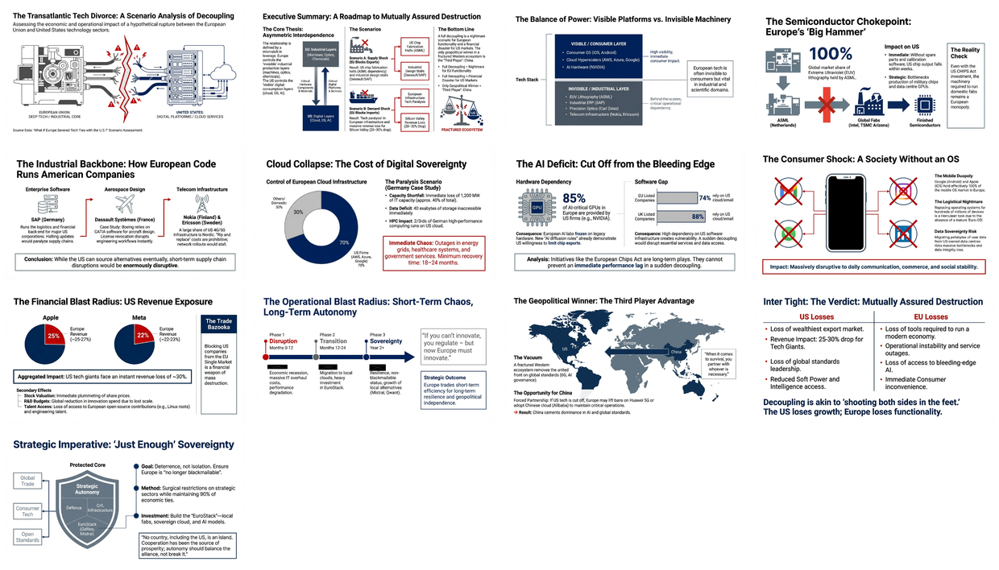

# What if Europe Severed Tech Ties with the U.S.?

[🏠 Home](../../../README.md) / [By Topic](../../README.md) / [3rd Party Content](../README.md) / **Transatlantic Tech Divorce**

---

## Overview

A comprehensive scenario analysis exploring the hypothetical "tech divorce" between Europe and the United States. The document examines two angles: (A) Europe cutting off U.S. access to European technology (ASML, Nokia/Ericsson, SAP), and (B) Europe halting its own use of U.S. technology (cloud services, semiconductors, software). Both scenarios reveal deep interdependencies and would cause significant economic damage to both sides, with China potentially emerging as the primary beneficiary.

---

## Infographic

---

## Slide Deck

*Click the mosaic above to view the full 13-slide presentation (PDF)*

---

## Semantic Knowledge Graph

For detailed concept mapping, relationships, and exportable graph data, see:

**[SEMANTIC-GRAPH.md](SEMANTIC-GRAPH.md)** - Contains Mermaid diagrams, concept taxonomy, and Cypher export for Neo4j integration.

---

## Key Scenarios

| Scenario | Description | Primary Leverage |
|----------|-------------|------------------|
| **A: EU Cuts Off U.S.** | Europe blocks U.S. access to European tech | ASML (EUV lithography), Nokia/Ericsson (5G), SAP |
| **B: EU Stops Using U.S. Tech** | Europe phases out American technology | 70% cloud dependency, 85% AI GPUs, 100% mobile OS |

---

## Critical Dependencies

### Europe's Leverage Over the U.S.

| Asset | Owner | Impact if Withheld |
|-------|-------|-------------------|
| **EUV Lithography** | ASML (Netherlands) | U.S. chip production halts within weeks |
| **5G Infrastructure** | Nokia (Finland), Ericsson (Sweden) | U.S. telecom rollouts disrupted |
| **Enterprise Software** | SAP (Germany), Dassault, Siemens | U.S. industrial/logistics paralysis |
| **Internal Market** | EU | ~25-30% revenue loss for Big Tech |

### U.S. Leverage Over Europe

| Asset | Providers | Europe's Dependency |
|-------|-----------|---------------------|
| **Cloud Computing** | AWS, Azure, Google Cloud | 70% of EU cloud infrastructure |
| **AI Hardware** | NVIDIA, Intel, AMD | 85% of AI-critical GPUs |
| **Operating Systems** | Google, Apple, Microsoft | ~100% of mobile OS market |
| **Enterprise Software** | Microsoft, Salesforce, Adobe | 74% of EU companies use U.S. tech |

---

## Key Statistics

| Metric | Value | Source |
|--------|-------|--------|
| EU cloud controlled by U.S. firms | 70% | Silicon Saxony |
| AI GPUs from U.S. providers | 85% | ECFR |
| Apple revenue from Europe | 25-27% | Bullfincher |
| Meta revenue from Europe | 22-23% | Nasdaq |
| EU companies using U.S. tech | 74% | Proton |
| German data center shortfall if cut off | 1,200 MW (40%) | Silicon Saxony |

---

## Source Information

| Property | Value |
|----------|-------|
| **Source File** | [What if Europe Severed Tech Ties with the U.S.?](./What%20if%20Europe%20Severed%20Tech%20Ties%20with%20the%20U.S._.pdf) (8 pages) |
| **Infographic** | [Transatlantic Tech Rift - Digital Divorce](./27%20Jan%20-%20Transatlantic%20Tech%20Rift%20-%20Digital%20Divorce.jpg) |
| **Slide Deck** | [Transatlantic Tech Divorce Scenario Analysis](./27%20Jan%20-%20Transatlantic_Tech_Divorce_Scenario_Analysis.pdf) (13 slides) |
| **Date** | January 2026 |
| **Author** | ChatGPT (synthesizing multiple sources) |

---

## Referenced Sources

| Source | Topic |
|--------|-------|
| Gizmodo | EU weaponizing tech against U.S. |
| NL Times | Dutch think tank ASML export restrictions |
| ECFR | European plan to escape American technology |
| Maria Sukhareva (Substack) | U.S. tech cutoff scenario |
| Silicon Saxony | European cloud infrastructure gaps |
| Proton | U.S. tech dominance in Europe |

---

## Navigation

| Direction | Link |
|-----------|------|
| ⬆️ Parent | [3rd Party Content](../README.md) |
| 🏠 Home | [Repository Root](../../../README.md) |

---

*Generated with [Google NotebookLM](https://notebooklm.google.com/) — Source document → Infographic → Slide deck*
