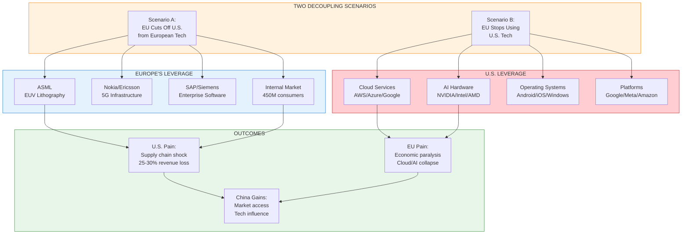
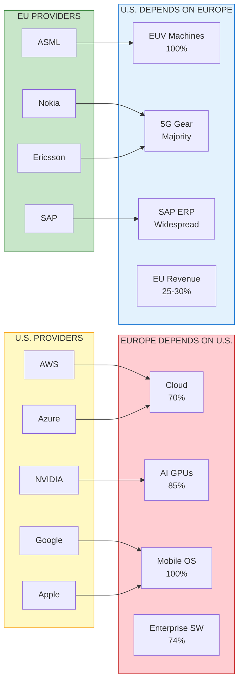
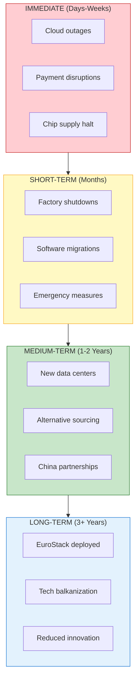
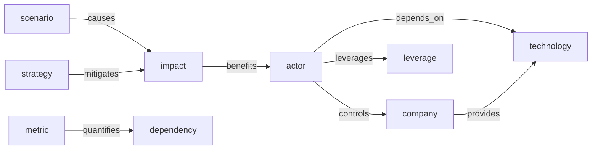
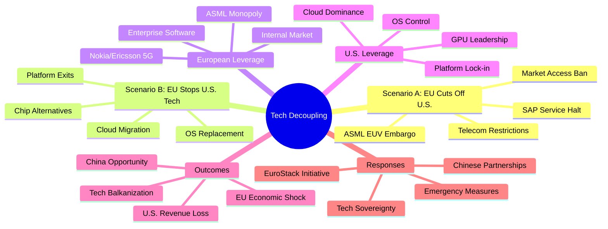
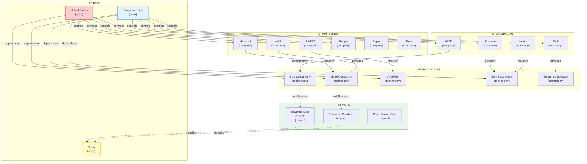

# Transatlantic Tech Divorce - Scenario Analysis

[📖 README](./README.md) · [🖼️ Infographic](./27%20Jan%20-%20Transatlantic%20Tech%20Rift%20-%20Digital%20Divorce.jpg) · [📑 Slides](./27%20Jan%20-%20Transatlantic_Tech_Divorce_Scenario_Analysis.pdf) · [🏠 Home](../../../README.md)

> *Semantic Knowledge Graph (SKG) — machine-readable metadata for search, discovery, and graph database integration*

---

## Summary

This analysis explores a hypothetical "tech divorce" between Europe and the United States, examining two scenarios: (A) Europe blocking U.S. access to European technology like ASML's EUV lithography machines, Nokia/Ericsson 5G equipment, and SAP enterprise software; and (B) Europe phasing out its dependence on U.S. technology including cloud services (70% controlled by AWS/Azure/Google), AI hardware (85% from NVIDIA), and software platforms. Both scenarios would cause severe mutual harm — Europe would face immediate paralysis and economic recession, while the U.S. would lose 25-30% of Big Tech revenue and face critical supply chain disruptions. China emerges as the likely beneficiary, potentially filling technology gaps and cementing its global tech influence. The analysis concludes that cooperation remains essential, but Europe is right to develop "just enough" tech sovereignty to avoid being "blackmailable."

---

## Key Concepts

- **Tech Sovereignty**: Europe's strategic goal to develop independent capabilities in chips, cloud, AI, and space to avoid dependency on any single foreign power.

- **ASML Leverage**: The Netherlands' ASML holds a de facto monopoly on EUV lithography machines essential for cutting-edge chips — Europe's "big hammer" that could halt U.S. chip production within weeks.

- **Cloud Dependency**: 70% of Europe's cloud infrastructure is controlled by three U.S. firms (AWS, Azure, Google Cloud), making a sudden cutoff potentially "paralyzing" for the European economy.

- **Internal Market as Weapon**: The EU's 450M+ consumer market represents 25-30% of U.S. Big Tech revenue — restricting market access could devastate Silicon Valley's bottom line.

- **EuroStack**: A proposed independent stack of European technology layers from chips to cloud to applications, ensuring Europe can survive without U.S. tech.

- **Mutual Assured Disruption**: Like nuclear deterrence, the tech interdependency means both sides would suffer catastrophically from decoupling — "shooting themselves in both feet."

---

## Core Arguments

1. **Europe is More Dependent but Not Powerless**: While Europe relies heavily on U.S. tech (70% cloud, 85% AI GPUs, 100% mobile OS), it holds critical leverage through ASML, telecom infrastructure, enterprise software, and market access.

2. **Short-Term Pain vs. Long-Term Sovereignty**: A forced decoupling would cause immediate economic chaos for Europe but could accelerate development of a self-reliant "EuroStack" over time.

3. **China as Tertius Gaudens**: Any transatlantic tech rift would benefit China, potentially giving it a "golden opportunity" to expand tech influence in Europe and cement AI dominance.

4. **Deterrence Through Capability**: Europe's goal should be building "just enough" tech capability to deter coercion, not to abandon the alliance — making it "no longer blackmailable."

5. **90% Continuity Possible**: Even in confrontation, 90% of the economy could continue normally — strategic decoupling can be surgical rather than total.

---

## Key Quotes

> "Europe could 'turn off the tap' on advanced chip production for the U.S. by leveraging ASML."

> "Losing access to American cloud services would essentially paralyze the German economy and industry."

> "Europe's two big leverage assets are our internal market and ASML."

> "No country, including the US, is an island — decoupling would be like shooting themselves in both feet."

> "When it comes to survival, you partner with whoever is necessary, even China."

> "If you can't innovate, you regulate — but now Europe must innovate because it fears regulation from abroad could cut it off."

---

## Tags

`tech-sovereignty` `transatlantic-relations` `asml` `euv-lithography` `cloud-computing` `semiconductors` `geopolitics` `trade-war` `digital-decoupling` `eurostack` `china` `big-tech` `aws` `azure` `nvidia` `nokia` `ericsson` `sap` `supply-chain` `economic-security`

---

## Search Phrases

- "Europe US tech decoupling"
- "ASML export restrictions"
- "European cloud sovereignty"
- "transatlantic tech war"
- "EU tech independence"
- "US Big Tech Europe revenue"
- "European digital sovereignty"
- "NVIDIA GPU dependency Europe"
- "EuroStack technology"
- "China benefit tech war"

---

## Semantic Knowledge Graph

### Scenario Overview (Visual)



### Technology Dependencies



### Impact Timeline



---

### Ontology

#### Node Types

| Ref | Description | Example |
|-----|-------------|---------|
| `scenario` | A hypothetical decoupling scenario | EU Cuts Off U.S. |
| `actor` | A country, region, or bloc | European Union, United States |
| `company` | A technology company | ASML, NVIDIA, AWS |
| `technology` | A technology category or asset | EUV Lithography, Cloud Computing |
| `leverage` | A strategic pressure point | Internal Market, ASML Monopoly |
| `impact` | A consequence of decoupling | Revenue Loss, Supply Chain Shock |
| `metric` | A quantitative measure | 70% cloud dependency |
| `strategy` | A policy or response approach | EuroStack, Tech Sovereignty |
| `source` | A referenced publication | ECFR Report, Silicon Saxony |

#### Predicates

| Ref | Inverse | Description |
|-----|---------|-------------|
| `controls` | `controlled_by` | Company controls technology |
| `depends_on` | `depended_by` | Actor depends on technology |
| `provides` | `provided_by` | Company provides technology |
| `causes` | `caused_by` | Scenario causes impact |
| `benefits` | `benefited_by` | Impact benefits actor |
| `mitigates` | `mitigated_by` | Strategy mitigates impact |
| `leverages` | `leveraged_by` | Actor leverages asset |
| `quantifies` | `quantified_by` | Metric quantifies dependency |
| `cites` | `cited_by` | Document cites source |



---

### Taxonomy



#### ASCII Tree

```
tech_decoupling
├── scenarios
│   ├── scenario_a_eu_cuts_off_us
│   │   ├── asml_euv_embargo
│   │   ├── telecom_restrictions
│   │   ├── sap_service_halt
│   │   └── market_access_ban
│   └── scenario_b_eu_stops_using_us_tech
│       ├── cloud_migration
│       ├── chip_alternatives
│       ├── os_replacement
│       └── platform_exits
├── european_leverage
│   ├── asml_euv_monopoly
│   ├── nokia_ericsson_5g
│   ├── sap_enterprise_software
│   └── internal_market_450m
├── us_leverage
│   ├── cloud_services_70pct
│   ├── ai_gpus_85pct
│   ├── mobile_os_100pct
│   └── enterprise_software_74pct
├── key_actors
│   ├── european_union
│   ├── united_states
│   ├── china
│   ├── asml
│   ├── nvidia
│   ├── aws_azure_google
│   └── nokia_ericsson
├── impacts
│   ├── us_revenue_loss_25_30pct
│   ├── eu_cloud_paralysis
│   ├── chip_supply_disruption
│   └── china_market_expansion
└── responses
    ├── eurostack_initiative
    ├── tech_sovereignty_strategy
    ├── chinese_partnerships
    └── emergency_nationalization
```

---

### Knowledge Graph



#### Nodes Table

| ID | Type | Name | Description |
|----|------|------|-------------|
| `european_union` | `actor` | European Union | 27-member bloc with 450M+ consumers |
| `united_states` | `actor` | United States | Primary tech provider, dependent on EU market |
| `china` | `actor` | China | Potential beneficiary of tech decoupling |
| `asml` | `company` | ASML | Dutch company, monopoly on EUV lithography |
| `nvidia` | `company` | NVIDIA | U.S. company, dominates AI GPU market |
| `aws` | `company` | Amazon Web Services | U.S. cloud provider, largest in Europe |
| `microsoft` | `company` | Microsoft | Azure cloud, Windows OS, Office 365 |
| `google` | `company` | Google | Cloud, Android OS, search, YouTube |
| `apple` | `company` | Apple | iOS, 25-27% revenue from Europe |
| `meta` | `company` | Meta | Facebook/Instagram, 22-23% revenue from Europe |
| `nokia` | `company` | Nokia | Finnish 5G equipment provider |
| `ericsson` | `company` | Ericsson | Swedish 5G equipment provider |
| `sap` | `company` | SAP | German enterprise software giant |
| `euv_lithography` | `technology` | EUV Lithography | Essential for cutting-edge chip manufacturing |
| `cloud_computing` | `technology` | Cloud Computing | AWS/Azure/Google control 70% of EU market |
| `ai_gpus` | `technology` | AI GPUs | NVIDIA dominates with 85% of EU AI chips |
| `five_g` | `technology` | 5G Infrastructure | Nokia/Ericsson supply U.S. carriers |
| `enterprise_software` | `technology` | Enterprise Software | SAP runs many U.S. corporations |
| `scenario_a` | `scenario` | EU Cuts Off U.S. | Europe blocks U.S. access to EU tech |
| `scenario_b` | `scenario` | EU Stops Using U.S. Tech | Europe phases out American technology |
| `eurostack` | `strategy` | EuroStack | Independent EU technology stack |
| `tech_sovereignty` | `strategy` | Tech Sovereignty | EU goal of technology independence |
| `revenue_loss` | `impact` | Revenue Loss | U.S. Big Tech loses 25-30% revenue |
| `economic_paralysis` | `impact` | Economic Paralysis | EU faces cloud/AI collapse |
| `china_gain` | `impact` | China Market Gain | China fills technology gaps |

#### Edges Table

| From | Predicate | To | Description |
|------|-----------|-----|-------------|
| `european_union` | `controls` | `asml` | EU has jurisdiction over ASML |
| `european_union` | `controls` | `nokia` | EU includes Finland |
| `european_union` | `controls` | `ericsson` | EU includes Sweden |
| `european_union` | `controls` | `sap` | EU includes Germany |
| `united_states` | `controls` | `nvidia` | U.S. company |
| `united_states` | `controls` | `aws` | U.S. company |
| `united_states` | `controls` | `microsoft` | U.S. company |
| `united_states` | `controls` | `google` | U.S. company |
| `united_states` | `controls` | `apple` | U.S. company |
| `united_states` | `controls` | `meta` | U.S. company |
| `asml` | `monopolizes` | `euv_lithography` | Only supplier of EUV machines |
| `nvidia` | `dominates` | `ai_gpus` | 85% of AI-critical GPUs |
| `aws` | `provides` | `cloud_computing` | Largest EU cloud provider |
| `microsoft` | `provides` | `cloud_computing` | Azure cloud services |
| `google` | `provides` | `cloud_computing` | Google Cloud Platform |
| `nokia` | `provides` | `five_g` | 5G network equipment |
| `ericsson` | `provides` | `five_g` | 5G network equipment |
| `sap` | `provides` | `enterprise_software` | ERP systems |
| `european_union` | `depends_on` | `cloud_computing` | 70% dependency on U.S. cloud |
| `european_union` | `depends_on` | `ai_gpus` | 85% dependency on U.S. GPUs |
| `united_states` | `depends_on` | `euv_lithography` | 100% dependency on ASML |
| `united_states` | `depends_on` | `five_g` | Significant dependency on Nokia/Ericsson |
| `scenario_a` | `causes` | `revenue_loss` | U.S. loses EU market access |
| `scenario_b` | `causes` | `economic_paralysis` | EU loses cloud/AI capability |
| `revenue_loss` | `benefits` | `china` | China gains market opportunity |
| `economic_paralysis` | `benefits` | `china` | China fills technology gaps |
| `eurostack` | `mitigates` | `economic_paralysis` | Long-term EU independence |
| `tech_sovereignty` | `mitigates` | `economic_paralysis` | Strategic EU goal |
| `apple` | `derives_from` | `european_union` | 25-27% of revenue |
| `meta` | `derives_from` | `european_union` | 22-23% of revenue |

---

### Cypher Import (Neo4j)

```cypher
// =====================================================
// TRANSATLANTIC TECH DIVORCE - KNOWLEDGE GRAPH IMPORT
// =====================================================

// Create Actor nodes
CREATE (eu:Actor {
    id: 'european_union',
    name: 'European Union',
    description: '27-member bloc with 450M+ consumers',
    type: 'bloc'
})
CREATE (us:Actor {
    id: 'united_states',
    name: 'United States',
    description: 'Primary tech provider, dependent on EU market',
    type: 'country'
})
CREATE (china:Actor {
    id: 'china',
    name: 'China',
    description: 'Potential beneficiary of tech decoupling',
    type: 'country'
})

// Create Company nodes - European
CREATE (asml:Company {
    id: 'asml',
    name: 'ASML',
    country: 'Netherlands',
    description: 'Monopoly on EUV lithography machines'
})
CREATE (nokia:Company {
    id: 'nokia',
    name: 'Nokia',
    country: 'Finland',
    description: '5G network equipment provider'
})
CREATE (ericsson:Company {
    id: 'ericsson',
    name: 'Ericsson',
    country: 'Sweden',
    description: '5G network equipment provider'
})
CREATE (sap:Company {
    id: 'sap',
    name: 'SAP',
    country: 'Germany',
    description: 'Enterprise software giant'
})

// Create Company nodes - American
CREATE (nvidia:Company {
    id: 'nvidia',
    name: 'NVIDIA',
    country: 'USA',
    description: 'Dominates AI GPU market'
})
CREATE (aws:Company {
    id: 'aws',
    name: 'Amazon Web Services',
    country: 'USA',
    description: 'Largest cloud provider in Europe'
})
CREATE (microsoft:Company {
    id: 'microsoft',
    name: 'Microsoft',
    country: 'USA',
    description: 'Azure cloud, Windows, Office'
})
CREATE (google:Company {
    id: 'google',
    name: 'Google',
    country: 'USA',
    description: 'Cloud, Android, search'
})
CREATE (apple:Company {
    id: 'apple',
    name: 'Apple',
    country: 'USA',
    description: '25-27% revenue from Europe',
    eu_revenue_pct: 26
})
CREATE (meta:Company {
    id: 'meta',
    name: 'Meta',
    country: 'USA',
    description: '22-23% revenue from Europe',
    eu_revenue_pct: 22.5
})

// Create Technology nodes
CREATE (euv:Technology {
    id: 'euv_lithography',
    name: 'EUV Lithography',
    description: 'Essential for cutting-edge chip manufacturing',
    eu_control_pct: 100
})
CREATE (cloud:Technology {
    id: 'cloud_computing',
    name: 'Cloud Computing',
    description: 'AWS/Azure/Google control 70% of EU market',
    us_control_pct: 70
})
CREATE (gpu:Technology {
    id: 'ai_gpus',
    name: 'AI GPUs',
    description: 'NVIDIA dominates with 85% of EU AI chips',
    us_control_pct: 85
})
CREATE (fiveg:Technology {
    id: 'five_g',
    name: '5G Infrastructure',
    description: 'Nokia/Ericsson supply U.S. carriers',
    eu_control_pct: 60
})
CREATE (erp:Technology {
    id: 'enterprise_software',
    name: 'Enterprise Software',
    description: 'SAP runs many U.S. corporations'
})

// Create Scenario nodes
CREATE (scenA:Scenario {
    id: 'scenario_a',
    name: 'EU Cuts Off U.S.',
    description: 'Europe blocks U.S. access to EU tech'
})
CREATE (scenB:Scenario {
    id: 'scenario_b',
    name: 'EU Stops Using U.S. Tech',
    description: 'Europe phases out American technology'
})

// Create Strategy nodes
CREATE (eurostack:Strategy {
    id: 'eurostack',
    name: 'EuroStack',
    description: 'Independent EU technology stack from chips to cloud'
})
CREATE (sovereignty:Strategy {
    id: 'tech_sovereignty',
    name: 'Tech Sovereignty',
    description: 'EU goal of technology independence'
})

// Create Impact nodes
CREATE (revLoss:Impact {
    id: 'revenue_loss',
    name: 'Revenue Loss',
    description: 'U.S. Big Tech loses 25-30% revenue',
    magnitude: '25-30%'
})
CREATE (paralysis:Impact {
    id: 'economic_paralysis',
    name: 'Economic Paralysis',
    description: 'EU faces cloud/AI collapse'
})
CREATE (chinaGain:Impact {
    id: 'china_gain',
    name: 'China Market Gain',
    description: 'China fills technology gaps'
})

// =====================================================
// CREATE RELATIONSHIPS
// =====================================================

// Actor controls Company
CREATE (eu)-[:CONTROLS]->(asml)
CREATE (eu)-[:CONTROLS]->(nokia)
CREATE (eu)-[:CONTROLS]->(ericsson)
CREATE (eu)-[:CONTROLS]->(sap)
CREATE (us)-[:CONTROLS]->(nvidia)
CREATE (us)-[:CONTROLS]->(aws)
CREATE (us)-[:CONTROLS]->(microsoft)
CREATE (us)-[:CONTROLS]->(google)
CREATE (us)-[:CONTROLS]->(apple)
CREATE (us)-[:CONTROLS]->(meta)

// Company provides/dominates Technology
CREATE (asml)-[:MONOPOLIZES]->(euv)
CREATE (nvidia)-[:DOMINATES]->(gpu)
CREATE (aws)-[:PROVIDES]->(cloud)
CREATE (microsoft)-[:PROVIDES]->(cloud)
CREATE (google)-[:PROVIDES]->(cloud)
CREATE (nokia)-[:PROVIDES]->(fiveg)
CREATE (ericsson)-[:PROVIDES]->(fiveg)
CREATE (sap)-[:PROVIDES]->(erp)

// Actor depends on Technology
CREATE (eu)-[:DEPENDS_ON {percentage: 70}]->(cloud)
CREATE (eu)-[:DEPENDS_ON {percentage: 85}]->(gpu)
CREATE (us)-[:DEPENDS_ON {percentage: 100}]->(euv)
CREATE (us)-[:DEPENDS_ON {percentage: 60}]->(fiveg)

// Scenario causes Impact
CREATE (scenA)-[:CAUSES]->(revLoss)
CREATE (scenB)-[:CAUSES]->(paralysis)

// Impact benefits Actor
CREATE (revLoss)-[:BENEFITS]->(china)
CREATE (paralysis)-[:BENEFITS]->(china)

// Strategy mitigates Impact
CREATE (eurostack)-[:MITIGATES]->(paralysis)
CREATE (sovereignty)-[:MITIGATES]->(paralysis)

// Company derives revenue from Actor
CREATE (apple)-[:DERIVES_REVENUE_FROM {percentage: 26}]->(eu)
CREATE (meta)-[:DERIVES_REVENUE_FROM {percentage: 22.5}]->(eu)
```

---

### How to Import into Neo4j Sandbox

1. **Create a free Neo4j Sandbox** at [sandbox.neo4j.com](https://sandbox.neo4j.com)
   - Select "Blank Sandbox" (or any template, then clear it)
   - Wait for provisioning (~30 seconds)

2. **Open Neo4j Browser** by clicking "Open with Browser"

3. **Copy the entire Cypher script above** and paste into the query box

4. **Run the query** (click Play or press Ctrl+Enter)

5. **Verify import** with: `MATCH (n) RETURN count(n) as nodes` (should return ~24 nodes)

---

### Sample Queries to Explore

**1. View the entire knowledge graph:**
```cypher
MATCH (n)-[r]->(m)
RETURN n, r, m
```

**2. Find all technologies Europe depends on:**
```cypher
MATCH (eu:Actor {name: 'European Union'})-[d:DEPENDS_ON]->(t:Technology)
RETURN t.name AS Technology, d.percentage AS DependencyPct
ORDER BY d.percentage DESC
```

**3. Find companies that could be "weaponized" by each side:**
```cypher
MATCH (a:Actor)-[:CONTROLS]->(c:Company)-[:PROVIDES|MONOPOLIZES|DOMINATES]->(t:Technology)
RETURN a.name AS Controller, c.name AS Company, t.name AS Technology
ORDER BY a.name
```

**4. Trace impact chain from scenario to beneficiary:**
```cypher
MATCH path = (s:Scenario)-[:CAUSES]->(i:Impact)-[:BENEFITS]->(a:Actor)
RETURN path
```

**5. Find strategies that mitigate impacts:**
```cypher
MATCH (s:Strategy)-[:MITIGATES]->(i:Impact)
RETURN s.name AS Strategy, i.name AS Impact
```

**6. Calculate total EU revenue exposure for U.S. Big Tech:**
```cypher
MATCH (c:Company)-[r:DERIVES_REVENUE_FROM]->(eu:Actor {name: 'European Union'})
RETURN c.name AS Company, r.percentage AS EU_Revenue_Pct
ORDER BY r.percentage DESC
```

**7. Find all European leverage points:**
```cypher
MATCH (eu:Actor {name: 'European Union'})-[:CONTROLS]->(c:Company)-[:PROVIDES|MONOPOLIZES]->(t:Technology)<-[:DEPENDS_ON]-(us:Actor {name: 'United States'})
RETURN c.name AS EU_Company, t.name AS Critical_Technology
```

---

## Metadata

| Field | Value |
|-------|-------|
| **Content Type** | Scenario Analysis / Geopolitical Assessment |
| **Domain** | Technology / Geopolitics / Trade |
| **Sub-domain** | Transatlantic Relations / Tech Sovereignty |
| **Authors** | ChatGPT (synthesizing multiple sources) |
| **Date Created** | January 2026 |
| **Source Format** | PDF (8 pages) |
| **Derived Assets** | Infographic, Slide Deck |
| **Primary Sources** | ECFR, NL Times, Gizmodo, Silicon Saxony, Proton, Maria Sukhareva |

---

## Related Content

| Relationship | Content |
|--------------|---------|
| `cites` | ECFR - "Get over your X: A European plan to escape American technology" |
| `cites` | NL Times - "Block U.S. from EU markets, restrict ASML exports" |
| `cites` | Gizmodo - "EU Gearing Up to Weaponize Europe's Tech Industry" |
| `cites` | Silicon Saxony - "European cloud infrastructures" report |
| `cites` | Proton - "US tech rules the European market" |
| `cites` | Maria Sukhareva - "What If the US Cuts Off Tech to Europe?" |
| `related_to` | EU Digital Markets Act (DMA) |
| `related_to` | European Chips Act |
| `related_to` | ASML Export Controls |
| `related_to` | EU-US Trade and Technology Council |
