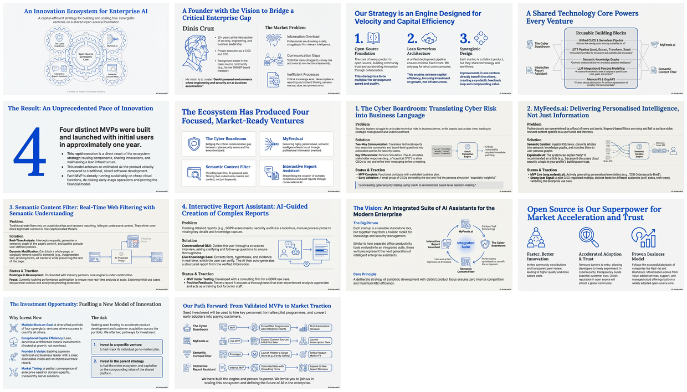

# Open-Source Multi-Startup Strategy: Four Synergistic Ventures

[🏠 Home](../../../README.md) / [By Topic](../../README.md) / [Dinis Cruz Startups](../README.md) / **Open Source Strategy**

---

## Overview

This content documents Dinis Cruz's innovative strategy of concurrently building four complementary startups in the cybersecurity and AI domain. Each venture addresses a different problem niche but all share a common foundation: an open-source core technology and a lean, serverless infrastructure. The four startups form a symbiotic ecosystem where improvements in one directly benefit the others.

---

## Infographic

---

## Slide Deck

*Click the mosaic above to view the full 14-slide presentation (PDF)*

---

## Semantic Knowledge Graph

For detailed concept mapping, relationships, and exportable graph data, see:

**[SEMANTIC-GRAPH.md](SEMANTIC-GRAPH.md)** - Contains Mermaid diagrams, concept taxonomy, and Cypher export for Neo4j integration.

---

## The Four Startups

| Startup | Focus | Core Technology | Status |
|---------|-------|-----------------|--------|
| **The Cyber Boardroom** | CISO-Board communication gap | GenAI persona-based translation engine | MVP complete |
| **MyFeeds.ai** | Information overload | Semantic knowledge graph pipeline | MVP live |
| **Semantic Content Filter** | Real-time web filtering | AI-powered filtering proxy | Prototype |
| **Interactive Report Assistant** | Complex report generation | Interactive LLM-driven Q&A workflow | MVP testing |

---

## Key Highlights

### Shared Technology Stack

All four startups leverage common open-source building blocks:

- **Unified CI/CD and Serverless Deployment Pipeline** - Run anywhere with minimal overhead
- **MemoryFS & GraphFS** - In-memory and graph filesystem abstractions
- **LETS Pipeline** - Load, Extract, Transform, Save data processing workflow
- **LLM Integration & Persona Modeling** - Common framework for AI-driven personalization
- **Semantic Knowledge Graphs** - Converting unstructured text into structured graphs

### Strategy Principles

| Principle | Description |
|-----------|-------------|
| **Symbiotic Development** | Each startup's output serves as input for another |
| **Distinct Focus** | No internal competition - each has unique niche |
| **Open-Source Ethos** | Shared philosophy accelerates adoption and trust |
| **Capital Efficiency** | Serverless + open-source = minimal fixed costs |

---

## Source Information

| Property | Value |
|----------|-------|
| **Source File** | [Dinis Cruz's Multi-Startup Strategy (PDF)](./4%20Sep%20-%20PDF%20-%20Dinis%20Cruz%E2%80%99s%20Multi-Startup%20Strategy_%20Open-Source%20Innovation%20Across%20Four%20Synergistic%20Ventures.pdf) |
| **Infographic** | [Open-Source Startup Ecosystem Four Ventures](./29%20Dec%20-%20Open-Source%20Startup%20Ecosystem%20Four%20Ventures.png) |
| **Slide Deck** | [Four Ventures One AI Engine](./29%20Dec%20-%20Four_Ventures_One_AI_Engine.pdf) (14 slides) |
| **Date** | September 2025 (source), December 2025 (slides) |
| **Author** | Dinis Cruz |

---

## Navigation

| Direction | Link |
|-----------|------|
| ⬆️ Parent | [Dinis Cruz Startups](../README.md) |
| 🏠 Home | [Repository Root](../../../README.md) |

---

*Generated with [Google NotebookLM](https://notebooklm.google.com/) — Source document → Infographic → Slide deck*
