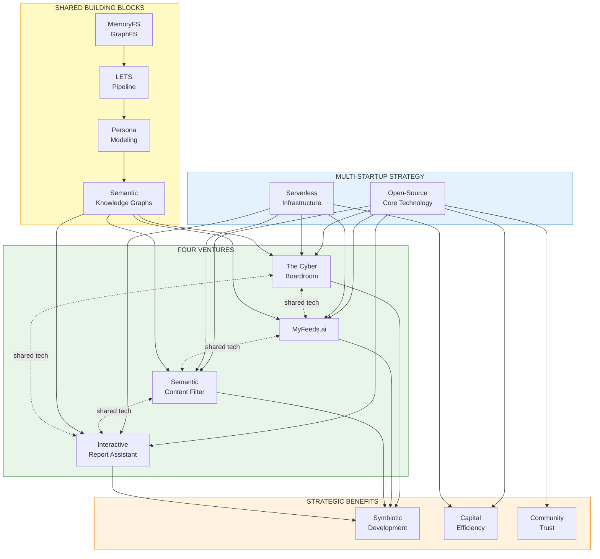
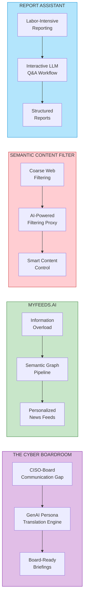
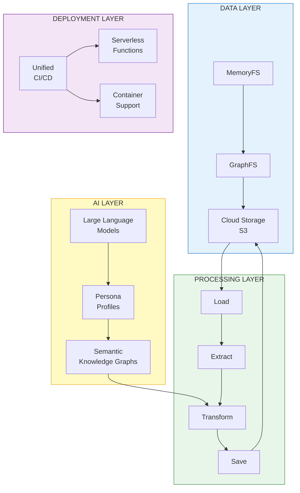
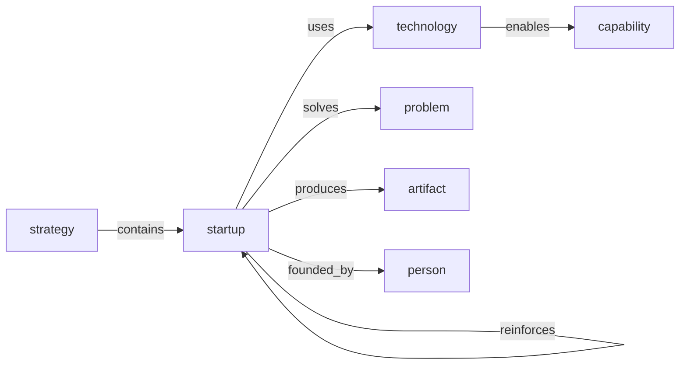
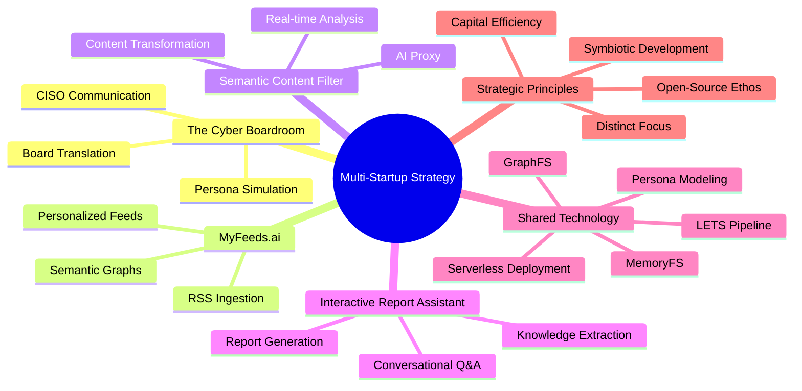
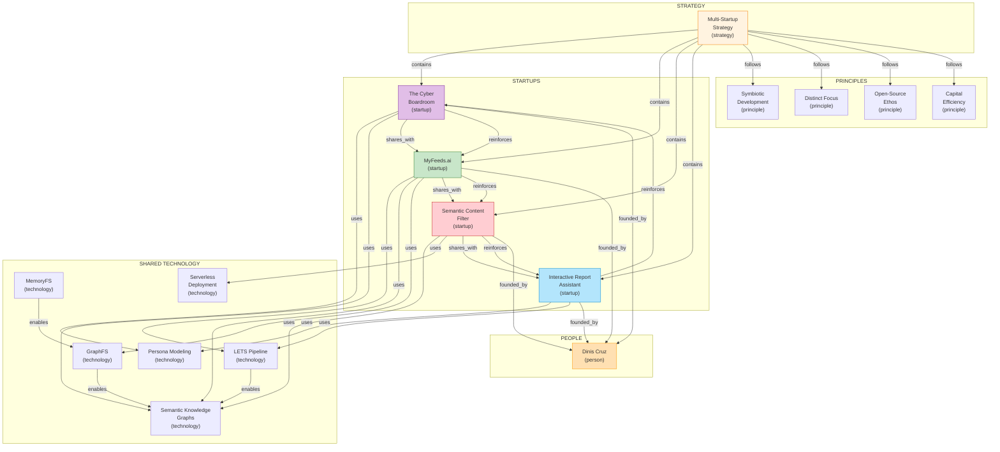

# Open-Source Multi-Startup Strategy

[📖 README](./README.md) · [🖼️ Infographic](./29%20Dec%20-%20Open-Source%20Startup%20Ecosystem%20Four%20Ventures.png) · [📑 Slides](./29%20Dec%20-%20Four_Ventures_One_AI_Engine.pdf) · [🏠 Home](../../../README.md)

> *Semantic Knowledge Graph (SKG) — machine-readable metadata for search, discovery, and graph database integration*

---

## Summary

Dinis Cruz's multi-startup strategy involves concurrently building four complementary ventures in cybersecurity and AI: The Cyber Boardroom (board-CISO communication), MyFeeds.ai (personalized news feeds), Semantic Content Filter (AI web filtering), and Interactive Report Assistant (guided report generation). All share an open-source core technology and serverless infrastructure, creating a symbiotic ecosystem where improvements in one benefit all. The strategy maximizes R&D efficiency through shared building blocks (MemoryFS, GraphFS, LETS pipeline, persona modeling) while maintaining distinct focus areas to avoid internal competition. Open source serves as a force multiplier — accelerating innovation, enabling code reuse, and building community trust.

---

## Key Concepts

- **Symbiotic Development**: Each startup's output serves as input or enhancement for another, creating non-linear progress where advances in one propel all four forward.

- **Open-Source Force Multiplier**: Open sourcing invites contributions, enables code reuse across all ventures, and establishes credibility with enterprise customers who can inspect and verify the code.

- **LETS Pipeline**: Load, Extract, Transform, Save — a stepwise data processing workflow inspired by ETL that ensures transparency and tweakability for debugging AI decisions.

- **Persona Modeling**: Common framework for representing user roles/preferences in a way LLMs can use to tailor outputs — from board personas in Cyber Boardroom to interest graphs in MyFeeds.

- **Semantic Knowledge Graphs**: Converting unstructured text into structured graphs with entities, topics, and relationships — enabling explainable recommendations, granular filtering, and traceable report facts.

- **Serverless Architecture**: Compute and storage scale with usage, costs tied directly to customer consumption, enabling capital efficiency with minimal fixed infrastructure burden.

---

## Core Arguments

1. **Multiple Shots on Goal**: Backing four related ventures diversifies risk while maintaining synergy — success in one directly lifts the others through shared tech and cross-selling opportunities.

2. **Open-Source as Market Accelerator**: Following the playbook of Red Hat, Elastic, and HashiCorp — widespread adoption through free experimentation, monetization through managed services and advanced features.

3. **Capital Efficiency**: The combination of serverless architecture and open-source software means extremely low fixed costs, with more funds going to feature development and user acquisition rather than infrastructure.

4. **Distinct Focus Prevents Cannibalization**: Each venture has clearly delineated scope (governance communication, personalized intel, content filtering, report generation), minimizing overlap risk while maximizing specialization.

5. **Shared Technology Accelerates Execution**: Four MVPs built in roughly a year — an unheard-of pace in enterprise software — made possible by reusing components extensively across all projects.

---

## Key Quotes

> "Open-source development is the cornerstone and force multiplier of this strategy – it accelerates innovation, encourages collaboration, and enables the reuse of key technological building blocks across all four startups."

> "By weaving open-source principles into each startup's DNA, Dinis effectively amplifies the impact of every line of code."

> "Each startup maintains a narrow and distinct focus (avoiding any internal competition or overlap), together they form a cohesive suite of solutions that reinforce one another's value."

> "Building GenAI-powered environments where engineering and security act as business accelerators."

---

## Tags

`open-source` `multi-startup-strategy` `cybersecurity` `genai` `semantic-knowledge-graphs` `serverless` `persona-modeling` `llm` `symbiotic-development` `cyber-boardroom` `myfeeds-ai` `content-filter` `report-assistant` `lets-pipeline` `memoryfs` `graphfs`

---

## Search Phrases

- "open source startup strategy"
- "multiple startup synergy"
- "GenAI cybersecurity startups"
- "semantic knowledge graph pipeline"
- "persona-based AI communication"
- "serverless AI architecture"
- "open source force multiplier"
- "CISO board communication AI"
- "personalized news feed AI"
- "AI-powered content filtering"

---

## Semantic Knowledge Graph

### Four Startups Ecosystem (Visual)



### Startup Focus Areas



### Shared Technology Stack



---

### Ontology

#### Node Types

| Ref | Description | Example |
|-----|-------------|---------|
| `strategy` | The overall multi-startup approach | Open-Source Multi-Startup Strategy |
| `startup` | An individual venture | The Cyber Boardroom |
| `technology` | A shared technology component | MemoryFS, LETS Pipeline |
| `principle` | A strategic principle | Symbiotic Development |
| `capability` | A product capability | Persona Simulation |
| `problem` | A problem being solved | CISO-Board Communication Gap |
| `solution` | A solution approach | GenAI Persona Translation |
| `artifact` | A data or output artifact | Personalized News Feed |
| `person` | A named individual | Dinis Cruz |
| `organization` | A company or entity | OWASP |

#### Predicates

| Ref | Inverse | Description |
|-----|---------|-------------|
| `contains` | `part_of` | Strategy contains startups |
| `uses` | `used_by` | Startup uses technology |
| `solves` | `solved_by` | Solution solves problem |
| `produces` | `produced_by` | Startup produces artifact |
| `enables` | `enabled_by` | Technology enables capability |
| `shares_with` | `shared_by` | Startup shares tech with another |
| `founded_by` | `founded` | Startup founded by person |
| `follows` | `followed_by` | Principle follows another |
| `reinforces` | `reinforced_by` | Success in one reinforces another |



---

### Taxonomy



#### ASCII Tree

```
multi_startup_strategy
├── startups
│   ├── the_cyber_boardroom
│   │   ├── persona_simulation
│   │   ├── board_translation
│   │   └── ciso_communication
│   ├── myfeeds_ai
│   │   ├── rss_ingestion
│   │   ├── semantic_graphs
│   │   └── personalized_feeds
│   ├── semantic_content_filter
│   │   ├── ai_proxy
│   │   ├── realtime_analysis
│   │   └── content_transformation
│   └── interactive_report_assistant
│       ├── conversational_qa
│       ├── knowledge_extraction
│       └── report_generation
├── shared_technology
│   ├── memoryfs
│   ├── graphfs
│   ├── lets_pipeline
│   ├── persona_modeling
│   └── serverless_deployment
└── strategic_principles
    ├── symbiotic_development
    ├── distinct_focus
    ├── open_source_ethos
    └── capital_efficiency
```

---

### Knowledge Graph



#### Nodes Table

| ID | Type | Name | Description |
|----|------|------|-------------|
| `multi_startup_strategy` | `strategy` | Multi-Startup Strategy | Four synergistic open-source ventures |
| `cyber_boardroom` | `startup` | The Cyber Boardroom | AI for CISO-board communication |
| `myfeeds_ai` | `startup` | MyFeeds.ai | Personalized news and intelligence feeds |
| `semantic_content_filter` | `startup` | Semantic Content Filter | Real-time AI web content filtering |
| `interactive_report_assistant` | `startup` | Interactive Report Assistant | AI-guided report generation |
| `memoryfs` | `technology` | MemoryFS | In-memory filesystem abstraction |
| `graphfs` | `technology` | GraphFS | Graph-based filesystem abstraction |
| `lets_pipeline` | `technology` | LETS Pipeline | Load, Extract, Transform, Save workflow |
| `persona_modeling` | `technology` | Persona Modeling | Framework for user/role representation |
| `semantic_knowledge_graphs` | `technology` | Semantic Knowledge Graphs | Structured entity-relationship graphs |
| `serverless_deployment` | `technology` | Serverless Deployment | Unified CI/CD for serverless/containers |
| `symbiotic_development` | `principle` | Symbiotic Development | Each startup enhances the others |
| `distinct_focus` | `principle` | Distinct Focus | No internal competition |
| `open_source_ethos` | `principle` | Open-Source Ethos | Shared philosophy of openness |
| `capital_efficiency` | `principle` | Capital Efficiency | Minimal fixed costs |
| `dinis_cruz` | `person` | Dinis Cruz | Founder of all four ventures |
| `persona_simulation` | `capability` | Persona Simulation | Simulate stakeholder perspectives |
| `board_translation` | `capability` | Board Translation | Convert technical to business language |
| `explainable_recs` | `capability` | Explainable Recommendations | Graph-based recommendation explanations |
| `realtime_filtering` | `capability` | Real-time Filtering | On-the-fly content analysis |
| `provenance_tracking` | `capability` | Provenance Tracking | Traceable facts in reports |

#### Edges Table

| From | Predicate | To | Description |
|------|-----------|-----|-------------|
| `multi_startup_strategy` | `contains` | `cyber_boardroom` | Strategy includes Cyber Boardroom |
| `multi_startup_strategy` | `contains` | `myfeeds_ai` | Strategy includes MyFeeds.ai |
| `multi_startup_strategy` | `contains` | `semantic_content_filter` | Strategy includes Content Filter |
| `multi_startup_strategy` | `contains` | `interactive_report_assistant` | Strategy includes Report Assistant |
| `cyber_boardroom` | `uses` | `persona_modeling` | Uses persona modeling framework |
| `cyber_boardroom` | `uses` | `semantic_knowledge_graphs` | Uses SKG for content |
| `myfeeds_ai` | `uses` | `lets_pipeline` | Uses LETS for data processing |
| `myfeeds_ai` | `uses` | `semantic_knowledge_graphs` | Uses SKG for article analysis |
| `myfeeds_ai` | `uses` | `graphfs` | Uses GraphFS for storage |
| `semantic_content_filter` | `uses` | `semantic_knowledge_graphs` | Uses SKG for page analysis |
| `semantic_content_filter` | `uses` | `serverless_deployment` | Uses serverless for scaling |
| `interactive_report_assistant` | `uses` | `persona_modeling` | Uses personas for audience |
| `interactive_report_assistant` | `uses` | `lets_pipeline` | Uses LETS for knowledge extraction |
| `memoryfs` | `enables` | `graphfs` | MemoryFS underlies GraphFS |
| `graphfs` | `enables` | `semantic_knowledge_graphs` | GraphFS enables SKG storage |
| `lets_pipeline` | `enables` | `semantic_knowledge_graphs` | LETS enables SKG generation |
| `cyber_boardroom` | `shares_with` | `myfeeds_ai` | Shares persona tech |
| `myfeeds_ai` | `shares_with` | `semantic_content_filter` | Shares SKG tech |
| `semantic_content_filter` | `shares_with` | `interactive_report_assistant` | Shares filtering tech |
| `cyber_boardroom` | `reinforces` | `myfeeds_ai` | Success reinforces each other |
| `myfeeds_ai` | `reinforces` | `semantic_content_filter` | Success reinforces each other |
| `semantic_content_filter` | `reinforces` | `interactive_report_assistant` | Success reinforces each other |
| `interactive_report_assistant` | `reinforces` | `cyber_boardroom` | Success reinforces each other |
| `multi_startup_strategy` | `follows` | `symbiotic_development` | Strategy follows principle |
| `multi_startup_strategy` | `follows` | `distinct_focus` | Strategy follows principle |
| `multi_startup_strategy` | `follows` | `open_source_ethos` | Strategy follows principle |
| `multi_startup_strategy` | `follows` | `capital_efficiency` | Strategy follows principle |
| `cyber_boardroom` | `founded_by` | `dinis_cruz` | Founded by Dinis |
| `myfeeds_ai` | `founded_by` | `dinis_cruz` | Founded by Dinis |
| `semantic_content_filter` | `founded_by` | `dinis_cruz` | Founded by Dinis |
| `interactive_report_assistant` | `founded_by` | `dinis_cruz` | Founded by Dinis |
| `persona_modeling` | `enables` | `persona_simulation` | Tech enables capability |
| `persona_modeling` | `enables` | `board_translation` | Tech enables capability |
| `semantic_knowledge_graphs` | `enables` | `explainable_recs` | Tech enables capability |
| `semantic_content_filter` | `enables` | `realtime_filtering` | Startup provides capability |
| `lets_pipeline` | `enables` | `provenance_tracking` | LETS enables provenance |

---

### Cypher Import (Neo4j)

```cypher
// =====================================================
// MULTI-STARTUP STRATEGY - KNOWLEDGE GRAPH IMPORT
// =====================================================

// Create Strategy node
CREATE (strategy:Strategy {
    id: 'multi_startup_strategy',
    name: 'Multi-Startup Strategy',
    description: 'Four synergistic open-source AI ventures'
})

// Create Startup nodes
CREATE (cb:Startup {
    id: 'cyber_boardroom',
    name: 'The Cyber Boardroom',
    description: 'AI for CISO-board communication',
    status: 'MVP complete'
})
CREATE (mf:Startup {
    id: 'myfeeds_ai',
    name: 'MyFeeds.ai',
    description: 'Personalized news and intelligence feeds',
    status: 'MVP live'
})
CREATE (scf:Startup {
    id: 'semantic_content_filter',
    name: 'Semantic Content Filter',
    description: 'Real-time AI web content filtering',
    status: 'Prototype'
})
CREATE (ira:Startup {
    id: 'interactive_report_assistant',
    name: 'Interactive Report Assistant',
    description: 'AI-guided report generation',
    status: 'MVP testing'
})

// Create Technology nodes
CREATE (memfs:Technology {id: 'memoryfs', name: 'MemoryFS', description: 'In-memory filesystem abstraction'})
CREATE (graphfs:Technology {id: 'graphfs', name: 'GraphFS', description: 'Graph-based filesystem abstraction'})
CREATE (lets:Technology {id: 'lets_pipeline', name: 'LETS Pipeline', description: 'Load, Extract, Transform, Save workflow'})
CREATE (persona:Technology {id: 'persona_modeling', name: 'Persona Modeling', description: 'Framework for user/role representation'})
CREATE (skg:Technology {id: 'semantic_knowledge_graphs', name: 'Semantic Knowledge Graphs', description: 'Structured entity-relationship graphs'})
CREATE (serverless:Technology {id: 'serverless_deployment', name: 'Serverless Deployment', description: 'Unified CI/CD for serverless/containers'})

// Create Principle nodes
CREATE (symbiotic:Principle {id: 'symbiotic_development', name: 'Symbiotic Development', description: 'Each startup enhances the others'})
CREATE (distinct:Principle {id: 'distinct_focus', name: 'Distinct Focus', description: 'No internal competition'})
CREATE (opensource:Principle {id: 'open_source_ethos', name: 'Open-Source Ethos', description: 'Shared philosophy of openness'})
CREATE (capital:Principle {id: 'capital_efficiency', name: 'Capital Efficiency', description: 'Minimal fixed costs'})

// Create Capability nodes
CREATE (persona_sim:Capability {id: 'persona_simulation', name: 'Persona Simulation', description: 'Simulate stakeholder perspectives'})
CREATE (board_trans:Capability {id: 'board_translation', name: 'Board Translation', description: 'Convert technical to business language'})
CREATE (explain_recs:Capability {id: 'explainable_recs', name: 'Explainable Recommendations', description: 'Graph-based recommendation explanations'})
CREATE (realtime_filter:Capability {id: 'realtime_filtering', name: 'Real-time Filtering', description: 'On-the-fly content analysis'})
CREATE (provenance:Capability {id: 'provenance_tracking', name: 'Provenance Tracking', description: 'Traceable facts in reports'})

// Create Person node
CREATE (dinis:Person {
    id: 'dinis_cruz',
    name: 'Dinis Cruz',
    description: 'Founder of all four ventures, former OWASP board member'
})

// =====================================================
// CREATE RELATIONSHIPS
// =====================================================

// Strategy contains startups
CREATE (strategy)-[:CONTAINS]->(cb)
CREATE (strategy)-[:CONTAINS]->(mf)
CREATE (strategy)-[:CONTAINS]->(scf)
CREATE (strategy)-[:CONTAINS]->(ira)

// Startups use technologies
CREATE (cb)-[:USES]->(persona)
CREATE (cb)-[:USES]->(skg)
CREATE (mf)-[:USES]->(lets)
CREATE (mf)-[:USES]->(skg)
CREATE (mf)-[:USES]->(graphfs)
CREATE (scf)-[:USES]->(skg)
CREATE (scf)-[:USES]->(serverless)
CREATE (ira)-[:USES]->(persona)
CREATE (ira)-[:USES]->(lets)

// Technology enables technology
CREATE (memfs)-[:ENABLES]->(graphfs)
CREATE (graphfs)-[:ENABLES]->(skg)
CREATE (lets)-[:ENABLES]->(skg)

// Startups share technology
CREATE (cb)-[:SHARES_WITH]->(mf)
CREATE (mf)-[:SHARES_WITH]->(scf)
CREATE (scf)-[:SHARES_WITH]->(ira)

// Startups reinforce each other
CREATE (cb)-[:REINFORCES]->(mf)
CREATE (mf)-[:REINFORCES]->(scf)
CREATE (scf)-[:REINFORCES]->(ira)
CREATE (ira)-[:REINFORCES]->(cb)

// Strategy follows principles
CREATE (strategy)-[:FOLLOWS]->(symbiotic)
CREATE (strategy)-[:FOLLOWS]->(distinct)
CREATE (strategy)-[:FOLLOWS]->(opensource)
CREATE (strategy)-[:FOLLOWS]->(capital)

// Startups founded by person
CREATE (cb)-[:FOUNDED_BY]->(dinis)
CREATE (mf)-[:FOUNDED_BY]->(dinis)
CREATE (scf)-[:FOUNDED_BY]->(dinis)
CREATE (ira)-[:FOUNDED_BY]->(dinis)

// Technologies enable capabilities
CREATE (persona)-[:ENABLES]->(persona_sim)
CREATE (persona)-[:ENABLES]->(board_trans)
CREATE (skg)-[:ENABLES]->(explain_recs)
CREATE (scf)-[:ENABLES]->(realtime_filter)
CREATE (lets)-[:ENABLES]->(provenance)
```

---

### How to Import into Neo4j Sandbox

1. **Create a free Neo4j Sandbox** at [sandbox.neo4j.com](https://sandbox.neo4j.com)
   - Select "Blank Sandbox" (or any template, then clear it)
   - Wait for provisioning (~30 seconds)

2. **Open Neo4j Browser** by clicking "Open with Browser"

3. **Copy the entire Cypher script above** and paste into the query box

4. **Run the query** (click Play or press Ctrl+Enter)

5. **Verify import** with: `MATCH (n) RETURN count(n) as nodes` (should return ~21 nodes)

---

### Sample Queries to Explore

**1. View the entire knowledge graph:**
```cypher
MATCH (n)-[r]->(m)
RETURN n, r, m
```

**2. Find all startups and their technologies:**
```cypher
MATCH (s:Startup)-[:USES]->(t:Technology)
RETURN s.name AS Startup, collect(t.name) AS Technologies
ORDER BY s.name
```

**3. Trace the technology dependency chain:**
```cypher
MATCH path = (t1:Technology)-[:ENABLES*]->(t2:Technology)
RETURN path
```

**4. Find startups that share technology:**
```cypher
MATCH (s1:Startup)-[:SHARES_WITH]->(s2:Startup)
RETURN s1.name AS From, s2.name AS To
```

**5. Find the reinforcement cycle:**
```cypher
MATCH path = (s:Startup)-[:REINFORCES*4]->(s)
RETURN path
LIMIT 1
```

**6. What principles does the strategy follow?**
```cypher
MATCH (strategy:Strategy)-[:FOLLOWS]->(p:Principle)
RETURN strategy.name AS Strategy, collect(p.name) AS Principles
```

**7. Find capabilities enabled by each technology:**
```cypher
MATCH (t:Technology)-[:ENABLES]->(c:Capability)
RETURN t.name AS Technology, collect(c.name) AS Capabilities
ORDER BY t.name
```

---

## Metadata

| Field | Value |
|-------|-------|
| **Content Type** | Strategic Business Plan / Investment Brief |
| **Domain** | Cybersecurity / AI / Startups |
| **Sub-domain** | Multi-venture Strategy / Open Source |
| **Authors** | Dinis Cruz, ChatGPT |
| **Date Created** | September 2025 |
| **Source Format** | PDF (16 pages) |
| **Derived Assets** | Infographic, Slide Deck |
| **License** | CC BY 4.0 |

---

## Related Content

| Relationship | Content |
|--------------|---------|
| `part_of` | The Cyber Boardroom |
| `part_of` | MyFeeds.ai |
| `part_of` | Semantic Content Filter |
| `part_of` | Interactive Report Assistant |
| `inspired_by` | Red Hat, Elastic, HashiCorp (open-source business models) |
| `related_to` | OWASP Open Source Security Tools |
| `uses` | Large Language Models (GPT-4, Claude) |
| `uses` | Serverless Architecture (AWS Lambda, S3) |
| `uses` | Graph Databases (Neo4j) |
