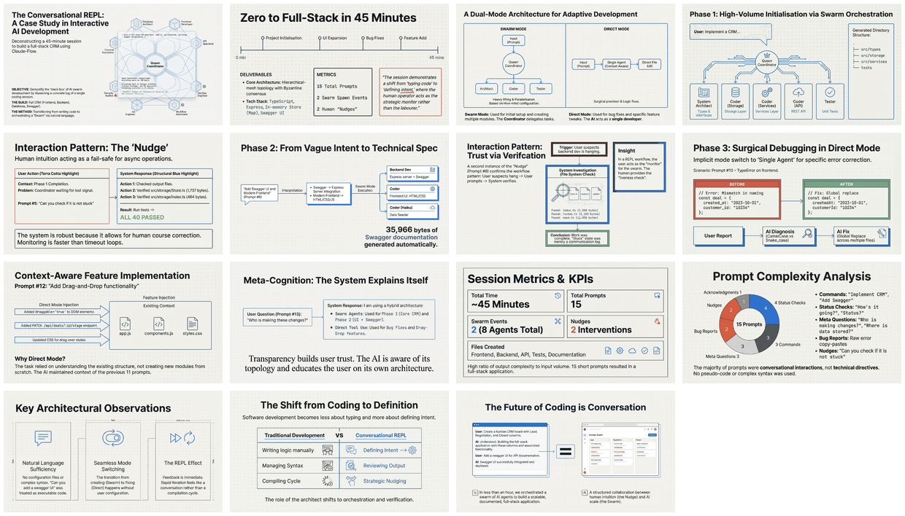

# Conversation Flow Analysis

[Home](../../../../../../README.md) > [GenAI Development](../../../../README.md) > [Dev Tools](../../../README.md) > [Claude-Flow](../../README.md) > [Create CRM Using Hive-Mind](../README.md) > **Conversation Flow Analysis**

---

## Overview

Complete conversation flow analysis during CRM development with Claude-Flow. This document captures all 15 user prompts and response patterns, demonstrating a REPL-like interaction where natural language commands drive complex AI orchestration. The session showcases how human-in-the-loop oversight enables effective swarm management through minimal, conversational inputs.

---

## Infographic

---

## Slides

*Click the mosaic to view the full 15-slide presentation (PDF)*

---

## Semantic Knowledge Graph

For detailed concept mapping, relationships, and exportable graph data, see:

**[SEMANTIC-GRAPH.md](SEMANTIC-GRAPH.md)**

Contents:
- Key concepts and definitions
- Core arguments and findings
- Mermaid diagrams (flowchart, class diagram, mindmap, knowledge graph)
- Cypher export for Neo4j

---

## Source Information

| Property | Value |
|----------|-------|
| **Source Document** | [002-conversation-flow-analysis.md](002-conversation-flow-analysis.md) |
| **Document Type** | Interaction Pattern Analysis |
| **Date** | January 26, 2026 |
| **Infographic** | 26 Jan - Claude-Flow AI Development Lifecycle.jpg |
| **Slides** | 26 Jan - Coding_Through_Conversation.pdf (15 slides) |
| **Mosaic** | slides_mosaic.png |

---

## Key Metrics

| Metric | Value |
|--------|-------|
| Total User Prompts | 15 |
| Swarm Spawn Events | 2 (8 agents total) |
| Direct Edit Sessions | 3 |
| Nudge Interventions | 2 |
| Total Session Time | ~45 minutes |

---

## Interaction Patterns Identified

1. **Swarm Orchestration** - Natural language triggers parallel agent spawning
2. **Nudge and Verify** - Human intuition catches async notification issues
3. **Bug Report to Fix** - Error messages lead to immediate diagnosis and repair
4. **Feature Request to Implementation** - Complexity determines swarm vs direct mode
5. **Meta-Discussion** - Transparent explanation of AI operations builds trust

---

*Part of the Claude-Flow development debrief series.*
