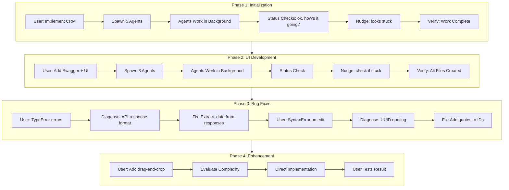
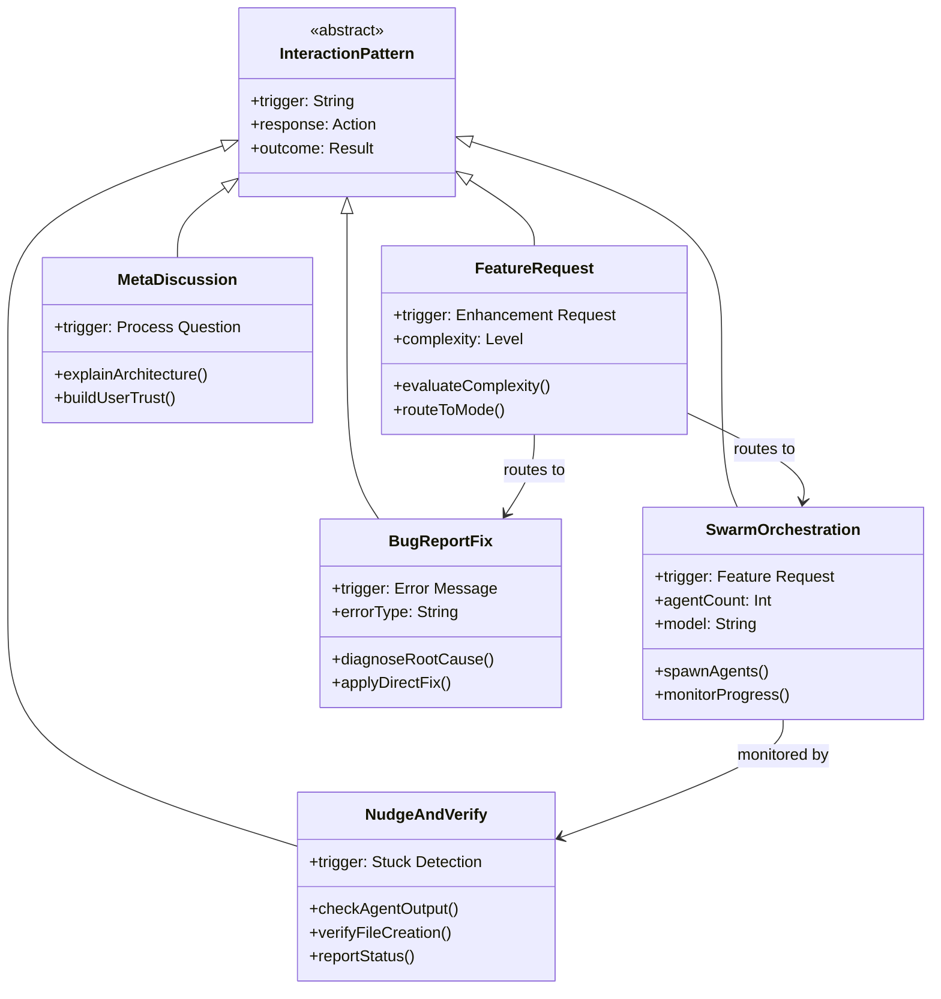
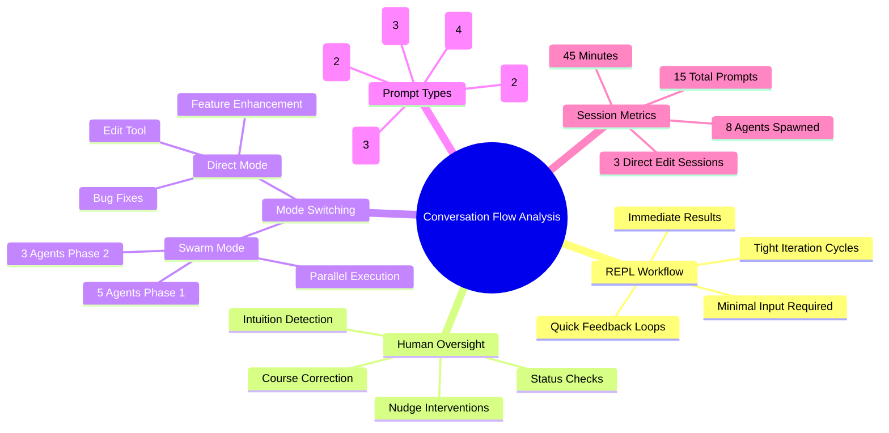
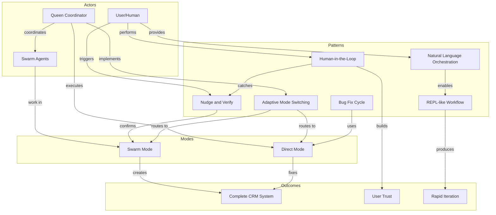

# Semantic Knowledge Graph: Conversation Flow Analysis

[README](README.md) | [Source Document](002-conversation-flow-analysis.md)

---

## Summary

This document analyzes the complete 15-prompt conversation flow during AI-assisted CRM development using Claude-Flow's hive-mind system. The session demonstrates a REPL-like interaction pattern where casual natural language commands orchestrate complex multi-agent operations, with human oversight catching edge cases that automation misses. Key findings reveal that adaptive mode switching between swarm and direct execution happens seamlessly based on task complexity, and that transparent AI operation builds user trust.

---

## Key Concepts

### 1. REPL-like Development Workflow
An interactive development paradigm where each natural language prompt produces immediate, visible results. The tight feedback loop accelerates development while maintaining human control, similar to Read-Eval-Print-Loop programming environments.

### 2. Human-in-the-Loop Swarm Oversight
The practice of human operators monitoring and intervening in autonomous agent swarms. Users provide status checks, nudges when agents appear stuck, and course corrections that catch issues automation misses.

### 3. Nudge and Verify Pattern
An interaction pattern where human intuition detects potential problems (e.g., "it looks stuck") triggering investigation that either confirms completion or identifies actual issues. Both nudge interventions in the session found work was complete but notifications were lost.

### 4. Natural Language to AI Orchestration
The ability to translate casual English prompts into complex multi-agent operations without special syntax, commands, or configuration files. Examples include "add swagger UI" spawning three specialized agents.

### 5. Adaptive Mode Switching
Seamless transition between parallel swarm execution for large features and direct edit mode for focused tasks like bug fixes. No explicit mode switching command is required; the system evaluates complexity automatically.

### 6. Bug Report to Fix Cycle
A rapid debugging pattern where user-reported error messages lead to immediate diagnosis and repair. The cycle completes within a single conversation turn, maintaining development momentum.

---

## Core Arguments

### 1. Natural Language Sufficiency
Every prompt in the 45-minute session was natural English without special syntax. Commands like "can you add a swagger UI" and "it looks stuck" were sufficient to drive complex operations, proving that conversational interfaces can replace traditional development tools.

### 2. Human Oversight Catches Edge Cases
The two nudge interventions where the user sensed something was stuck were crucial. Both times, agent notifications had been lost but work was complete. Human intuition detected what pure automation missed, validating the importance of human-in-the-loop design.

### 3. Seamless Mode Transitions
The workflow naturally switched between spawning 5-8 parallel agents for major features and direct edits for bug fixes. This adaptive behavior happened without explicit user commands, demonstrating intelligent task routing.

### 4. Transparency Builds Trust
When the user asked "who is making these changes?", the clear explanation of swarm versus direct modes built understanding and trust. Transparent AI operation is essential for user confidence in autonomous systems.

### 5. Rapid Iteration Through Conversation
A complete CRM with API documentation, web frontend, and drag-and-drop functionality was built in 45 minutes through 15 conversational prompts. This demonstrates that conversational development can achieve significant velocity.

### 6. Minimal Input Maximum Output
Status checks used prompts as brief as "ok" and "how's it going?" yet received comprehensive progress updates. The system extracted maximum meaning from minimal user input, reducing cognitive load.

---

## Tags

`conversation-flow` `REPL-development` `human-in-the-loop` `swarm-oversight` `natural-language-programming` `AI-orchestration` `adaptive-mode-switching` `bug-fix-cycle` `nudge-and-verify` `claude-flow` `hive-mind` `multi-agent-systems` `feedback-loops` `transparent-AI` `rapid-iteration`

---

## Mermaid Diagrams

### Conversation Flow Process



### Interaction Pattern Classes



### Conversation Flow Mindmap



### Knowledge Graph



---

## Cypher Export

```cypher
// Clear existing data (optional)
// MATCH (n) DETACH DELETE n;

// Create Concept nodes
CREATE (repl:Concept {name: "REPL-like Development Workflow", type: "paradigm", description: "Interactive development where each prompt produces immediate visible results"})
CREATE (hilo:Concept {name: "Human-in-the-Loop Oversight", type: "practice", description: "Human operators monitoring and intervening in autonomous agent swarms"})
CREATE (nudge:Concept {name: "Nudge and Verify Pattern", type: "pattern", description: "Human intuition detects problems triggering investigation"})
CREATE (nlo:Concept {name: "Natural Language Orchestration", type: "capability", description: "Translating casual English into multi-agent operations"})
CREATE (ams:Concept {name: "Adaptive Mode Switching", type: "behavior", description: "Seamless transition between swarm and direct modes"})
CREATE (bfc:Concept {name: "Bug Fix Cycle", type: "pattern", description: "Error report to diagnosis to repair in single turn"})

// Create Actor nodes
CREATE (user:Actor {name: "User", role: "Human Operator", promptCount: 15})
CREATE (queen:Actor {name: "Queen Coordinator", role: "Claude Code Instance", function: "Strategic planning and agent spawning"})
CREATE (swarm:Actor {name: "Swarm Agents", role: "Background Workers", count: 8})

// Create Mode nodes
CREATE (swarmMode:Mode {name: "Swarm Mode", description: "Parallel agent execution for large features"})
CREATE (directMode:Mode {name: "Direct Mode", description: "Single-agent edits for focused tasks"})

// Create Metric nodes
CREATE (m1:Metric {name: "Total Prompts", value: 15})
CREATE (m2:Metric {name: "Session Duration", value: "45 minutes"})
CREATE (m3:Metric {name: "Agents Spawned", value: 8})
CREATE (m4:Metric {name: "Nudge Interventions", value: 2})
CREATE (m5:Metric {name: "Direct Edit Sessions", value: 3})

// Create Outcome nodes
CREATE (crm:Outcome {name: "Complete CRM System", components: "API, Swagger UI, Web Frontend, Drag-Drop"})
CREATE (trust:Outcome {name: "User Trust", source: "Transparent AI operation"})
CREATE (rapid:Outcome {name: "Rapid Iteration", evidence: "45 minute full build"})

// Create relationships - User interactions
CREATE (user)-[:PROVIDES]->(nlo)
CREATE (user)-[:PERFORMS]->(hilo)
CREATE (user)-[:TRIGGERS]->(nudge)
CREATE (user)-[:REPORTS]->(bfc)

// Create relationships - Queen coordination
CREATE (queen)-[:COORDINATES]->(swarm)
CREATE (queen)-[:IMPLEMENTS]->(ams)
CREATE (queen)-[:EXECUTES]->(directMode)
CREATE (queen)-[:SPAWNS_INTO]->(swarmMode)

// Create relationships - Pattern connections
CREATE (nlo)-[:ENABLES]->(repl)
CREATE (hilo)-[:CATCHES_VIA]->(nudge)
CREATE (nudge)-[:CONFIRMS_STATUS_OF]->(swarmMode)
CREATE (ams)-[:ROUTES_TO]->(swarmMode)
CREATE (ams)-[:ROUTES_TO]->(directMode)
CREATE (bfc)-[:USES]->(directMode)

// Create relationships - Outcomes
CREATE (repl)-[:PRODUCES]->(rapid)
CREATE (hilo)-[:BUILDS]->(trust)
CREATE (swarmMode)-[:CREATES]->(crm)
CREATE (directMode)-[:FIXES]->(crm)

// Create relationships - Metrics to session
CREATE (m1)-[:MEASURES]->(user)
CREATE (m2)-[:MEASURES]->(repl)
CREATE (m3)-[:MEASURES]->(swarm)
CREATE (m4)-[:MEASURES]->(nudge)
CREATE (m5)-[:MEASURES]->(directMode)

// Create Document node
CREATE (doc:Document {
    name: "Conversation Flow Analysis",
    date: "2026-01-26",
    type: "Interaction Pattern Analysis",
    purpose: "Demonstrate REPL-like development workflow"
})

// Link concepts to document
CREATE (doc)-[:ANALYZES]->(repl)
CREATE (doc)-[:ANALYZES]->(hilo)
CREATE (doc)-[:ANALYZES]->(nudge)
CREATE (doc)-[:ANALYZES]->(nlo)
CREATE (doc)-[:ANALYZES]->(ams)
CREATE (doc)-[:ANALYZES]->(bfc)
```

---

*Generated from source document: 002-conversation-flow-analysis.md*
