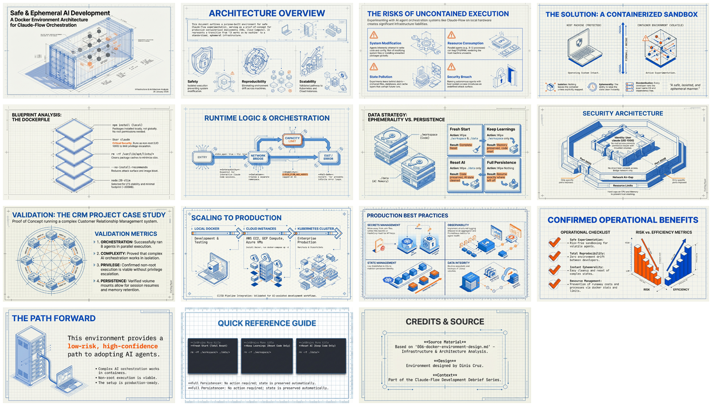

# Docker Environment Design: Safe and Ephemeral AI Development

[Home](../../../../../../README.md) > [GenAI Development](../../../../README.md) > [Dev Tools](../../../README.md) > [Claude-Flow](../../README.md) > [Create CRM Using Hive-Mind](../README.md) > Docker Environment Design

---

## Overview

This document describes the Docker environment purpose-built for experimenting with Claude-Flow in a safe, isolated, and ephemeral manner. Beyond experimentation, this setup serves as a proof-of-concept for deploying Claude and Claude-Flow in production containerized environments such as Kubernetes clusters, cloud compute instances (AWS EC2, GCP Compute, Azure VMs), container orchestration platforms, and CI/CD pipelines for AI-assisted development.

The core philosophy: "What happens in the container, stays in the container."

---

## Infographic


---

## Slide Deck

[](Safe_Ephemeral_AI_Development.pdf)

*Click the mosaic above to open the full 15-slide presentation (PDF)*

---

## Semantic Knowledge Graph

For detailed concept mapping, arguments, and knowledge graph exports, see:

**[SEMANTIC-GRAPH.md](SEMANTIC-GRAPH.md)** - Contains:
- Key concepts and their relationships
- Core arguments with supporting evidence
- Mermaid diagrams (flowchart, class diagram, mindmap, graph)
- Cypher export for Neo4j integration
- Comprehensive tagging taxonomy

---

## Source Information

| Attribute | Value |
|-----------|-------|
| **Source Document** | [006-docker-environment-design.md](006-docker-environment-design.md) |
| **Document Type** | Infrastructure and Architecture Analysis |
| **Date** | January 26, 2026 |
| **Author** | Dinis Cruz |
| **Infographic** | [26 Jan - Dockerising AI - Safe Sandbox Strategy.jpg](26%20Jan%20-%20Dockerising%20AI%20-%20Safe%20Sandbox%20Strategy.jpg) |
| **Slide Deck** | [Safe_Ephemeral_AI_Development.pdf](Safe_Ephemeral_AI_Development.pdf) (15 slides) |
| **Slide Mosaic** | [slides_mosaic.png](slides_mosaic.png) |

---

## Key Topics Covered

- **Containerized AI Sandbox**: Complete isolation of AI agents from host system
- **Non-Root Security Model**: Running containers as user `claude` (UID 1000) to minimize risk
- **Volume Mount Strategy**: Separation of ephemeral workspace from persistent state
- **Kubernetes Deployment Patterns**: Translation of Docker setup to K8s manifests
- **CI/CD Pipeline Integration**: GitHub Actions workflow for AI-assisted development
- **Resource Management**: CPU/memory limits and monitoring strategies

---

## Quick Reference Commands

**Start Fresh Environment:**
```bash
docker-compose up -d
docker-compose exec claude-flow bash
```

**Full Reset:**
```bash
docker-compose down -v
rm -rf ./workspace/* ./data/*
docker-compose up -d --build
```

**Export to Kubernetes:**
```bash
kompose convert -f docker-compose.yml
```

---

## Related Documents

- [005 - Hive-Mind Agent Analysis](../005-hive-mind-agent-analysis/README.md)
- [007 - Lessons Learned](../007-lessons-learned/README.md)
- [Claude-Flow Project Overview](../README.md)

---

*Document generated as part of the Claude-Flow development debrief series.*
