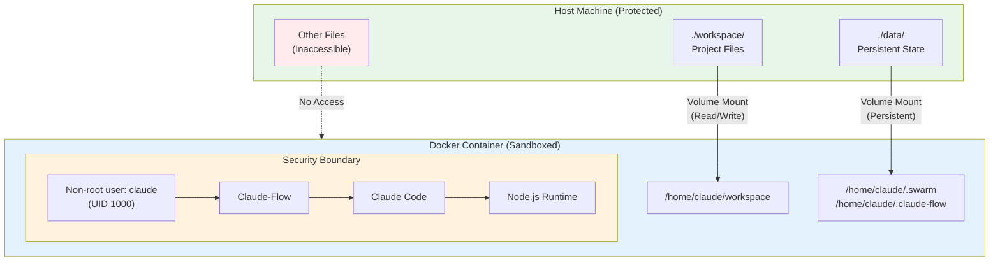
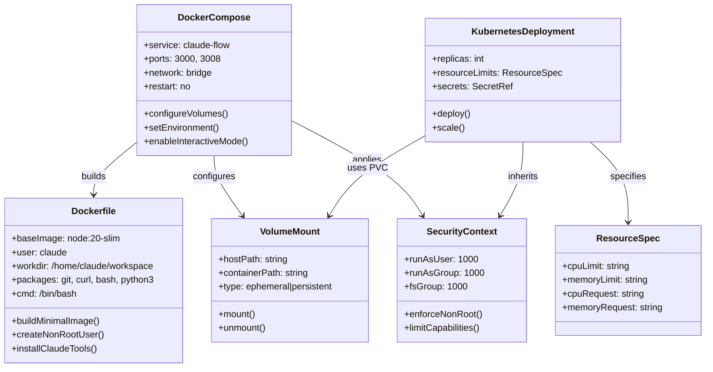
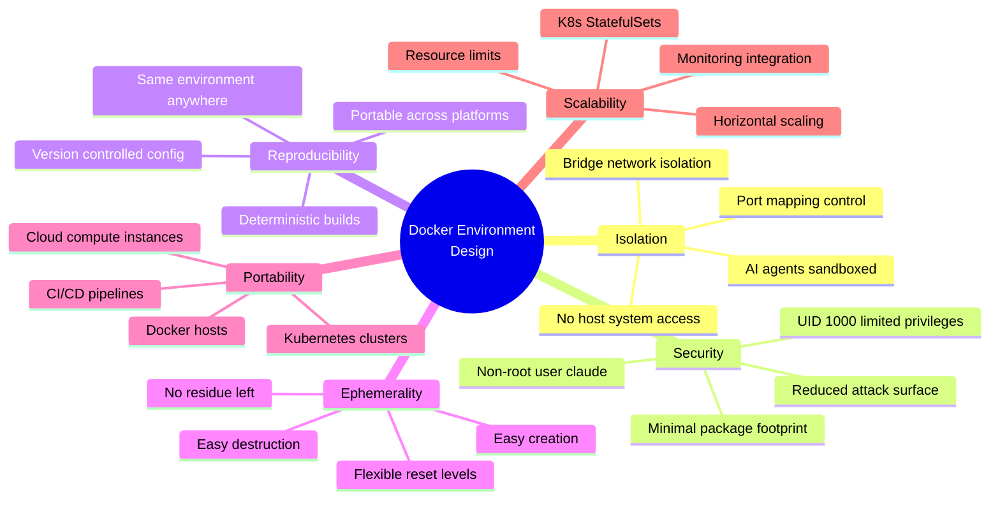
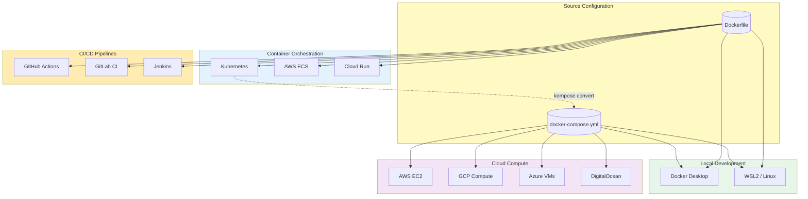

# Semantic Knowledge Graph: Docker Environment Design

[Home](../../../../../../README.md) > [GenAI Development](../../../../README.md) > [Dev Tools](../../../README.md) > [Claude-Flow](../../README.md) > [Create CRM Using Hive-Mind](../README.md) > [Docker Environment Design](README.md) > Semantic Graph

---

## Summary

This document presents a comprehensive Docker containerization strategy for running Claude-Flow AI agent orchestration safely and reproducibly. The architecture employs a non-root user security model, strategic volume mounts separating ephemeral workspace from persistent state, and network isolation via bridge networking. The setup serves as a validated proof-of-concept for production deployments in Kubernetes clusters, cloud compute instances, and CI/CD pipelines, demonstrating that complex multi-agent AI orchestration can be effectively sandboxed in enterprise environments.

---

## Key Concepts

### 1. Containerized AI Sandbox
A Docker-based isolation environment where AI agents operate within strict boundaries, preventing any modification to the host system. The container provides a complete runtime with Claude-Flow, Claude Code, and Node.js while restricting access to only explicitly mounted volumes and mapped ports.

### 2. Non-Root User Security Model
Security architecture running the container as user `claude` (UID 1000) rather than root, significantly reducing the impact of potential container escape vulnerabilities. This limits writable access to `/home/claude/` and follows the principle of least privilege.

### 3. Volume Mount Strategy
A deliberate separation of storage concerns into ephemeral workspace (`./workspace/`) for project files and persistent state (`./data/`) for swarm memory and configuration. This enables flexible scenarios from complete reset to full session resume.

### 4. Ephemerality Principle
The design philosophy that AI development environments should be easily created, used, and destroyed without leaving residue. Containers can be torn down instantly, and different reset levels (workspace only, state only, or full) provide granular control.

### 5. Production Portability
The Docker setup directly translates to enterprise deployment targets including Kubernetes (with provided manifests), cloud compute instances, and CI/CD pipelines, validating the approach for organizational adoption.

### 6. Resource Management and Limits
Configurable CPU and memory constraints that prevent runaway AI agents from consuming excessive resources, with support for monitoring via `docker stats` and horizontal scaling in Kubernetes.

---

## Core Arguments

### Argument 1: Container Isolation Enables Safe AI Experimentation
**Claim**: Docker containerization provides the necessary isolation for AI agents to operate without risk to host systems.

**Evidence**: The CRM project demonstrated 8 AI agents spawning in parallel, creating 19 files, installing npm packages, and running server processes with zero impact on the host machine. All activity remained contained within the Docker boundary.

**Implication**: Organizations can experiment with AI agent orchestration confidently, knowing that even unexpected agent behavior cannot compromise production systems.

### Argument 2: Non-Root Execution Dramatically Reduces Security Risk
**Claim**: Running containers as a non-root user fundamentally changes the security posture compared to traditional root execution.

**Evidence**: The comparison shows that container escape with root access grants attackers root on the host, while non-root escape only provides limited user privileges. The `claude` user can only modify `/home/claude/`, not system files.

**Implication**: The non-root model should be standard practice for AI workloads where autonomous agents may perform unpredictable operations.

### Argument 3: Volume Mount Separation Enables Flexible State Management
**Claim**: Separating workspace from persistent state allows teams to choose their desired level of continuity.

**Evidence**: Four distinct scenarios are supported: fresh start (delete both), new project with retained learnings (delete workspace), keep code but reset AI state (delete data), and full persistence. Each serves different workflow needs.

**Implication**: Teams can iterate rapidly by resetting specific components while preserving valuable context in others.

### Argument 4: Docker Setup Translates Directly to Production Infrastructure
**Claim**: The development Docker configuration serves as a validated template for enterprise deployment.

**Evidence**: The document provides working Kubernetes deployment manifests, GitHub Actions CI/CD workflows, and deployment approaches for AWS EC2, GCP Compute, Azure VMs, and DigitalOcean. The same security context (runAsUser: 1000) and volume patterns apply.

**Implication**: Organizations can move from experimentation to production with minimal configuration changes, reducing adoption risk.

---

## Tags

`#docker` `#containerization` `#claude-flow` `#ai-orchestration` `#security` `#non-root` `#kubernetes` `#k8s` `#ci-cd` `#github-actions` `#volume-mounts` `#ephemerality` `#sandbox` `#devops` `#infrastructure`

---

## Mermaid Diagrams

### Flowchart: Container Security Model



### Class Diagram: Docker Architecture Components



### Mind Map: Containerization Benefits



### Graph: Deployment Targets



---

## Cypher Export

```cypher
// Nodes: Core Concepts
CREATE (docker_env:Concept {name: "Docker Environment Design", type: "Architecture", description: "Safe and ephemeral AI development sandbox"})
CREATE (containerization:Concept {name: "Containerization", type: "Technology", description: "Docker-based isolation for AI workloads"})
CREATE (non_root:Concept {name: "Non-Root Security Model", type: "Security Pattern", description: "Running as user claude (UID 1000)"})
CREATE (volume_strategy:Concept {name: "Volume Mount Strategy", type: "Architecture Pattern", description: "Ephemeral workspace with persistent state"})
CREATE (ephemerality:Concept {name: "Ephemerality", type: "Design Principle", description: "Easy to create, use, and destroy without residue"})
CREATE (isolation:Concept {name: "Isolation", type: "Security Benefit", description: "AI agents sandboxed from host system"})

// Nodes: Technologies
CREATE (docker:Technology {name: "Docker", version: "Latest", purpose: "Container runtime"})
CREATE (compose:Technology {name: "Docker Compose", purpose: "Multi-container orchestration"})
CREATE (kubernetes:Technology {name: "Kubernetes", purpose: "Production container orchestration"})
CREATE (node:Technology {name: "Node.js", version: "20-slim", purpose: "JavaScript runtime"})
CREATE (claude_flow:Technology {name: "Claude-Flow", version: "alpha", purpose: "AI agent orchestration"})
CREATE (claude_code:Technology {name: "Claude Code", purpose: "AI coding assistant"})

// Nodes: Deployment Targets
CREATE (k8s_deploy:DeploymentTarget {name: "Kubernetes Cluster", type: "Orchestration"})
CREATE (aws_ec2:DeploymentTarget {name: "AWS EC2", type: "Cloud Compute"})
CREATE (gcp_compute:DeploymentTarget {name: "GCP Compute", type: "Cloud Compute"})
CREATE (azure_vm:DeploymentTarget {name: "Azure VMs", type: "Cloud Compute"})
CREATE (github_actions:DeploymentTarget {name: "GitHub Actions", type: "CI/CD"})

// Nodes: Security Aspects
CREATE (bridge_network:SecurityFeature {name: "Bridge Network", description: "Isolated network namespace"})
CREATE (resource_limits:SecurityFeature {name: "Resource Limits", description: "CPU and memory constraints"})
CREATE (minimal_image:SecurityFeature {name: "Minimal Image", description: "node:20-slim with minimal packages"})

// Nodes: Volume Mounts
CREATE (workspace_vol:Volume {name: "Workspace Volume", hostPath: "./workspace/", containerPath: "/home/claude/workspace", type: "ephemeral"})
CREATE (swarm_vol:Volume {name: "Swarm Volume", hostPath: "./data/.swarm/", containerPath: "/home/claude/.swarm", type: "persistent"})
CREATE (config_vol:Volume {name: "Config Volume", hostPath: "./data/.claude-flow/", containerPath: "/home/claude/.claude-flow", type: "persistent"})

// Relationships: Core Structure
CREATE (docker_env)-[:IMPLEMENTS]->(containerization)
CREATE (docker_env)-[:USES]->(non_root)
CREATE (docker_env)-[:DEFINES]->(volume_strategy)
CREATE (docker_env)-[:EMBODIES]->(ephemerality)
CREATE (containerization)-[:PROVIDES]->(isolation)

// Relationships: Technology Stack
CREATE (docker_env)-[:BUILT_ON]->(docker)
CREATE (docker_env)-[:CONFIGURED_BY]->(compose)
CREATE (docker_env)-[:DEPLOYS_TO]->(kubernetes)
CREATE (docker)-[:RUNS]->(node)
CREATE (node)-[:EXECUTES]->(claude_flow)
CREATE (claude_flow)-[:INTEGRATES]->(claude_code)

// Relationships: Deployment
CREATE (docker_env)-[:TRANSLATES_TO]->(k8s_deploy)
CREATE (docker_env)-[:DEPLOYS_ON]->(aws_ec2)
CREATE (docker_env)-[:DEPLOYS_ON]->(gcp_compute)
CREATE (docker_env)-[:DEPLOYS_ON]->(azure_vm)
CREATE (docker_env)-[:INTEGRATES_WITH]->(github_actions)

// Relationships: Security
CREATE (non_root)-[:ENFORCES]->(isolation)
CREATE (docker_env)-[:CONFIGURES]->(bridge_network)
CREATE (docker_env)-[:APPLIES]->(resource_limits)
CREATE (docker)-[:USES]->(minimal_image)

// Relationships: Volumes
CREATE (volume_strategy)-[:DEFINES]->(workspace_vol)
CREATE (volume_strategy)-[:DEFINES]->(swarm_vol)
CREATE (volume_strategy)-[:DEFINES]->(config_vol)
CREATE (workspace_vol)-[:SUPPORTS]->(ephemerality)
CREATE (swarm_vol)-[:ENABLES]->(persistence:Concept {name: "State Persistence"})
CREATE (config_vol)-[:ENABLES]->(persistence)

// Metadata
CREATE (doc:Document {
    title: "Docker Environment Design: Safe & Ephemeral AI Development",
    date: "2026-01-26",
    author: "Dinis Cruz",
    type: "Infrastructure & Architecture Analysis",
    purpose: "Document Docker environment for Claude-Flow and validate containerized AI orchestration"
})
CREATE (doc)-[:DESCRIBES]->(docker_env)
```

---

## Related Semantic Graphs

- [005 - Hive-Mind Agent Analysis - Semantic Graph](../005-hive-mind-agent-analysis/SEMANTIC-GRAPH.md)
- [007 - Lessons Learned - Semantic Graph](../007-lessons-learned/SEMANTIC-GRAPH.md)
- [Claude-Flow Project - Master Graph](../SEMANTIC-GRAPH.md)

---

*Generated from source: [006-docker-environment-design.md](006-docker-environment-design.md)*
