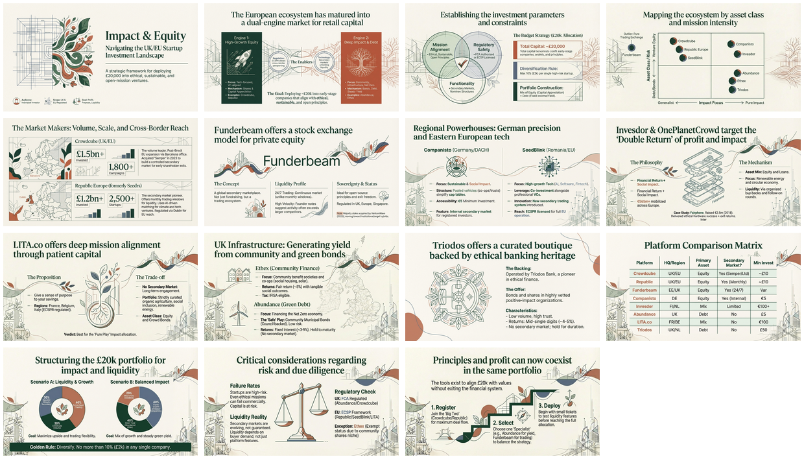

[🏠 Home](../../../../../README.md) / [By Topic](../../../../README.md) / [Dev Briefs](../../../README.md) / [OSBot Fast API](../../README.md) / **v0.32.5 - Unified Service Client (v1)**

---

# v0.32.5 - Unified Service Client Architecture

## Overview

This development brief describes a unified architecture for FastAPI service clients that enables seamless switching between **IN_MEMORY** (TestClient) and **REMOTE** (HTTP) modes without code changes. The architecture centralizes transport logic, eliminates redundant wrapper classes, and establishes clear patterns for all current and future service clients in the osbot_fast_api ecosystem.

**Version**: v0.32.5
**Date**: January 2025
**Status**: Proposed

**Affected Projects**:
- `osbot_fast_api`
- `mgraph_ai_service_cache_client`
- `mgraph_ai_service_cache`
- `mgraph_ai_service_html_graph_client`
- `mgraph_ai_service_html_graph`
- Future service clients

---

## Infographic


---

## Slide Deck

**PDF**: [26 Jan - Unified_Service_Client_Architecture.pdf](26%20Jan%20-%20Unified_Service_Client_Architecture.pdf)



---

## Source

| Item | Details |
|------|---------|
| **Source File** | [v0.32.5__brief_(v1)__unified-service-client-architecture.md](v0.32.5__brief_(v1)__unified-service-client-architecture.md) |
| **Type** | Development Brief |
| **Format** | Markdown |

---

## Key Highlights

### Layer Diagram Architecture

The architecture follows a three-layer design:

1. **Application Layer** - Business logic discovers clients via registry
2. **Service Client Layer** - Domain-specific clients extending the base class
3. **Infrastructure Layer** - Generic transport in osbot_fast_api

```
Application Layer
    |
    v
Service Client Layer (Cache__Service__Client, Html__Service__Client, etc.)
    |
    v
Infrastructure Layer (Fast_API__Client__Requests, Registry, Base Classes)
```

### Registry Pattern

The `Fast_API__Service__Registry` provides centralized service discovery:

- **Registration**: `registry.register(cache_client)`
- **Discovery**: `cache_client = registry.client(Cache__Service__Client)`

Benefits:
- Single source of truth for service clients
- Mode-agnostic client access
- Clean separation of concerns

### Transport Abstraction

The `Fast_API__Client__Requests` class provides a generic, reusable transport layer:

- **IN_MEMORY Mode**: Uses Starlette's `TestClient` for direct FastAPI app communication
- **REMOTE Mode**: Uses Python's `requests` library for HTTP communication

Key insight: The transport logic is 100% generic and service-agnostic, enabling code reuse across all service clients.

### Mode Switching

| Installation | Available Modes |
|--------------|-----------------|
| Client only | REMOTE only |
| Client + Service | REMOTE and IN_MEMORY |

This design enables:
- Fast test execution (~100ms startup)
- Same code paths in tests and production
- No mocks needed for integration testing

### Simplified Class Structure

**Before** (3+ classes per service):
- `Cache__Service__Fast_API__Client`
- `Cache__Service__Registry__Client`
- `Cache__Service__In_Memory`

**After** (1 class per service):
- `Cache__Service__Client`

---

## Related Resources

- [SEMANTIC-GRAPH.md](SEMANTIC-GRAPH.md) - Knowledge graph representation
