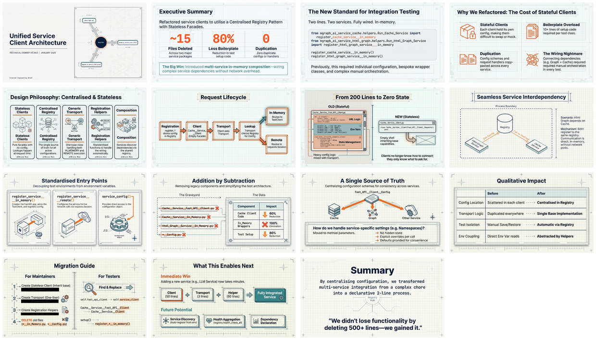

# osbot-fast-api v0.34.0 - Unified Service Client Architecture

[🏠 Home](../../../../README.md) / [By Topic](../../../README.md) / [Dev Briefs](../../README.md) / [osbot-fast-api](../README.md) / **v0.34.0**

---

## Overview

Technical debrief documenting the refactoring of all service clients to use a **centralized registry pattern** with **stateless facades**. This architectural change eliminated ~15 files across two service packages, reduced test setup boilerplate by 80%, and introduced **multi-service in-memory composition** — the ability to wire up multiple services for integration testing with just two lines of code.

---

## Infographic


---

## Slide Deck

[](./27%20%20Jan%20-%20Centralised_Stateless_Architecture.pdf)

*Click the mosaic above to view the full 15-slide presentation (PDF)*

---

## Semantic Knowledge Graph

For detailed concept mapping, relationships, and exportable graph data, see:

**[SEMANTIC-GRAPH.md](SEMANTIC-GRAPH.md)** - Contains Mermaid diagrams, concept taxonomy, and Cypher export for Neo4j integration.

---

## The Killer Feature

```python
@classmethod
def setUpClass(cls):
    fast_api__service__registry.configs__save(clear_configs=True)
    register_cache_service__in_memory()       # Wire up Cache service
    register_html_graph_service__in_memory()  # Wire up Html Graph service

    cls.html_graph_client = Html_Graph__Service__Client()
```

**Two lines. Two services. Fully wired. In-memory. Ready for testing.**

---

## Key Metrics

| Metric | Before | After | Improvement |
|--------|--------|-------|-------------|
| Files per service | 5-6 | 2-3 | **50% reduction** |
| Test setup lines | 15+ | 3 | **80% reduction** |
| Duplicate code | ~200 lines | 0 | **100% elimination** |
| Services composable | No | Yes | **Enabled** |

---

## Core Design Principles

| Principle | Description |
|-----------|-------------|
| **Stateless Clients** | Clients are facades with no config; lookup config from registry at request time |
| **Centralized Registry** | Single source of truth for all service configurations |
| **Generic Transport** | One `Fast_API__Client__Requests` base class handles IN_MEMORY vs REMOTE |
| **Registration Helpers** | Each service provides `register_*__in_memory()` and `register_*__remote()` |
| **Composition via Registry** | Multiple services wire up by registering to the same registry |

---

## Before vs After

### Test Setup Comparison

**BEFORE (20+ lines):**
```python
cache_config = Cache__Config(storage_mode='memory')
cache_service = Cache__Service(cache_config=cache_config)
serverless_config = Serverless__Fast_API__Config(enable_api_key=False)
cache_fast_api = Cache_Service__Fast_API(config=serverless_config, cache_service=cache_service)
cache_fast_api.setup()
# ... 15 more lines ...
```

**AFTER (3 lines):**
```python
fast_api__service__registry.configs__save(clear_configs=True)
register_cache_service__in_memory()
register_html_graph_service__in_memory()
```

---

## Source Information

| Property | Value |
|----------|-------|
| **Source File** | [v0.34.0 Debrief (Markdown)](./v0.34.0__debrief__unified-service-client-architecture.md) |
| **Infographic** | [Unified Service Architecture - Less Code](./27%20Jan%20-%20Unified%20Service%20Architecture%20-%20Less%20Code.jpg) |
| **Slide Deck** | [Centralised Stateless Architecture](./27%20%20Jan%20-%20Centralised_Stateless_Architecture.pdf) (15 slides) |
| **Date** | January 2025 |
| **Components** | `Fast_API__Service__Registry`, Service Clients, Registration Helpers |
| **Packages** | `osbot-fast-api`, `mgraph_ai_service_cache_client`, `mgraph_ai_service_html_graph` |

---

## Navigation

| Direction | Link |
|-----------|------|
| ⬆️ Parent | [osbot-fast-api](../README.md) |
| 🏠 Home | [Repository Root](../../../../README.md) |

---

*Generated with [Google NotebookLM](https://notebooklm.google.com/) — Source document → Infographic → Slide deck*
