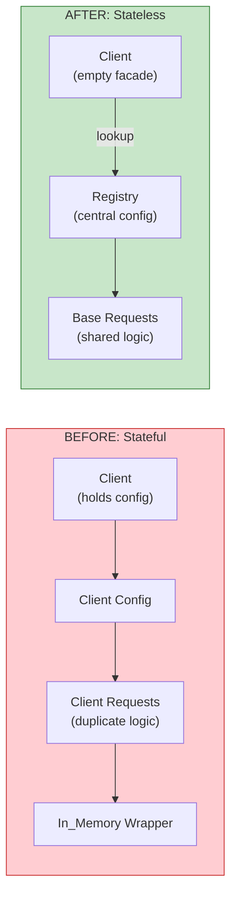
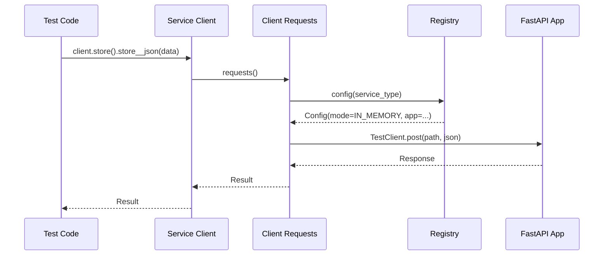
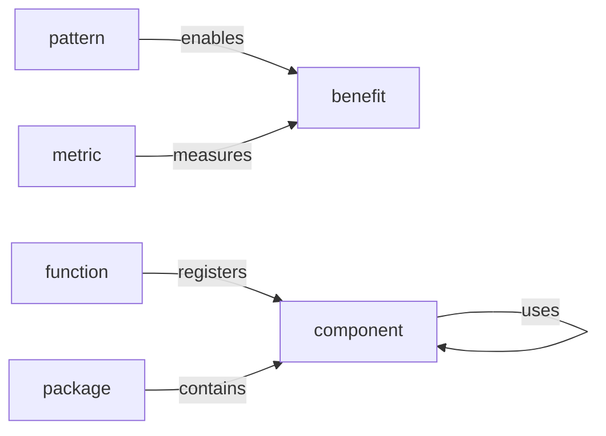
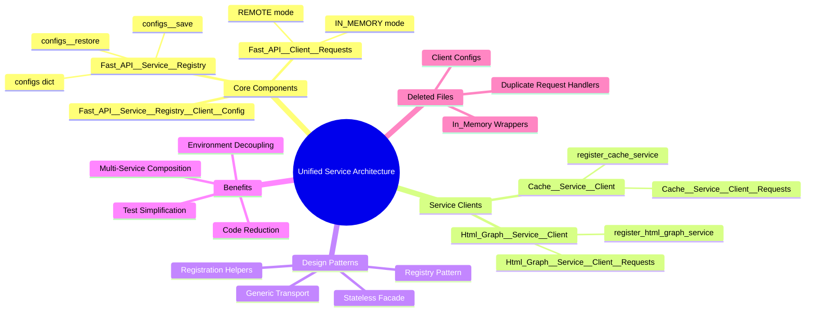
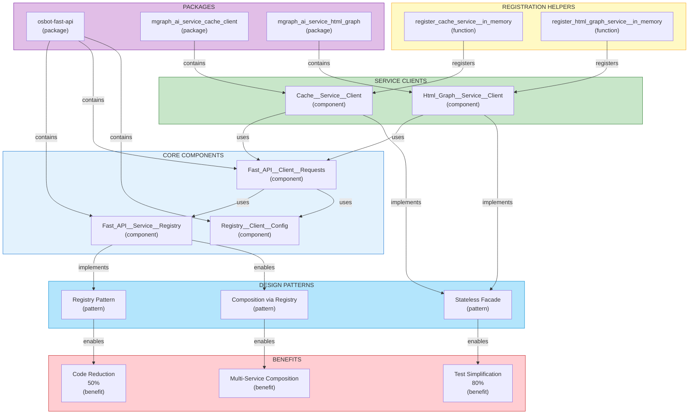

# Unified Service Client Architecture - Knowledge Graph

[📖 README](./README.md) · [🖼️ Infographic](./27%20Jan%20-%20Unified%20Service%20Architecture%20-%20Less%20Code.jpg) · [📑 Slides](./27%20%20Jan%20-%20Centralised_Stateless_Architecture.pdf) · [🏠 Home](../../../../README.md)

> *Semantic Knowledge Graph (SKG) — machine-readable metadata for search, discovery, and graph database integration*

---

## Summary

The v0.34.0 release of osbot-fast-api introduces a unified service client architecture that replaces scattered, stateful service clients with stateless facades backed by a centralized registry. The refactoring eliminated ~15 files across two service packages (Cache and Html Graph), reduced test setup boilerplate by 80%, and enabled multi-service in-memory composition with just two lines of code. The core innovation is the registry pattern: clients are now empty facades that look up their configuration at request time from `fast_api__service__registry`, while a single generic transport class (`Fast_API__Client__Requests`) handles the IN_MEMORY vs REMOTE routing that was previously duplicated across every service. Registration helpers (`register_*__in_memory()`, `register_*__remote()`) encapsulate all the setup complexity, and the `configs__save()`/`configs__restore()` pattern enables clean test isolation.

---

## Key Concepts

- **Stateless Facades**: Service clients no longer hold configuration state; they're empty classes whose `requests()` method creates a transport that looks up config from the registry at request time.

- **Centralized Registry**: `fast_api__service__registry` is a singleton that stores service configurations keyed by client class type, providing a single source of truth.

- **Generic Transport**: `Fast_API__Client__Requests` base class handles IN_MEMORY (TestClient) vs REMOTE (requests.Session) routing; service-specific transports just inherit with no additional code.

- **Registration Helpers**: Functions like `register_cache_service__in_memory()` encapsulate all setup complexity — creating the FastAPI app, configuring it, and registering to the registry.

- **Multi-Service Composition**: Because services share the same registry, they can discover and call each other automatically in tests (e.g., Html Graph service can find Cache service).

- **Config Save/Restore**: `configs__save(clear_configs=True)` and `configs__restore()` provide test isolation — save current configs, clear for test, restore after.

---

## Core Arguments

1. **Stateless is Better**: Clients holding their own config created hidden state and made swapping difficult; stateless facades that lookup at request time are more flexible and testable.

2. **Centralization Reduces Duplication**: Every service had its own config schema with the same fields — centralizing eliminates ~200 lines of duplicate code.

3. **Composition Over Configuration**: The old approach required manual wiring of multi-service dependencies; the registry pattern enables automatic composition.

4. **Delete Code to Add Features**: By removing ~15 files and 500+ lines, the architecture gained multi-service composition — proving that less code can mean more capability.

5. **Explicit Over Implicit**: Registration helpers make setup explicit and visible; no more hidden env var reading in constructors.

---

## Key Quotes

> "Two lines. Two services. Fully wired. In-memory. Ready for testing."

> "By deleting ~15 files and 500+ lines of duplicated code, we didn't lose functionality — we gained it. The new architecture does more with less."

> "Clients are stateless facades with no config; they look up config from registry at request time."

> "All communication happens in-process via TestClient. No network, no ports, no threading issues."

> "What previously required 20+ lines of manual wiring now happens automatically through the shared registry."

---

## Tags

`osbot-fast-api` `service-registry` `stateless-facades` `fastapi` `python` `refactoring` `design-patterns` `integration-testing` `dependency-injection` `testclient` `in-memory-testing` `code-reduction` `architecture` `registry-pattern`

---

## Search Phrases

- "FastAPI service registry pattern"
- "stateless service client Python"
- "multi-service integration testing"
- "FastAPI TestClient in-memory"
- "service composition registry"
- "reduce test setup boilerplate"
- "centralized configuration Python"
- "osbot-fast-api architecture"

---

## Semantic Knowledge Graph

### Architecture Overview (Visual)

```mermaid
flowchart TB
    subgraph registry ["CENTRAL REGISTRY"]
        REG["fast_api__service__registry"]
        CONFIGS["configs: Dict"]
    end

    subgraph clients ["STATELESS CLIENTS"]
        CACHE_CLIENT["Cache__Service__Client\n(facade)"]
        HTML_CLIENT["Html_Graph__Service__Client\n(facade)"]
    end

    subgraph transports ["GENERIC TRANSPORT"]
        BASE_REQ["Fast_API__Client__Requests\n(base class)"]
        CACHE_REQ["Cache__Service__Client__Requests"]
        HTML_REQ["Html_Graph__Service__Client__Requests"]
    end

    subgraph helpers ["REGISTRATION HELPERS"]
        REG_CACHE["register_cache_service__in_memory()"]
        REG_HTML["register_html_graph_service__in_memory()"]
    end

    subgraph apps ["FASTAPI APPS"]
        CACHE_APP["Cache FastAPI App"]
        HTML_APP["Html Graph FastAPI App"]
    end

    REG_CACHE --> CACHE_APP
    REG_CACHE --> REG
    REG_HTML --> HTML_APP
    REG_HTML --> REG

    CACHE_CLIENT -->|requests()| CACHE_REQ
    HTML_CLIENT -->|requests()| HTML_REQ

    CACHE_REQ -->|inherits| BASE_REQ
    HTML_REQ -->|inherits| BASE_REQ

    BASE_REQ -->|lookup config| REG
    CONFIGS -->|IN_MEMORY| CACHE_APP
    CONFIGS -->|IN_MEMORY| HTML_APP

    style registry fill:#e3f2fd,stroke:#1976d2
    style clients fill:#e8f5e9,stroke:#388e3c
    style transports fill:#fff9c4,stroke:#f9a825
    style helpers fill:#f3e5f5,stroke:#7b1fa2
    style apps fill:#ffcdd2,stroke:#c62828
```

### Before vs After Comparison



### Request Flow



---

### Ontology

#### Node Types

| Ref | Description | Example |
|-----|-------------|---------|
| `component` | A code component or class | Fast_API__Service__Registry |
| `pattern` | A design pattern | Registry Pattern, Stateless Facade |
| `file` | A source file | Cache__Service__Client.py |
| `function` | A function or method | register_cache_service__in_memory() |
| `package` | A Python package | osbot-fast-api |
| `metric` | A quantitative measure | 80% reduction |
| `mode` | An execution mode | IN_MEMORY, REMOTE |
| `problem` | A problem being solved | Duplicate code |
| `benefit` | A benefit achieved | Composability |

#### Predicates

| Ref | Inverse | Description |
|-----|---------|-------------|
| `contains` | `part_of` | Package contains component |
| `extends` | `extended_by` | Class extends base class |
| `uses` | `used_by` | Component uses another |
| `registers` | `registered_by` | Helper registers to registry |
| `replaces` | `replaced_by` | New component replaces old |
| `eliminates` | `eliminated_by` | Change eliminates problem |
| `enables` | `enabled_by` | Pattern enables benefit |
| `measures` | `measured_by` | Metric measures improvement |



---

### Taxonomy



#### ASCII Tree

```
unified_service_architecture
├── core_components
│   ├── fast_api__service__registry
│   │   ├── configs (dict by service_type)
│   │   ├── configs__save()
│   │   ├── configs__restore()
│   │   └── register()
│   ├── fast_api__client__requests
│   │   ├── execute_in_memory()
│   │   ├── execute_remote()
│   │   └── config() (registry lookup)
│   └── registry_client_config
│       ├── mode (IN_MEMORY/REMOTE)
│       ├── fast_api_app
│       ├── base_url
│       └── api_key
├── service_clients
│   ├── cache_service_client
│   │   ├── requests() (creates transport)
│   │   └── store(), retrieve()
│   └── html_graph_service_client
│       ├── requests() (creates transport)
│       └── store_html(), retrieve()
├── registration_helpers
│   ├── register_*__in_memory()
│   ├── register_*__remote()
│   └── register_*__from_env()
├── design_patterns
│   ├── registry_pattern
│   ├── stateless_facade
│   ├── generic_transport
│   └── composition_via_registry
└── metrics
    ├── files_deleted (15+)
    ├── lines_reduced (500+)
    ├── test_setup_reduction (80%)
    └── duplicate_elimination (100%)
```

---

### Knowledge Graph



#### Nodes Table

| ID | Type | Name | Description |
|----|------|------|-------------|
| `osbot_fast_api` | `package` | osbot-fast-api | Core FastAPI utilities package |
| `cache_client_pkg` | `package` | mgraph_ai_service_cache_client | Cache service client package |
| `html_graph_pkg` | `package` | mgraph_ai_service_html_graph | Html Graph service client package |
| `registry` | `component` | Fast_API__Service__Registry | Central registry singleton |
| `base_requests` | `component` | Fast_API__Client__Requests | Generic transport base class |
| `registry_config` | `component` | Registry__Client__Config | Universal config schema |
| `cache_client` | `component` | Cache__Service__Client | Stateless cache client facade |
| `html_client` | `component` | Html_Graph__Service__Client | Stateless html graph client facade |
| `cache_requests` | `component` | Cache__Service__Client__Requests | Cache transport (inherits base) |
| `html_requests` | `component` | Html_Graph__Service__Client__Requests | Html Graph transport (inherits base) |
| `reg_cache_inmem` | `function` | register_cache_service__in_memory | Cache in-memory registration |
| `reg_html_inmem` | `function` | register_html_graph_service__in_memory | Html Graph in-memory registration |
| `configs_save` | `function` | configs__save | Save current configs for test isolation |
| `configs_restore` | `function` | configs__restore | Restore saved configs after test |
| `registry_pattern` | `pattern` | Registry Pattern | Centralized config storage |
| `stateless_facade` | `pattern` | Stateless Facade | Clients with no internal state |
| `generic_transport` | `pattern` | Generic Transport | Single base class for all routing |
| `composition_pattern` | `pattern` | Composition via Registry | Multi-service automatic wiring |
| `in_memory_mode` | `mode` | IN_MEMORY | TestClient-based execution |
| `remote_mode` | `mode` | REMOTE | HTTP requests execution |
| `code_reduction` | `benefit` | Code Reduction | 50% fewer files |
| `test_simplification` | `benefit` | Test Simplification | 80% less setup code |
| `composability` | `benefit` | Multi-Service Composition | Two-line multi-service setup |
| `env_decoupling` | `benefit` | Environment Decoupling | No env vars in constructors |

#### Edges Table

| From | Predicate | To | Description |
|------|-----------|-----|-------------|
| `osbot_fast_api` | `contains` | `registry` | Package contains registry |
| `osbot_fast_api` | `contains` | `base_requests` | Package contains base transport |
| `osbot_fast_api` | `contains` | `registry_config` | Package contains config schema |
| `cache_client_pkg` | `contains` | `cache_client` | Package contains client |
| `html_graph_pkg` | `contains` | `html_client` | Package contains client |
| `cache_client` | `uses` | `cache_requests` | Client creates transport |
| `html_client` | `uses` | `html_requests` | Client creates transport |
| `cache_requests` | `extends` | `base_requests` | Inherits base class |
| `html_requests` | `extends` | `base_requests` | Inherits base class |
| `base_requests` | `uses` | `registry` | Transport looks up config |
| `base_requests` | `uses` | `registry_config` | Transport uses config |
| `reg_cache_inmem` | `registers` | `cache_client` | Helper registers to registry |
| `reg_html_inmem` | `registers` | `html_client` | Helper registers to registry |
| `registry` | `implements` | `registry_pattern` | Registry implements pattern |
| `cache_client` | `implements` | `stateless_facade` | Client implements pattern |
| `html_client` | `implements` | `stateless_facade` | Client implements pattern |
| `base_requests` | `implements` | `generic_transport` | Transport implements pattern |
| `registry` | `enables` | `composition_pattern` | Registry enables composition |
| `registry_pattern` | `enables` | `code_reduction` | Pattern enables benefit |
| `stateless_facade` | `enables` | `test_simplification` | Pattern enables benefit |
| `composition_pattern` | `enables` | `composability` | Pattern enables benefit |
| `registry_config` | `supports` | `in_memory_mode` | Config supports mode |
| `registry_config` | `supports` | `remote_mode` | Config supports mode |
| `configs_save` | `enables` | `test_simplification` | Function enables isolation |
| `configs_restore` | `enables` | `test_simplification` | Function enables cleanup |

---

### Cypher Import (Neo4j)

```cypher
// =====================================================
// UNIFIED SERVICE CLIENT ARCHITECTURE - KNOWLEDGE GRAPH
// =====================================================

// Create Package nodes
CREATE (osbot:Package {id: 'osbot_fast_api', name: 'osbot-fast-api', description: 'Core FastAPI utilities'})
CREATE (cache_pkg:Package {id: 'cache_client_pkg', name: 'mgraph_ai_service_cache_client'})
CREATE (html_pkg:Package {id: 'html_graph_pkg', name: 'mgraph_ai_service_html_graph'})

// Create Component nodes - Core
CREATE (registry:Component {
    id: 'registry',
    name: 'Fast_API__Service__Registry',
    description: 'Central registry singleton',
    type: 'singleton'
})
CREATE (base_req:Component {
    id: 'base_requests',
    name: 'Fast_API__Client__Requests',
    description: 'Generic transport base class'
})
CREATE (config:Component {
    id: 'registry_config',
    name: 'Registry__Client__Config',
    description: 'Universal config schema'
})

// Create Component nodes - Clients
CREATE (cache_client:Component {
    id: 'cache_client',
    name: 'Cache__Service__Client',
    description: 'Stateless cache client facade'
})
CREATE (html_client:Component {
    id: 'html_client',
    name: 'Html_Graph__Service__Client',
    description: 'Stateless html graph client facade'
})
CREATE (cache_req:Component {
    id: 'cache_requests',
    name: 'Cache__Service__Client__Requests',
    description: 'Cache transport - inherits base'
})
CREATE (html_req:Component {
    id: 'html_requests',
    name: 'Html_Graph__Service__Client__Requests',
    description: 'Html Graph transport - inherits base'
})

// Create Function nodes
CREATE (reg_cache:Function {
    id: 'reg_cache_inmem',
    name: 'register_cache_service__in_memory',
    description: 'Cache in-memory registration helper'
})
CREATE (reg_html:Function {
    id: 'reg_html_inmem',
    name: 'register_html_graph_service__in_memory',
    description: 'Html Graph in-memory registration helper'
})
CREATE (save:Function {id: 'configs_save', name: 'configs__save', description: 'Save configs for test isolation'})
CREATE (restore:Function {id: 'configs_restore', name: 'configs__restore', description: 'Restore saved configs'})

// Create Pattern nodes
CREATE (reg_pattern:Pattern {id: 'registry_pattern', name: 'Registry Pattern', description: 'Centralized config storage'})
CREATE (stateless:Pattern {id: 'stateless_facade', name: 'Stateless Facade', description: 'Clients with no internal state'})
CREATE (generic:Pattern {id: 'generic_transport', name: 'Generic Transport', description: 'Single base class for routing'})
CREATE (composition:Pattern {id: 'composition_pattern', name: 'Composition via Registry', description: 'Multi-service automatic wiring'})

// Create Mode nodes
CREATE (inmem:Mode {id: 'in_memory_mode', name: 'IN_MEMORY', description: 'TestClient-based execution'})
CREATE (remote:Mode {id: 'remote_mode', name: 'REMOTE', description: 'HTTP requests execution'})

// Create Benefit nodes
CREATE (code_red:Benefit {id: 'code_reduction', name: 'Code Reduction', metric: '50% fewer files'})
CREATE (test_simp:Benefit {id: 'test_simplification', name: 'Test Simplification', metric: '80% less setup'})
CREATE (composable:Benefit {id: 'composability', name: 'Multi-Service Composition', metric: '2 lines'})
CREATE (env_decoup:Benefit {id: 'env_decoupling', name: 'Environment Decoupling', description: 'No env vars in constructors'})

// =====================================================
// CREATE RELATIONSHIPS
// =====================================================

// Package contains components
CREATE (osbot)-[:CONTAINS]->(registry)
CREATE (osbot)-[:CONTAINS]->(base_req)
CREATE (osbot)-[:CONTAINS]->(config)
CREATE (cache_pkg)-[:CONTAINS]->(cache_client)
CREATE (cache_pkg)-[:CONTAINS]->(cache_req)
CREATE (html_pkg)-[:CONTAINS]->(html_client)
CREATE (html_pkg)-[:CONTAINS]->(html_req)

// Client uses transport
CREATE (cache_client)-[:USES]->(cache_req)
CREATE (html_client)-[:USES]->(html_req)

// Transport extends base
CREATE (cache_req)-[:EXTENDS]->(base_req)
CREATE (html_req)-[:EXTENDS]->(base_req)

// Transport uses registry and config
CREATE (base_req)-[:USES]->(registry)
CREATE (base_req)-[:USES]->(config)

// Registration helpers register clients
CREATE (reg_cache)-[:REGISTERS]->(cache_client)
CREATE (reg_html)-[:REGISTERS]->(html_client)

// Components implement patterns
CREATE (registry)-[:IMPLEMENTS]->(reg_pattern)
CREATE (cache_client)-[:IMPLEMENTS]->(stateless)
CREATE (html_client)-[:IMPLEMENTS]->(stateless)
CREATE (base_req)-[:IMPLEMENTS]->(generic)
CREATE (registry)-[:ENABLES]->(composition)

// Patterns enable benefits
CREATE (reg_pattern)-[:ENABLES]->(code_red)
CREATE (stateless)-[:ENABLES]->(test_simp)
CREATE (composition)-[:ENABLES]->(composable)
CREATE (generic)-[:ENABLES]->(code_red)

// Config supports modes
CREATE (config)-[:SUPPORTS]->(inmem)
CREATE (config)-[:SUPPORTS]->(remote)

// Functions enable benefits
CREATE (save)-[:ENABLES]->(test_simp)
CREATE (restore)-[:ENABLES]->(test_simp)
```

---

### How to Import into Neo4j Sandbox

1. **Create a free Neo4j Sandbox** at [sandbox.neo4j.com](https://sandbox.neo4j.com)
   - Select "Blank Sandbox" (or any template, then clear it)
   - Wait for provisioning (~30 seconds)

2. **Open Neo4j Browser** by clicking "Open with Browser"

3. **Copy the entire Cypher script above** and paste into the query box

4. **Run the query** (click Play or press Ctrl+Enter)

5. **Verify import** with: `MATCH (n) RETURN count(n) as nodes` (should return ~24 nodes)

---

### Sample Queries to Explore

**1. View the entire knowledge graph:**
```cypher
MATCH (n)-[r]->(m)
RETURN n, r, m
```

**2. Find the inheritance chain for transports:**
```cypher
MATCH path = (t:Component)-[:EXTENDS]->(base:Component)
RETURN path
```

**3. What patterns enable what benefits?**
```cypher
MATCH (p:Pattern)-[:ENABLES]->(b:Benefit)
RETURN p.name AS Pattern, collect(b.name) AS Benefits
```

**4. Trace from client to registry:**
```cypher
MATCH path = (c:Component {name: 'Cache__Service__Client'})-[:USES*..3]->(r:Component {name: 'Fast_API__Service__Registry'})
RETURN path
```

**5. Find all components in each package:**
```cypher
MATCH (pkg:Package)-[:CONTAINS]->(c:Component)
RETURN pkg.name AS Package, collect(c.name) AS Components
ORDER BY pkg.name
```

**6. What do registration helpers register?**
```cypher
MATCH (f:Function)-[:REGISTERS]->(c:Component)
RETURN f.name AS Helper, c.name AS Client
```

**7. Find all modes supported by config:**
```cypher
MATCH (c:Component {name: 'Registry__Client__Config'})-[:SUPPORTS]->(m:Mode)
RETURN c.name AS Config, collect(m.name) AS Modes
```

---

## Metadata

| Field | Value |
|-------|-------|
| **Content Type** | Technical Debrief / Architecture Documentation |
| **Domain** | Software Engineering / Python |
| **Sub-domain** | FastAPI / Service Architecture |
| **Version** | v0.34.0 |
| **Date** | January 2025 |
| **Packages** | osbot-fast-api, mgraph_ai_service_cache_client, mgraph_ai_service_html_graph |
| **Key Patterns** | Registry Pattern, Stateless Facade, Generic Transport |
| **Source Format** | Markdown |
| **Derived Assets** | Infographic, Slide Deck |

---

## Related Content

| Relationship | Content |
|--------------|---------|
| `previous_version` | v0.33.1 Unified Service Client Architecture |
| `previous_version` | v0.32.5 Unified Service Client Architecture |
| `related_to` | Registry Save/Restore Feature (previous debrief) |
| `uses` | FastAPI TestClient |
| `uses` | Python requests library |
| `pattern_reference` | Service Locator Pattern |
| `pattern_reference` | Dependency Injection |
| `pattern_reference` | Facade Pattern |
