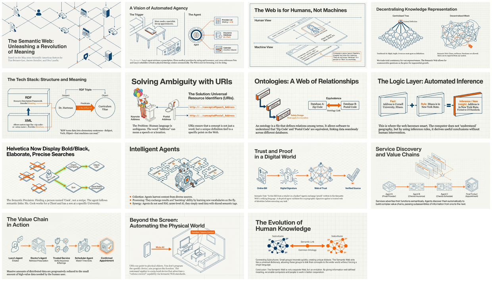

# The Semantic Web (Scientific American, May 2001)

[🏠 Home](../../../README.md) / [LinkedIn Published](../../README.md) / [3rd Party Content](../README.md) / **The Semantic Web**

---

## Overview

This is the seminal article that introduced the concept of the Semantic Web to the world. Written by **Tim Berners-Lee** (inventor of the World Wide Web), **James Hendler**, and **Ora Lassila**, it envisions a web where information is given well-defined meaning, enabling computers and people to work in cooperation. The article describes how software agents would use ontologies, RDF, and inference rules to perform sophisticated tasks — a vision that directly anticipates today's knowledge graphs and AI systems.

---

## LinkedIn Post

📎 [View LinkedIn Post](https://www.linkedin.com/feed/update/urn:li:activity:7422249486254579713/)

---

## Infographic

---

## Slide Deck

*Click the mosaic above to view the full 15-slide presentation (PDF)*

---

## Semantic Knowledge Graph

For detailed concept mapping, relationships, and exportable graph data, see:

**[SEMANTIC-GRAPH.md](SEMANTIC-GRAPH.md)** - Contains Mermaid diagrams, concept taxonomy, and Cypher export for Neo4j integration.

---

## Key Concepts from the Article

| Concept | Description |
|---------|-------------|
| **Semantic Web** | An extension of the Web where information has well-defined meaning, enabling machine comprehension |
| **RDF (Resource Description Framework)** | Encodes meaning in subject-verb-object triples, each identified by URIs |
| **Ontologies** | Documents that formally define relations among terms; include taxonomy and inference rules |
| **Software Agents** | Programs that collect, process, and exchange Web content to perform tasks for users |
| **Knowledge Representation** | Structured collections of information and inference rules for automated reasoning |
| **URIs (Universal Resource Identifiers)** | Unique identifiers that tie concepts to definitions anyone can find on the Web |

---

## The Authors

| Author | Role | Affiliation (2001) |
|--------|------|-------------------|
| **Tim Berners-Lee** | Inventor of the World Wide Web | W3C Director, MIT Lab for Computer Science |
| **James Hendler** | Knowledge Representation Researcher | Professor, University of Maryland; DARPA |
| **Ora Lassila** | Co-author of RDF Specification | Nokia Research Center, W3C Advisory Board |

---

## Historical Significance

This article is historically significant because:

- **First mainstream articulation** of the Semantic Web vision to a general audience
- **Predicted software agents** that would perform complex tasks by reasoning over structured data
- **Introduced ontologies** as a mechanism for shared understanding between systems
- **Laid groundwork** for technologies like OWL, SPARQL, and modern knowledge graphs
- **Anticipated LLM-era challenges**: the article discusses how agents should verify information sources and exchange proofs — remarkably relevant to today's AI systems

---

## From Vision to Reality (2001 → 2025)

| 2001 Vision | 2025 Reality |
|-------------|--------------|
| Software agents scheduling appointments | LLM-powered assistants (Claude, ChatGPT) |
| Ontologies defining relations | Knowledge graphs (Wikidata, Google KG) |
| RDF triples encoding meaning | Graph databases (Neo4j), semantic web standards |
| Service discovery via descriptions | APIs, microservices, MCP connectors |
| Inference engines verifying proofs | RAG systems, citation-backed AI responses |
| Devices advertising capabilities | IoT protocols, smart home integration |

---

## Source Information

| Property | Value |
|----------|-------|
| **Original Source** | [Scientific American - The Semantic Web (May 2001)](./Scientific%20American_%20Feature%20Article%20-%20The%20Semantic%20Web_%20May%202001.pdf) |
| **Infographic** | [Semantic Web - Machine Comprehension](./28%20Jan%20-%20Semantic%20Web%20-%20Machine%20Comprehension.jpg) |
| **Slide Deck** | [The Web of Data](./28%20Jan%20-%20The_Web_of_Data.pdf) (15 slides) |
| **Date** | May 2001 (original), January 2026 (NotebookLM processing) |
| **Authors** | Tim Berners-Lee, James Hendler, Ora Lassila |
| **Publication** | Scientific American |

---

## Navigation

| Direction | Link |
|-----------|------|
| ⬆️ Parent | [3rd Party Content](../README.md) |
| 🏠 Home | [Repository Root](../../../README.md) |

---

*Generated with [Google NotebookLM](https://notebooklm.google.com/) — Source document → Infographic → Slide deck*
