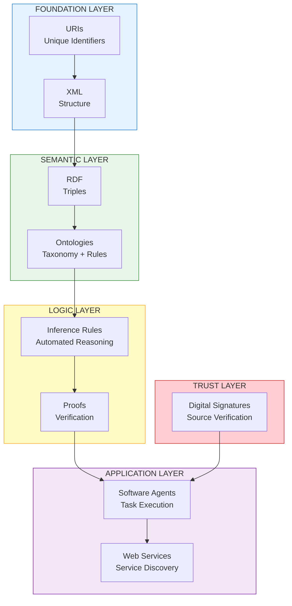
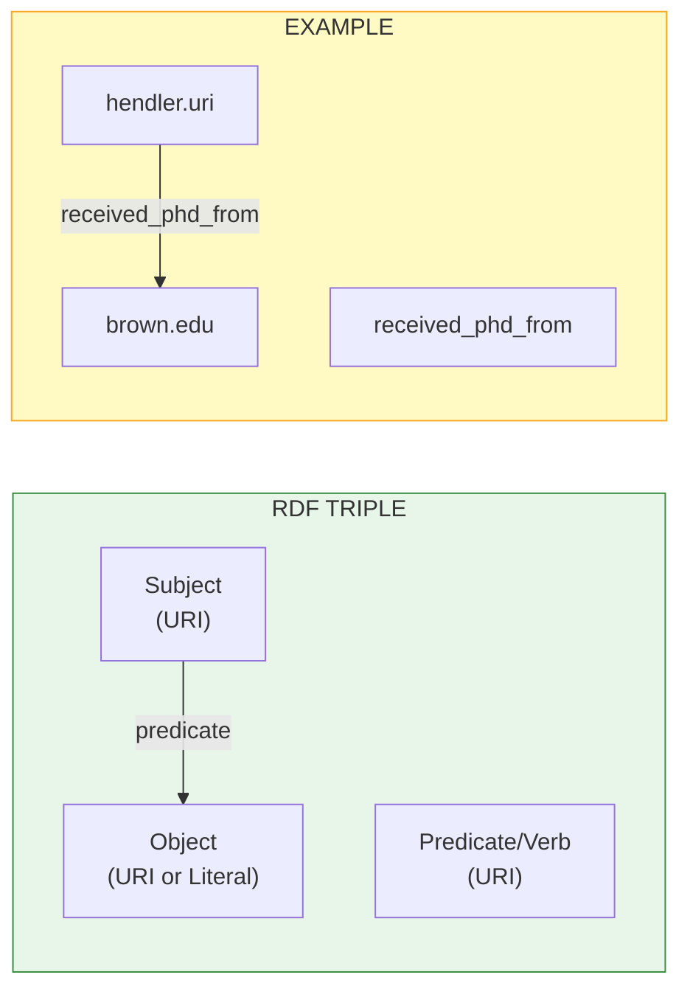
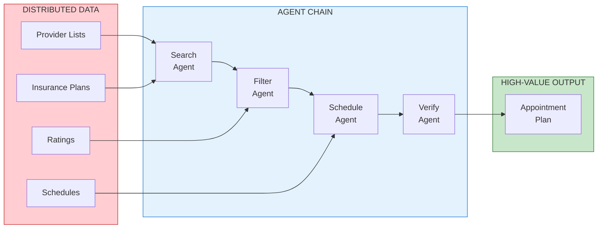
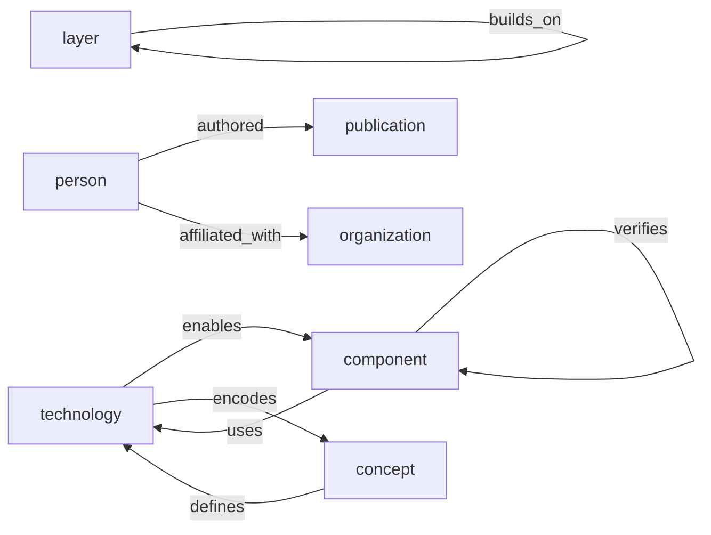
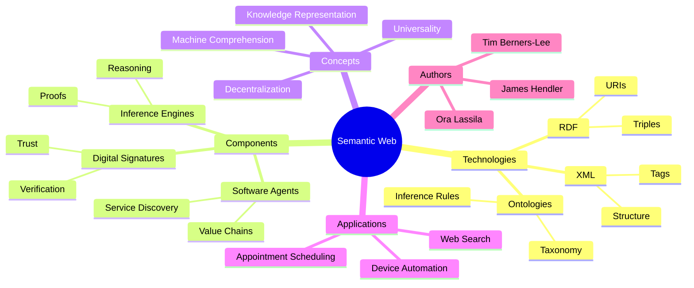
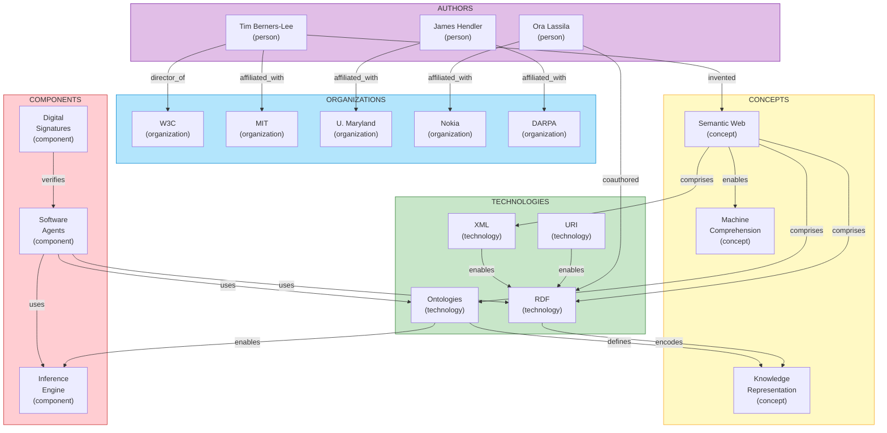

# The Semantic Web - Knowledge Graph

[📖 README](./README.md) · [🖼️ Infographic](./28%20Jan%20-%20Semantic%20Web%20-%20Machine%20Comprehension.jpg) · [📑 Slides](./28%20Jan%20-%20The_Web_of_Data.pdf) · [🏠 Home](../../../README.md)

> *Semantic Knowledge Graph (SKG) — machine-readable metadata for search, discovery, and graph database integration*

---

## Summary

The Semantic Web, as envisioned by Tim Berners-Lee, James Hendler, and Ora Lassila in this seminal 2001 Scientific American article, is an extension of the World Wide Web where information is given well-defined meaning, enabling computers and people to work in cooperation. Unlike the document-centric Web of 2001, the Semantic Web would be a web of data where software agents use RDF (Resource Description Framework) to encode meaning in subject-verb-object triples, ontologies to define relationships among terms, and inference rules to perform automated reasoning. The vision describes agents scheduling appointments, verifying insurance coverage, and discovering services — all by exchanging semantically rich data. The article introduced concepts (URIs for unique identification, ontologies for shared vocabularies, knowledge representation for reasoning) that laid the foundation for today's knowledge graphs, linked data, and remarkably, anticipated the need for AI systems to verify sources and exchange proofs.

---

## Key Concepts

- **Semantic Web**: An extension of the current Web where information is given well-defined meaning, better enabling computers and people to work in cooperation — not a separate Web, but the same Web with added structure.

- **RDF (Resource Description Framework)**: Encodes meaning in sets of triples (subject, verb, object), each identified by URIs, forming webs of information about related things.

- **Ontologies**: Documents or files that formally define relations among terms, typically containing a taxonomy (classes and subclasses) and inference rules.

- **Software Agents**: Programs that collect Web content from diverse sources, process information, and exchange results with other programs to perform sophisticated tasks for users.

- **Knowledge Representation**: Structured collections of information and sets of inference rules that computers use to conduct automated reasoning.

- **URIs (Universal Resource Identifiers)**: Unique identifiers that ensure concepts are tied to definitions anyone can find on the Web, solving the problem of ambiguous terms.

- **Inference Rules**: Logical rules in ontologies that allow programs to deduce new facts from existing data (e.g., "if a city code is associated with a state code, then an address using that city code has that state code").

- **Digital Signatures**: Encrypted blocks of data that verify information comes from a trusted source — agents should be skeptical until they check sources.

---

## Core Arguments

1. **Machine Comprehension, Not AI**: The Semantic Web enables machines to comprehend semantic documents and data, not human speech — it achieves useful "understanding" without requiring HAL-level artificial intelligence.

2. **Decentralization is Essential**: Like the Web itself, the Semantic Web must be decentralized, accepting compromises (like "404 Not Found") to allow exponential growth and universal participation.

3. **URIs Solve Ambiguity**: By using unique URIs for each concept, different systems can distinguish between homonyms (address-as-location vs. address-as-speech) and discover equivalences.

4. **Ontologies Enable Interoperability**: When different databases use different terms for the same concept, ontologies provide equivalence relations and inference rules to bridge the gap.

5. **Value Chains Create Intelligence**: Complex queries are solved by chains of agents, each adding value — reducing large amounts of distributed data to small amounts of high-value information.

6. **Evolution Through Linking**: The Semantic Web assists the evolution of human knowledge by letting anyone express new concepts via URIs and progressively link them into a universal Web.

---

## Key Quotes

> "The Semantic Web will bring structure to the meaningful content of Web pages, creating an environment where software agents roaming from page to page can readily carry out sophisticated tasks for users."

> "The Semantic Web is not a separate Web but an extension of the current one, in which information is given well-defined meaning, better enabling computers and people to work in cooperation."

> "The Semantic Web will enable machines to COMPREHEND semantic documents and data, not human speech and writings."

> "Agents should be skeptical of assertions that they read on the Semantic Web until they have checked the sources of information."

> "Properly designed, the Semantic Web can assist the evolution of human knowledge as a whole."

> "The essential property of the World Wide Web is its universality. The power of a hypertext link is that 'anything can link to anything.'"

---

## Tags

`semantic-web` `tim-berners-lee` `rdf` `ontologies` `knowledge-representation` `software-agents` `uri` `xml` `inference-rules` `linked-data` `w3c` `knowledge-graphs` `machine-comprehension` `web-of-data` `scientific-american`

---

## Search Phrases

- "Semantic Web Tim Berners-Lee"
- "RDF Resource Description Framework"
- "ontologies knowledge representation"
- "software agents web"
- "machine-readable web content"
- "URI unique resource identifier"
- "web of data linked data"
- "semantic web 2001 original article"
- "knowledge graphs foundation"
- "automated reasoning web"

---

## Semantic Knowledge Graph

### Semantic Web Architecture (Visual)



### RDF Triple Structure



### Agent Value Chain



---

### Ontology

#### Node Types

| Ref | Description | Example |
|-----|-------------|---------|
| `technology` | A technical component or standard | RDF, XML, URI |
| `concept` | An abstract idea or principle | Knowledge Representation, Ontology |
| `component` | A functional element | Software Agent, Inference Engine |
| `person` | An individual | Tim Berners-Lee |
| `organization` | An institution | W3C, MIT, DARPA |
| `publication` | A document or article | Scientific American |
| `layer` | An architectural layer | Foundation, Semantic, Logic, Application |
| `example` | An illustrative scenario | Pete and Lucy appointment scheduling |

#### Predicates

| Ref | Inverse | Description |
|-----|---------|-------------|
| `enables` | `enabled_by` | Technology enables capability |
| `encodes` | `encoded_by` | Technology encodes meaning |
| `defines` | `defined_by` | Ontology defines relations |
| `uses` | `used_by` | Component uses technology |
| `authored` | `authored_by` | Person authored publication |
| `affiliated_with` | `has_member` | Person affiliated with organization |
| `builds_on` | `foundation_for` | Layer builds on another |
| `verifies` | `verified_by` | Component verifies information |



---

### Taxonomy



#### ASCII Tree

```
semantic_web
├── technologies
│   ├── xml
│   │   ├── tags
│   │   └── structure
│   ├── rdf
│   │   ├── triples
│   │   ├── uris
│   │   └── subject_verb_object
│   └── ontologies
│       ├── taxonomy
│       ├── inference_rules
│       └── equivalence_relations
├── components
│   ├── software_agents
│   │   ├── service_discovery
│   │   ├── value_chains
│   │   └── task_delegation
│   ├── inference_engines
│   │   ├── proofs
│   │   └── automated_reasoning
│   └── digital_signatures
│       ├── trust
│       └── source_verification
├── architectural_layers
│   ├── foundation (uri, xml)
│   ├── semantic (rdf, ontologies)
│   ├── logic (inference, proofs)
│   ├── application (agents, services)
│   └── trust (signatures)
├── key_concepts
│   ├── knowledge_representation
│   ├── machine_comprehension
│   ├── decentralization
│   └── universality
└── authors
    ├── tim_berners_lee
    ├── james_hendler
    └── ora_lassila
```

---

### Knowledge Graph



#### Nodes Table

| ID | Type | Name | Description |
|----|------|------|-------------|
| `semantic_web` | `concept` | Semantic Web | Extension of Web with well-defined meaning |
| `rdf` | `technology` | RDF | Resource Description Framework - triples encoding |
| `xml` | `technology` | XML | eXtensible Markup Language - structure |
| `uri` | `technology` | URI | Universal Resource Identifier - unique naming |
| `ontology` | `technology` | Ontology | Formal definition of term relations |
| `knowledge_representation` | `concept` | Knowledge Representation | Structured information + inference rules |
| `machine_comprehension` | `concept` | Machine Comprehension | Machines understanding semantic data |
| `software_agent` | `component` | Software Agent | Program performing tasks using semantic data |
| `inference_engine` | `component` | Inference Engine | System applying rules to derive new facts |
| `digital_signature` | `component` | Digital Signature | Encrypted verification of source |
| `triple` | `concept` | RDF Triple | Subject-verb-object statement |
| `taxonomy` | `concept` | Taxonomy | Hierarchical classification of concepts |
| `inference_rule` | `concept` | Inference Rule | Logical rule for deriving facts |
| `service_discovery` | `concept` | Service Discovery | Finding services via descriptions |
| `value_chain` | `concept` | Value Chain | Agents passing processed data |
| `tim_berners_lee` | `person` | Tim Berners-Lee | Inventor of WWW, W3C Director |
| `james_hendler` | `person` | James Hendler | Knowledge representation researcher |
| `ora_lassila` | `person` | Ora Lassila | Co-author of RDF specification |
| `w3c` | `organization` | W3C | World Wide Web Consortium |
| `mit` | `organization` | MIT | Massachusetts Institute of Technology |
| `darpa` | `organization` | DARPA | Defense Advanced Research Projects Agency |
| `scientific_american` | `publication` | Scientific American | May 2001 publication |

#### Edges Table

| From | Predicate | To | Description |
|------|-----------|-----|-------------|
| `tim_berners_lee` | `invented` | `semantic_web` | TBL created the vision |
| `tim_berners_lee` | `director_of` | `w3c` | TBL leads W3C |
| `tim_berners_lee` | `affiliated_with` | `mit` | TBL at MIT |
| `james_hendler` | `affiliated_with` | `darpa` | Hendler at DARPA |
| `ora_lassila` | `coauthored` | `rdf` | Lassila co-wrote RDF spec |
| `uri` | `enables` | `rdf` | URIs identify triple elements |
| `xml` | `enables` | `rdf` | XML provides structure for RDF |
| `rdf` | `encodes` | `knowledge_representation` | RDF encodes meaning |
| `ontology` | `defines` | `knowledge_representation` | Ontologies define relations |
| `ontology` | `contains` | `taxonomy` | Ontologies include taxonomies |
| `ontology` | `contains` | `inference_rule` | Ontologies include rules |
| `inference_engine` | `applies` | `inference_rule` | Engines apply rules |
| `software_agent` | `uses` | `rdf` | Agents read RDF data |
| `software_agent` | `uses` | `ontology` | Agents use ontologies |
| `software_agent` | `uses` | `inference_engine` | Agents use reasoning |
| `software_agent` | `performs` | `service_discovery` | Agents find services |
| `software_agent` | `creates` | `value_chain` | Agents form chains |
| `digital_signature` | `verifies` | `software_agent` | Signatures verify sources |
| `semantic_web` | `comprises` | `rdf` | SW includes RDF |
| `semantic_web` | `comprises` | `ontology` | SW includes ontologies |
| `semantic_web` | `enables` | `machine_comprehension` | SW enables machine understanding |
| `triple` | `has_component` | `uri` | Triples use URIs |
| `rdf` | `uses` | `triple` | RDF is based on triples |

---

### Cypher Import (Neo4j)

```cypher
// =====================================================
// SEMANTIC WEB (2001) - KNOWLEDGE GRAPH IMPORT
// =====================================================

// Create Person nodes
CREATE (tbl:Person {
    id: 'tim_berners_lee',
    name: 'Tim Berners-Lee',
    description: 'Inventor of the World Wide Web, W3C Director',
    role: 'Director'
})
CREATE (jh:Person {
    id: 'james_hendler',
    name: 'James Hendler',
    description: 'Knowledge representation researcher',
    role: 'Professor'
})
CREATE (ol:Person {
    id: 'ora_lassila',
    name: 'Ora Lassila',
    description: 'Co-author of RDF specification',
    role: 'Research Fellow'
})

// Create Organization nodes
CREATE (w3c:Organization {id: 'w3c', name: 'W3C', description: 'World Wide Web Consortium'})
CREATE (mit:Organization {id: 'mit', name: 'MIT', description: 'Massachusetts Institute of Technology'})
CREATE (umd:Organization {id: 'umd', name: 'University of Maryland', description: 'College Park'})
CREATE (nokia:Organization {id: 'nokia', name: 'Nokia', description: 'Nokia Research Center'})
CREATE (darpa:Organization {id: 'darpa', name: 'DARPA', description: 'Defense Advanced Research Projects Agency'})

// Create Technology nodes
CREATE (xml:Technology {id: 'xml', name: 'XML', description: 'eXtensible Markup Language'})
CREATE (rdf:Technology {id: 'rdf', name: 'RDF', description: 'Resource Description Framework'})
CREATE (uri:Technology {id: 'uri', name: 'URI', description: 'Universal Resource Identifier'})
CREATE (ont:Technology {id: 'ontology', name: 'Ontology', description: 'Formal definition of term relations'})

// Create Concept nodes
CREATE (sw:Concept {id: 'semantic_web', name: 'Semantic Web', description: 'Web with well-defined meaning'})
CREATE (kr:Concept {id: 'knowledge_representation', name: 'Knowledge Representation', description: 'Structured information + inference rules'})
CREATE (mc:Concept {id: 'machine_comprehension', name: 'Machine Comprehension', description: 'Machines understanding semantic data'})
CREATE (triple:Concept {id: 'triple', name: 'RDF Triple', description: 'Subject-verb-object statement'})
CREATE (taxonomy:Concept {id: 'taxonomy', name: 'Taxonomy', description: 'Hierarchical classification'})
CREATE (infrule:Concept {id: 'inference_rule', name: 'Inference Rule', description: 'Logical rule for deriving facts'})
CREATE (sd:Concept {id: 'service_discovery', name: 'Service Discovery', description: 'Finding services via descriptions'})
CREATE (vc:Concept {id: 'value_chain', name: 'Value Chain', description: 'Agents passing processed data'})

// Create Component nodes
CREATE (agent:Component {id: 'software_agent', name: 'Software Agent', description: 'Program performing tasks using semantic data'})
CREATE (inf:Component {id: 'inference_engine', name: 'Inference Engine', description: 'System applying rules'})
CREATE (sig:Component {id: 'digital_signature', name: 'Digital Signature', description: 'Source verification'})

// Create Publication node
CREATE (pub:Publication {
    id: 'scientific_american_2001',
    name: 'The Semantic Web',
    publication: 'Scientific American',
    date: 'May 2001'
})

// =====================================================
// CREATE RELATIONSHIPS
// =====================================================

// Author relationships
CREATE (tbl)-[:AUTHORED]->(pub)
CREATE (jh)-[:AUTHORED]->(pub)
CREATE (ol)-[:AUTHORED]->(pub)

CREATE (tbl)-[:INVENTED]->(sw)
CREATE (tbl)-[:DIRECTOR_OF]->(w3c)
CREATE (tbl)-[:AFFILIATED_WITH]->(mit)
CREATE (jh)-[:AFFILIATED_WITH]->(umd)
CREATE (jh)-[:AFFILIATED_WITH]->(darpa)
CREATE (ol)-[:AFFILIATED_WITH]->(nokia)
CREATE (ol)-[:COAUTHORED_SPEC]->(rdf)

// Technology relationships
CREATE (uri)-[:ENABLES]->(rdf)
CREATE (xml)-[:ENABLES]->(rdf)
CREATE (rdf)-[:ENCODES]->(kr)
CREATE (rdf)-[:USES]->(triple)
CREATE (ont)-[:DEFINES]->(kr)
CREATE (ont)-[:CONTAINS]->(taxonomy)
CREATE (ont)-[:CONTAINS]->(infrule)
CREATE (triple)-[:HAS_COMPONENT]->(uri)

// Component relationships
CREATE (agent)-[:USES]->(rdf)
CREATE (agent)-[:USES]->(ont)
CREATE (agent)-[:USES]->(inf)
CREATE (agent)-[:PERFORMS]->(sd)
CREATE (agent)-[:CREATES]->(vc)
CREATE (inf)-[:APPLIES]->(infrule)
CREATE (sig)-[:VERIFIES]->(agent)

// Semantic Web relationships
CREATE (sw)-[:COMPRISES]->(xml)
CREATE (sw)-[:COMPRISES]->(rdf)
CREATE (sw)-[:COMPRISES]->(ont)
CREATE (sw)-[:ENABLES]->(mc)
CREATE (sw)-[:ENABLES]->(agent)

// Publication relationships
CREATE (pub)-[:INTRODUCES]->(sw)
CREATE (pub)-[:DESCRIBES]->(rdf)
CREATE (pub)-[:DESCRIBES]->(ont)
CREATE (pub)-[:DESCRIBES]->(agent)
```

---

### How to Import into Neo4j Sandbox

1. **Create a free Neo4j Sandbox** at [sandbox.neo4j.com](https://sandbox.neo4j.com)
   - Select "Blank Sandbox" (or any template, then clear it)
   - Wait for provisioning (~30 seconds)

2. **Open Neo4j Browser** by clicking "Open with Browser"

3. **Copy the entire Cypher script above** and paste into the query box

4. **Run the query** (click Play or press Ctrl+Enter)

5. **Verify import** with: `MATCH (n) RETURN count(n) as nodes` (should return ~22 nodes)

---

### Sample Queries to Explore

**1. View the entire knowledge graph:**
```cypher
MATCH (n)-[r]->(m)
RETURN n, r, m
```

**2. Find what the Semantic Web comprises:**
```cypher
MATCH (sw:Concept {name: 'Semantic Web'})-[:COMPRISES|ENABLES]->(t)
RETURN sw.name AS Concept, type(r) AS Relationship, t.name AS Component
```

**3. Trace the technology stack from URI to agents:**
```cypher
MATCH path = (uri:Technology {name: 'URI'})-[*..5]->(agent:Component {name: 'Software Agent'})
RETURN path
```

**4. Find all author affiliations:**
```cypher
MATCH (p:Person)-[:AFFILIATED_WITH|DIRECTOR_OF]->(o:Organization)
RETURN p.name AS Author, collect(o.name) AS Organizations
```

**5. What do ontologies contain and enable?**
```cypher
MATCH (ont:Technology {name: 'Ontology'})-[r]->(target)
RETURN type(r) AS Relationship, target.name AS Target
```

**6. Find the components that use technologies:**
```cypher
MATCH (c:Component)-[:USES]->(t:Technology)
RETURN c.name AS Component, collect(t.name) AS Technologies
```

**7. Trace from RDF to machine comprehension:**
```cypher
MATCH path = (rdf:Technology {name: 'RDF'})-[*..4]->(mc:Concept {name: 'Machine Comprehension'})
RETURN path
```

---

## Metadata

| Field | Value |
|-------|-------|
| **Content Type** | Academic Article / Vision Paper |
| **Domain** | Computer Science / Web Technology |
| **Sub-domain** | Semantic Web / Knowledge Representation |
| **Authors** | Tim Berners-Lee, James Hendler, Ora Lassila |
| **Publication** | Scientific American |
| **Date Published** | May 2001 |
| **Historical Significance** | Foundational paper introducing Semantic Web to mainstream |
| **Source Format** | PDF (4 pages) |
| **Derived Assets** | Infographic, Slide Deck |

---

## Related Content

| Relationship | Content |
|--------------|---------|
| `foundation_for` | OWL (Web Ontology Language) |
| `foundation_for` | SPARQL Query Language |
| `foundation_for` | Linked Data Movement |
| `foundation_for` | Knowledge Graphs (Google, Wikidata) |
| `inspired` | Schema.org |
| `related_to` | W3C Standards |
| `related_to` | DARPA Agent Markup Language (DAML) |
| `related_to` | SHOE (Simple HTML Ontology Extensions) |
| `anticipated` | LLM-based agents with tool use |
| `anticipated` | RAG (Retrieval Augmented Generation) |
| `book_by_author` | "Weaving the Web" by Tim Berners-Lee |
