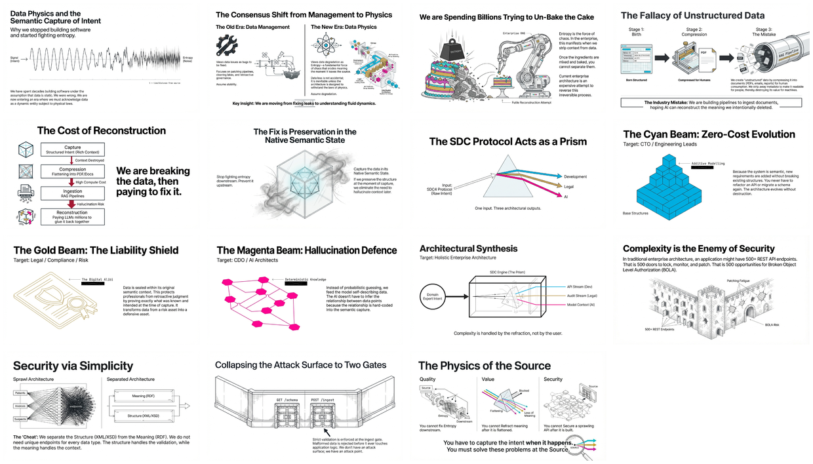

# Data Physics and the Semantic Capture of Intent

[🏠 Home](../../../README.md) / [LinkedIn Published](../../README.md) / [3rd Party Content](../README.md) / **Data Physics**

---

## Overview

This folder contains curated content on "Data Physics" - a paradigm shift from traditional data management to understanding data entropy as a fundamental force. The core thesis: capture semantic intent at the source to prevent entropy, rather than trying to reconstruct meaning downstream with AI.

---

## Infographic

---

## Slide Deck

*Click the mosaic above to view the full 15-slide presentation (PDF)*

---

## Semantic Knowledge Graph

For detailed concept mapping, relationships, and exportable graph data, see:

**[SEMANTIC-GRAPH.md](SEMANTIC-GRAPH.md)** - Contains Mermaid diagrams, concept taxonomy, and Cypher export for Neo4j integration.

---

## Source Information

| Property | Value |
|----------|-------|
| **Source** | [source.txt](source.txt) - Original Substack article |
| **Origin** | [Substack Post #185831042](https://substack.com/inbox/post/185831042) |
| **Infographic** | [26 Data Physics - Capturing Intent.jpg](26%20Data%20Physics%20-%20Capturing%20Intent.jpg) |
| **Slide Deck** | [26 Jan - Data_Physics_Solving_Entropy.pdf](26%20Jan%20-%20Data_Physics_Solving_Entropy.pdf) (15 slides) |
| **Date** | January 26, 2026 |
| **Content Type** | 3rd Party - External thought leadership |

---

## Key Concepts

### The Three Metaphors

| Metaphor | Problem | Solution |
|----------|---------|----------|
| **The Cake** | Data becomes "unstructured" when compressed into documents for human consumption | Capture data in its Native Semantic State at the moment of creation |
| **The Prism** | Single source of truth refracts into multiple value streams | SDC4 Protocol as "white light" producing Cyan (Dev), Gold (Legal), Magenta (AI) beams |
| **The Fortress** | 500+ REST endpoints = 500 attack vectors | Collapse to 2 endpoints: GET /schema, POST /ingest |

### Core Arguments

1. **Data Entropy is Real**: Data quality degrades the moment it leaves its source - this is physics, not a bug
2. **Un-baking the Cake is Expensive**: RAG and LLMs are paying to reconstruct context that was destroyed
3. **Solve at Source**: You cannot secure, govern, or fix data downstream - capture intent when it happens
4. **Security via Simplicity**: Reduce attack surface from hundreds of endpoints to two well-guarded gates

---

## Related LinkedIn Posts

| Post | Content |
|------|---------|
| [Post with Source Material](https://www.linkedin.com/feed/update/urn:li:activity:7421527915898638337/) | Original article discussion |
| [Post with Slides](https://www.linkedin.com/feed/update/urn:li:ugcPost:7421605976543367168/) | Slide deck presentation |
| [Post with Semantic Graph](https://www.linkedin.com/feed/update/urn:li:ugcPost:7421615241991544832/) | Knowledge graph and Cypher export |

---

## Navigation

| Direction | Link |
|-----------|------|
| ⬆️ Parent | [3rd Party Content](../README.md) |
| 🏠 Home | [Repository Root](../../../README.md) |
