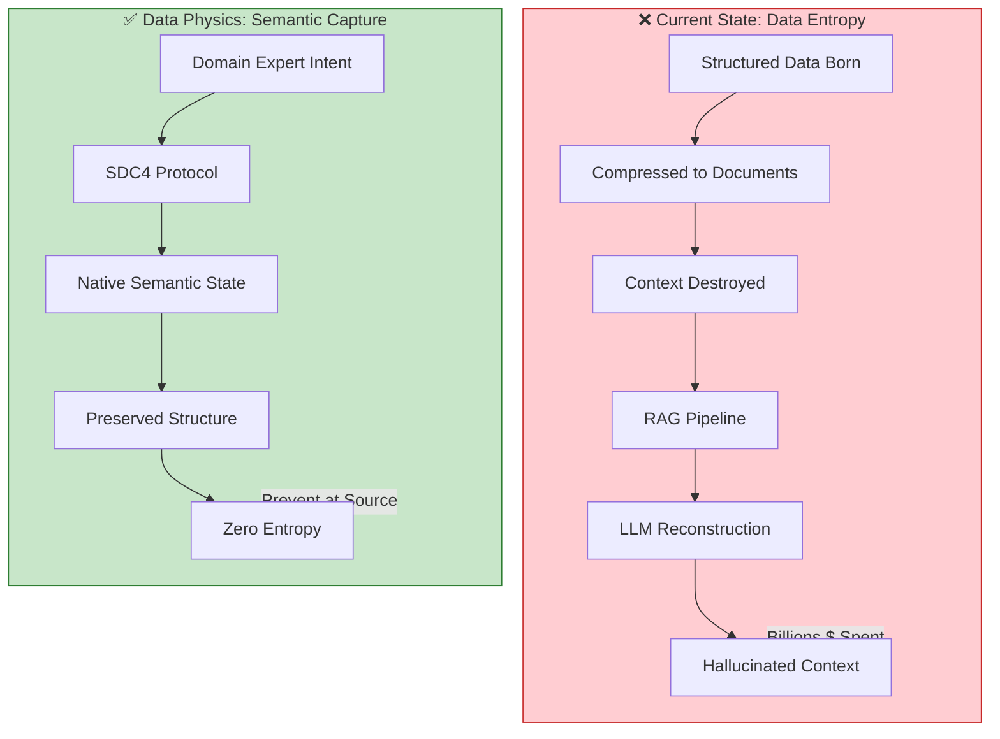
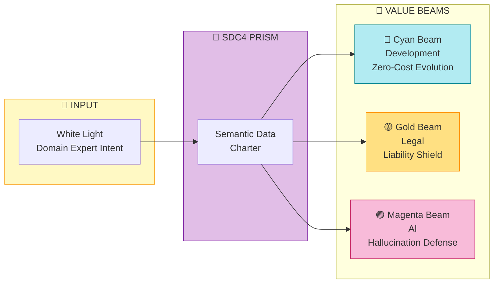
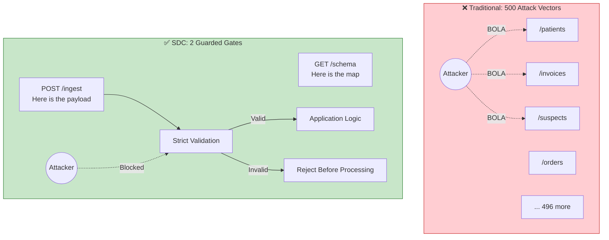
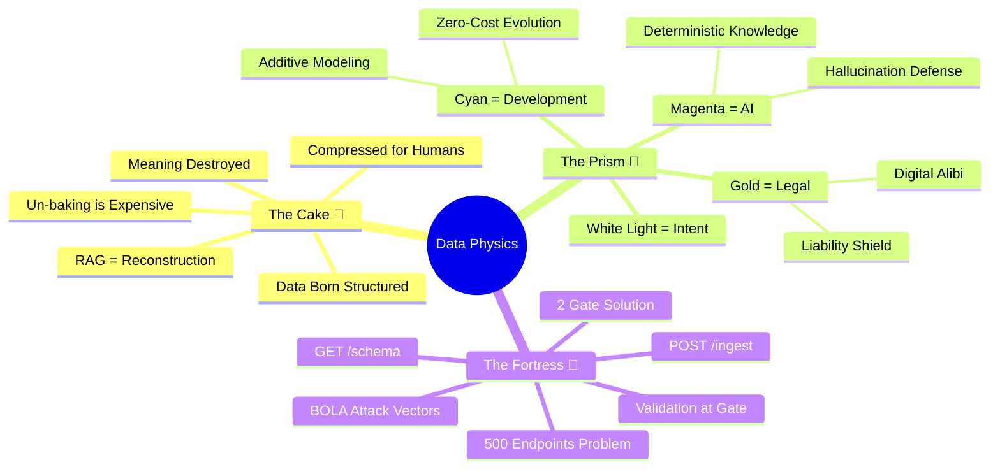
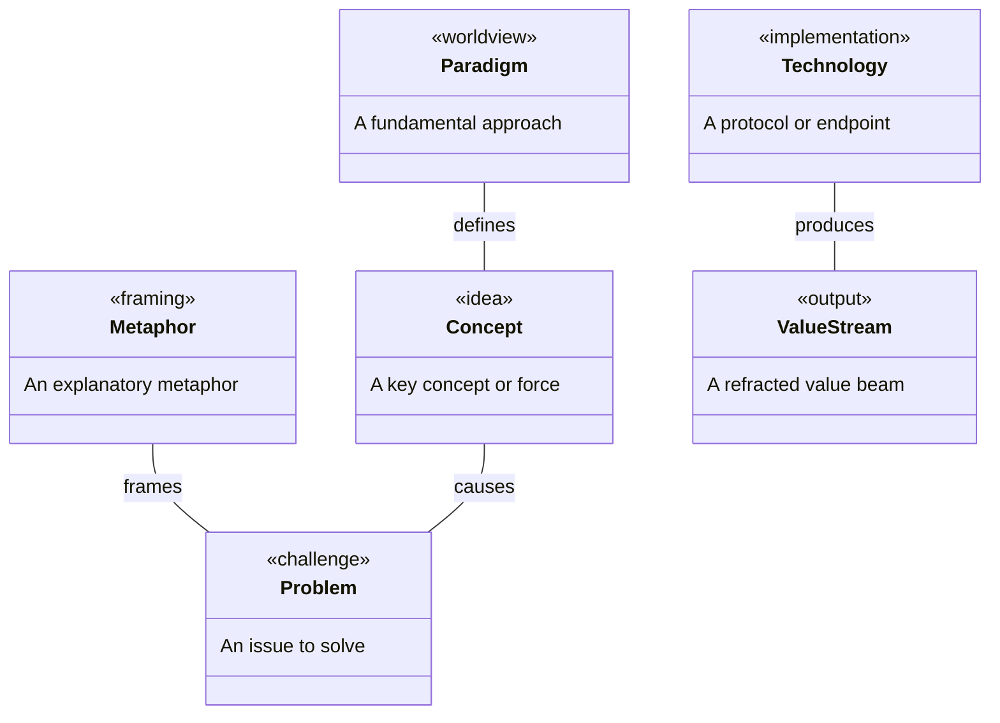
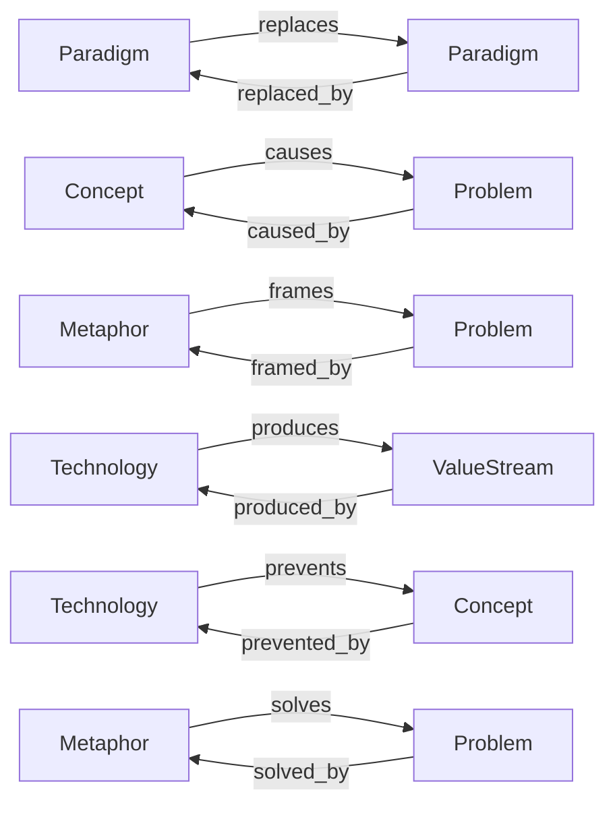
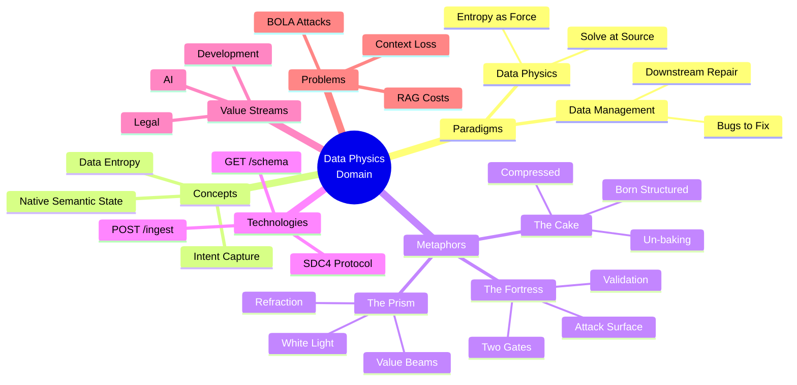
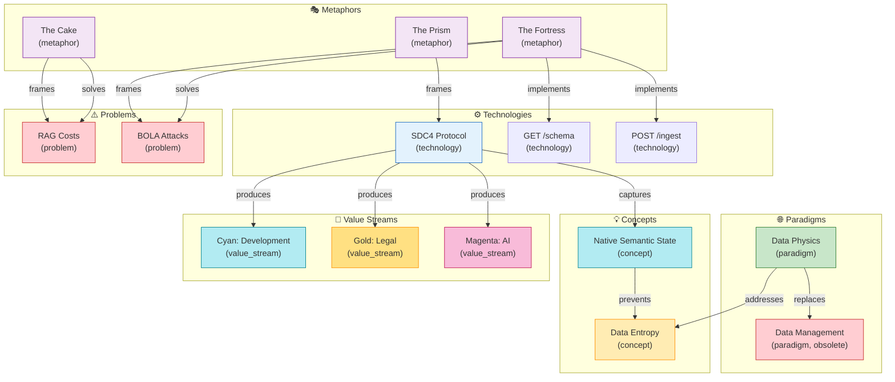

# Data Physics and the Semantic Capture of Intent

[📖 README](./README.md) · [🖼️ Infographic](./26%20Data%20Physics%20-%20Capturing%20Intent.jpg) · [📑 Slides](./26%20Jan%20-%20Data_Physics_Solving_Entropy.pdf) · [🏠 Home](../../../README.md)

> *Semantic Knowledge Graph (SKG) — machine-readable metadata for search, discovery, and graph database integration*

---

## Summary

This document maps the conceptual architecture of "Data Physics" - a paradigm treating data quality degradation as entropy (a fundamental force) rather than bugs to fix. The Semantic Data Charter (SDC) approach captures intent at source, preventing downstream reconstruction costs. Three metaphors frame the solution: The Cake (don't un-bake compressed documents), The Prism (single truth refracts into Dev/Legal/AI value), and The Fortress (collapse 500 endpoints to 2 guarded gates).

---

## Key Concepts

- **Data Physics**: A paradigm shift from "Data Management" — treating data degradation as entropy, a fundamental force of chaos requiring prevention rather than repair.

- **Data Entropy**: The degradation of meaning that occurs the moment data leaves its source — structure and context are progressively lost.

- **Native Semantic State**: Capturing data with its full structure and metadata at the moment of creation, before entropy destroys its machine-readable value.

- **SDC4 Protocol**: Semantic Data Charter protocol that acts as "white light" — raw domain expert intent that refracts into development, legal, and AI value streams.

- **The Cake Metaphor**: Data isn't born unstructured — we compress it into documents for humans, destroying its value to machines. RAG is "un-baking the cake."

- **The Prism Metaphor**: SDC acts as a prism, refracting single-source truth into Cyan (Development), Gold (Legal), and Magenta (AI) value beams.

- **The Fortress Metaphor**: Traditional APIs have 500+ attack vectors; SDC collapses this to 2 endpoints (GET /schema, POST /ingest) with validation at the gate.

---

## Core Arguments

1. **Data is born structured** — form entries, sensor readings, transactions all start with structure. We compress them into documents for human readability, destroying their machine value.

2. **RAG is expensive reconstruction** — we are paying billions to LLM companies to reconstruct context we deliberately destroyed when flattening data into PDFs and reports.

3. **Solve at source, not downstream** — you cannot secure a sprawling API after it's built, govern data after it's flattened, or fix context after the domain expert has retired.

4. **Security through simplicity** — 500 REST endpoints means 500 BOLA attack vectors; collapsing to 2 well-guarded gates with strict validation eliminates the attack surface.

5. **Single source, multiple outputs** — the SDC4 Protocol captures intent once and produces development (zero-cost evolution), legal (liability shield), and AI (hallucination defense) value.

---

## Key Quotes

> "We are spending billions trying to 'un-bake the cake' of enterprise data. It's time to fix the ingredients."

> "Data is rarely born unstructured. It starts as a form entry, a sensor reading, or a transaction. It is born structured."

> "We are breaking the data, and then paying LLM companies millions to glue it back together."

> "We don't have an attack surface; we have an attack point."

> "You cannot solve these problems downstream. You have to solve it at the Source."

---

## Tags

`#data-physics` `#data-entropy` `#semantic-data` `#SDC` `#RAG` `#data-architecture` `#API-security` `#BOLA` `#intent-capture` `#knowledge-graphs` `#data-quality` `#enterprise-data`

---

## Search Phrases

- "data physics vs data management"
- "data entropy enterprise"
- "semantic data charter SDC"
- "un-bake the cake data"
- "RAG reconstruction costs"
- "native semantic state capture"
- "API attack surface reduction"
- "BOLA prevention two endpoints"
- "data quality as physics"
- "intent capture at source"

---

## Metadata

| Field | Value |
|-------|-------|
| **Content Type** | 3rd Party Thought Leadership |
| **Domain** | Data Architecture / Enterprise Data |
| **Sub-domain** | Data Quality, API Security |
| **Format** | PDF (15 slides) + Infographic |
| **Date** | January 2026 |
| **Source** | Substack Post #185831042 |
| **Target Audience** | Data Architects, Security Engineers, Enterprise Architects |

---

## Related Content

| Relationship | Content |
|--------------|---------|
| `references` | Dinis Cruz - Security Research (BOLA, API Attack Surface) |
| `related_to` | RAG Pipeline Architecture |
| `related_to` | Enterprise Data Governance |
| `implements` | Semantic Data Charter (SDC4 Protocol) |
| `contrasts_with` | Traditional Data Management Paradigm |

---

## Semantic Knowledge Graph

### The Entropy Problem vs Solution (Visual)



### Value Prism Architecture (Visual)



### Security Architecture: Fortress (Visual)



### Three Metaphors Mind Map (Visual)



---

### Ontology

> The ontology defines the **types of entities** (nodes) and **relationships** (predicates) in this knowledge domain.

#### Node Types



| Ref | Description | Examples |
|-----|-------------|----------|
| `paradigm` | A fundamental worldview/approach | Data Physics, Data Management |
| `concept` | A key idea or force in the domain | Data Entropy, Native Semantic State |
| `metaphor` | An explanatory framing device | The Cake, The Prism, The Fortress |
| `value_stream` | An output value beam | Cyan (Dev), Gold (Legal), Magenta (AI) |
| `technology` | A protocol or implementation | SDC4 Protocol, GET /schema, POST /ingest |
| `problem` | A challenge to be addressed | RAG Costs, BOLA Attacks, Context Loss |

#### Predicates (Relationships)



| Ref | Inverse | Description |
|-----|---------|-------------|
| `replaces` | `replaced_by` | Paradigm succession |
| `causes` | `caused_by` | Causal relationship |
| `frames` | `framed_by` | Metaphor explaining problem |
| `produces` | `produced_by` | Technology producing value |
| `prevents` | `prevented_by` | Solution preventing problem |
| `solves` | `solved_by` | Resolution relationship |
| `references` | `referenced_by` | Citation relationship |

---

### Taxonomy

> Hierarchical classification of concepts in this domain.



**ASCII Tree View:**

```
data_physics_domain
├── paradigms
│   ├── data_physics
│   │   ├── entropy_as_force
│   │   └── solve_at_source
│   └── data_management (obsolete)
│       ├── bugs_to_fix
│       └── downstream_repair
├── concepts
│   ├── data_entropy
│   ├── native_semantic_state
│   └── intent_capture
├── metaphors
│   ├── the_cake
│   │   ├── born_structured
│   │   ├── compressed_for_humans
│   │   └── unbaking_expensive
│   ├── the_prism
│   │   ├── white_light_intent
│   │   └── refracted_value
│   └── the_fortress
│       ├── attack_surface_reduction
│       └── validation_at_gate
├── technologies
│   ├── sdc4_protocol
│   ├── get_schema_endpoint
│   └── post_ingest_endpoint
├── value_streams
│   ├── cyan_development
│   ├── gold_legal
│   └── magenta_ai
└── problems
    ├── rag_reconstruction_costs
    ├── bola_attacks
    └── context_loss
```

---

### Knowledge Graph

> Visual representation of entities and their relationships.



#### Nodes (for database import)

| ID | Type | Name | Description |
|----|------|------|-------------|
| `data_physics` | `paradigm` | Data Physics | Treating data management as physics with entropy as fundamental force |
| `data_management` | `paradigm` | Data Management | Traditional approach treating data issues as bugs (obsolete) |
| `data_entropy` | `concept` | Data Entropy | Degradation of meaning as data moves from source |
| `native_semantic_state` | `concept` | Native Semantic State | Data captured with full structure at creation |
| `the_cake` | `metaphor` | The Cake | Un-baking compressed documents |
| `the_prism` | `metaphor` | The Prism | Single source refracting into value streams |
| `the_fortress` | `metaphor` | The Fortress | Security through minimal attack surface |
| `sdc4_protocol` | `technology` | SDC4 Protocol | Semantic Data Charter for intent capture |
| `get_schema` | `technology` | GET /schema | Endpoint providing the data map |
| `post_ingest` | `technology` | POST /ingest | Endpoint accepting validated payload |
| `cyan_beam` | `value_stream` | Cyan Beam | Development: Zero-Cost Evolution |
| `gold_beam` | `value_stream` | Gold Beam | Legal: Liability Shield |
| `magenta_beam` | `value_stream` | Magenta Beam | AI: Hallucination Defense |
| `rag_costs` | `problem` | RAG Reconstruction Costs | Billions spent reconstructing destroyed context |
| `bola_attacks` | `problem` | BOLA Attacks | Broken Object Level Authorization on many endpoints |
| `dinis_cruz` | `person` | Dinis Cruz | Security Researcher (referenced) |

#### Edges (for database import)

| From | Predicate | To |
|------|-----------|-----|
| `data_physics` | `replaces` | `data_management` |
| `data_physics` | `addresses` | `data_entropy` |
| `native_semantic_state` | `prevents` | `data_entropy` |
| `sdc4_protocol` | `captures` | `native_semantic_state` |
| `the_cake` | `frames` | `rag_costs` |
| `the_prism` | `frames` | `sdc4_protocol` |
| `the_fortress` | `frames` | `bola_attacks` |
| `sdc4_protocol` | `produces` | `cyan_beam` |
| `sdc4_protocol` | `produces` | `gold_beam` |
| `sdc4_protocol` | `produces` | `magenta_beam` |
| `the_fortress` | `implements` | `get_schema` |
| `the_fortress` | `implements` | `post_ingest` |
| `the_cake` | `solves` | `rag_costs` |
| `the_fortress` | `solves` | `bola_attacks` |
| `the_fortress` | `references` | `dinis_cruz` |

---

### Cypher Import (Neo4j)

```cypher
// =====================================================
// Data Physics Domain - Neo4j Import
// Generated from Knowledge Graph raw data above
// =====================================================

// Create Paradigm nodes
CREATE (dp:Paradigm {id: 'data_physics', name: 'Data Physics', description: 'Treating data management as physics with entropy as fundamental force'})
CREATE (dm:Paradigm {id: 'data_management', name: 'Data Management', description: 'Traditional approach treating data issues as bugs', status: 'obsolete'})

// Create Concept nodes
CREATE (entropy:Concept {id: 'data_entropy', name: 'Data Entropy', definition: 'Degradation of meaning as data moves from source'})
CREATE (nss:Concept {id: 'native_semantic_state', name: 'Native Semantic State', definition: 'Data captured with full structure at creation'})

// Create Metaphor nodes
CREATE (cake:Metaphor {id: 'the_cake', name: 'The Cake', problem: 'Un-baking compressed documents', solution: 'Capture at source'})
CREATE (prism:Metaphor {id: 'the_prism', name: 'The Prism', problem: 'Multiple value streams needed', solution: 'Single source refracts'})
CREATE (fortress:Metaphor {id: 'the_fortress', name: 'The Fortress', problem: '500+ attack vectors', solution: '2 guarded gates'})

// Create Technology nodes
CREATE (sdc:Technology {id: 'sdc4_protocol', name: 'SDC4 Protocol', purpose: 'Semantic Data Charter for intent capture'})
CREATE (getSchema:Technology {id: 'get_schema', name: 'GET /schema', purpose: 'Provide the data map'})
CREATE (postIngest:Technology {id: 'post_ingest', name: 'POST /ingest', purpose: 'Accept payload with validation'})

// Create ValueStream nodes
CREATE (cyan:ValueStream {id: 'cyan_beam', name: 'Cyan Beam', target: 'Development', benefit: 'Zero-Cost Evolution'})
CREATE (gold:ValueStream {id: 'gold_beam', name: 'Gold Beam', target: 'Legal', benefit: 'Liability Shield'})
CREATE (magenta:ValueStream {id: 'magenta_beam', name: 'Magenta Beam', target: 'AI', benefit: 'Hallucination Defense'})

// Create Problem nodes
CREATE (rag:Problem {id: 'rag_costs', name: 'RAG Reconstruction Costs', cost: 'Billions', description: 'Paying LLMs to reconstruct destroyed context'})
CREATE (bola:Problem {id: 'bola_attacks', name: 'BOLA Attacks', risk: 'High', description: 'Broken Object Level Authorization on many endpoints'})

// Create Person node
CREATE (dc:Person {id: 'dinis_cruz', name: 'Dinis Cruz', role: 'Security Researcher'})

// =====================================================
// Create Relationships (from Edges table)
// =====================================================

CREATE (dp)-[:REPLACES]->(dm)
CREATE (dp)-[:ADDRESSES]->(entropy)
CREATE (nss)-[:PREVENTS]->(entropy)
CREATE (sdc)-[:CAPTURES]->(nss)

CREATE (cake)-[:FRAMES]->(rag)
CREATE (prism)-[:FRAMES]->(sdc)
CREATE (fortress)-[:FRAMES]->(bola)

CREATE (sdc)-[:PRODUCES]->(cyan)
CREATE (sdc)-[:PRODUCES]->(gold)
CREATE (sdc)-[:PRODUCES]->(magenta)

CREATE (fortress)-[:IMPLEMENTS]->(getSchema)
CREATE (fortress)-[:IMPLEMENTS]->(postIngest)

CREATE (cake)-[:SOLVES]->(rag)
CREATE (fortress)-[:SOLVES]->(bola)

CREATE (fortress)-[:REFERENCES]->(dc)
```

---

## Navigation

| Direction | Link |
|-----------|------|
| ⬆️ Parent | [Data Physics README](./README.md) |
| 📁 Category | [3rd Party Content](../README.md) |
| 🏠 Home | [Repository Root](../../../README.md) |
