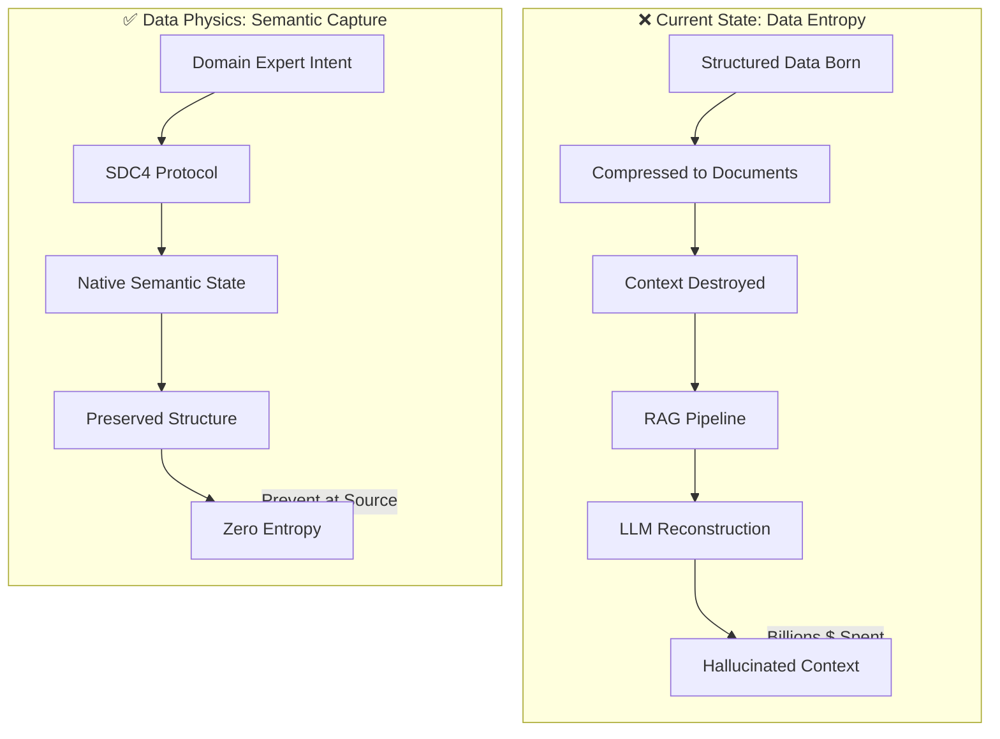
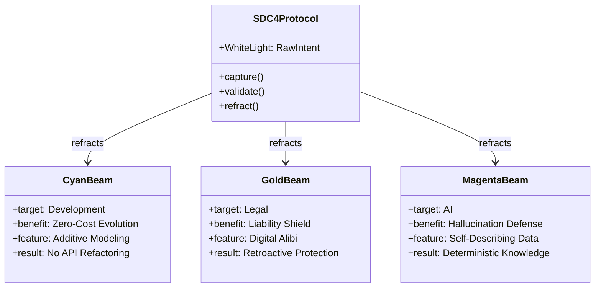
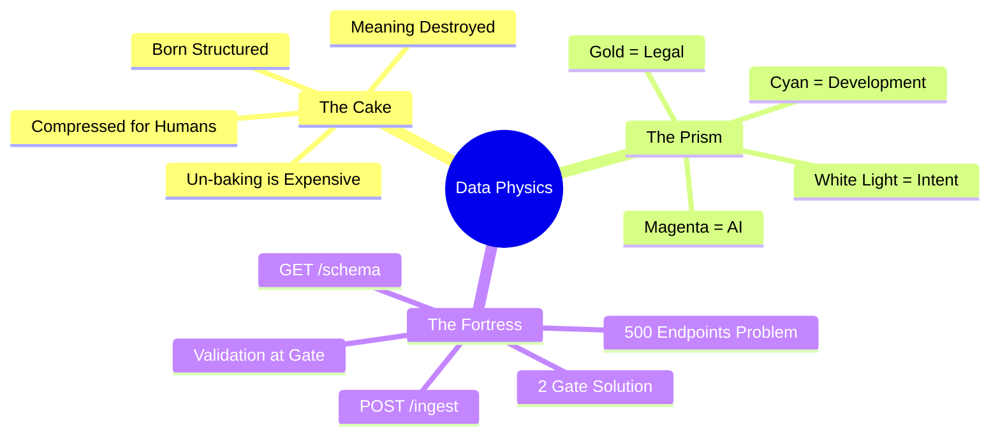
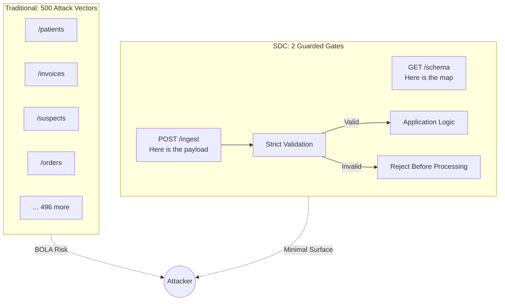

[🏠 Home](../../../README.md) / [LinkedIn Published](../../README.md) / [3rd Party Content](../README.md) / [Data Physics](./README.md) / **Semantic Graph**

---

# Semantic Knowledge Graph: Data Physics and Semantic Capture of Intent

## Summary

This document maps the conceptual architecture of "Data Physics" - a paradigm treating data quality degradation as entropy (a fundamental force) rather than bugs to fix. The Semantic Data Charter (SDC) approach captures intent at source, preventing downstream reconstruction costs.

---

## Key Concepts

| Concept | Definition | Category |
|---------|------------|----------|
| Data Physics | Treating data management as physics - understanding entropy as a force | Paradigm |
| Data Entropy | The degradation of meaning as data moves from source | Core Problem |
| Native Semantic State | Data captured with full structure and context at creation | Solution |
| SDC4 Protocol | Semantic Data Charter protocol for intent capture | Technology |
| The Cake Metaphor | Data "un-baking" - trying to reconstruct compressed documents | Problem Frame |
| The Prism Metaphor | Single truth source refracting into Dev/Legal/AI value | Architecture |
| The Fortress Metaphor | Security through minimal attack surface | Security Pattern |

---

## Core Arguments

### Argument 1: Data is Born Structured

```
PREMISE: Data starts as form entries, sensor readings, transactions
OBSERVATION: We compress it into documents for human readability
CONSEQUENCE: Structure and metadata are destroyed
CONCLUSION: "Unstructured data" is manufactured, not natural
```

### Argument 2: RAG is Un-baking the Cake

```
PREMISE: Industry invests billions in RAG pipelines
OBSERVATION: LLMs attempt to reconstruct meaning from flattened documents
PROBLEM: We are paying to recover context we deliberately destroyed
SOLUTION: Capture semantic state at source, don't reconstruct downstream
```

### Argument 3: Security via Simplicity

```
PREMISE: Traditional APIs have 500+ endpoints
PROBLEM: Each endpoint is an attack vector (BOLA vulnerabilities)
SOLUTION: Collapse to 2 endpoints (GET /schema, POST /ingest)
BENEFIT: Validation at ingest gate rejects malformed data before app logic
```

---

## Tags

`#data-physics` `#semantic-data` `#data-entropy` `#SDC` `#RAG` `#data-architecture` `#security` `#API-design` `#intent-capture` `#knowledge-graphs`

---

## Concept Flow Diagram



---

## Value Prism Architecture



---

## Metaphor Mind Map



---

## Security Architecture



---

## Cypher Export

```cypher
// Data Physics Domain Model

// Core Paradigm
CREATE (dp:Paradigm {name: 'Data Physics', description: 'Treating data management as physics with entropy as fundamental force'})
CREATE (dm:Paradigm {name: 'Data Management', description: 'Traditional approach treating data issues as bugs', status: 'obsolete'})

// Core Concepts
CREATE (entropy:Concept {name: 'Data Entropy', definition: 'Degradation of meaning as data moves from source'})
CREATE (nss:Concept {name: 'Native Semantic State', definition: 'Data captured with full structure and context at creation'})
CREATE (sdc:Technology {name: 'SDC4 Protocol', purpose: 'Semantic Data Charter for intent capture'})

// The Three Metaphors
CREATE (cake:Metaphor {name: 'The Cake', problem: 'Un-baking compressed documents', solution: 'Capture at source'})
CREATE (prism:Metaphor {name: 'The Prism', problem: 'Multiple value streams needed', solution: 'Single source refracts'})
CREATE (fortress:Metaphor {name: 'The Fortress', problem: '500+ attack vectors', solution: '2 guarded gates'})

// Value Beams
CREATE (cyan:ValueStream {name: 'Cyan Beam', target: 'Development', benefit: 'Zero-Cost Evolution'})
CREATE (gold:ValueStream {name: 'Gold Beam', target: 'Legal', benefit: 'Liability Shield'})
CREATE (magenta:ValueStream {name: 'Magenta Beam', target: 'AI', benefit: 'Hallucination Defense'})

// Security Elements
CREATE (getSchema:Endpoint {name: 'GET /schema', purpose: 'Provide the map'})
CREATE (postIngest:Endpoint {name: 'POST /ingest', purpose: 'Accept payload with validation'})

// Problems
CREATE (rag:Problem {name: 'RAG Reconstruction', cost: 'Billions', description: 'Paying LLMs to reconstruct destroyed context'})
CREATE (bola:Problem {name: 'BOLA Attacks', risk: 'High', description: 'Broken Object Level Authorization on many endpoints'})

// Relationships
CREATE (dp)-[:REPLACES]->(dm)
CREATE (dp)-[:ADDRESSES]->(entropy)
CREATE (nss)-[:PREVENTS]->(entropy)
CREATE (sdc)-[:CAPTURES]->(nss)

CREATE (sdc)-[:USES]->(cake)
CREATE (sdc)-[:USES]->(prism)
CREATE (sdc)-[:USES]->(fortress)

CREATE (prism)-[:PRODUCES]->(cyan)
CREATE (prism)-[:PRODUCES]->(gold)
CREATE (prism)-[:PRODUCES]->(magenta)

CREATE (fortress)-[:IMPLEMENTS]->(getSchema)
CREATE (fortress)-[:IMPLEMENTS]->(postIngest)

CREATE (cake)-[:SOLVES]->(rag)
CREATE (fortress)-[:SOLVES]->(bola)

// Expert Reference
CREATE (dc:Person {name: 'Dinis Cruz', role: 'Security Researcher'})
CREATE (fortress)-[:REFERENCES]->(dc)
```

---

## Navigation

| Direction | Link |
|-----------|------|
| ⬆️ Parent | [Data Physics README](./README.md) |
| 📁 Category | [3rd Party Content](../README.md) |
| 🏠 Home | [Repository Root](../../../README.md) |
