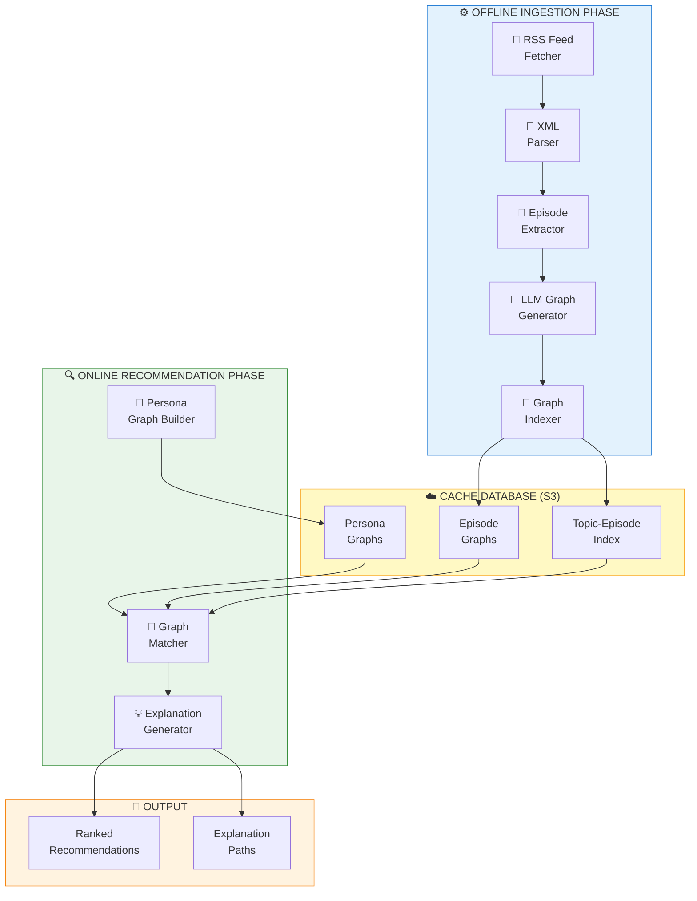
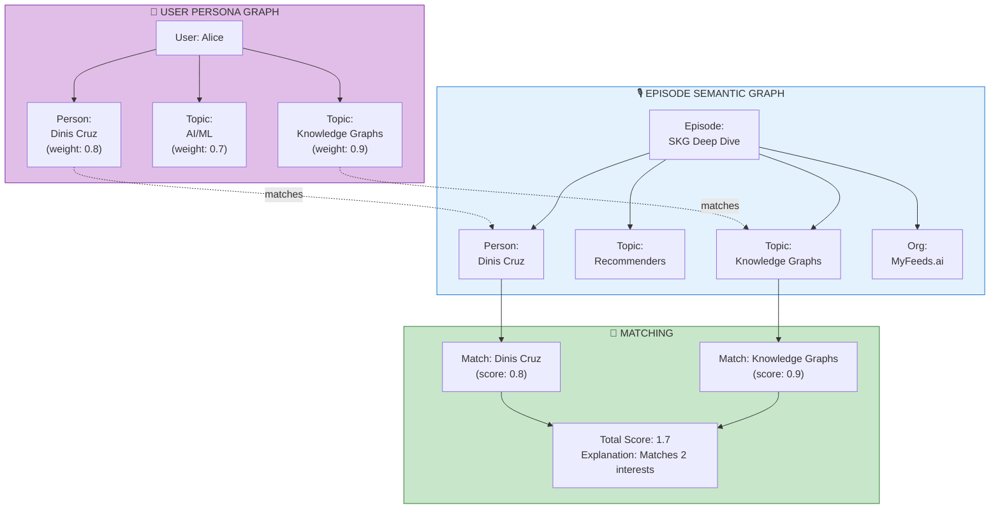
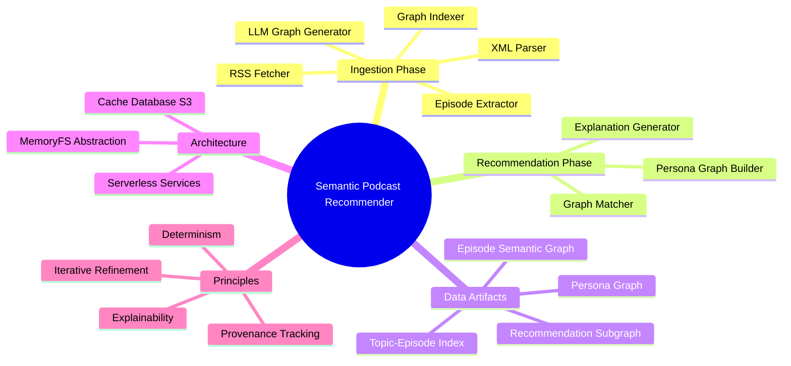
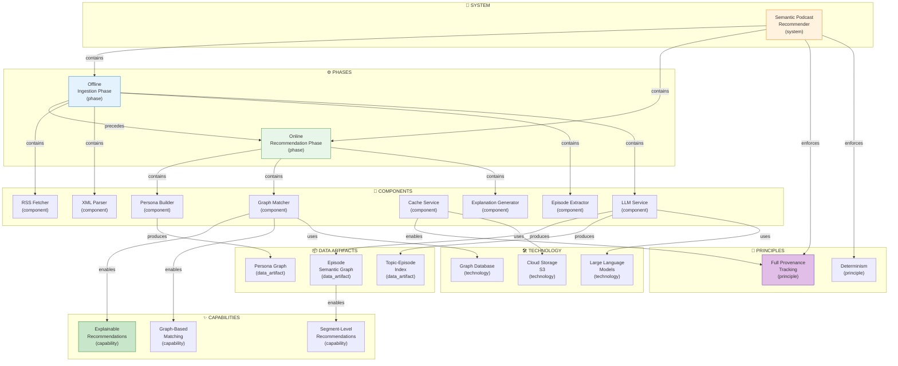

# Semantic Graph-Powered Podcast Recommender

[📖 README](./README.md) · [🖼️ Infographic](./20%20Jan%20-%20Semantic%20Podcast%20Recommender%20Workflow.jpg) · [📑 Slides](./20%20Jan%20-%20From_Black_Box_to_Glass_Box.pdf) · [🏠 Home](../../../../README.md)

> *Semantic Knowledge Graph (SKG) — machine-readable metadata for search, discovery, and graph database integration*

---

## Summary

A semantic knowledge graph-powered podcast recommender system that transforms unstructured podcast content into structured knowledge graphs, enabling highly personalized and explainable recommendations. The system uses LLMs to automatically generate semantic graphs from episode descriptions, represents user preferences as persona graphs using the same vocabulary, and matches users to content via graph traversal rather than opaque vector similarity. Built on a serverless architecture with full provenance tracking, every recommendation is traceable to specific graph connections.

---

## Key Concepts

- **Knowledge Graph vs Vector Search**: Graph-based strategies store knowledge as explicit nodes and relationships aligned with human reasoning, avoiding the "interpretability bottleneck" of vector-based semantic search where recommendations are based on opaque high-dimensional math.

- **Two-Phase Architecture**: Offline ingestion phase (RSS fetch → XML parse → episode extraction → LLM analysis → graph storage) and online recommendation phase (persona graph → graph matching → explainable results).

- **Persona Graphs**: User interests represented as semantic graphs using the same vocabulary as content graphs — nodes for topics, people, entities with weights indicating preference strength.

- **LLM-Powered Graph Construction**: Large Language Models analyze episode descriptions to extract entities (topics, people, organizations) and relationships, outputting structured JSON graphs that are stored with full provenance.

- **Segment-Level Recommendations**: Beyond episode-level matching, the system can identify and recommend specific segments within episodes (e.g., "Episode X – Segment 2 (10:00–20:00): discussion on Knowledge Graphs").

- **Serverless Cache-Centric Architecture**: All data stored as JSON files in cloud storage (S3) with MemoryFS abstraction, enabling versioning, reproducibility, and full provenance tracking for every transformation.

---

## Core Arguments

1. **Semantic Richness**: Traditional recommendation methods (collaborative filtering, keyword search) struggle to capture the rich semantic relationships within podcast content — knowledge graphs make these explicit and queryable.

2. **Explainability Over Opacity**: Vector-based semantic search introduces an "interpretability bottleneck" that hinders traceability — graph-based recommendations can explain exactly why each suggestion was made via graph path tracing.

3. **Proven at Scale**: Spotify reported double-digit improvements in audiobook engagement after deploying graph-powered recommendations, demonstrating that this approach works at scale.

4. **Architectural Constraints for Trust**: LLM-generated knowledge graphs require architectural constraints (defined vocabularies, validation rules, provenance tracking) to mitigate hallucinations and ensure trustworthiness.

5. **Full Provenance and Determinism**: The serverless, cache-centric architecture enables full provenance and determinism — every recommendation can be traced back through cached files to the original RSS input.

6. **Control and Visibility**: Treating content ingestion as graph-building and recommendations as graph queries provides control and visibility crucial for trust-dependent AI applications.

---

## Key Quotes

> "In AI systems that assist with complex tasks – from enterprise Q&A to personalized feeds – properties like provenance, determinism, and explainability are not luxuries but requirements."

> "By representing podcast information as a knowledge graph, we can trace exactly why a recommendation was made and ensure each connection is grounded in the source content."

> "We don't require the initial graph to be perfect. We prefer to get a decent first draft and then improve it over time."

> "The knowledge graph is not just a product of AI, but a verified, evolving dataset that can be trusted for downstream use."

---

## Tags

`knowledge-graph` `podcast-recommendations` `semantic-search` `explainable-ai` `llm-graph-construction` `persona-graphs` `serverless-architecture` `provenance-tracking` `graph-traversal` `myfeeds-ai` `content-personalization` `graph-matching` `rss-processing` `trustworthy-ai`

---

## Search Phrases

- "knowledge graph podcast recommendations"
- "semantic graph-powered recommender system"
- "explainable AI recommendations"
- "LLM knowledge graph construction"
- "persona graph user modeling"
- "graph-based vs vector-based recommendations"
- "serverless knowledge graph architecture"
- "podcast content semantic analysis"
- "provenance tracking AI systems"
- "segment-level podcast recommendations"

---

## Semantic Knowledge Graph

### Two-Phase Architecture (Visual)



### Knowledge Graph vs Vector Search

```mermaid
flowchart LR
    subgraph vector ["VECTOR APPROACH"]
        V_CONTENT["Podcast\nContent"]
        V_EMBED["Embedding\nModel"]
        V_STORE["Vector\nDatabase"]
        V_QUERY["User Query\nEmbedding"]
        V_RESULT["Similar\nVectors"]
        V_EXPLAIN["Why?\nBlack Box"]

        V_CONTENT --> V_EMBED --> V_STORE
        V_QUERY --> V_STORE --> V_RESULT --> V_EXPLAIN
    end

    subgraph graph ["KNOWLEDGE GRAPH APPROACH"]
        G_CONTENT["Podcast\nContent"]
        G_LLM["LLM\nExtraction"]
        G_STORE["Graph\nDatabase"]
        G_PERSONA["User\nPersona Graph"]
        G_RESULT["Matched\nSubgraph"]
        G_EXPLAIN["Path Trace\nGlass Box"]

        G_CONTENT --> G_LLM --> G_STORE
        G_PERSONA --> G_STORE --> G_RESULT --> G_EXPLAIN
    end

    style vector fill:#ffcdd2,stroke:#c62828
    style graph fill:#c8e6c9,stroke:#2e7d32
```

### Persona Graph Matching



---

### Ontology

#### Node Types

| Ref | Description | Example |
|-----|-------------|---------|
| `system` | The overall recommendation system | Semantic Podcast Recommender |
| `phase` | A major processing phase | Offline Ingestion Phase |
| `component` | A system component or service | LLM Graph Generation Service |
| `data_artifact` | A data structure or stored artifact | Episode Semantic Graph |
| `capability` | A feature or capability | Explainable Recommendations |
| `principle` | A design principle | Full Provenance Tracking |
| `topic` | A subject or domain area | Knowledge Graphs, AI/ML |
| `person` | A named individual | Dinis Cruz |
| `organization` | A company or entity | MyFeeds.ai, Spotify |
| `technology` | A technical tool or approach | LLM, Graph Database |

#### Predicates

| Ref | Inverse | Description |
|-----|---------|-------------|
| `contains` | `part_of` | System contains phases/components |
| `produces` | `produced_by` | Component produces data artifact |
| `enables` | `enabled_by` | Component enables capability |
| `follows` | `precedes` | Phase follows another phase |
| `enforces` | `enforced_by` | System enforces principle |
| `uses` | `used_by` | Component uses technology |
| `discusses` | `discussed_in` | Episode discusses topic |
| `features` | `featured_in` | Episode features person |
| `matches` | `matched_by` | Persona matches content |
| `explains` | `explained_by` | Recommendation explained by path |

---

### Taxonomy



#### ASCII Tree

```
semantic_podcast_recommender
├── ingestion_phase
│   ├── rss_fetcher
│   ├── xml_parser
│   ├── episode_extractor
│   ├── llm_graph_generator
│   └── graph_indexer
├── recommendation_phase
│   ├── persona_graph_builder
│   ├── graph_matcher
│   └── explanation_generator
├── data_artifacts
│   ├── episode_semantic_graph
│   ├── persona_graph
│   ├── topic_to_episode_index
│   └── recommendation_subgraph
├── architecture
│   ├── serverless_services
│   ├── cache_database
│   └── memoryfs_abstraction
└── principles
    ├── provenance_tracking
    ├── explainability
    ├── determinism
    └── iterative_refinement
```

---

### Knowledge Graph



#### Nodes Table

| ID | Type | Name | Description |
|----|------|------|-------------|
| `podcast_recommender` | `system` | Semantic Podcast Recommender | The overall recommendation system |
| `ingestion_phase` | `phase` | Offline Ingestion Phase | Batch processing of RSS feeds to graphs |
| `recommendation_phase` | `phase` | Online Recommendation Phase | Real-time user-content matching |
| `rss_fetcher` | `component` | RSS Fetcher | Retrieves podcast RSS feeds |
| `xml_parser` | `component` | XML Parser | Parses RSS XML structure |
| `episode_extractor` | `component` | Episode Extractor | Extracts episode metadata |
| `llm_service` | `component` | LLM Graph Generation Service | Generates semantic graphs from descriptions |
| `cache_service` | `component` | Cache Database Service | S3-based JSON storage |
| `persona_builder` | `component` | Persona Graph Builder | Constructs user interest graphs |
| `graph_matcher` | `component` | Graph Matcher | Matches persona to episode graphs |
| `explanation_generator` | `component` | Explanation Generator | Produces path-based explanations |
| `episode_graph` | `data_artifact` | Episode Semantic Graph | Knowledge graph per episode |
| `persona_graph` | `data_artifact` | User Persona Graph | User interests as semantic graph |
| `topic_episode_index` | `data_artifact` | Topic-Episode Index | Inverted index for topic lookup |
| `explainability` | `capability` | Explainable Recommendations | Why each suggestion was made |
| `segment_recommendations` | `capability` | Segment-Level Recommendations | Sub-episode recommendations |
| `graph_matching` | `capability` | Graph-Based Matching | Traversal-based similarity |
| `provenance` | `principle` | Full Provenance Tracking | Every result traceable to source |
| `determinism` | `principle` | Determinism | Same inputs produce same outputs |
| `llm_technology` | `technology` | Large Language Models | GPT-4 / Claude for extraction |
| `s3_storage` | `technology` | Cloud Storage (S3) | Serverless file storage |
| `graph_db` | `technology` | Graph Database | Neo4j / graph query engine |

#### Edges Table

| From | Predicate | To | Description |
|------|-----------|-----|-------------|
| `podcast_recommender` | `contains` | `ingestion_phase` | System contains ingestion |
| `podcast_recommender` | `contains` | `recommendation_phase` | System contains recommendation |
| `ingestion_phase` | `precedes` | `recommendation_phase` | Ingestion runs before recommendation |
| `ingestion_phase` | `contains` | `rss_fetcher` | Phase includes RSS fetcher |
| `ingestion_phase` | `contains` | `xml_parser` | Phase includes XML parser |
| `ingestion_phase` | `contains` | `episode_extractor` | Phase includes episode extractor |
| `ingestion_phase` | `contains` | `llm_service` | Phase includes LLM service |
| `recommendation_phase` | `contains` | `persona_builder` | Phase includes persona builder |
| `recommendation_phase` | `contains` | `graph_matcher` | Phase includes graph matcher |
| `recommendation_phase` | `contains` | `explanation_generator` | Phase includes explanation generator |
| `llm_service` | `produces` | `episode_graph` | LLM generates episode graphs |
| `llm_service` | `produces` | `topic_episode_index` | LLM populates topic index |
| `persona_builder` | `produces` | `persona_graph` | Builder creates persona graphs |
| `graph_matcher` | `enables` | `explainability` | Matching enables explanations |
| `graph_matcher` | `enables` | `graph_matching` | Component provides capability |
| `episode_graph` | `enables` | `segment_recommendations` | Graphs enable segment-level recs |
| `podcast_recommender` | `enforces` | `provenance` | System enforces provenance |
| `podcast_recommender` | `enforces` | `determinism` | System enforces determinism |
| `cache_service` | `enables` | `provenance` | Cache enables provenance tracking |
| `llm_service` | `uses` | `llm_technology` | Service uses LLM technology |
| `cache_service` | `uses` | `s3_storage` | Service uses S3 storage |
| `graph_matcher` | `uses` | `graph_db` | Matcher uses graph database |

---

### Cypher Import (Neo4j)

```cypher
// =====================================================
// SEMANTIC PODCAST RECOMMENDER - KNOWLEDGE GRAPH IMPORT
// =====================================================

// Create System node
CREATE (system:System {
    id: 'podcast_recommender',
    name: 'Semantic Podcast Recommender',
    description: 'Knowledge graph-powered podcast recommendation system'
})

// Create Phase nodes
CREATE (ingestion:Phase {
    id: 'ingestion_phase',
    name: 'Offline Ingestion Phase',
    description: 'Batch processing of RSS feeds to semantic graphs'
})
CREATE (recommendation:Phase {
    id: 'recommendation_phase',
    name: 'Online Recommendation Phase',
    description: 'Real-time user-content matching via graph traversal'
})

// Create Component nodes
CREATE (rss:Component {id: 'rss_fetcher', name: 'RSS Fetcher', description: 'Retrieves podcast RSS feeds'})
CREATE (xml:Component {id: 'xml_parser', name: 'XML Parser', description: 'Parses RSS XML structure'})
CREATE (extractor:Component {id: 'episode_extractor', name: 'Episode Extractor', description: 'Extracts episode metadata'})
CREATE (llm_svc:Component {id: 'llm_service', name: 'LLM Graph Generation Service', description: 'Generates semantic graphs from descriptions'})
CREATE (cache_svc:Component {id: 'cache_service', name: 'Cache Database Service', description: 'S3-based JSON storage with MemoryFS'})
CREATE (persona_build:Component {id: 'persona_builder', name: 'Persona Graph Builder', description: 'Constructs user interest graphs'})
CREATE (matcher:Component {id: 'graph_matcher', name: 'Graph Matcher', description: 'Matches persona to episode graphs'})
CREATE (explainer:Component {id: 'explanation_generator', name: 'Explanation Generator', description: 'Produces path-based explanations'})

// Create Data Artifact nodes
CREATE (episode_graph:DataArtifact {
    id: 'episode_graph',
    name: 'Episode Semantic Graph',
    description: 'Knowledge graph per episode with topics, people, entities'
})
CREATE (persona_graph:DataArtifact {
    id: 'persona_graph',
    name: 'User Persona Graph',
    description: 'User interests as semantic graph with weighted nodes'
})
CREATE (topic_index:DataArtifact {
    id: 'topic_episode_index',
    name: 'Topic-Episode Index',
    description: 'Inverted index for efficient topic lookup'
})

// Create Capability nodes
CREATE (explainability:Capability {
    id: 'explainability',
    name: 'Explainable Recommendations',
    description: 'Every recommendation traceable via graph paths'
})
CREATE (segment_recs:Capability {
    id: 'segment_recommendations',
    name: 'Segment-Level Recommendations',
    description: 'Recommend specific time segments within episodes'
})
CREATE (graph_match:Capability {
    id: 'graph_matching',
    name: 'Graph-Based Matching',
    description: 'Similarity via graph traversal, not vectors'
})

// Create Principle nodes
CREATE (provenance:Principle {
    id: 'provenance',
    name: 'Full Provenance Tracking',
    description: 'Every result traceable to original source'
})
CREATE (determinism:Principle {
    id: 'determinism',
    name: 'Determinism',
    description: 'Same inputs always produce same outputs'
})

// Create Technology nodes
CREATE (llm_tech:Technology {id: 'llm_technology', name: 'Large Language Models', description: 'GPT-4/Claude for entity extraction'})
CREATE (s3:Technology {id: 's3_storage', name: 'Cloud Storage (S3)', description: 'Serverless file storage'})
CREATE (graph_db:Technology {id: 'graph_db', name: 'Graph Database', description: 'Neo4j or compatible graph engine'})

// Create Organization nodes (referenced)
CREATE (myfeeds:Organization {id: 'myfeeds', name: 'MyFeeds.ai', description: 'Platform implementing this architecture'})
CREATE (spotify:Organization {id: 'spotify', name: 'Spotify', description: 'Validated graph-based recs at scale'})

// =====================================================
// CREATE RELATIONSHIPS
// =====================================================

// System contains phases
CREATE (system)-[:CONTAINS]->(ingestion)
CREATE (system)-[:CONTAINS]->(recommendation)
CREATE (ingestion)-[:PRECEDES]->(recommendation)

// Ingestion phase contains components
CREATE (ingestion)-[:CONTAINS]->(rss)
CREATE (ingestion)-[:CONTAINS]->(xml)
CREATE (ingestion)-[:CONTAINS]->(extractor)
CREATE (ingestion)-[:CONTAINS]->(llm_svc)

// Recommendation phase contains components
CREATE (recommendation)-[:CONTAINS]->(persona_build)
CREATE (recommendation)-[:CONTAINS]->(matcher)
CREATE (recommendation)-[:CONTAINS]->(explainer)

// Component produces artifacts
CREATE (llm_svc)-[:PRODUCES]->(episode_graph)
CREATE (llm_svc)-[:PRODUCES]->(topic_index)
CREATE (persona_build)-[:PRODUCES]->(persona_graph)

// Components enable capabilities
CREATE (matcher)-[:ENABLES]->(explainability)
CREATE (matcher)-[:ENABLES]->(graph_match)
CREATE (episode_graph)-[:ENABLES]->(segment_recs)
CREATE (cache_svc)-[:ENABLES]->(provenance)

// System enforces principles
CREATE (system)-[:ENFORCES]->(provenance)
CREATE (system)-[:ENFORCES]->(determinism)

// Components use technologies
CREATE (llm_svc)-[:USES]->(llm_tech)
CREATE (cache_svc)-[:USES]->(s3)
CREATE (matcher)-[:USES]->(graph_db)

// External references
CREATE (system)-[:IMPLEMENTED_BY]->(myfeeds)
CREATE (graph_match)-[:VALIDATED_BY]->(spotify)

// Processing flow within ingestion
CREATE (rss)-[:FEEDS]->(xml)
CREATE (xml)-[:FEEDS]->(extractor)
CREATE (extractor)-[:FEEDS]->(llm_svc)

// Processing flow within recommendation
CREATE (persona_graph)-[:INPUT_TO]->(matcher)
CREATE (episode_graph)-[:INPUT_TO]->(matcher)
CREATE (matcher)-[:FEEDS]->(explainer)
```

---

### How to Import into Neo4j Sandbox

1. **Create a free Neo4j Sandbox** at [sandbox.neo4j.com](https://sandbox.neo4j.com)
   - Select "Blank Sandbox" (or any template, then clear it)
   - Wait for provisioning (~30 seconds)

2. **Open Neo4j Browser** by clicking "Open with Browser"

3. **Copy the entire Cypher script above** and paste into the query box

4. **Run the query** (click Play or press Ctrl+Enter)

5. **Verify import** with: `MATCH (n) RETURN count(n) as nodes` (should return ~22 nodes)

---

### Sample Queries to Explore

**1. View the entire knowledge graph:**
```cypher
MATCH (n)-[r]->(m)
RETURN n, r, m
```

**2. Find all components in the Ingestion Phase:**
```cypher
MATCH (phase:Phase {name: 'Offline Ingestion Phase'})-[:CONTAINS]->(c:Component)
RETURN phase.name AS Phase, collect(c.name) AS Components
```

**3. Trace what enables Explainable Recommendations:**
```cypher
MATCH path = (c)-[:ENABLES*]->(cap:Capability {name: 'Explainable Recommendations'})
RETURN path
```

**4. Find the data flow from RSS to recommendations:**
```cypher
MATCH path = (start:Component {name: 'RSS Fetcher'})-[:FEEDS|PRODUCES|INPUT_TO*]->(end)
RETURN path
```

**5. What technologies does each component use?**
```cypher
MATCH (c:Component)-[:USES]->(t:Technology)
RETURN c.name AS Component, t.name AS Technology
ORDER BY c.name
```

**6. Find all principles the system enforces:**
```cypher
MATCH (s:System)-[:ENFORCES]->(p:Principle)
RETURN s.name AS System, collect(p.name) AS Principles
```

**7. Shortest path between two nodes:**
```cypher
MATCH path = shortestPath(
  (rss:Component {name: 'RSS Fetcher'})-[*]-(cap:Capability {name: 'Explainable Recommendations'})
)
RETURN path
```

---

## Metadata

| Field | Value |
|-------|-------|
| **Content Type** | White Paper / Technical Architecture |
| **Domain** | AI/ML / Recommendation Systems |
| **Sub-domain** | Knowledge Graphs / Personalization |
| **Authors** | Dinis Cruz, ChatGPT Deep Research |
| **Date Created** | January 2026 |
| **Source Format** | PDF (12 pages) |
| **Derived Assets** | Infographic, Slide Deck |
| **License** | CC BY 4.0 |

---

## Related Content

| Relationship | Content |
|--------------|---------|
| `inspired_by` | MyFeeds.ai Platform Architecture |
| `references` | Spotify Graph-Based Audiobook Recommendations |
| `contrasts_with` | Vector Database / Embedding-based Search |
| `related_to` | LLM-Generated Knowledge Graphs |
| `related_to` | Trustworthy AI Architecture Patterns |
| `uses` | Large Language Models (GPT-4, Claude) |
| `uses` | Graph Databases (Neo4j) |
| `uses` | Serverless Architecture (AWS S3) |
