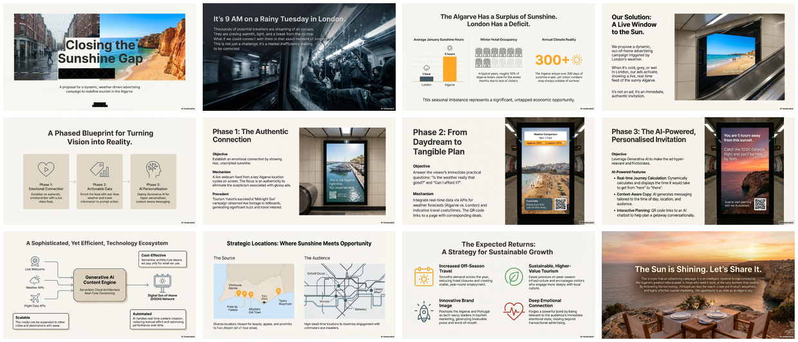

# Dynamic Weather-Driven Algarve Tourism Campaign

[← Back to Cyber Security & Business](../README.md) · [LinkedIn Published](../../README.md) · [🏠 Home](../../../../README.md)

> A white paper proposing AI-powered, weather-triggered digital billboard advertising in London to promote off-season tourism to Portugal's Algarve region. The concept leverages live webcam feeds, real-time weather data, flight APIs, and Generative AI to show rain-soaked Londoners exactly what they're missing — sunny beaches just 2.5 hours away.

| 📄 Source | 🖼️ Infographic | 📑 Slides |
|-----------|----------------|-----------|
| [White Paper](./Dynamic%20Weather-Driven%20Algarve%20Tourism%20Campaign%20%28White%20Paper%29.pdf) | [Main Infographic](./14%20Jan%20-%20%28infographic%29%20Rainy%20London%2C%20Sunny%20Algarve%20Advertising.png) | [Main Deck (12 slides)](./14%20Jan%20-%20%28side%20deck%29%20Closing%20the%20Sunshine%20Gap%20-%20Algarve%20Surplus%20Strategy.pdf) |

> Generated with [Google NotebookLM](https://notebooklm.google.com/) — Source document → Infographic → Slide deck

---

## 📑 Slide Deck (12 slides)

> **Closing the Sunshine Gap** — NotebookLM-generated presentation on the weather-triggered advertising strategy

*Click image to open the slide deck* · [⬇️ Download PDF](https://github.com/DinisCruz/NotebookLM__Infographics-and-slides/raw/refs/heads/main/linkedin-published/Cyber%20Security%20and%20Business/Portugal%20-%20Dynamic%20Weather-Driven%20Algarve%20Tourism%20Campaign/14%20Jan%20-%20%28side%20deck%29%20Closing%20the%20Sunshine%20Gap%20-%20Algarve%20Surplus%20Strategy.pdf)

---

## 🖼️ Infographics

### Main Infographic

### Additional Variations (AI-Generated Experiments)

These infographics showcase interesting AI-generated ad design variations, though with some notable issues:

| Infographic | Notes |
|-------------|-------|
|  | **Placement issues** — Ad positioning has errors |
|  | **Text issues** — Interesting design concept but text rendering problems |

> 💡 **Note:** These variations demonstrate both the potential and current limitations of AI-generated advertising visuals. The design concepts are compelling, but text placement and accuracy remain challenges.

### Alternative Slide Deck

| Presentation | Description |
|--------------|-------------|
| [Closing the Sunshine Gap (Variations)](./14%20Jan%20-%20%28interesting%20variations%20of%20other%20slide%20deck%29%20Closing_the_Sunshine_Gap.pdf) | Interesting alternative version with different visual treatments |

---

## 🧠 Semantic Knowledge Graph

> **Machine-readable metadata** — Structured content for search, discovery, and graph database integration

This document includes a comprehensive [SEMANTIC-GRAPH.md](./SEMANTIC-GRAPH.md) file containing:

| Section | Description |
|---------|-------------|
| **Summary** | Weather-triggered tourism advertising concept |
| **Key Concepts** | 6 core concepts: seasonal tourism, DOOH, GenAI, weather APIs |
| **Core Arguments** | 6 strategic arguments for implementation |
| **Key Quotes** | 4 memorable quotes from the white paper |
| **Tags & Search Phrases** | 15 tags + 10 search phrases for discovery |
| **Mermaid Diagrams** | Campaign architecture, phased implementation, knowledge graph |
| **Cypher Import** | Ready-to-import Neo4j graph database queries |

[📖 View SEMANTIC-GRAPH.md](./SEMANTIC-GRAPH.md)

---

## Key Topics

- **Weather-Triggered Marketing**: Ads that respond to real-time weather conditions
- **Digital Out-of-Home (DOOH)**: Dynamic billboard advertising in London Underground
- **Generative AI**: AI-generated ad copy, personalization, and chatbot concierge
- **Seasonal Tourism**: Addressing Algarve's off-season capacity problem
- **Live Streaming**: Real-time webcam feeds from Portuguese beaches
- **Phased Implementation**: Three-phase rollout from simple to AI-powered

---

## Campaign Phases

| Phase | Focus | Key Features |
|-------|-------|--------------|
| **Phase 1** | Emotional Connection | Live webcam feeds, simple messaging |
| **Phase 2** | Actionable Information | Weather comparison, flight prices, QR codes |
| **Phase 3** | AI Personalization | Dynamic itineraries, location-aware content, chatbot |

---

## Algarve Locations Featured

| Location | Distance from Faro | Appeal |
|----------|-------------------|--------|
| Faro Marina & Old Town | 0 km | Historic waterfront, outdoor cafés |
| Vilamoura Marina | ~20 km | Luxury yachts, nightlife |
| Praia da Falésia | ~30 km | Red cliffs, natural beauty |
| Albufeira Old Town | ~30 km | Sandy beach, whitewashed buildings |
| Tavira Riverfront | ~30 km | Traditional culture, Roman bridge |

---

## Contents

| File | Description |
|------|-------------|
| [White Paper (PDF)](./Dynamic%20Weather-Driven%20Algarve%20Tourism%20Campaign%20%28White%20Paper%29.pdf) | Full 11-page white paper |
| [Main Slide Deck](./14%20Jan%20-%20%28side%20deck%29%20Closing%20the%20Sunshine%20Gap%20-%20Algarve%20Surplus%20Strategy.pdf) | 12-slide presentation |
| [Alternative Slides](./14%20Jan%20-%20%28interesting%20variations%20of%20other%20slide%20deck%29%20Closing_the_Sunshine_Gap.pdf) | Variation with different visuals |
| [Main Infographic](./14%20Jan%20-%20%28infographic%29%20Rainy%20London%2C%20Sunny%20Algarve%20Advertising.png) | Primary infographic |
| [SEMANTIC-GRAPH.md](./SEMANTIC-GRAPH.md) | Semantic Knowledge Graph metadata |

---

## LinkedIn Posts

| Post | Content |
|------|---------|
| [Source Document Post](https://www.linkedin.com/posts/diniscruz_dynamic-weather-driven-algarve-tourism-campaign-activity-7389426063203909632-Dq6f/) | Original white paper share |
| [Infographic Post](https://www.linkedin.com/posts/diniscruz_here-how-i-would-boost-the-tourism-in-the-activity-7417205099665686528-AJEz/) | Infographic presentation |
| [Slide Deck Post](https://www.linkedin.com/posts/diniscruz_closing-the-sunshine-gap-algarve-surplus-activity-7417207449981624321-x4jQ/) | Slide deck share |

---

## Source Information

| Field | Value |
|-------|-------|
| **Author** | Dinis Cruz (with ChatGPT Deep Research) |
| **Date** | October 2024 (White Paper), January 2025 (NotebookLM assets) |
| **Target Audience** | Tourism boards, marketing agencies, DOOH providers |
| **Key Insight** | 300+ sunny days in Algarve vs ~1 hour sunshine in London winters |

---

*Generated for NotebookLM content pipeline*
