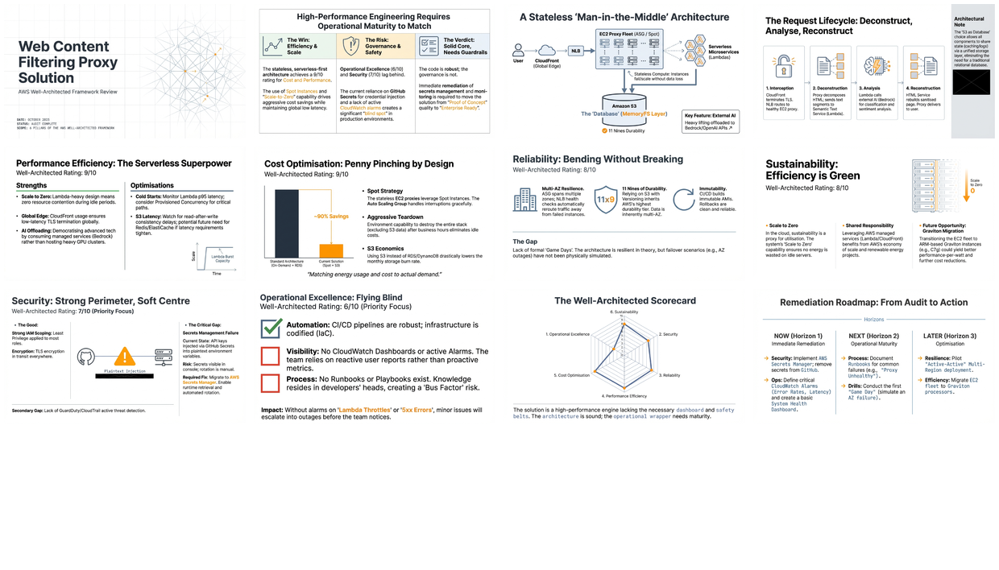

# AWS Well-Architected Framework Review – Web Content Filtering Proxy Solution

[← Back to Dev Briefs/MitmProxy Service](../README.md) · [LinkedIn Published](../../README.md) · [Home](../../../../README.md)

> AWS Well-Architected Framework review evaluating a man-in-the-middle web proxy designed for advanced content filtering against all six AWS pillars. Key findings include strong performance efficiency (9/10) and cost optimization (9/10) through serverless design and Spot usage, but operational gaps (6/10) due to missing runbooks, dashboards, and alarms. The review provides detailed recommendations for each pillar to achieve production-grade maturity.

| 📄 Source | 🖼️ Infographic | 📑 Slides |
|-----------|----------------|-----------|
| [Source Doc](./AWS%20Well-Architected%20Framework%20Review%20%E2%80%93%20Web%20Content%20Filtering%20Proxy%20Solution.pdf) | [View Image](./22%20Jan%20-%20Cloud%20Proxy%20Risk%20and%20Optimisation..jpg) | [Slide Deck](./22%20Jan%20-%20Web_Content_Filtering_Proxy_Audit.pdf) |

> Generated with [Google NotebookLM](https://notebooklm.google.com/) — Source document → Infographic → Slide deck

---

## 🖼️ Infographic

---

## 📑 Slide Deck (12 slides)

> **Deep Dive Presentation** — NotebookLM-generated slide deck on AWS Well-Architected Framework review

*Click image to open the slide deck* · [⬇️ Download PDF](https://github.com/DinisCruz/NotebookLM__Infographics-and-slides/raw/refs/heads/main/linkedin-published/Dev%20Briefs%20-%20MitmProxy%20Service/AWS%20Well-Architected%20Framework%20Review%20%E2%80%93%20Web%20Content%20Filtering%20Proxy%20Solution/22%20Jan%20-%20Web_Content_Filtering_Proxy_Audit.pdf)

---

## 🧠 Semantic Knowledge Graph

> **Machine-readable metadata** — Structured content for search, discovery, and graph database integration

This document includes a comprehensive [SEMANTIC-GRAPH.md](./SEMANTIC-GRAPH.md) file containing:

| Section | Description |
|---------|-------------|
| **Summary** | Concise overview of the review findings |
| **Key Concepts** | 6 main architectural concepts |
| **Core Arguments** | 6 pillar assessments with ratings |
| **Key Quotes** | 4 memorable quotes for reference |
| **Tags & Search Phrases** | 12 tags + 10 search phrases for discovery |
| **Ontology & Taxonomy** | Structured hierarchy for knowledge graphs |
| **Graph Nodes & Edges** | Ready-to-import relationships for Neo4j/similar |

[📖 View SEMANTIC-GRAPH.md](./SEMANTIC-GRAPH.md)

---

## Key Topics

- **Six Pillars Assessment**: Operational Excellence, Security, Reliability, Performance, Cost, Sustainability
- **Architecture Components**: CloudFront, EC2 Auto Scaling, Lambda microservices, S3 as database
- **Identified Gaps**: Missing runbooks, no CloudWatch dashboards, secrets in GitHub
- **Recommendations**: Implement alarms, adopt Secrets Manager, conduct game days

## Pillar Ratings

| Pillar | Rating | Notes |
|--------|--------|-------|
| Operational Excellence | 6/10 | Missing runbooks, dashboards |
| Security | 7/10 | Needs secrets management migration |
| Reliability | 8/10 | Strong multi-AZ, needs failure testing |
| Performance Efficiency | 9/10 | Serverless + global CloudFront |
| Cost Optimization | 9/10 | Spot Instances, scale-to-zero |
| Sustainability | 8/10 | Consider Graviton instances |

---

## Contents

| File | Description |
|------|-------------|
| [AWS Well-Architected Framework Review – Web Content Filtering Proxy Solution.pdf](./AWS%20Well-Architected%20Framework%20Review%20%E2%80%93%20Web%20Content%20Filtering%20Proxy%20Solution.pdf) | Full review document (19 pages) |
| [22 Jan - Web_Content_Filtering_Proxy_Audit.pdf](./22%20Jan%20-%20Web_Content_Filtering_Proxy_Audit.pdf) | NotebookLM slide deck |
| [22 Jan - Cloud Proxy Risk and Optimisation..jpg](./22%20Jan%20-%20Cloud%20Proxy%20Risk%20and%20Optimisation..jpg) | Infographic visualization |
| [LinkedIn Post](https://www.linkedin.com/posts/diniscruz_web-content-filtering-proxy-audit-ugcPost-7420502543375708160-jcrE/) | LinkedIn post with slides |
| [SEMANTIC-GRAPH.md](./SEMANTIC-GRAPH.md) | Semantic Knowledge Graph metadata |

---

## Source Information

| Field | Value |
|-------|-------|
| **Generated By** | ChatGPT Deep Research |
| **Date** | January 2026 |
| **Target Audience** | Cloud Architects, DevOps Engineers, Security Teams |

---

*Generated for NotebookLM content pipeline*
