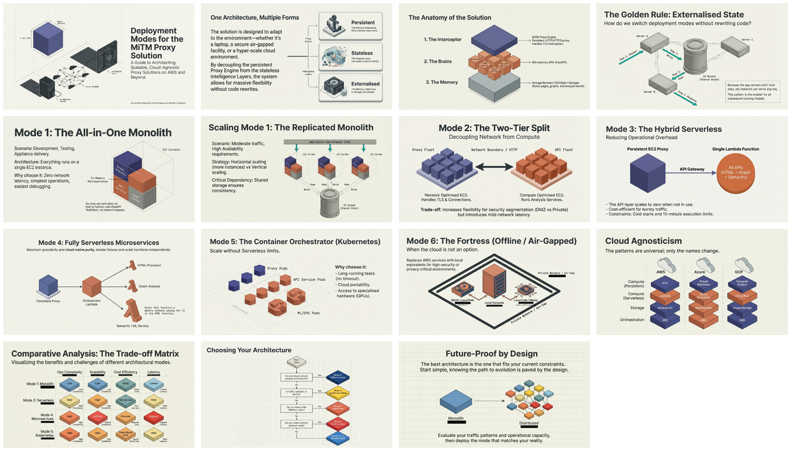

# Deployment Modes for the Man-in-the-Middle Proxy Solution (AWS-Oriented)

[← Back to Dev Briefs/MitmProxy Service](../README.md) · [LinkedIn Published](../../README.md) · [Home](../../../../README.md)

> Technical guide presenting six deployment models for the MiTM proxy solution, spanning the spectrum from single-machine monolith to fully distributed cloud-native microservices. The architecture's stateless design—externalizing state to S3—enables horizontal scaling across all models. Each deployment mode offers different trade-offs: all-in-one for simplicity, split tiers for security segmentation, single Lambda for serverless benefits, multiple Lambdas for maximum granularity, Kubernetes for container portability, and offline mode for air-gapped environments.

| 📄 Source | 🖼️ Infographic | 📑 Slides |
|-----------|----------------|-----------|
| [Source Doc](./Deployment%20Modes%20for%20the%20Man-in-the-Middle%20Proxy%20Solution%20%28AWS-Oriented%29.pdf) | [View Image](./23%20Jan%20-%20MiTM%20Proxy%20Scaling%20Strategies.jpg) | [Slide Deck](./23%20Jan-%20Deployment_Modes_Scaling_the_MiTM_Proxy.pdf) |

> Generated with [Google NotebookLM](https://notebooklm.google.com/) — Source document → Infographic → Slide deck

---

## 🖼️ Infographic

---

## 📑 Slide Deck (15 slides)

> **Deep Dive Presentation** — NotebookLM-generated slide deck on deployment modes and scaling strategies

*Click image to open the slide deck* · [⬇️ Download PDF](https://github.com/DinisCruz/NotebookLM__Infographics-and-slides/raw/refs/heads/main/linkedin-published/Dev%20Briefs%20-%20MitmProxy%20Service/Deployment%20Modes%20for%20the%20Man-in-the-Middle%20Proxy%20Solution%20%28AWS-Oriented%29/23%20Jan-%20Deployment_Modes_Scaling_the_MiTM_Proxy.pdf)

---

## 🧠 Semantic Knowledge Graph

> **Machine-readable metadata** — Structured content for search, discovery, and graph database integration

This document includes a comprehensive [SEMANTIC-GRAPH.md](./SEMANTIC-GRAPH.md) file containing:

| Section | Description |
|---------|-------------|
| **Summary** | Concise overview of deployment options |
| **Key Concepts** | 6 architectural patterns explained |
| **Core Arguments** | 6 deployment trade-off analyses |
| **Key Quotes** | 4 memorable quotes for reference |
| **Tags & Search Phrases** | 15 tags + 10 search phrases for discovery |
| **Ontology & Taxonomy** | Structured hierarchy for knowledge graphs |
| **Graph Nodes & Edges** | Ready-to-import relationships for Neo4j/similar |

[📖 View SEMANTIC-GRAPH.md](./SEMANTIC-GRAPH.md)

---

## Key Topics

- **Stateless Architecture**: Externalizing state to S3 for horizontal scaling
- **Six Deployment Modes**: All-in-one, split tier, single Lambda, multi-Lambda, Kubernetes, offline
- **FastAPI TestClient**: In-memory microservices for same-process communication
- **Persistent Compute**: Why the proxy engine requires EC2/containers (not pure serverless)
- **Cloud Agnostic**: Patterns translate to Azure and GCP

## Deployment Modes Comparison

| Mode | Use Case | Pros | Cons |
|------|----------|------|------|
| All-in-One | Development, low traffic | Simple, single instance | Limited scaling |
| Split Tier | Security segmentation | DMZ isolation, independent scaling | More infrastructure |
| Single Lambda | Moderate loads | Serverless simplicity | Cold starts, 15min limit |
| Multi-Lambda | Large scale | Max scalability, fault isolation | Network latency, complexity |
| Kubernetes | Enterprise | Container portability, no time limits | K8s expertise needed |
| Offline | Air-gapped | No external dependencies | Limited ML capabilities |

---

## Contents

| File | Description |
|------|-------------|
| [Deployment Modes for the Man-in-the-Middle Proxy Solution (AWS-Oriented).pdf](./Deployment%20Modes%20for%20the%20Man-in-the-Middle%20Proxy%20Solution%20%28AWS-Oriented%29.pdf) | Full technical guide (9 pages) |
| [23 Jan- Deployment_Modes_Scaling_the_MiTM_Proxy.pdf](./23%20Jan-%20Deployment_Modes_Scaling_the_MiTM_Proxy.pdf) | NotebookLM slide deck |
| [23 Jan - MiTM Proxy Scaling Strategies.jpg](./23%20Jan%20-%20MiTM%20Proxy%20Scaling%20Strategies.jpg) | Infographic visualization |
| [LinkedIn Post](https://www.linkedin.com/posts/diniscruz_deployment-modes-scaling-the-mitm-proxy-ugcPost-7420506134899298304-5N77/) | LinkedIn post with slides |
| [SEMANTIC-GRAPH.md](./SEMANTIC-GRAPH.md) | Semantic Knowledge Graph metadata |

---

## Source Information

| Field | Value |
|-------|-------|
| **Generated By** | ChatGPT |
| **Date** | January 2026 |
| **Target Audience** | DevOps Engineers, Cloud Architects, Platform Engineers |

---

*Generated for NotebookLM content pipeline*
