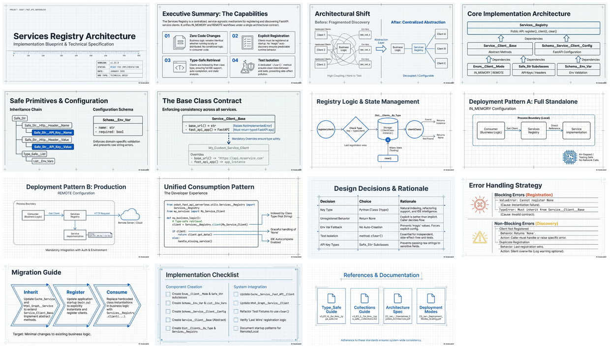

[🏠 Home](../../../README.md) / [LinkedIn Published](../README.md) / **Dev Briefs/OSBot Fast API Serverless**

---

# Services Registry Implementation Blueprint

A centralized, service-agnostic mechanism for registering and discovering FastAPI service clients across multiple deployment modes — enabling zero code changes when switching between distributed microservices (REMOTE) and collapsed single-process (IN_MEMORY) deployments.

| 📄 Source | 🖼️ Infographic | 📑 Slides |
|---|---|---|
| [Dev Brief (MD)](./v1.33.0__dev-brief__create-services-registry.md) | [View Image](./24%20Jan%20-%20Unified%20Service%20Discovery%20Services%20Registry.png) | [Slide Deck](./24%20Jan%20-%20Services_Registry_Implementation_Blueprint.pdf) |

> *Generated with [Google NotebookLM](https://notebooklm.google.com/) — Source document → Infographic → Slide deck*

---

## 🖼️ Infographic

---

## 📑 Slide Deck (15 slides)

*Click image to open the slide deck* · [⬇️ Download PDF](https://github.com/DinisCruz/NotebookLM__Infographics-and-slides/raw/refs/heads/main/linkedin-published/Dev%20Briefs%20-%20OSBot%20Fast%20API%20Serverless/24%20Jan%20-%20Services_Registry_Implementation_Blueprint.pdf)

---

## 🧠 Semantic Knowledge Graph

> **Machine-readable metadata** — Structured content for search, discovery, and graph database integration

This document includes a comprehensive [SEMANTIC-GRAPH.md](./SEMANTIC-GRAPH.md) file containing:

| Section | Description |
|---------|-------------|
| Summary | 2-4 sentence overview of the content |
| Key Concepts | Core ideas with explanations |
| Core Arguments | Logical flow of main points |
| Mermaid Diagrams | Visual ontology, taxonomy, and knowledge graph |
| Neo4j Cypher | Ready-to-import graph database queries |

[📖 View SEMANTIC-GRAPH.md](./SEMANTIC-GRAPH.md)

---

## 🔗 LinkedIn Posts

| Type | Link |
|------|------|
| Infographic Post | [View on LinkedIn](https://www.linkedin.com/feed/update/urn:li:share:7420968139074740224/) |
| Slides Post | [View on LinkedIn](https://www.linkedin.com/feed/update/urn:li:ugcPost:7420973474556354560/) |

---

## Key Topics

| Topic | Description |
|-------|-------------|
| **Services Registry** | Centralized mechanism for registering and discovering FastAPI service clients |
| **Deployment Modes** | IN_MEMORY (TestClient) vs REMOTE (HTTP) modes for flexible deployment |
| **Type-Safe Clients** | Service__Client__Base with Dict__Clients__By_Type for compile-time safety |
| **Zero Code Changes** | Business logic works unchanged across all deployment configurations |
| **Test Isolation** | `clear()` method enables proper test fixture cleanup |

---

## Source Information

| Field | Value |
|-------|-------|
| **Version** | v1.33.0 |
| **Date** | January 2025 |
| **Status** | Ready for Implementation |
| **Target Package** | `osbot_fast_api_serverless` |
