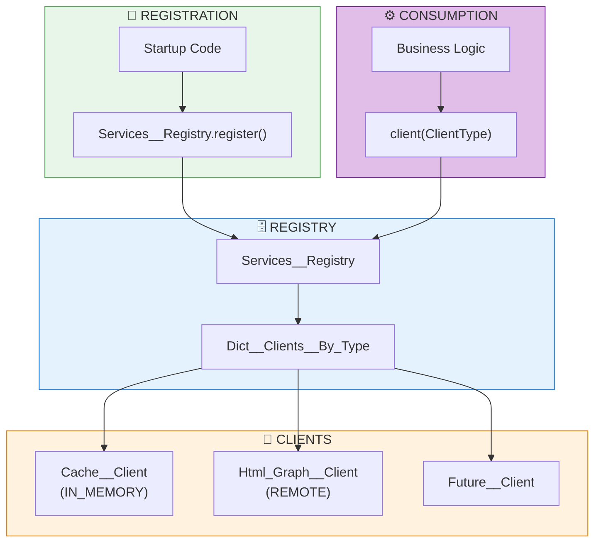
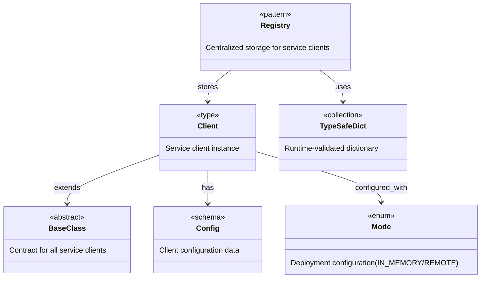
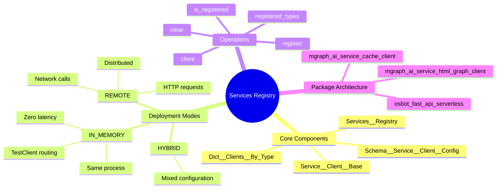
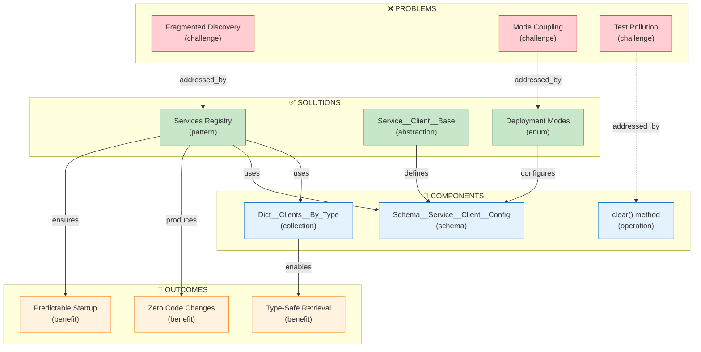

# Services Registry Implementation Blueprint

[📖 README](./README.md) · [🖼️ Infographic](./24%20Jan%20-%20Unified%20Service%20Discovery%20Services%20Registry.png) · [📑 Slides](./24%20Jan%20-%20Services_Registry_Implementation_Blueprint.pdf) · [🏠 Home](../../../README.md) · [LinkedIn Published](../README.md)

> *Semantic Knowledge Graph (SKG) — machine-readable metadata for search, discovery, and graph database integration*

---

## Summary

This document specifies a **Services Registry** — a centralized, service-agnostic mechanism for registering and discovering FastAPI service clients across multiple deployment modes. The registry enables the same business logic code to run unchanged whether services are deployed as distributed microservices (REMOTE mode) or collapsed into a single process (IN_MEMORY mode). By indexing clients by their class type and providing explicit registration at startup, it solves the fragmented service discovery problem while maintaining backwards compatibility with existing environment variable configuration.

---

## Key Concepts

- **Services Registry**: A static singleton class that acts as a centralized hub for registering and discovering FastAPI service clients, indexed by their class type for type-safe retrieval
- **Deployment Modes**: Two operational modes — IN_MEMORY (using FastAPI TestClient for same-process routing) and REMOTE (using HTTP requests for distributed services)
- **Service__Client__Base**: Abstract base class that all service clients must inherit, defining the contract for `setup_from_env()`, `requests()`, `health()`, and `env_vars()`
- **Dict__Clients__By_Type**: Type-safe dictionary using Type_Safe__Dict that maps client class types to their instances, providing runtime validation
- **Zero Code Changes**: Business logic uses `Services__Registry.client(ClientType)` and works identically regardless of whether the underlying client is IN_MEMORY or REMOTE
- **Test Isolation**: The `clear()` method enables proper test fixture cleanup, ensuring tests don't pollute each other's registry state

---

## Core Arguments

1. Current service discovery is fragmented — REMOTE mode reads env vars at runtime while IN_MEMORY mode requires direct FastAPI app injection, with no unified mechanism for deep code to discover clients
2. A centralized Services Registry abstracts away deployment topology, allowing business logic to request clients by type without knowing whether they're local or remote
3. The registry supports hybrid deployments where some services run IN_MEMORY (for development/testing) while others run REMOTE (connecting to shared infrastructure)
4. Type-safe client retrieval via `Services__Registry.client(Cache__Client)` provides IDE support and catches configuration errors at startup rather than runtime
5. Explicit registration at startup (not automatic from env vars) makes service wiring predictable and debuggable
6. Package dependency architecture ensures client packages have no knowledge of service implementations — only the registry and base classes

---

## Key Quotes

> "Zero code changes in business logic when switching deployment modes"

> "This code has NO IDEA if cache is in-memory or remote — It just works!"

> "Explicit registration at startup for predictable behavior"

> "Services__Registry.client(Cache__Service__Fast_API__Client) → Gets correct client regardless of deployment mode"

---

## Tags

`services-registry` `fastapi` `service-discovery` `microservices` `dependency-injection` `type-safe` `python` `osbot-utils` `serverless` `testclient` `in-memory` `remote` `deployment-modes` `singleton` `registry-pattern`

---

## Search Phrases

- "how to implement service discovery in FastAPI"
- "switching between microservices and monolith without code changes"
- "type-safe dependency injection Python"
- "FastAPI TestClient for in-memory service testing"
- "centralized service registry pattern"
- "deployment mode abstraction layer"
- "service client base class pattern"
- "environment variable configuration for services"
- "test isolation with registry clear method"
- "hybrid deployment local and remote services"

---

## Semantic Knowledge Graph

### Service Registry Architecture (Visual)



### Ontology



### Taxonomy



### Knowledge Graph



### Cypher Import (Neo4j)

```cypher
// Create nodes - Problems
CREATE (fragmented_discovery:Challenge {id: 'fragmented_discovery', name: 'Fragmented Discovery', description: 'REMOTE mode reads env vars, IN_MEMORY requires direct injection'})
CREATE (mode_coupling:Challenge {id: 'mode_coupling', name: 'Mode Coupling', description: 'Deep code cannot discover which mode it is in'})
CREATE (test_pollution:Challenge {id: 'test_pollution', name: 'Test Pollution', description: 'Tests pollute each other registry state'})

// Create nodes - Solutions
CREATE (services_registry:Pattern {id: 'services_registry', name: 'Services Registry', description: 'Centralized hub for service client discovery'})
CREATE (client_base:Abstraction {id: 'client_base', name: 'Service__Client__Base', description: 'Abstract base class defining client contract'})
CREATE (deployment_modes:Enum {id: 'deployment_modes', name: 'Enum__Client__Mode', description: 'IN_MEMORY or REMOTE configuration'})

// Create nodes - Components
CREATE (dict_by_type:Collection {id: 'dict_by_type', name: 'Dict__Clients__By_Type', description: 'Type-safe dictionary mapping class to instance'})
CREATE (client_config:Schema {id: 'client_config', name: 'Schema__Service__Client__Config', description: 'Configuration including mode, URL, API keys'})
CREATE (clear_method:Operation {id: 'clear_method', name: 'clear()', description: 'Reset registry for test isolation'})

// Create nodes - Benefits
CREATE (zero_code_changes:Benefit {id: 'zero_code_changes', name: 'Zero Code Changes', description: 'Business logic unchanged across deployment modes'})
CREATE (type_safe_retrieval:Benefit {id: 'type_safe_retrieval', name: 'Type-Safe Retrieval', description: 'IDE support and compile-time checking'})
CREATE (predictable_startup:Benefit {id: 'predictable_startup', name: 'Predictable Startup', description: 'Explicit registration makes wiring debuggable'})

// Create nodes - Clients
CREATE (cache_client:Client {id: 'cache_client', name: 'Cache__Service__Fast_API__Client', description: 'Client for Cache service'})
CREATE (html_graph_client:Client {id: 'html_graph_client', name: 'Html_Graph__Service__Client', description: 'Client for HTML Graph service'})

// Create relationships - Problem addressing
CREATE (fragmented_discovery)-[:ADDRESSED_BY]->(services_registry)
CREATE (mode_coupling)-[:ADDRESSED_BY]->(deployment_modes)
CREATE (test_pollution)-[:ADDRESSED_BY]->(clear_method)

// Create relationships - Component composition
CREATE (services_registry)-[:USES]->(dict_by_type)
CREATE (services_registry)-[:USES]->(client_config)
CREATE (client_base)-[:DEFINES]->(client_config)
CREATE (deployment_modes)-[:CONFIGURES]->(client_config)

// Create relationships - Outcomes
CREATE (services_registry)-[:PRODUCES]->(zero_code_changes)
CREATE (dict_by_type)-[:ENABLES]->(type_safe_retrieval)
CREATE (services_registry)-[:ENSURES]->(predictable_startup)

// Create relationships - Client hierarchy
CREATE (cache_client)-[:EXTENDS]->(client_base)
CREATE (html_graph_client)-[:EXTENDS]->(client_base)
CREATE (services_registry)-[:STORES]->(cache_client)
CREATE (services_registry)-[:STORES]->(html_graph_client)
```

---

### Neo4j Visualization

**How to import and visualize this graph in Neo4j:**

1. **Create a free Neo4j Sandbox** at [sandbox.neo4j.com](https://sandbox.neo4j.com/) — select "Blank Sandbox"
2. **Open Neo4j Browser** and paste the Cypher code above into the query editor
3. **Run the query** (click the play button or press Ctrl+Enter)
4. **Visualize the graph** with this query:
   ```cypher
   MATCH p=()-[]-()
   RETURN p
   ```
