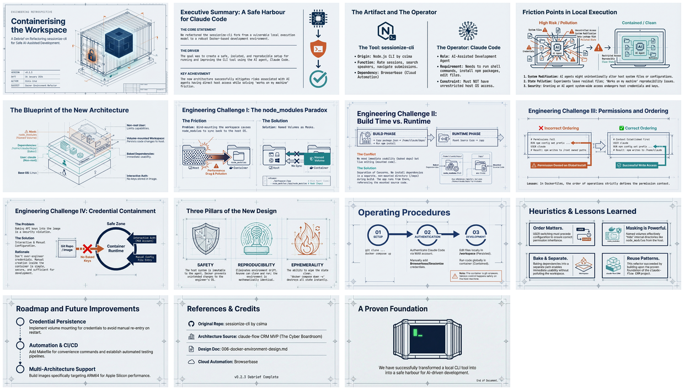

# Sessionize CLI v0.2.3: Docker Development Environment

[🏠 Home](../../../../README.md) / [LinkedIn Published](../../../README.md) / [Dev Briefs](../../README.md) / [Sessionize CLI](../README.md) / **v0.2.3 - Docker Dev Environment**

---

## Overview

This dev brief documents the refactoring of the `sessionize-cli` fork to use a Docker-based development environment. The goal: create a safe, isolated, and reproducible setup for running AI-assisted development (Claude Code) without risking host system modifications.

---

## Infographic


---

## Slide Deck

[](26%20Jan%20-%20AI_Workspace_Containerization.pdf)

*Click the mosaic above to view the full 15-slide presentation (PDF)*

---

## Semantic Knowledge Graph

For detailed concept mapping, relationships, and exportable graph data, see:

**[SEMANTIC-GRAPH.md](SEMANTIC-GRAPH.md)** - Contains Mermaid diagrams, concept taxonomy, and Cypher export for Neo4j integration.

---

## Source Information

| Property | Value |
|----------|-------|
| **Source File** | [v0.2.3__debrief__refactor-repo-to-docker-structure.md](v0.2.3__debrief__refactor-repo-to-docker-structure.md) |
| **Infographic** | [26 Jan - AI-Assisted Development Containerisation Strategy.jpg](26%20Jan%20-%20AI-Assisted%20Development%20Containerisation%20Strategy.jpg) |
| **Slide Deck** | [26 Jan - AI_Workspace_Containerization.pdf](26%20Jan%20-%20AI_Workspace_Containerization.pdf) (15 slides) |
| **Date** | January 26, 2026 |
| **Version** | v0.2.3 |
| **Project** | sessionize-cli (fork of csima/sessionize-cli) |

---

## Key Highlights

### The Problem

Running AI-assisted development tools directly on a host machine introduces risks:
- System modification by AI agents
- State pollution from experiments
- Reproducibility issues ("works on my machine")
- Security concerns with AI having system access

### The Solution

Containerize the development environment using Docker with:
- Non-root user (`claude`) for security
- Volume-mounted workspace for code persistence
- Baked-in dependencies for immediate usability
- Named volumes to mask node_modules

### Architecture

```
HOST MACHINE                          DOCKER CONTAINER
─────────────                         ────────────────
workspace/  ──────────────────────►   /home/claude/workspace/
  └── (git-tracked source)              └── (volume mount)

data/       ──────────────────────►   /home/claude/.sessionize-cli.json
  └── (git-ignored)                     └── (credentials)

                                      /home/claude/deps/
                                        └── node_modules/ (baked in)
```

### Key Challenges Solved

| Challenge | Solution |
|-----------|----------|
| node_modules syncing to host | Named volume masks bind mount |
| npm install during build vs runtime | Copy deps to separate path, bake into image |
| npm global install EACCES | USER claude before npm config |
| Credential management | Manual creation or mounted config file |

---

## Related LinkedIn Posts

| Post | Content |
|------|---------|
| [Post with Slides](https://www.linkedin.com/feed/update/urn:li:ugcPost:7421669631339171840/) | Slide deck presentation |

---

## Navigation

| Direction | Link |
|-----------|------|
| ⬆️ Parent | [Sessionize CLI](../README.md) |
| 🏠 Home | [Repository Root](../../../../README.md) |
