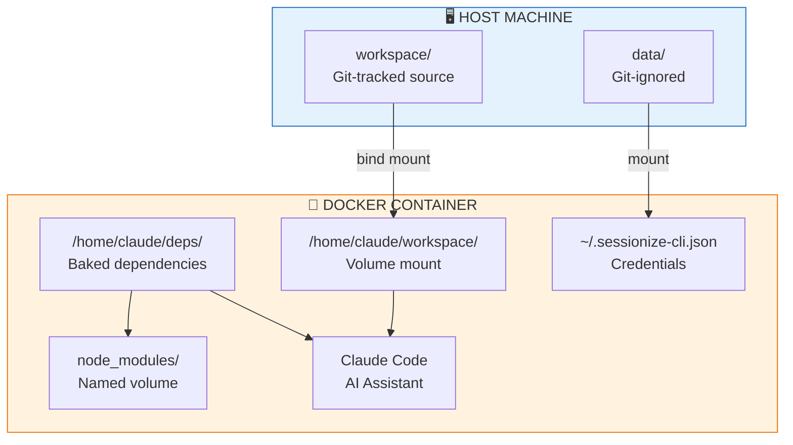
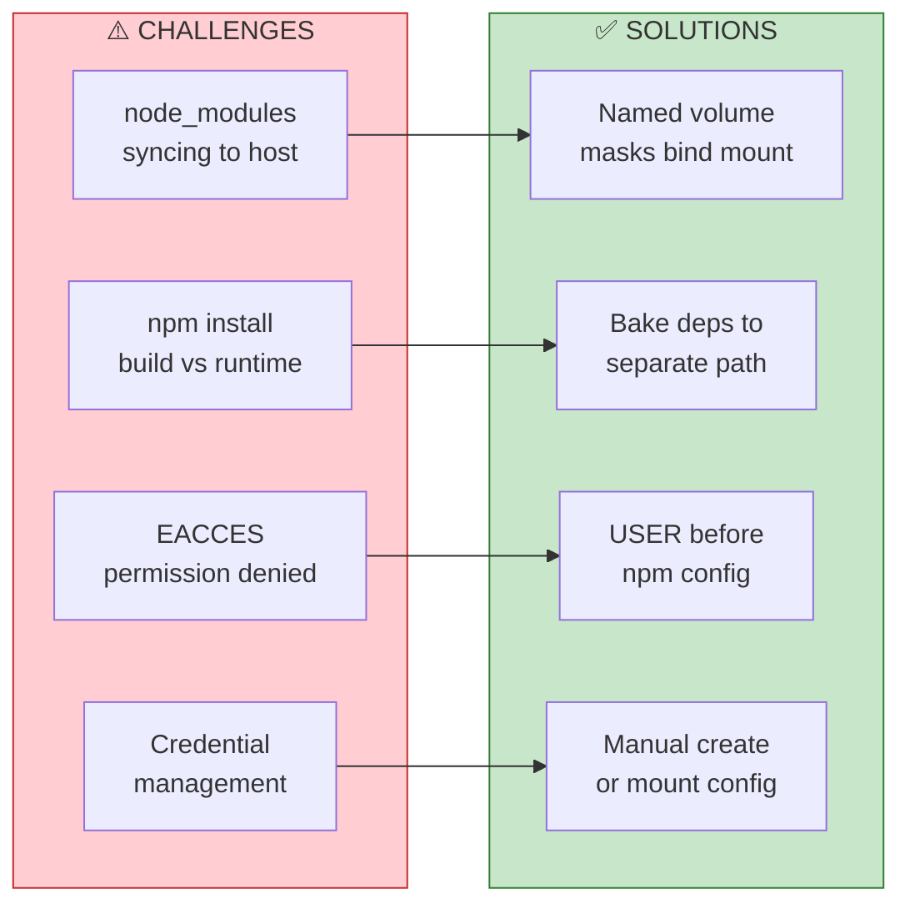
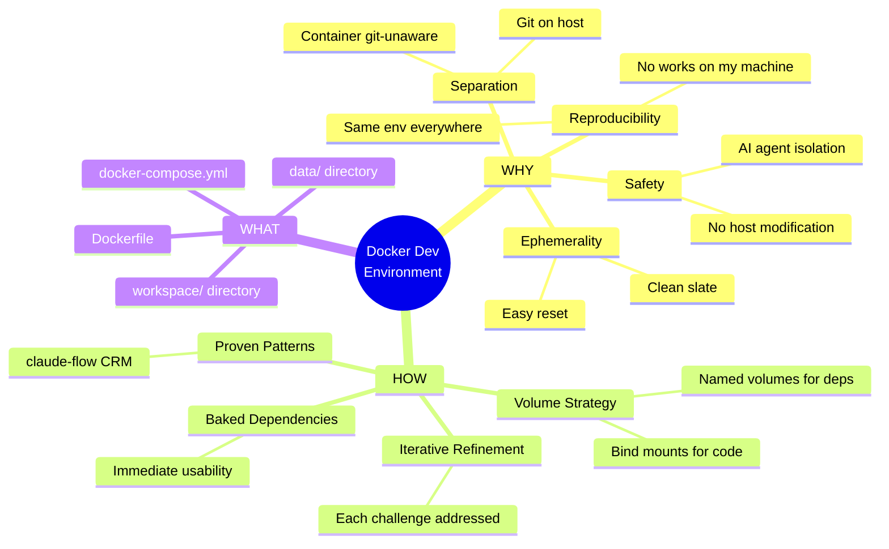
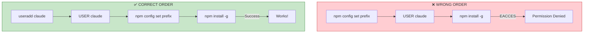
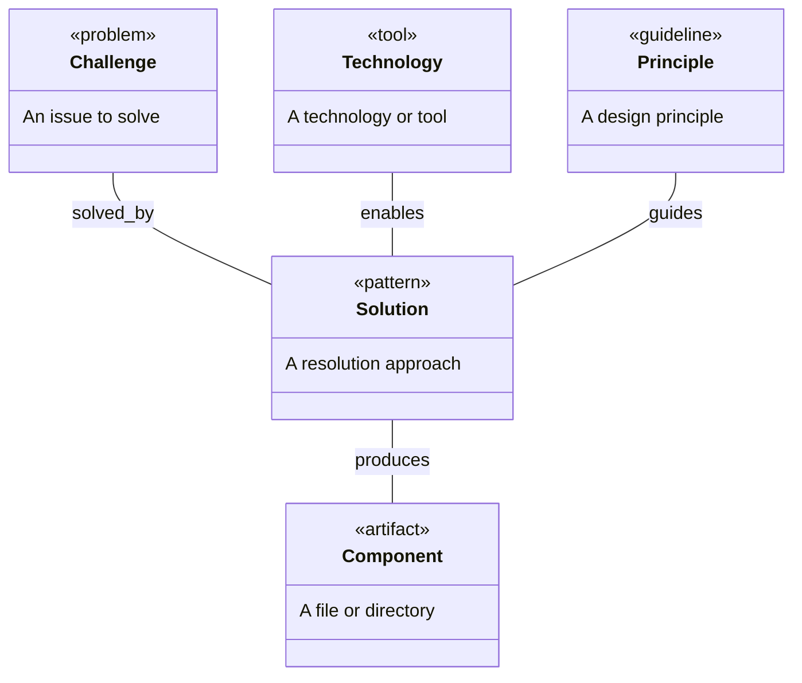
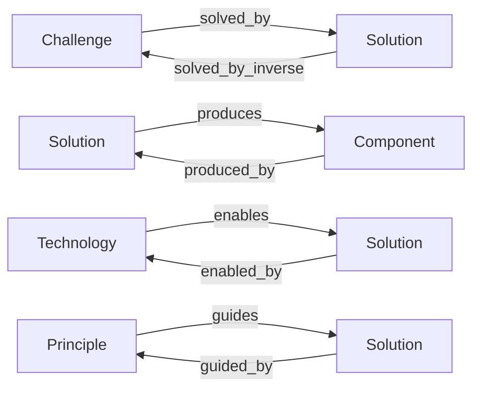
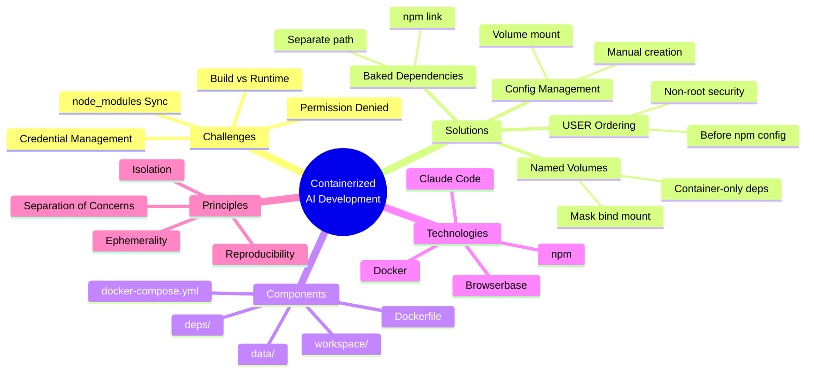
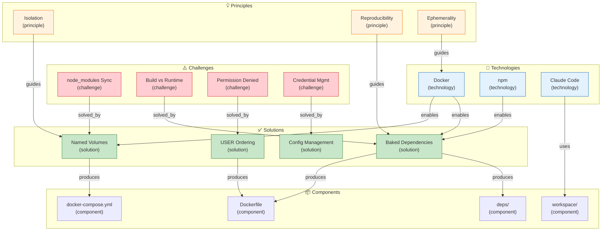

# Sessionize CLI v0.2.3: Docker Development Environment

[📖 README](./README.md) · [🖼️ Infographic](./26%20Jan%20-%20AI-Assisted%20Development%20Containerisation%20Strategy.jpg) · [📑 Slides](./26%20Jan%20-%20AI_Workspace_Containerization.pdf) · [🏠 Home](../../../../README.md)

> *Semantic Knowledge Graph (SKG) — machine-readable metadata for search, discovery, and graph database integration*

---

## Summary

This document describes refactoring the `sessionize-cli` fork to use a Docker-based development environment for safe AI-assisted development. The architecture separates git-tracked source code (volume-mounted workspace) from baked-in dependencies, using a non-root user for security. Key challenges addressed include node_modules syncing (solved with named volumes), build-time vs runtime dependencies (solved by copying to separate path), and npm permission issues (solved by proper USER ordering in Dockerfile).

---

## Key Concepts

- **Containerized AI Development**: Running AI coding assistants (like Claude Code) inside Docker containers to isolate their file system and command execution from the host machine.

- **Named Volume Masking**: Using Docker named volumes to overlay specific subdirectories (like node_modules) of bind mounts, preventing them from syncing to the host.

- **Baked-in Dependencies**: Copying package.json and source to a separate container path during build, running npm install there, so the tool works immediately without runtime setup.

- **Non-root Container User**: Creating a dedicated user (e.g., `claude`) in the container to limit capabilities and prevent accidental system modifications.

- **Volume-mounted Workspace**: Bind-mounting the source code directory so changes persist on the host and remain git-tracked, while container stays git-unaware.

- **Ephemeral Environment**: The ability to completely reset the development environment with `docker compose down -v`, enabling clean-slate experimentation.

---

## Core Arguments

1. **AI agents need sandboxing** — Claude Code can modify files, run commands, and install packages. Containing this in Docker prevents unintended host system changes.

2. **Reproducibility requires containerization** — Anyone can clone the repo, run `docker compose up`, and have an identical environment. No "works on my machine" issues.

3. **Dependencies should be baked, not mounted** — Copying deps to a separate path in the image provides immediate usability while keeping the workspace clean of node_modules.

4. **Order matters in Dockerfiles** — USER must come before npm config for global prefix to work correctly; many permission issues stem from wrong ordering.

5. **Named volumes solve the node_modules problem** — They mask specific subdirectories of bind mounts, preventing thousands of small files from syncing to the host.

---

## Key Quotes

> "Running AI-assisted development tools directly on a host machine introduces risks: System modification by AI agents, State pollution from experiments, Reproducibility issues."

> "The named volume overlays that specific path, keeping node_modules container-only."

> "Easy to reset: `docker compose down -v` wipes everything. Start fresh anytime."

> "Ensure `USER claude` comes BEFORE npm configuration."

---

## Tags

`#docker` `#containerization` `#ai-development` `#claude-code` `#devops` `#reproducibility` `#sandboxing` `#nodejs` `#npm` `#volume-mounts` `#security` `#development-environment`

---

## Search Phrases

- "docker AI development environment"
- "containerize claude code"
- "node_modules docker volume"
- "named volume mask bind mount"
- "non-root docker user npm"
- "baked dependencies docker"
- "reproducible AI development"
- "ephemeral development environment"
- "sessionize cli docker"
- "AI agent sandboxing"

---

## Metadata

| Field | Value |
|-------|-------|
| **Content Type** | Dev Brief / Technical Documentation |
| **Domain** | DevOps / AI-Assisted Development |
| **Sub-domain** | Containerization, Development Environments |
| **Format** | PDF (15 slides) + Infographic |
| **Date** | January 26, 2026 |
| **Version** | v0.2.3 |
| **Target Audience** | Developers, DevOps Engineers |

---

## Related Content

| Relationship | Content |
|--------------|---------|
| `based_on` | claude-flow CRM project Docker setup |
| `references` | Docker named volumes documentation |
| `related_to` | 006-docker-environment-design (CRM series) |
| `forks` | csima/sessionize-cli |
| `uses` | Browserbase for cloud browser automation |

---

## Semantic Knowledge Graph

### Architecture Overview (Visual)



### Challenge-Solution Flow (Visual)



### Why-How-What Framework (Visual)



### Dockerfile Order Pattern (Visual)



---

### Ontology

> The ontology defines the **types of entities** (nodes) and **relationships** (predicates) in this knowledge domain.

#### Node Types



| Ref | Description | Examples |
|-----|-------------|----------|
| `challenge` | A problem to solve | node_modules sync, EACCES, build vs runtime |
| `solution` | A resolution pattern | Named volumes, baked deps, USER ordering |
| `component` | A file or directory | Dockerfile, workspace/, deps/ |
| `technology` | A tool or technology | Docker, npm, Claude Code |
| `principle` | A design guideline | Isolation, Reproducibility, Ephemerality |

#### Predicates (Relationships)



| Ref | Inverse | Description |
|-----|---------|-------------|
| `solved_by` | `solves` | Challenge resolution |
| `produces` | `produced_by` | Solution creating artifact |
| `enables` | `enabled_by` | Technology enabling solution |
| `guides` | `guided_by` | Principle informing solution |
| `uses` | `used_by` | Dependency relationship |
| `mounts` | `mounted_by` | Volume mount relationship |

---

### Taxonomy

> Hierarchical classification of concepts in this domain.



**ASCII Tree View:**

```
containerized_ai_development
├── challenges
│   ├── node_modules_sync
│   ├── build_vs_runtime
│   ├── permission_denied
│   └── credential_management
├── solutions
│   ├── named_volumes
│   │   ├── mask_bind_mount
│   │   └── container_only_deps
│   ├── baked_dependencies
│   │   ├── separate_path
│   │   └── npm_link
│   ├── user_ordering
│   │   ├── before_npm_config
│   │   └── nonroot_security
│   └── config_management
│       ├── manual_creation
│       └── volume_mount
├── components
│   ├── dockerfile
│   ├── docker_compose
│   ├── workspace_dir
│   ├── data_dir
│   └── deps_dir
├── technologies
│   ├── docker
│   ├── npm
│   ├── claude_code
│   └── browserbase
└── principles
    ├── isolation
    ├── reproducibility
    ├── ephemerality
    └── separation_of_concerns
```

---

### Knowledge Graph

> Visual representation of entities and their relationships.



#### Nodes (for database import)

| ID | Type | Name | Description |
|----|------|------|-------------|
| `node_modules_sync` | `challenge` | node_modules Sync | Thousands of files syncing to host via bind mount |
| `build_vs_runtime` | `challenge` | Build vs Runtime | npm install needed but code comes via volume at runtime |
| `permission_denied` | `challenge` | Permission Denied | EACCES when npm tries to write to /usr/local |
| `credential_mgmt` | `challenge` | Credential Management | API keys shouldn't be in image or git |
| `named_volumes` | `solution` | Named Volumes | Use named volume to mask node_modules in bind mount |
| `baked_deps` | `solution` | Baked Dependencies | Copy deps to separate path, npm install during build |
| `user_ordering` | `solution` | USER Ordering | Set USER claude before npm config set prefix |
| `config_mgmt` | `solution` | Config Management | Manual creation or mounted config file |
| `dockerfile` | `component` | Dockerfile | Container definition with Claude Code and tools |
| `docker_compose` | `component` | docker-compose.yml | Orchestration with volume mounts |
| `workspace_dir` | `component` | workspace/ | Git-tracked source code directory |
| `deps_dir` | `component` | deps/ | Baked-in dependencies directory |
| `docker` | `technology` | Docker | Container runtime and orchestration |
| `npm` | `technology` | npm | Node.js package manager |
| `claude_code` | `technology` | Claude Code | AI coding assistant |
| `isolation` | `principle` | Isolation | AI agents contained, no host modification |
| `reproducibility` | `principle` | Reproducibility | Same environment for everyone |
| `ephemerality` | `principle` | Ephemerality | Easy reset with docker compose down -v |

#### Edges (for database import)

| From | Predicate | To |
|------|-----------|-----|
| `node_modules_sync` | `solved_by` | `named_volumes` |
| `build_vs_runtime` | `solved_by` | `baked_deps` |
| `permission_denied` | `solved_by` | `user_ordering` |
| `credential_mgmt` | `solved_by` | `config_mgmt` |
| `named_volumes` | `produces` | `docker_compose` |
| `baked_deps` | `produces` | `dockerfile` |
| `baked_deps` | `produces` | `deps_dir` |
| `user_ordering` | `produces` | `dockerfile` |
| `docker` | `enables` | `named_volumes` |
| `docker` | `enables` | `baked_deps` |
| `npm` | `enables` | `baked_deps` |
| `claude_code` | `uses` | `workspace_dir` |
| `isolation` | `guides` | `named_volumes` |
| `reproducibility` | `guides` | `baked_deps` |
| `ephemerality` | `guides` | `docker` |

---

### Cypher Import (Neo4j)

```cypher
// =====================================================
// Sessionize CLI Docker Environment - Neo4j Import
// Generated from Knowledge Graph raw data above
// =====================================================

// Create Challenge nodes
CREATE (nms:Challenge {id: 'node_modules_sync', name: 'node_modules Sync', description: 'Thousands of files syncing to host via bind mount'})
CREATE (bvr:Challenge {id: 'build_vs_runtime', name: 'Build vs Runtime', description: 'npm install needed but code comes via volume at runtime'})
CREATE (pd:Challenge {id: 'permission_denied', name: 'Permission Denied', description: 'EACCES when npm tries to write to /usr/local'})
CREATE (cm:Challenge {id: 'credential_mgmt', name: 'Credential Management', description: 'API keys should not be in image or git'})

// Create Solution nodes
CREATE (nv:Solution {id: 'named_volumes', name: 'Named Volumes', description: 'Use named volume to mask node_modules in bind mount'})
CREATE (bd:Solution {id: 'baked_deps', name: 'Baked Dependencies', description: 'Copy deps to separate path, npm install during build'})
CREATE (uo:Solution {id: 'user_ordering', name: 'USER Ordering', description: 'Set USER claude before npm config set prefix'})
CREATE (cfg:Solution {id: 'config_mgmt', name: 'Config Management', description: 'Manual creation or mounted config file'})

// Create Component nodes
CREATE (df:Component {id: 'dockerfile', name: 'Dockerfile', description: 'Container definition with Claude Code and tools'})
CREATE (dc:Component {id: 'docker_compose', name: 'docker-compose.yml', description: 'Orchestration with volume mounts'})
CREATE (ws:Component {id: 'workspace_dir', name: 'workspace/', description: 'Git-tracked source code directory'})
CREATE (deps:Component {id: 'deps_dir', name: 'deps/', description: 'Baked-in dependencies directory'})

// Create Technology nodes
CREATE (docker:Technology {id: 'docker', name: 'Docker', description: 'Container runtime and orchestration'})
CREATE (npm:Technology {id: 'npm', name: 'npm', description: 'Node.js package manager'})
CREATE (cc:Technology {id: 'claude_code', name: 'Claude Code', description: 'AI coding assistant'})

// Create Principle nodes
CREATE (iso:Principle {id: 'isolation', name: 'Isolation', description: 'AI agents contained, no host modification'})
CREATE (rep:Principle {id: 'reproducibility', name: 'Reproducibility', description: 'Same environment for everyone'})
CREATE (eph:Principle {id: 'ephemerality', name: 'Ephemerality', description: 'Easy reset with docker compose down -v'})

// =====================================================
// Create Relationships (from Edges table)
// =====================================================

// Challenge -> Solution
CREATE (nms)-[:SOLVED_BY]->(nv)
CREATE (bvr)-[:SOLVED_BY]->(bd)
CREATE (pd)-[:SOLVED_BY]->(uo)
CREATE (cm)-[:SOLVED_BY]->(cfg)

// Solution -> Component
CREATE (nv)-[:PRODUCES]->(dc)
CREATE (bd)-[:PRODUCES]->(df)
CREATE (bd)-[:PRODUCES]->(deps)
CREATE (uo)-[:PRODUCES]->(df)

// Technology -> Solution
CREATE (docker)-[:ENABLES]->(nv)
CREATE (docker)-[:ENABLES]->(bd)
CREATE (npm)-[:ENABLES]->(bd)

// Technology -> Component
CREATE (cc)-[:USES]->(ws)

// Principle -> Solution
CREATE (iso)-[:GUIDES]->(nv)
CREATE (rep)-[:GUIDES]->(bd)
CREATE (eph)-[:GUIDES]->(docker)
```

---

## Navigation

| Direction | Link |
|-----------|------|
| ⬆️ Parent | [Sessionize CLI](../README.md) |
| 📁 Category | [Dev Briefs](../../README.md) |
| 🏠 Home | [Repository Root](../../../../README.md) |
