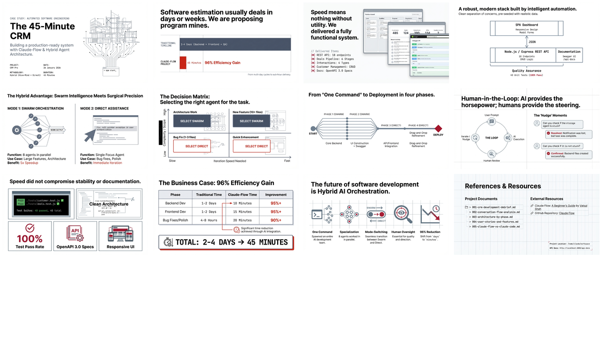

# Executive Summary: CRM Development with Claude-Flow

[🏠 Home](../../../../README.md) / [LinkedIn Published](../../../README.md) / [GenAI Development](../../README.md) / [CRM Hive-Mind Series](../README.md) / **Executive Summary**

---

## Overview

This folder contains the executive business briefing on a complete CRM system built using Claude-Flow's multi-agent AI orchestration in just 45 minutes. The project demonstrates a paradigm shift in software development: from traditional multi-day cycles to sub-hour delivery through intelligent AI coordination, achieving a **96% time reduction** with 8 parallel agents producing 19 files and 40 passing tests.

---

## Infographic

---

## Slide Deck

*Click the mosaic above to view the full 12-slide presentation (PDF)*

---

## Semantic Knowledge Graph

For detailed concept mapping, relationships, and exportable graph data, see:

**[SEMANTIC-GRAPH.md](SEMANTIC-GRAPH.md)** - Contains Mermaid diagrams, concept taxonomy, and Cypher export for Neo4j integration.

---

## Source Information

| Property | Value |
|----------|-------|
| **Source File** | [000-executive-summary.md](000-executive-summary.md) |
| **Infographic** | [26 Jan - Building a CRM in 45 Minutes.jpg](26%20Jan%20-%20Building%20a%20CRM%20in%2045%20Minutes.jpg) |
| **Slide Deck** | [26 Jan - Days_To_Minutes_Coding.pdf](26%20Jan%20-%20Days_To_Minutes_Coding.pdf) (12 slides) |
| **Slide Mosaic** | [slides_mosaic.png](slides_mosaic.png) |
| **Date** | January 26, 2026 |
| **Project** | CRM Pro - Customer Relationship Management System |
| **Methodology** | Claude-Flow Hive-Mind + Claude Code Hybrid Approach |
| **Duration** | 45 Minutes |

---

## Key Highlights

### Project Metrics

| Metric | Value |
|--------|-------|
| Total Time | 45 minutes |
| Agents Spawned | 8 specialized agents |
| Files Created | 19 files |
| Test Pass Rate | 40 tests, 100% pass |
| Time Reduction | 96% vs traditional development |

### Deliverables

- **REST API**: 18 endpoints across customers, deals, and interactions
- **Web Dashboard**: Modern SPA with KPIs, activity feed, notifications
- **Customer Management**: Full CRUD, search, status filtering
- **Deals Pipeline**: 6-stage kanban board with drag-and-drop
- **Interactions Timeline**: Activity tracking with 4 types
- **API Documentation**: Swagger UI with full OpenAPI 3.0 spec

### Hybrid Development Approach

| Mode | Use Case | Advantage |
|------|----------|-----------|
| **Swarm Orchestration** | Large features (10+ files) | 5x speedup through parallelization |
| **Direct Assistance** | Bug fixes (1-3 files) | Immediate iteration, precise fixes |

---

## Related Documents

| Document | Focus Area |
|----------|------------|
| [001 - CRM Development Debrief](../001-crm-development-debrief/) | Complete project debrief with architecture and lessons learned |
| [002 - Conversation Flow Analysis](../002-conversation-flow-analysis/) | All 15 user prompts analyzed with response patterns |
| [003 - Architecture by Phase](../003-architecture-by-phase/) | Detailed architecture diagrams for each development phase |
| [004 - User Stories and Features](../004-user-stories-and-features/) | User stories with ASCII art for all CRM features |
| [005 - Claude-Flow vs Claude Code](../005-claude-flow-vs-claude-code/) | Technical comparison and best-of-both-worlds analysis |

---

## Navigation

| Direction | Link |
|-----------|------|
| Parent | [CRM Hive-Mind Series](../README.md) |
| Root | [Home](../../../../README.md) |
