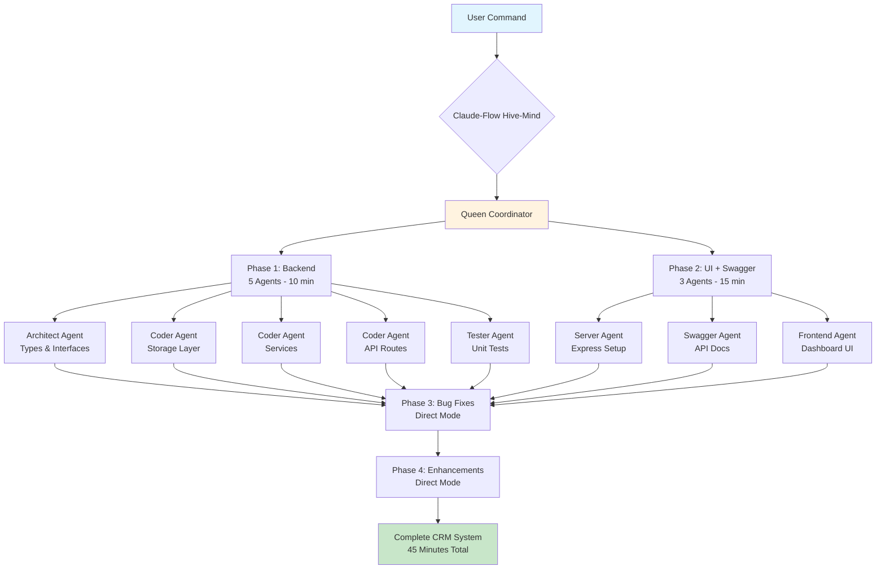
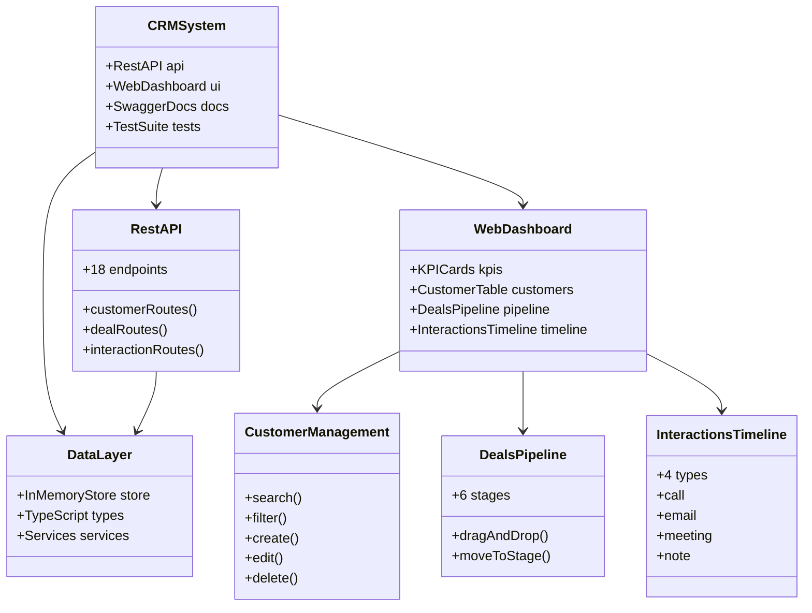
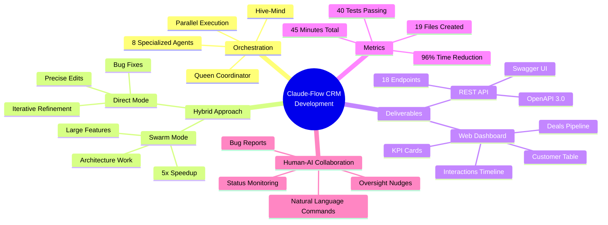
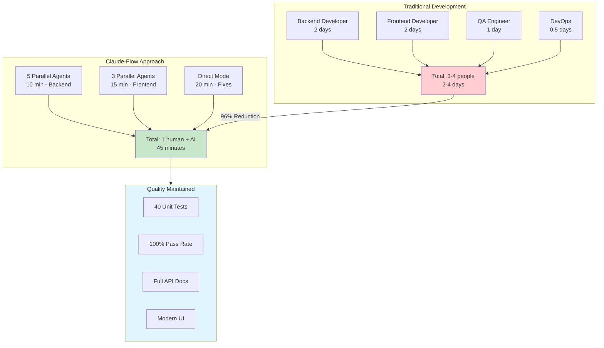

[🏠 Home](../../../../README.md) / [LinkedIn Published](../../../README.md) / [GenAI Development](../../README.md) / [CRM Hive-Mind Series](../README.md) / [Executive Summary](./README.md) / **Semantic Graph**

# Semantic Knowledge Graph: Executive Summary - CRM Development

---

## Summary

This executive briefing documents the development of a complete CRM system in 45 minutes using Claude-Flow's Hive-Mind multi-agent AI orchestration, achieving a 96% time reduction compared to traditional 2-4 day development cycles. The hybrid approach combines Swarm mode for parallel large-scale work with Direct mode for iterative bug fixes, demonstrating that intelligent AI coordination with human-in-the-loop oversight can transform software delivery from days to minutes.

---

## Key Concepts

1. **Claude-Flow Hive-Mind Orchestration**: A multi-agent AI coordination platform that enables parallel execution of software development tasks through specialized worker agents coordinated by a Queen Coordinator.

2. **Hybrid Development Approach**: Strategic combination of Swarm mode (parallel agents for large features) and Direct mode (Claude Code for iterative fixes), optimizing for both throughput and precision.

3. **Parallel Agent Execution**: Simultaneous deployment of 8 specialized agents (Architect, multiple Coders, Tester) achieving 5x speedup through parallelization of independent development tasks.

4. **Sub-Hour Software Delivery**: A paradigm shift from traditional multi-day development cycles to complete system delivery in under 60 minutes through intelligent AI orchestration.

5. **Human-in-the-Loop Oversight**: Critical human intervention points where user intuition catches issues AI might miss, ensuring quality through collaborative human-AI development.

6. **REPL-Like Development Pattern**: Interactive, conversational development flow where natural language commands trigger complex AI orchestration, creating a responsive feedback loop.

---

## Core Arguments

1. **One Command, Entire Team**: A single `npx claude-flow@alpha hive-mind spawn` command can instantiate an entire AI development team with specialized roles, eliminating traditional team assembly and coordination overhead.

2. **Mode-Switching Optimization**: The optimal development strategy combines swarm orchestration for parallelizable architecture work with direct assistance for iterative debugging, leveraging the strengths of each approach.

3. **96% Time Reduction is Achievable**: By replacing sequential human development with parallel AI agents, projects traditionally requiring 2-4 days can be completed in 45 minutes while maintaining quality (40 tests, 100% pass rate).

4. **Human Intuition Remains Essential**: Despite AI automation, human oversight provides critical "nudge" moments that catch stuck agents and validate direction, making the human-AI partnership more effective than either alone.

5. **Natural Language to Complex Orchestration**: The abstraction of complex multi-agent coordination behind natural language interfaces democratizes access to parallel development capabilities.

6. **Quality Through Specialization**: Dedicated agent roles (Architect for types, Coders for storage/services/API, Tester for tests) enable domain-specific expertise while maintaining architectural coherence.

---

## Tags

`claude-flow` `hive-mind` `multi-agent-orchestration` `parallel-development` `swarm-mode` `direct-mode` `crm-system` `rest-api` `swagger` `45-minute-delivery` `96-percent-reduction` `human-in-the-loop` `ai-coordination` `hybrid-development` `sub-hour-delivery`

---

## Mermaid Diagrams

### Development Process Flow



### System Architecture



### Concept Mind Map



### Value Comparison



---

## Cypher Export

```cypher
// Nodes - Core Concepts
CREATE (cf:Technology {name: "Claude-Flow", type: "AI Orchestration Platform"})
CREATE (hm:Concept {name: "Hive-Mind", description: "Multi-agent coordination system"})
CREATE (qc:Agent {name: "Queen Coordinator", role: "Orchestration leader"})
CREATE (crm:System {name: "CRM Pro", type: "Customer Relationship Management"})

// Nodes - Development Modes
CREATE (swarm:Mode {name: "Swarm Orchestration", useCase: "Large features", advantage: "5x speedup"})
CREATE (direct:Mode {name: "Direct Assistance", useCase: "Bug fixes", advantage: "Immediate iteration"})

// Nodes - Agents
CREATE (arch:Agent {name: "Architect Agent", responsibility: "Types and interfaces"})
CREATE (coder1:Agent {name: "Storage Coder", responsibility: "Data layer"})
CREATE (coder2:Agent {name: "Services Coder", responsibility: "Business logic"})
CREATE (coder3:Agent {name: "API Coder", responsibility: "REST endpoints"})
CREATE (tester:Agent {name: "Tester Agent", responsibility: "Unit tests"})
CREATE (server:Agent {name: "Server Agent", responsibility: "Express setup"})
CREATE (swagger:Agent {name: "Swagger Agent", responsibility: "API documentation"})
CREATE (frontend:Agent {name: "Frontend Agent", responsibility: "Dashboard UI"})

// Nodes - Phases
CREATE (p1:Phase {name: "Phase 1", focus: "Backend", duration: "10 min", agentCount: 5})
CREATE (p2:Phase {name: "Phase 2", focus: "UI + Swagger", duration: "15 min", agentCount: 3})
CREATE (p3:Phase {name: "Phase 3", focus: "Bug Fixes", mode: "Direct"})
CREATE (p4:Phase {name: "Phase 4", focus: "Enhancements", mode: "Direct"})

// Nodes - Deliverables
CREATE (api:Component {name: "REST API", endpoints: 18})
CREATE (dash:Component {name: "Web Dashboard", type: "SPA"})
CREATE (docs:Component {name: "Swagger UI", spec: "OpenAPI 3.0"})
CREATE (tests:Component {name: "Test Suite", count: 40, passRate: "100%"})

// Nodes - Metrics
CREATE (time:Metric {name: "Development Time", value: "45 minutes", traditional: "2-4 days"})
CREATE (reduction:Metric {name: "Time Reduction", value: "96%"})
CREATE (files:Metric {name: "Files Created", value: 19})
CREATE (agents:Metric {name: "Agents Spawned", value: 8})

// Nodes - Concepts
CREATE (hitl:Concept {name: "Human-in-the-Loop", description: "Critical oversight for quality"})
CREATE (hybrid:Concept {name: "Hybrid Development", description: "Combining Swarm and Direct modes"})
CREATE (subhour:Concept {name: "Sub-Hour Delivery", description: "Complete systems in under 60 minutes"})

// Relationships - Platform Structure
CREATE (cf)-[:PROVIDES]->(hm)
CREATE (hm)-[:COORDINATES_VIA]->(qc)
CREATE (hm)-[:SUPPORTS]->(swarm)
CREATE (hm)-[:SUPPORTS]->(direct)

// Relationships - Agent Hierarchy
CREATE (qc)-[:SPAWNS]->(arch)
CREATE (qc)-[:SPAWNS]->(coder1)
CREATE (qc)-[:SPAWNS]->(coder2)
CREATE (qc)-[:SPAWNS]->(coder3)
CREATE (qc)-[:SPAWNS]->(tester)
CREATE (qc)-[:SPAWNS]->(server)
CREATE (qc)-[:SPAWNS]->(swagger)
CREATE (qc)-[:SPAWNS]->(frontend)

// Relationships - Phase Execution
CREATE (swarm)-[:EXECUTES]->(p1)
CREATE (swarm)-[:EXECUTES]->(p2)
CREATE (direct)-[:EXECUTES]->(p3)
CREATE (direct)-[:EXECUTES]->(p4)

// Relationships - Phase Agents
CREATE (p1)-[:USES]->(arch)
CREATE (p1)-[:USES]->(coder1)
CREATE (p1)-[:USES]->(coder2)
CREATE (p1)-[:USES]->(coder3)
CREATE (p1)-[:USES]->(tester)
CREATE (p2)-[:USES]->(server)
CREATE (p2)-[:USES]->(swagger)
CREATE (p2)-[:USES]->(frontend)

// Relationships - Deliverables
CREATE (cf)-[:PRODUCES]->(crm)
CREATE (crm)-[:CONTAINS]->(api)
CREATE (crm)-[:CONTAINS]->(dash)
CREATE (crm)-[:CONTAINS]->(docs)
CREATE (crm)-[:CONTAINS]->(tests)

// Relationships - Metrics
CREATE (crm)-[:ACHIEVED]->(time)
CREATE (crm)-[:ACHIEVED]->(reduction)
CREATE (crm)-[:ACHIEVED]->(files)
CREATE (crm)-[:ACHIEVED]->(agents)

// Relationships - Concepts
CREATE (hybrid)-[:COMBINES]->(swarm)
CREATE (hybrid)-[:COMBINES]->(direct)
CREATE (hitl)-[:ENSURES_QUALITY_OF]->(crm)
CREATE (cf)-[:ENABLES]->(subhour)

// Relationships - Value Proposition
CREATE (swarm)-[:PROVIDES {benefit: "Parallelization"}]->(reduction)
CREATE (direct)-[:PROVIDES {benefit: "Precision"}]->(reduction)
CREATE (hitl)-[:VALIDATES]->(tests)
```

---

## Navigation

| Link | Description |
|------|-------------|
| [README.md](README.md) | Folder overview and resource links |
| [Source Document](000-executive-summary.md) | Original executive briefing |
| [Parent Directory](../README.md) | CRM Hive-Mind Series |
| [Root](../../../../README.md) | Repository root |
